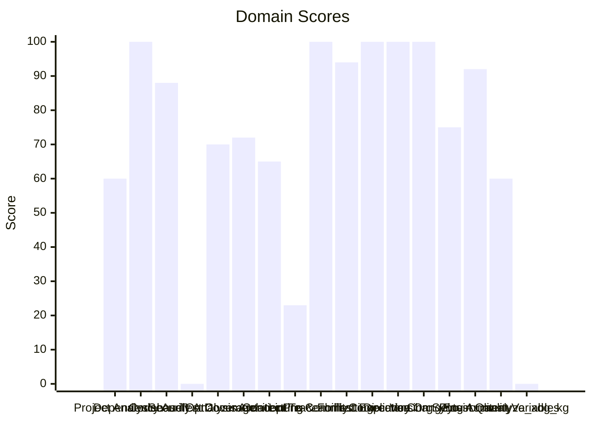

# 🔬 Code Enhancement Report

> **Generated**: 2026-05-29 22:58:30 UTC | **Target**: epistemic-graph | **Overall GPA**: 2.35/4.0

---

## 📊 Executive Summary

| Domain | Grade | Score | Status |
|--------|-------|-------|--------|
| Security Analysis | 🔴 F | 0/100 | `░░░░░░░░░░░░░░░░░░░░` 0/100 |
| analyze_xdg_kg | 🔴 F | 0/100 | `░░░░░░░░░░░░░░░░░░░░` 0/100 |
| Concept Traceability | 🔴 F | 23/100 | `████░░░░░░░░░░░░░░░░` 23/100 |
| Project Analysis | 🟠 D | 60/100 | `████████████░░░░░░░░` 60/100 |
| Environment Variables | 🟠 D | 60/100 | `████████████░░░░░░░░` 60/100 |
| Architecture & Design Patterns | 🟠 D | 65/100 | `█████████████░░░░░░░` 65/100 |
| Test Coverage | 🟡 C | 70/100 | `██████████████░░░░░░` 70/100 |
| Documentation & Governance | 🟡 C | 72/100 | `██████████████░░░░░░` 72/100 |
| Changelog Audit | 🟡 C | 75/100 | `███████████████░░░░░` 75/100 |
| Codebase Optimization | 🔵 B | 88/100 | `█████████████████░░░` 88/100 |
| Pytest Quality | 🟢 A | 92/100 | `██████████████████░░` 92/100 |
| Pre-Commit Compliance | 🟢 A | 94/100 | `██████████████████░░` 94/100 |
| Dependency Audit | 🟢 A | 100/100 | `████████████████████` 100/100 |
| Linting & Formatting | 🟢 A | 100/100 | `████████████████████` 100/100 |
| Test Execution | 🟢 A | 100/100 | `████████████████████` 100/100 |
| Directory Organization | 🟢 A | 100/100 | `████████████████████` 100/100 |
| Version Sync Analysis | 🟢 A | 100/100 | `████████████████████` 100/100 |

---

## 📋 Domain Scorecards

### Project Analysis — 🟠 Grade: D (60/100)

`████████████░░░░░░░░` 60/100

| Criterion | Points | Evidence | Reasoning |
|-----------|--------|----------|-----------|
| has_pyproject | 10 | `pyproject.toml and requirements.txt` | Both pyproject.toml and requirements.txt exist, fulfilling mandatory Python proj |
| project_type_detected | 0 | `dependency list` | No recognized ecosystem markers found in dependencies |
| externalized_prompts | 0 | `/home/apps/workspace/agent-packages/epistemic-graph` | No prompts/ directory found. Prompts may be hardcoded in source. |
| observability | 0 | `dependency list` | No observability tools (logfire, sentry, opentelemetry) found |
| testing_suite | 10 | `tests dir: True, pytest dep: True` | Tests directory exists, pytest in dependencies |
| agents_md | 10 | `/home/apps/workspace/agent-packages/epistemic-graph/AGENTS.m` | AGENTS.md exists with comprehensive content |
| pre_commit_hooks | 10 | `/home/apps/workspace/agent-packages/epistemic-graph/.pre-com` | Pre-commit configuration found for automated code quality checks |
| gitignore | 10 | `/home/apps/workspace/agent-packages/epistemic-graph/.gitigno` | .gitignore exists to prevent committing build artifacts and secrets |
| env_template | 10 | `/home/apps/workspace/agent-packages/epistemic-graph/.env.exa` | Environment template exists for onboarding and secret management |
| protocol_support | 0 | `file scan` | No A2A, ACP, or MCP protocol support detected |

---

### Dependency Audit — 🟢 Grade: A (100/100)

`████████████████████` 100/100

> [!TIP]
> Package not found on PyPI: epistemic-graph

| Criterion | Points | Evidence | Reasoning |
|-----------|--------|----------|-----------|
| dependency_freshness | 100 | `source=/home/apps/workspace/agent-packages/epistemic-graph/p` | Audited 7 deps (7 installed, 0 constraint-only). 0 major, 0 minor, 0 patch updates |

---

### Codebase Optimization — 🔵 Grade: B (88/100)

`█████████████████░░░` 88/100

> [!NOTE]
> Needs attention: client.py (608L) — God class: EpistemicGraphClient (69 methods) — consider mixins/composition

| Criterion | Points | Evidence | Reasoning |
|-----------|--------|----------|-----------|
| code_quality | 88 | `{"file_count": 11, "total_lines": 1627, "function_count": 13` | Analyzed 11 files, 133 functions. Avg CC=2.4, max length=96, duplication=0.0%, 1 |

---

### Security Analysis — 🔴 Grade: F (0/100)

`░░░░░░░░░░░░░░░░░░░░` 0/100

> [!CAUTION]
> 24 HIGH severity vulnerabilities found

| Criterion | Points | Evidence | Reasoning |
|-----------|--------|----------|-----------|
| security_posture | 0 | `high=24 med=0 low=0 attack_surface={"subprocess_calls": 39, ` | Scanned 95 files. Found 24 security findings. High: -360pts, Med: -0pts, Low: -0 |

---

### Test Coverage — 🟡 Grade: C (70/100)

`██████████████░░░░░░` 70/100

> [!NOTE]
> Low test-to-source ratio: 0.27

| Criterion | Points | Evidence | Reasoning |
|-----------|--------|----------|-----------|
| test_coverage_quality | 70 | `{"test_file_count": 6, "test_count": 26, "source_file_count"` | 26 tests across 6 files. Ratio: 0.27. Intent: {'unit': 25, 'integration': 1}. 0  |

**Findings:**
- 9 potential doc-test drift items

---

### Documentation & Governance — 🟡 Grade: C (72/100)

`██████████████░░░░░░` 72/100

> [!NOTE]
> README.md missing sections: overview

| Criterion | Points | Evidence | Reasoning |
|-----------|--------|----------|-----------|
| documentation_quality | 72 | `{"README.md": {"exists": true, "missing": ["overview"]}, "AG` | Audited 6 standard docs + docs/ directory. 4 broken references, 5 docs present.  |

**Findings:**
- README.md is short (100 lines) — consider expanding
- README missing: Has a Table of Contents
- README missing: Has architecture overview or diagram
- AGENTS.md missing sections: tech stack, project structure

---

### Architecture & Design Patterns — 🟠 Grade: D (65/100)

`█████████████░░░░░░░` 65/100

> [!WARNING]
> SRP: 1 modules exceed 500 lines (god modules)

| Criterion | Points | Evidence | Reasoning |
|-----------|--------|----------|-----------|
| architecture_quality | 65 | `{"layers": 0, "di_ratio": 0.04, "solid_violations": 2}` | Analyzed 95 files. 0/5 architecture layers present, DI ratio: 4%, 2 SOLID violat |

**Findings:**
- SRP: 1 classes have >15 methods
- No discernible layer architecture (no domain/service/adapter separation)
- Low dependency injection ratio: 4%

---

### Concept Traceability — 🔴 Grade: F (23/100)

`████░░░░░░░░░░░░░░░░` 23/100

> [!CAUTION]
> Low traceability ratio: 0% concepts fully traced

| Criterion | Points | Evidence | Reasoning |
|-----------|--------|----------|-----------|
| concept_traceability | 23 | `{"total_concepts": 8, "well_traced": 0, "orphans": 6, "drift` | 8 unique concepts found. 0 fully traced (code+docs+tests), 6 orphans, 2 drifted. |

**Findings:**
- 6 orphaned concepts (only in one source)
- 26 test functions missing concept markers
- 22 significant functions (>10 lines) missing concept markers in docstrings

---

### Linting & Formatting — 🟢 Grade: A (100/100)

`████████████████████` 100/100

> [!TIP]
> Total lint findings: 0 (high/error: 0, medium/warning: 0, low: 0)

| Criterion | Points | Evidence | Reasoning |
|-----------|--------|----------|-----------|
| lint_compliance | 100 | `ruff=0, bandit=0, mypy=0` | 0 total findings across 3 tools. High/error: -0pts, Med/warning: -0pts, Low: -0p |

---

### Pre-Commit Compliance — 🟢 Grade: A (94/100)

`██████████████████░░` 94/100

> [!TIP]
> 2 hook(s) may be outdated: ruff-pre-commit, uv-pre-commit

| Criterion | Points | Evidence | Reasoning |
|-----------|--------|----------|-----------|
| precommit_compliance | 94 | `{"total_hooks": 19, "passed": 18, "failed": 0, "skipped": 1,` | Ran pre-commit with 19 hooks: 18 passed, 0 failed, 1 skipped. 2 potentially outd |

**Findings:**
- Pytest hooks skipped (handled by CE-016 Test Execution): local-pytest, pytest

---

### Test Execution — 🟢 Grade: A (100/100)

`████████████████████` 100/100

| Criterion | Points | Evidence | Reasoning |
|-----------|--------|----------|-----------|
| test_execution | 100 | `{"frameworks_detected": 2, "total_passed": 27, "total_failed` | Executed 2 framework(s). 27 passed, 0 failed, 0 errors. Pass rate: 100%. |

---

### Directory Organization — 🟢 Grade: A (100/100)

`████████████████████` 100/100

| Criterion | Points | Evidence | Reasoning |
|-----------|--------|----------|-----------|
| directory_organization | 100 | `{"total_source_files": 43, "total_directories": 9, "max_dept` | 43 files across 9 directories. Max depth: 2, avg files/dir: 4.8. 0 crowded, 0 se |

---

### Version Sync Analysis — 🟢 Grade: A (100/100)

`████████████████████` 100/100

> [!TIP]
> All version '0.13.0' declarations appear to be tracked correctly.

| Criterion | Points | Evidence | Reasoning |
|-----------|--------|----------|-----------|
| bumpversion_exists | 20 | `/home/apps/workspace/agent-packages/epistemic-graph/.bumpver` | .bumpversion.cfg found |
| current_version_defined | 20 | `0.13.0` | Current version tracked is 0.13.0 |
| files_tracked | 20 | `3 files tracked` | Found 3 files tracked in .bumpversion.cfg |
| version_drift_check | 40 | `0 drifted files` | No version drift detected in codebase files |

---

### Changelog Audit — 🟡 Grade: C (75/100)

`███████████████░░░░░` 75/100

> [!NOTE]
> CHANGELOG.md exists but could not be parsed — check format compliance

| Criterion | Points | Evidence | Reasoning |
|-----------|--------|----------|-----------|
| changelog_quality | 75 | `{"exists": true, "parseable": false, "version_count": 0, "ha` | CHANGELOG.md exists. 0 versions tracked. 0 dependency changelogs analyzed. |

**Findings:**
- No changelog entries within the last 30 days
- keepachangelog not installed — pip install 'universal-skills[code-enhancer]'

---

### Pytest Quality — 🟢 Grade: A (92/100)

`██████████████████░░` 92/100

> [!TIP]
> Test directory lacks subdirectory organization (consider unit/, integration/, e2e/)

| Criterion | Points | Evidence | Reasoning |
|-----------|--------|----------|-----------|
| pytest_quality | 92 | `{"test_files": 6, "total_tests": 26, "descriptive_name_ratio` | 26 tests across 6 files. Naming: 20/20, Structure: 17/20, Fixtures: 15/20, Assertions |

**Findings:**
- No @pytest.mark.parametrize usage — consider data-driven tests

---

### Environment Variables — 🟠 Grade: D (60/100)

`████████████░░░░░░░░` 60/100

> [!WARNING]
> Only 0% of env vars documented in README.md

| Criterion | Points | Evidence | Reasoning |
|-----------|--------|----------|-----------|
| env_var_documentation | 60 | `{"total_vars": 10, "python_vars": 7, "dockerfile_vars": 2, "` | Found 10 unique env vars across 32 occurrences. README documents 0/10. Has .env. |

**Findings:**
- Undocumented env vars: GRAPH_SERVICE_AUTH_SECRET, GRAPH_SERVICE_SOCKET, PATH, PYTHONPATH, TESTS, TESTS_BATCH_SIZE, TEST_ITERATIONS, TRIVUP_ROOT, UID, XDG_RUNTIME_DIR
- 7 Python env vars not in .env.example: GRAPH_SERVICE_AUTH_SECRET, GRAPH_SERVICE_SOCKET, TESTS, TESTS_BATCH_SIZE, TEST_ITERATIONS

---

### analyze_xdg_kg — 🔴 Grade: F (0/100)

`░░░░░░░░░░░░░░░░░░░░` 0/100

> [!CAUTION]
> Analysis error: No module named 'agent_utilities.knowledge_graph'

---

## 🎯 Prioritized Action Items

| # | Priority | Domain | Action | Impact | Risk |
|---|----------|--------|--------|--------|------|
| 1 | 🔴 High | Security Analysis | 24 HIGH severity vulnerabilities found | High | High |
| 2 | 🔴 High | Concept Traceability | Low traceability ratio: 0% concepts fully traced | High | High |
| 3 | 🔴 High | Concept Traceability | 6 orphaned concepts (only in one source) | High | High |
| 4 | 🔴 High | Concept Traceability | 26 test functions missing concept markers | High | High |
| 5 | 🔴 High | Concept Traceability | 22 significant functions (>10 lines) missing concept markers in docstrings | High | High |
| 6 | 🔴 High | analyze_xdg_kg | Analysis error: No module named 'agent_utilities.knowledge_graph' | High | High |
| 7 | 🔴 High | Architecture & Design Patterns | SRP: 1 modules exceed 500 lines (god modules) | High | Medium |
| 8 | 🔴 High | Architecture & Design Patterns | SRP: 1 classes have >15 methods | High | Medium |
| 9 | 🔴 High | Architecture & Design Patterns | No discernible layer architecture (no domain/service/adapter separation) | High | Medium |
| 10 | 🔴 High | Architecture & Design Patterns | Low dependency injection ratio: 4% | High | Medium |
| 11 | 🔴 High | Environment Variables | Only 0% of env vars documented in README.md | High | Medium |
| 12 | 🔴 High | Environment Variables | Undocumented env vars: GRAPH_SERVICE_AUTH_SECRET, GRAPH_SERVICE_SOCKET, PATH, PY | High | Medium |
| 13 | 🔴 High | Environment Variables | 7 Python env vars not in .env.example: GRAPH_SERVICE_AUTH_SECRET, GRAPH_SERVICE_ | High | Medium |
| 14 | 🟡 Medium | Test Coverage | Low test-to-source ratio: 0.27 | Medium | Low |
| 15 | 🟡 Medium | Test Coverage | 9 potential doc-test drift items | Medium | Low |
| 16 | 🟡 Medium | Documentation & Governance | README.md missing sections: overview | Medium | Low |
| 17 | 🟡 Medium | Documentation & Governance | README.md is short (100 lines) — consider expanding | Medium | Low |
| 18 | 🟡 Medium | Documentation & Governance | README missing: Has a Table of Contents | Medium | Low |
| 19 | 🟡 Medium | Documentation & Governance | README missing: Has architecture overview or diagram | Medium | Low |
| 20 | 🟡 Medium | Documentation & Governance | AGENTS.md missing sections: tech stack, project structure | Medium | Low |
| 21 | 🟡 Medium | Documentation & Governance | 4 broken file references in documentation | Medium | Low |
| 22 | 🟡 Medium | Changelog Audit | CHANGELOG.md exists but could not be parsed — check format compliance | Medium | Low |
| 23 | 🟡 Medium | Changelog Audit | No changelog entries within the last 30 days | Medium | Low |
| 24 | 🟡 Medium | Changelog Audit | keepachangelog not installed — pip install 'universal-skills[code-enhancer]' | Medium | Low |
| 25 | 🟢 Low | Codebase Optimization | Needs attention: client.py (608L) — God class: EpistemicGraphClient (69 methods) | Low | Low |
| 26 | 🟢 Low | Dependency Audit | Package not found on PyPI: epistemic-graph | Low | Low |
| 27 | 🟢 Low | Linting & Formatting | Total lint findings: 0 (high/error: 0, medium/warning: 0, low: 0) | Low | Low |
| 28 | 🟢 Low | Pre-Commit Compliance | 2 hook(s) may be outdated: ruff-pre-commit, uv-pre-commit | Low | Low |
| 29 | 🟢 Low | Pre-Commit Compliance | Pytest hooks skipped (handled by CE-016 Test Execution): local-pytest, pytest | Low | Low |
| 30 | 🟢 Low | Version Sync Analysis | All version '0.13.0' declarations appear to be tracked correctly. | Low | Low |

---

## 🔄 SDD Handoff

Run `generate_sdd_handoff.py` with this report's JSON data to produce
structured TODO items compatible with the `spec-generator` → `task-planner` →
`sdd-implementer` pipeline. Output will be saved to `.specify/specs/`.
