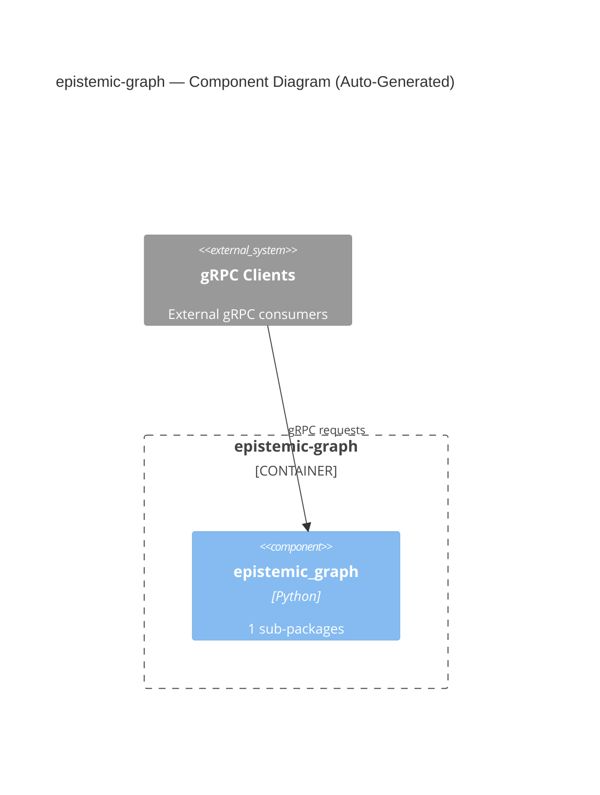

# epistemic-graph — Auto-Generated C4 Architecture

> Auto-generated by `analyze_architecture.py` from AST analysis.
> Update this file manually to add descriptions and refine boundaries.

## Component Diagram

