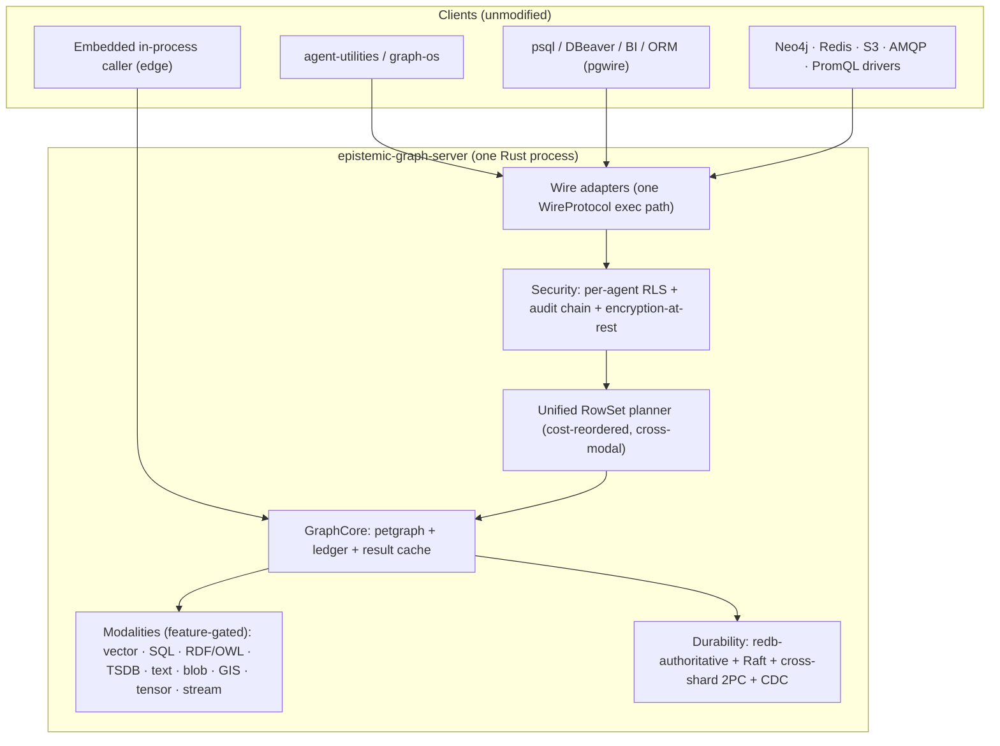

# epistemic-graph

<p align="center">
  <b>A durable database for connected knowledge, evidence, and multimodal data.</b><br>
  <sub>Use it on its own, or use it as the storage and reasoning engine behind agent-utilities.</sub>
</p>

<p align="center">
  
  
  
</p>

> **Looking for technical detail?** The [capability matrix](docs/capabilities.md)
> tracks support operation by operation. The
> [documentation site](https://knuckles-team.github.io/epistemic-graph/) contains
> the interface guides, deployment recipes, and architecture reference. If
> documentation and code disagree, the code is authoritative.

---

## What it is

`epistemic-graph` is a standalone Rust database and compute engine for data whose
meaning depends on connections. It keeps property graphs, tables, RDF/OWL
knowledge, vectors, text, time-series, events, and files under one durable
authority, and can query and compute across all of them in one plan, committing
related changes through one transaction boundary — no application-managed sync
between separate stores.

The word *epistemic* refers to knowledge and how it is supported: alongside
ordinary records, the engine can represent claims, evidence, provenance,
confidence, time, and relationships, so an answer can be traced to what was
observed, where it came from, and when it was valid.

It is a database, not an agent framework. You do not need `agent-utilities`, an
LLM, or an MCP server to use it.

## Standalone, or with agent-utilities

Applications can use `epistemic-graph` directly through its Python client or a
supported wire protocol.
[`agent-utilities`](https://github.com/Knuckles-Team/agent-utilities) is an
optional layer on top that adds connectors, agent orchestration, and governed
ingestion — it does not replace the database, and both paths share the same
engine, transaction boundary, and durable state.

| | Standalone | + agent-utilities |
|---|---|---|
| Storage & query | Durable graph, RDF/OWL, SQL, vector, time-series, events, blobs — one engine, one transaction | Same engine underneath; nothing duplicated |
| Reasoning & evidence | Claims, evidence, provenance, belief state, as-of queries | Feeds agent memory and governed ingestion |
| Access | Python client, or wire protocols such as Postgres, SPARQL, Bolt, Redis, S3 | GraphOS APIs, MCP tools, identity policy, user entry points |
| Ingestion | You write it | Connectors and governed ingestion from external systems |
| Orchestration | None — bring your own application logic | Agent/workflow orchestration, skills, prompts, model routing |
| Scale | Single node by default; opt-in replicated cluster | Same cluster, plus background hydration, evaluation, and evolution loops |
| Security | Auth, tenant/row-level control, audit, encryption at rest | Identity policy layered on top |

Use epistemic-graph alone if you only need the database. Put agent-utilities in
front of it once you need connectors, agent execution, skills, MCP, or a
governed knowledge layer — see the
[Graph Engine guide](https://github.com/Knuckles-Team/agent-utilities/blob/main/docs/guides/graph_engine.md).
Wire-protocol compatibility is tracked precisely in the
[capability matrix](docs/capabilities.md); check it before treating
epistemic-graph as a drop-in replacement for a specific product.

Reach for epistemic-graph when the relationships between data matter as much as
the records themselves — documents supporting claims, events changing business
objects, ontology terms constraining records, or an agent that needs memory with
provenance. Related graph, vector, and content changes commit together instead
of being synchronized by application code, and the reason behind an answer —
evidence, provenance, temporal state, security context — lives beside the
knowledge it qualifies.

---

## Quick start

### Docker

`CONTAINER_DATA_DIR` is the durable data directory inside the container;
`TLS_CERT_FILE`/`TLS_KEY_FILE` are host paths to a PEM certificate and private
key that get bind-mounted in for TLS termination, for example:

```bash
export CONTAINER_DATA_DIR=/var/lib/epistemic-graph TLS_CERT_FILE=./certs/server.crt TLS_KEY_FILE=./certs/server.key
```

```bash
: "${CONTAINER_DATA_DIR:?set to the image data directory}"
: "${TLS_CERT_FILE:?set to a host PEM certificate file}"
: "${TLS_KEY_FILE:?set to a host PEM private key file}"
docker volume create eg-data
docker run -d --name epistemic-graph \
  -e GRAPH_SERVICE_AUTH_SECRET \
  -e EPISTEMIC_GRAPH_AUDIENCE=epistemic-graph \
  -e EPISTEMIC_GRAPH_TENANT=tenant:default \
  -e EPISTEMIC_GRAPH_POLICY_VERSION=policy:initial \
  -e EPISTEMIC_GRAPH_SIGNER_KEYS_JSON \
  -e GRAPH_SERVICE_PERSIST_DIR="${CONTAINER_DATA_DIR}" \
  -e GRAPH_SERVICE_TCP_ADDR=0.0.0.0:9100 \
  -e GRAPH_SERVICE_TLS_CERT=/run/secrets/server.crt \
  -e GRAPH_SERVICE_TLS_KEY=/run/secrets/server.key \
  -p 9100:9100 \
  --mount type=bind,src="${TLS_CERT_FILE}",dst=/run/secrets/server.crt,readonly \
  --mount type=bind,src="${TLS_KEY_FILE}",dst=/run/secrets/server.key,readonly \
  -v eg-data:"${CONTAINER_DATA_DIR}" \
  <registry>/epistemic-graph:<tag>
```

> Populate `GRAPH_SERVICE_AUTH_SECRET` and `EPISTEMIC_GRAPH_SIGNER_KEYS_JSON` from
> a runtime secret provider before starting the container. The server accepts only
> `eg2.` request envelopes and requires the audience, tenant, policy revision,
> durable replay state, and trusted signer registry. Routable native TCP always
> uses TLS/mTLS; auxiliary listeners (database-protocol, metrics) are
> loopback-only — expose them through a co-located authenticated TLS gateway.
> Full recipes (compose, HA cluster, prebuilt wheels): the
> [deployment guide](docs/deployment.md).

### Binary

```bash
: "${GRAPH_SERVICE_AUTH_SECRET:?required}"
: "${EPISTEMIC_GRAPH_SIGNER_KEYS_JSON:?required}"
: "${GRAPH_SERVICE_PERSIST_DIR:?required}"
export EPISTEMIC_GRAPH_AUDIENCE=epistemic-graph
export EPISTEMIC_GRAPH_TENANT=tenant:default
export EPISTEMIC_GRAPH_POLICY_VERSION=policy:initial
epistemic-graph-server
```

### Python client

```bash
pip install epistemic-graph
```

The wheel already contains the complete Rust build and all runtime Python
helpers (OWL/SPARQL, LMCache HTTP acceleration, numeric interoperability) —
`epistemic-graph`, `[full]`, and `[all]` provide the same production runtime.

```python
from epistemic_graph import SyncEpistemicGraphClient

context = {
    "principal": "service:client",
    "tenant": "tenant:default",
    "audience": "epistemic-graph",
    "agent_id": "service:client",
    "roles": ["graph-client"],
    "scopes": ["kg:read", "kg:write"],
    "policy_version": "policy:initial",
    "delegation": [],
}
with SyncEpistemicGraphClient.connect(verified_context=context) as graph:
    graph.nodes.add("node:a", {"node_type": "coordinator"})
    graph.nodes.add("node:b", {"node_type": "worker"})
    graph.edges.add("node:a", "node:b", {"weight": 1.5})
    print("Order:", graph.graph.topological_sort())
```

More entry points — the remote → shared-local → autostart resolver and the
embedded in-process handle — are in [engine modes](docs/engine_modes.md).

---

## Capabilities

Every surface below composes in a single [UQL planner](docs/uql.md) plan, so a
query can join graph, vector, SQL, and time-series without moving intermediate
results between databases. Beyond the query surfaces, the engine also carries:
native program optimization (typed LM programs, evaluation-gated promotion,
no embedded DSPy/LiteLLM runtime); an in-database numeric kernel exposed as
DataFusion UDFs/UDAFs for cross-modal join-then-analyze; lakehouse interop
(tables materialize as open Parquet/Delta/Iceberg for zero-ETL reads from
Spark/Trino/DuckDB); and durability primitives — Raft replication, cross-shard
2PC, and a placement authority — that keep a cluster byte-for-byte the
single-node build with replication switched off.

Legend: ✅ supported · 🔶 in-progress · 🗺 roadmap

| Surface family | Status | Notes |
|---|:---:|---|
| SQL / pgwire | ✅ | DataFusion `SELECT`/DML/DDL, `COPY`, PL/pgSQL functions, `pg_catalog`, pgvector/AGE/Timescale/ParadeDB compat |
| SPARQL / RDF / OWL | ✅ | SPARQL 1.1, W3C `/sparql` endpoint, OWL 2 EL⁺/RL + DL-tableau + SWRL, SHACL/ShEx write-path enforcement |
| Cypher / Bolt | ✅ | `MATCH`/writes/aggregation, GDS via `CALL gds.*`, native Bolt v4.4 wire |
| GraphQL | ✅ | Reads/mutations, Apollo Federation v2, authenticated SSE subscriptions |
| Vector / ANN | ✅ | IVF-PQ + OPQ + SQ8 + HNSW + exact/flat, hybrid pre-filter, cross-shard scatter-gather |
| Time-series | ✅ | `time_bucket`, ASOF join, gap-fill, OHLC, decay, unified planner window ops |
| KV / Blob | ✅ | Redis RESP2/3 wire, S3/MinIO wire, content-addressed CAS with content-defined chunking |
| Messaging & Broker | ✅ | AMQP/MQTT/STOMP wires, DLQ/TTL/priority, exactly-once, replayable streams |
| Distribution | ✅ (cluster opt-in) | Raft replication, cross-shard 2PC, multi-Raft groups, online resharding |
| Epistemic reasoning | ✅ | Claim/Evidence/BeliefState, paraconsistent truth maintenance, calibrated causal reasoning |
| Security | ✅ | Verified `eg2.` request authority, per-agent RLS, audit chain, encryption at rest |

Full operation-by-operation matrix (~95 rows): see
[docs/capabilities.md](docs/capabilities.md).

---

## Architecture at a glance



A standalone application connects straight to the wire adapters or, embedded, to
`GraphCore`. Agent-utilities is one more client of the same wire adapters — an
optional control and orchestration layer, not a second data store. Every path
reaches the same planner, transaction boundary, and durable state. See the
[technical overview](docs/overview.md) for the crate DAG and planner pipeline,
and [subsystems](docs/architecture/subsystems.md) for how each modality composes
on the one store.

---

## One build, opt-in layers

epistemic-graph ships one binary and one default (`full`) feature set;
`+cluster` and `+full-extras` are additive Cargo features you opt into at
compile time — you are never choosing between incompatible builds. The target
host pulls a prebuilt wheel and never compiles.

| Build | Carries | For |
|---|---|---|
| **main** (default wheel) | The whole single-node DB: redb-authoritative + cypher + DataFusion SQL + GraphQL + ANN + TSDB + blob + text + RDF/SPARQL/OWL + security + the wire family (pgwire/mysql/mssql/sqlite/bolt/redis/amqp/mqtt/stomp) + numeric kernel + broker | Anything single-node, Raspberry Pi 4+ to workstation |
| **+ cluster** | main + Raft replication + cross-shard 2PC + distributed compute | Multi-node HA |
| **+ full-extras** | main + accelerator legs (`gpu-cuda`, `ros2-bridge`, `ros2-dds`) | GPU / robotics |

`cluster` and `full-extras` are built from source, not published as separate
wheels. Full map: [one build, opt-in layers](docs/architecture/tiers.md).

---

## Documentation

- [Status / Codex page](docs/status.md) — live capability and drift status.
- [Capabilities & parity matrix](docs/capabilities.md) — the operation-by-operation truth table.
- Foundations: [Technical overview](docs/overview.md) · [Master-of-all engine](docs/architecture/engine.md) ·
  [Unified planner & UQL](docs/uql.md) · [Engine modes](docs/engine_modes.md) · [Service mode](docs/service_mode.md).
- [Query surfaces & interfaces](docs/interfaces/connecting.md) — one guide per wire protocol.
- [Analytics & advanced capabilities](docs/architecture/analytics_program.md) — program optimization, numeric kernel, lakehouse interop.
- [Distribution & scaling](docs/architecture/scaling_program.md) — Raft, resharding, cluster deployment.
- Deploy & operate: [Deployment](docs/deployment.md) · [Deployment topology](docs/deployment_topology.md) ·
  [Operations runbook](docs/operations/runbook.md).
- Contributing: [AGENTS.md](AGENTS.md) · [Rust compute guide](docs/rust_compute_guide.md) · [CONTRIBUTING.md](CONTRIBUTING.md).

## License

MIT — see [LICENSE](LICENSE).
