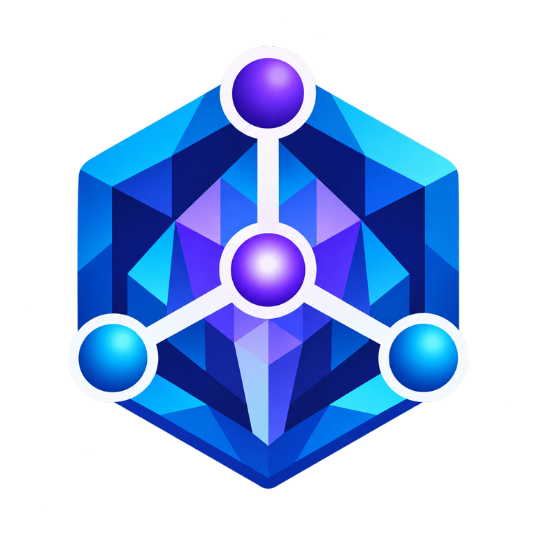

# Epistemic Graph

<p align="center">
  
</p>

<p align="center">
  <strong>A durable graph database and reasoning engine for connected, evidence-rich data.</strong><br>
  <sub>Property graph · SQL · RDF/OWL · vectors · time · provenance · multimodal records</sub>
</p>

<p align="center">

[](https://pypi.org/project/epistemic-graph/)
[](https://knuckles-team.github.io/epistemic-graph/)
[](LICENSE)
[](https://github.com/Knuckles-Team/epistemic-graph/releases)
[](https://github.com/Knuckles-Team/epistemic-graph/actions/workflows/release.yml)
[](https://github.com/Knuckles-Team/epistemic-graph/stargazers)
[](https://github.com/Knuckles-Team/epistemic-graph/forks)
[](https://github.com/Knuckles-Team/epistemic-graph/graphs/contributors)
[](https://github.com/Knuckles-Team/epistemic-graph/commits/main)
[](https://github.com/Knuckles-Team/epistemic-graph/pulls)
[](https://github.com/Knuckles-Team/epistemic-graph/pulls?q=is%3Apr+is%3Aclosed)
[](https://github.com/Knuckles-Team/epistemic-graph/issues)
[](https://github.com/Knuckles-Team/epistemic-graph)
[](https://github.com/Knuckles-Team/epistemic-graph)
[](https://github.com/Knuckles-Team/epistemic-graph)
[](https://github.com/Knuckles-Team/epistemic-graph)
[](https://pypi.org/project/epistemic-graph/)
[](https://pypi.org/project/epistemic-graph/)
[](https://pypi.org/project/epistemic-graph/)
[](https://pypi.org/project/epistemic-graph/)

</p>

<p align="center">
  <a href="https://knuckles-team.github.io/epistemic-graph/">Documentation</a> ·
  <a href="https://knuckles-team.github.io/epistemic-graph/capabilities/">Capabilities</a> ·
  <a href="https://knuckles-team.github.io/epistemic-graph/interfaces/">Interfaces</a> ·
  <a href="https://knuckles-team.github.io/epistemic-graph/status/">Status</a>
</p>

## Overview

Epistemic Graph is a Rust-native database and compute engine for teams building
knowledge systems, evidence-led applications, analytics, and agent memory. It
stores and queries connected graph records, relational data, RDF/OWL knowledge,
vectors, time-series, events, documents, and media through one engine.

Claims can retain their evidence, provenance, confidence, and time of validity,
so applications can inspect why information is present and how it changes. Use
Epistemic Graph directly through its clients and query interfaces, or as the
durable knowledge layer beneath [Graph OS](https://knuckles-team.github.io/graph-os/)
and [Agent Utilities](https://knuckles-team.github.io/agent-utilities/).
Epistemic Graph is the database; agent execution and connector runtimes live in
their respective ecosystem projects.

## Key capabilities

| Capability | What it provides |
|---|---|
| One multi-model engine | Property graph, relational tables, RDF, vectors, time-series, events, blobs, and media |
| Query across interfaces | UQL, SQL, SPARQL, Cypher/Bolt, GraphQL, and typed native clients |
| Semantic constraints | OWL reasoning, SHACL validation, and ShEx shape validation |
| Evidence-aware knowledge | Claims, provenance, confidence, contradiction handling, and bitemporal validity |
| Durable operation | Commit-before-ack persistence, audit, change data capture, tenant isolation, and observability |
| Distributed deployment | Single-node operation and an optional cluster build with replication and coordinated placement |

Check the [capability matrix](https://knuckles-team.github.io/epistemic-graph/capabilities/)
and [generated method ledger](https://knuckles-team.github.io/epistemic-graph/capabilities.generated/)
for the current behavior of each operation.

## Documentation

- [Start here](https://knuckles-team.github.io/epistemic-graph/) for a guided engine tour.
- [Interfaces](https://knuckles-team.github.io/epistemic-graph/interfaces/) explains UQL, SQL, SPARQL, Cypher, GraphQL, vectors, time-series, and clients.
- [Architecture](https://knuckles-team.github.io/epistemic-graph/architecture/) covers query execution, reasoning, storage, and distribution.
- [Deploy Epistemic Graph](https://knuckles-team.github.io/epistemic-graph/standalone_deployment/) covers durable server, TLS, containers, and clusters.
- [Operations](https://knuckles-team.github.io/epistemic-graph/operations/runbook/) covers day-two procedures and recovery.

## Architecture

<p align="center">
  
</p>

<p align="center">
  
</p>

People use the **Agent Web UI**, **Agent Terminal UI** (through the Graph OS
REST API), **Geniusbot**, or the messaging services hosted by **Graph OS**.
External applications and agents connect through Graph OS using MCP, REST, or
A2A. Graph OS governs the runtime boundary, **Agent Utilities** coordinates
agents and workflows, and Epistemic Graph stores and reasons over their durable
knowledge. Source systems enter through **Agent Connector SDK**, which commits
typed source data to the graph.

| This repository owns | Ecosystem projects own |
|---|---|
| Durable graph and multimodal state, query planning, semantic reasoning, transaction behavior, and engine authorization | [Graph OS](https://knuckles-team.github.io/graph-os/) owns MCP/REST/A2A entrypoints, runtime policy, messaging services, and frontend hosting |
| Generated engine contracts and capability truth | [Agent Utilities](https://knuckles-team.github.io/agent-utilities/) owns agents, workflows, skills, evaluation, and the agent control plane |
| Source-ingestion admission, schema validation, evidence, and provenance commits | [Agent Connector SDK](https://knuckles-team.github.io/agent-connector-sdk/) owns connector execution and source-system adapters |
| Database and compute execution | [Agent Web UI](https://knuckles-team.github.io/agent-webui/), [Agent Terminal UI](https://github.com/Knuckles-Team/agent-terminal-ui), and [Geniusbot](https://github.com/Knuckles-Team/geniusbot) provide user-facing clients |

## Quick start

Install the release wheel and open an in-process graph. This mode is explicit,
ephemeral, and needs no server or TLS configuration.

```bash
python -m pip install epistemic-graph
python -m epistemic_graph.cli status  # no server is expected in embedded mode
python - <<'PY'
import msgpack
from epistemic_graph.engine import Engine

engine = Engine(persist_dir=":memory:")
engine.create_graph("demo")
engine.add_node(
    "demo",
    "node:hello",
    msgpack.packb({"kind": "Greeting"}, use_bin_type=True),
)
print(engine.has_node("demo", "node:hello"), engine.node_count("demo"))
PY
```

Expected output:

```text
Status: NOT RUNNING (no PID file)
True 1
```

For durable storage, authenticated clients, containers, TLS, or clustering,
continue with [Deploy Epistemic Graph](https://knuckles-team.github.io/epistemic-graph/standalone_deployment/).

## Contributing

Issues and pull requests are welcome. See [CONTRIBUTING.md](CONTRIBUTING.md)
for development setup and review gates. Architecture and implementation guidance
for coding agents lives in [AGENTS.md](AGENTS.md).

## License

Licensed under the [MIT License](LICENSE).
