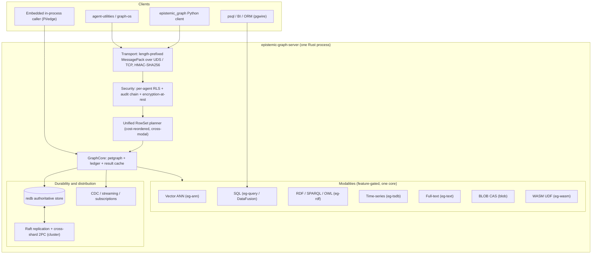
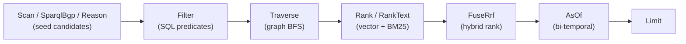

# epistemic-graph

<p align="center">
  <b>One durable, Rust-native engine that is a drop-in substrate for graph · vector · SQL · SPARQL/RDF/OWL · time-series · blob · key-value · message-broker · observability · spatial/GIS · tensor · agent-memory</b><br>
  <sub>Every modality is a first-class citizen of one <code>RowSet</code> planner — from a Raspberry Pi to a replicated Raft cluster, from one core.</sub>
</p>

<p align="center">
  
  
  
</p>

> **Honesty first.** This README claims only what the code actually does today. Every row in the
> [capability matrix](#capability-matrix) is tagged ✅ supported · 🔶 in-progress · 🗺 roadmap, and the
> [parity roadmap](docs/roadmap.md) names exactly which gaps are being closed and in which order. If a
> doc and the code disagree, the code wins — file an issue.

> **Documentation** — the full architecture, the tier/binary map, deployment recipes, the
> per-interface guides, and the concept registry live in the
> [official documentation](https://knuckles-team.github.io/epistemic-graph/).

> **This is the compute & storage engine for
> [`agent-utilities`](https://github.com/Knuckles-Team/agent-utilities)** — a standalone Rust service
> reached out-of-process over MessagePack/UDS (no PyO3), embedded in-process, or spoken to over the
> Postgres wire protocol. Contributing? See [CONTRIBUTING.md](CONTRIBUTING.md).

---

## The thesis: one engine, every modality

A modern agent platform normally needs a graph database **and** a vector index **and** a SQL warehouse
**and** a triple-store + reasoner **and** a time-series DB **and** a blob store **and** a full-text
index **and** a message broker **and** an observability stack **and** a GIS engine **and** an LLM
KV-cache — a dozen systems, a dozen copies of the data, a rat's nest of sync pipelines, and a brittle
application layer that stitches results back together.

`epistemic-graph` is the **"master of all databases"**: it speaks the *wire protocols* of the systems
it replaces (Postgres, MySQL, MSSQL, SQLite, Neo4j Bolt, Redis, S3, AMQP/MQTT/STOMP, PromQL, OTLP) so
existing clients, drivers and ORMs connect **unmodified** — all resolving to ONE exec path over ONE
store.

`epistemic-graph` collapses that rack into **one durable engine with one unified query planner**. Every
modality is a view over the same `RowSet` algebra, so a single plan can seed candidates from an OWL
inference or a SPARQL pattern, filter them with SQL, traverse the graph, re-rank by vector similarity
*and* BM25 text, fuse the two, and run a sandboxed WASM UDF — without ever leaving the engine or
marshalling rows back to Python.

It is **durable by default**: built with the `redb` feature (folded into every deployment tier), the
persist dir is the **authoritative source of truth** and an acked write survives `kill -9`
(commit-before-ack). It scales by configuration alone — the *same binary family* runs as an embedded
in-process library on a Pi, a single durable server, or a multi-node Raft cluster with cross-shard
transactions.

### Drop-in positioning — and the honest parity status

| You run today | epistemic-graph as a drop-in | Current parity |
|---------------|------------------------------|----------------|
| **Postgres** (psql / BI / ORM) | pgwire server: SCRAM/trust auth, simple + extended protocol, `pg_catalog` + `information_schema` (`\d`/`\dt`/`\l`), `CREATE FUNCTION`, arrays/ranges + common functions, `CREATE EXTENSION` | ✅ read SQL · ✅ user tables + DDL + `COPY` · ✅ compound-WHERE DML + `INSERT…SELECT` + `ON CONFLICT` + mixed-store wire transactions · ✅ views/functions |
| **Postgres extensions** (pgvector / AGE / TimescaleDB / ParadeDB) | `vector` type + `<->`/`<=>`/`<#>` with **real ANN index pushdown** to HNSW/IVF, AGE `cypher()`, TimescaleDB hypertables + continuous aggregates, ParadeDB `@@@` with **real BM25 ranking + snippets** | ✅ pgvector (real pushdown, EG-313) · ✅ AGE · ✅ Timescale · ✅ ParadeDB (real BM25, EG-311) (EG-114/116/117/119) |
| **Databricks / lakehouse** (Delta / Iceberg / Spark / Trino / DuckDB) | **LTAP** interop (`eg-lake`): the engine's tables materialize as open **Parquet + Delta + Iceberg** on object-store with an **Iceberg-REST catalog** + LSN as-of, so external lakehouse engines read them with **zero ETL** | ✅ Parquet · ✅ Delta log · ✅ Iceberg-REST catalog + LSN as-of · 🔶 Iceberg Avro manifest stub (EG-317) |
| **Stardog / GraphDB** (RDF triple-store + reasoner) | RDF dataset over the property graph, SPARQL 1.1, OWL 2 EL⁺/RL reasoning, SHACL + ShEx, **ICV enforced on the write path**, **R2RML** OBDA virtual graphs, GeoSPARQL | ✅ SELECT/ASK/CONSTRUCT/DESCRIBE + UPDATE + `/sparql` + total-ordering `ORDER BY` + rich FILTER + content negotiation + SHACL/ICV (commit-guard, EG-300) + R2RML Turtle (EG-305) + JSON-LD/TriG/RDF-XML + OWL-DL tableau + SWRL (EG-059/060) |
| **Neo4j** (property graph) | native petgraph core + Cypher `MATCH…RETURN` + writes + GDS via `CALL gds.*` + `UNWIND`, plus a native **Bolt v4.4** wire | ✅ read traversal, writes (`CREATE/MERGE/SET/DELETE`), `ORDER BY`/`WITH`/aggregation, GDS over `CALL gds.*` (PageRank/Louvain/betweenness/Dijkstra/SCC), Bolt drivers (EG-144/298/159) |
| **Pinecone / Milvus** (vector DB) | native IVF-PQ + OPQ + SQ8 + **HNSW** ANN + exact/flat index + recall harness, persistent, warm-on-start, **cross-shard scatter-gather** | ✅ (EG-297/301/319) |
| **InfluxDB / TimescaleDB** (time-series) | native redb TSDB: ASOF, gap-fill, `time_bucket`, OHLC, decay, columnar segments + SQL window frames | ✅ primitives + window functions + `Op::Window` planner-op execution + per-point retention trim (EG-089/067/068) |
| **S3 / MinIO** (blob) | content-addressed streaming CAS, redb-native or S3-backed, plus an **S3 REST** serving surface (SigV4-lite) | ✅ (EG-176) |
| **Redis** (KV / structures) | native **RESP2/3** wire over the KV surface (GET/SET/INCR, hashes, lists, sets, sorted-sets) | ✅ (EG-174) |
| **SQLite / RocksDB** (embedded KV) | `EmbeddedEngine` in-process handle + generic namespaced KV over the same redb rows | ✅ embedded graph API · ✅ generic KV · ✅ SQLite/MySQL/MSSQL/Bolt wires |
| **MySQL / MariaDB / SQL Server** (protocol clients) | hand-rolled MySQL (handshake v10), MSSQL-TDS and SQLite-NDJSON listeners over the shared wire core | ✅ connect + query via native drivers · see [`connecting.md`](docs/interfaces/connecting.md) (EG-075/076/077) |
| **RabbitMQ / Kafka** (message broker) | native broker: exchanges/topic-routing, DLQ, TTL, priority, delayed delivery, consumer-groups + QoS, replayable streams, publisher confirms + **exactly-once** (idempotent producer); **AMQP 0.9.1 / MQTT / STOMP** wires | ✅ (EG-275–284, EG-281/282); exactly-once + AMQP `confirm.select`/MQTT5 frames (EG-314) |
| **Prometheus / OpenObserve / Jaeger** (observability) | obs listener: log ingest + PromQL `/api/v1/query` (extended fn set) + OTLP traces `/v1/traces` + service-map + VRL pipelines + super-cluster federated search; the engine also **emits its own** metrics/traces (OTLP export + Prometheus remote-write) | ✅ logs · ✅ PromQL (extended, EG-302) · ✅ traces · ✅ pipelines · ✅ federated · ✅ OTel export/remote-write (EG-316) (EG-160–165/172/243) |
| **PostGIS / GIS** (spatial) | native eg-geo: CRS/reprojection, R-tree, GeoJSON/WKB/GPX + **Shapefile/KML/GeoParquet**, XYZ/TMS + MVT tiles, routing (+ turn-restrictions/time-windows)/isochrones/TSP, map task-tracking | ✅ (EG-262–267/306/312) |
| **Apollo GraphQL** | Apollo Federation v2 subgraph (`_service`/`_entities`, `@key`) + APQ/depth/complexity hardening + CDC subscriptions + fragments/variables/directives + relay pagination | ✅ (EG-295/296/064/065/066) |
| **vLLM / LMCache** (LLM KV-cache) | tiered hot/warm/cold KV-block cache + shared dedup backend + HTTP endpoint (LMCache remote-backend contract) — the durable, deduplicating **L2 tier** below vLLM's GPU prefix-cache (L0) and LMCache's CPU tier (L1) | ✅ (EG-185/186/187) |
| **Agent memory** (Zep / mem0 / LeanRAG) | bi-temporal `AsOf`, summary-node tier, episodic→semantic consolidation, decay/reinforce, LeanRAG hierarchical retrieval, scene/trajectory memory — all **drivable over the wire**, NL→query | ✅ (EG-220/221/222/195); memory/scene/trajectory wire-Op surface for AU/MCP (EG-318); NL→query is a complete LLM-optional seam (EG-078/080) |

The point is **convergence, not a checkbox**: the modalities share one snapshot, one ACID transaction,
one security model, and one planner. See the full [capability matrix](#capability-matrix) below for the
operation-by-operation truth.

---

## Capability matrix

Legend: **✅ supported** (implemented & tested) · **🔶 in-progress** (partial or being added now) ·
**🗺 roadmap** (designed, not built). Feature flags are the Cargo features that gate each surface; the
[tier table](#deployment-tiers-and-the-prebuilt-binaries) shows which prebuilt binary carries them.

| Interface | Operation | Status | Feature | Notes |
|-----------|-----------|:------:|---------|-------|
| **SQL** | `SELECT` (joins, aggregates, CTE, window, subquery) | ✅ | `query` | DataFusion 43 over `nodes` + `edges`; real predicate pushdown (Inexact) |
| **SQL** | `INSERT` / `UPDATE` / `DELETE` (+ `RETURNING`) | ✅ | `query` | `nodes` + user tables (KG-2.198); serializable CAS gates |
| **SQL** | Compound/`AND`/`OR`/`IN`/`BETWEEN`/`IS NULL` WHERE DML, `INSERT…SELECT`, `UPDATE…FROM`/`DELETE…USING`, `ON CONFLICT` upsert | ✅ | `query` | EG-045/046/047/048; serializable re-check under the write guard |
| **SQL** | Mixed-store wire transactions (`BEGIN`/`COMMIT`/`ROLLBACK` + `TransactionStatus`) | ✅ | `pgwire` | EG-049; node + user-table ops, read-your-own-writes; documented non-2PC user-table window |
| **SQL** | `CREATE VIEW`/`DROP VIEW`, `CREATE FUNCTION`, arrays/ranges + common functions | ✅ | `query` | EG-072/118/104; durable view + function catalog |
| **SQL** | Arbitrary user tables + DDL (`CREATE`/`ALTER ADD COLUMN`/`DROP`), `COPY` | ✅ | `query` | durable redb table catalog (EG-018/EG-020); JOINable to the graph |
| **SQL** | `ALTER TABLE` beyond ADD COLUMN — `DROP`/`RENAME COLUMN`, `RENAME TO`, `ALTER COLUMN TYPE`, `DROP CONSTRAINT` | ✅ | `query` | durable catalog rewrite with data migration (EG-310) |
| **SQL** | Columnar segments + window functions (`ROW_NUMBER`/`RANK`/`LAG`/`LEAD`/`OVER(…)`) | ✅ | `query` | EG-089; struct-of-arrays analytical scan |
| **Postgres compat** | `pg_catalog` + `information_schema` system views (`\d`/`\dt`/`\l`) | ✅ | `pgwire` | EG-103; synthesized from live table/view/function catalogs |
| **Postgres compat** | `CREATE EXTENSION` catalog · pgvector `vector` + `<->`/`<=>`/`<#>` + **real ANN pushdown** to HNSW/IVF + exact re-rank | ✅ | `pgwire` | EG-102/115/116; real top-k pushdown (EG-313) |
| **Postgres compat** | AGE `cypher()` set-returning function, TimescaleDB hypertables + continuous aggregates, ParadeDB `@@@` **real BM25 ranking + snippets** | ✅ | `pgwire` | EG-114/117/119; real BM25 (EG-311) |
| **Postgres wire** | listener, simple + extended/prepared protocol | ✅ | `pgwire` | `EPISTEMIC_GRAPH_PGWIRE_ADDR`; folded into `node`/`full`/`cluster` (EG-352) |
| **Postgres wire** | SCRAM-SHA-256 / trust auth, `pg_catalog` introspection | ✅ | `pgwire` | KG-2.202 / KG-2.201; pg user → engine ACL actor |
| **SPARQL** | `SELECT` (BGP, paths, FILTER subset, OPTIONAL, UNION, GROUP/agg, BIND, DISTINCT, SLICE) | ✅ | `sparql` | spargebra parser compiled to LPG scans |
| **SPARQL** | `ASK` / `CONSTRUCT` / `DESCRIBE` | ✅ | `sparql` | template instantiation + bounded description (gated by `rdf`, implied by `sparql`) |
| **SPARQL** | `UPDATE` (`INSERT/DELETE DATA`, `DELETE/INSERT WHERE`, `CLEAR`, `CREATE`/`DROP GRAPH`) | ✅ | `sparql` | `eg-rdf/src/update.rs`; `LOAD` intentionally deferred (no HTTP fetch in write path) |
| **SPARQL** | `/sparql` HTTP endpoint (W3C SPARQL 1.1 Protocol) | ✅ | `sparql-http` | `src/server/sparql_http.rs`; GET + POST query/update |
| **SPARQL** | true named graphs (quad dataset) + `FROM`/`FROM NAMED` | ✅ | `sparql` | `GRAPH ?g`/constant-IRI over registry graphs (EG-054) |
| **SPARQL** | `ORDER BY` total-ordering, `VALUES`, `MINUS`, `EXISTS`/`NOT EXISTS`, negated property set | ✅ | `sparql` | EG-135/125/055/056; fixes the unordered-results correctness gap |
| **SPARQL** | content negotiation (JSON/XML/CSV/TSV/Turtle/N-Triples), rich FILTER, sub-SELECT, SERVICE federation | ✅ | `sparql` | EG-050/053/051/052; SSRF allowlist on SERVICE |
| **SPARQL** | SHACL + ShEx validation, ICV integrity constraints (**enforced on the commit/write path**), GeoSPARQL + RCC8/Egenhofer | ✅ | `sparql`/`geosparql` | EG-132/133/146/261/155; ICV commit-guard (EG-300) |
| **RDF I/O** | JSON-LD 1.1, TriG, N-Quads, RDF/XML serialization matrix | ✅ | `rdf` | EG-136/137 (alongside Turtle/N-Triples) |
| **Cypher** | `MATCH … WHERE … RETURN … LIMIT` (var-length `[*m..n]`) | ✅ | `cypher` | read over a snapshot; WHERE supports `OR`/`IN`/`STARTS WITH`/`CONTAINS`/`IS NULL` (EG-062) |
| **Cypher** | writes (`CREATE`/`MERGE`/`SET`/`DELETE`+`DETACH`/`REMOVE`) | ✅ | `cypher` | native eg-core mutations (EG-061) |
| **Cypher** | `ORDER BY`/`SKIP`/`WITH`/`OPTIONAL MATCH`/`OR`/aggregation/`DISTINCT`/`UNWIND`/`CALL` | ✅ | `cypher` | EG-062/141/142; GDS via `CALL gds.<algo>(…) YIELD …` streams eg-compute results as rows (EG-143/144/298) |
| **Cypher** | Neo4j **Bolt v4.4** wire (PackStream v2) | ✅ | `bolt-wire` | `EPISTEMIC_GRAPH_BOLT_ADDR` (EG-159); neo4j drivers / cypher-shell |
| **GraphQL** | read queries (scan + BFS, schema-from-graph, aliases, `first`/`limit`, filters) | ✅ | `graphql` | byte-equal to Cypher path |
| **GraphQL** | mutations (`createNode`/`updateNode`/`deleteNode`/`addEdge`/`removeEdge`) | ✅ | `graphql` | native eg-core mutations |
| **GraphQL** | Apollo Federation v2 subgraph (`_service`/`_entities`, `@key`) + APQ/depth/complexity hardening | ✅ | `graphql` | EG-295/296 |
| **GraphQL** | subscriptions / fragments / variables / directives / relay pagination | ✅ | `graphql` | real CDC push (`LiveQuery`, WS/SSE) + `$`/`@` lexer + fragments + `@skip`/`@include` + relay envelope (EG-064/065/066) |
| **OWL** | EL⁺ + RL forward-chaining materialization & classification | ✅ | `owl` | pure-Rust; consistency + incremental + justifications |
| **OWL** | confidence-weighting + Ebbinghaus time-decay | ✅ | `owl` | KG-2.236; per-axiom `eg:confidence`, fact decay |
| **OWL** | query-time `Op::Reason` (reasoner seeds a RowSet) | ✅ | `owl-plan` | distributed/cross-shard union supported |
| **OWL** | OWL-DL (tableau, cardinality, `allValuesFrom`), SWRL user rules | ✅ | `owl-dl`/`owl` | pure-Rust DL tableau (consistency→classification→instance) + `swrlb:` built-in library; EL/RL fast path stays default (EG-059/060) |
| **Vector / ANN** | IVF-PQ + OPQ + SQ8-refine, persistent (reopen w/o rebuild), warm-on-start | ✅ | `ann` | parallel/SIMD brute-force fallback below threshold |
| **Vector / ANN** | hybrid metadata pre-filter (kNN + `allow(id)` predicate) | ✅ | `ann` | `search_filtered` (EG-070); filtered during the ADC probe |
| **Vector / ANN** | HNSW index (higher recall-per-probe than IVF-PQ) | ✅ | `ann` | insert/search/serde-persist, recall-harness-tuned (EG-301) |
| **Vector / ANN** | exact/flat kNN index + ANN-vs-exact re-rank + recall@k/precision harness | ✅ | `ann` | EG-297 |
| **Vector / ANN** | cross-shard kNN scatter-gather → deterministic global top-k | ✅ | `ann` | server-layer scatter over per-shard indexes merged via the `merge_topk` leaf (EG-319, completing EG-069) |
| **Time-series** | store + `time_bucket`, ASOF join, gap-fill LOCF, OHLC, downsample, decay | ✅ | `tsdb` | native redb columnar, no DataFusion |
| **Time-series** | time-ops as unified planner ops (`Op::Window`) | ✅ | `tsdb` | real `window_aggregate` over the RowSet via eg-tsdb `time_bucket` (EG-067); per-point retention trim (EG-068) |
| **Blob / CAS** | content-addressed streaming store (redb-native) | ✅ | `blob` | refcount mark-and-sweep GC; bounded RAM |
| **Blob / CAS** | S3 / MinIO backend behind the same `ChunkStore` trait | ✅ | `blob-s3` | manifest/linkage byte-identical |
| **Blob / CAS** | content-defined chunking | ✅ | `blob` | Gear/FastCDC rolling-hash chunker (variable boundaries); sha256 CAS dedup + refcount GC preserved (EG-071) |
| **Key-value** | embedded in-process engine API over redb rows | ✅ | `embedded` | `EmbeddedEngine` — no Tokio/socket/HMAC (KG-2.216) |
| **Key-value** | generic namespaced `get`/`put`/`scan`/`cas` KV surface over redb | ✅ | `redb` | `src/server/kv.rs` (EG-022); durable, commit-before-ack; not graph-scoped |
| **Multi-wire** | wire-neutral SQL core (`WireProtocol`/`WireSession`, one classify→exec path) | ✅ | `wire` | `src/server/wire` (EG-074); shared by every SQL wire |
| **Multi-wire** | MySQL / MariaDB wire (handshake v10 + `mysql_native_password`) | ✅ | `mysql-wire` | `EPISTEMIC_GRAPH_MYSQL_ADDR` (EG-076) |
| **Multi-wire** | MSSQL TDS wire | ✅ | `mssql-wire` | `EPISTEMIC_GRAPH_MSSQL_ADDR` (EG-077) |
| **Multi-wire** | SQLite-dialect NDJSON-over-TCP endpoint | ✅ | `sqlite-wire` | `EPISTEMIC_GRAPH_SQLITE_ADDR` (EG-075); `.db` file I/O 🔶 forward roadmap |
| **Multi-wire** | Neo4j Bolt v4.4 wire (PackStream v2, native Cypher) | ✅ | `bolt-wire` | `EPISTEMIC_GRAPH_BOLT_ADDR` (EG-159) |
| **Broker** | exchanges (direct/topic/fanout) + bindings/routing over the KG-2.303 work-queue | ✅ | `broker` | RabbitMQ-class (EG-275) |
| **Broker** | DLQ · message/queue TTL · priority · delayed/scheduled delivery · consumer-groups + QoS/prefetch | ✅ | `broker` | EG-276/277/278/279/280 |
| **Broker** | replayable append-log streams (Kafka-style offsets/retention) + publisher confirms + manual ack/nack | ✅ | `broker` | EG-283/284 |
| **Broker** | exactly-once (idempotent-producer dedup) + stream/confirm/ack over AMQP `confirm.select` + MQTT 5 frames | ✅ | `broker` | effectively-exactly-once atop at-least-once (EG-314) |
| **Broker wires** | AMQP 0.9.1 · MQTT 3.1.1/5.0 · STOMP 1.2 listeners | ✅ | `amqp-wire`/`mqtt-wire`/`stomp-wire` | `EPISTEMIC_GRAPH_{AMQP,MQTT,STOMP}_ADDR` (EG-275/281/282) |
| **KV / structures** | Redis RESP2/3 wire (strings/hashes/lists/sets/sorted-sets) + **pub/sub** + `MULTI`/`EXEC` | ✅ | `redis-wire` | `EPISTEMIC_GRAPH_REDIS_ADDR` (EG-174/307) |
| **Object store** | S3-compatible REST (bucket/object CRUD, SigV4-lite) over the blob CAS + **multipart upload** + **range GET** | ✅ | `s3-api` | EG-176/307 |
| **Observability** | log ingest + PromQL `/api/v1/query` (extended fn set) + OTLP traces `/v1/traces` + service-dependency map | ✅ | `obs`/`promql`/`traces` | `EPISTEMIC_GRAPH_OBS_ADDR`, default `:5080` (EG-160/172/163); PromQL `_over_time`/`topk`/`label_replace`/`clamp*` (EG-302) |
| **Observability** | VRL-style ingest pipelines (parse/filter/enrich, cross-modal) + super-cluster federated search (typed SQL/SPARQL fusion) | ✅ | `obs`/`federation` | EG-165/243; typed result fusion (EG-309) |
| **Observability** | engine's own telemetry egress — OTLP metrics/traces export + Prometheus remote-write receiver | ✅ | `otel-export` | the engine emits, not just ingests (EG-316) |
| **Lakehouse (LTAP)** | Parquet-on-object-store + Delta log + Iceberg-REST catalog + LSN as-of — external lakehouse engines read with zero ETL | ✅ | `lake` | `eg-lake` (EG-317); Iceberg Avro manifest is a documented stub |
| **Spatial / GIS** | `SpatialScan` + `ST_Within`/`ST_DWithin`, GeoSPARQL + RCC8/Egenhofer, CRS/reproject, R-tree, GeoJSON/WKB/GPX + **Shapefile/KML/GeoParquet** | ✅ | `geo`/`geosparql` | eg-geo (EG-083/261/155/262/263/264); Shapefile/KML/GeoParquet I/O (EG-306); no GEOS/PROJ |
| **Spatial / GIS** | XYZ/TMS + Mapbox Vector Tiles · weighted routing (+ **turn-restrictions/time-windows**)/isochrones/TSP · map-based task tracking | ✅ | `geo` | EG-265/266/267; turn-restrictions + time-dependent weights (EG-312) |
| **Document / JSON** | deep JSONPath query + durable inverted path-index (persists to redb + boot-rehydrate + cost `Stats`); PG `->`/`->>`/`@>` + Mongo `$match` | ✅ | (core)/`query` | `Pred::JsonPath` (EG-084); durable path-index (EG-308) |
| **Tensor / probabilistic** | N-D array store (CAS-backed) + `TensorScan`/`TensorOp` (results **written back** to the CAS store); distribution-valued properties | ✅ | `tensor` | EG-085/086; tensor-op CAS write-back (EG-304) |
| **Scene-graph / 3D** | `:SceneObject` pose + transform hierarchy + spatial relations (robotics/AR/urban-3D) | ✅ | (core) | EG-087 |
| **CEP / streams** | windowed event ingest + `Op::Cep` bounded-NFA pattern match over sliding/tumbling windows | ✅ | `stream` | EG-088 |
| **Robotics** | multimodal sensor fusion (ASOF-aligned) + action/trajectory memory | ✅ | `tensor` | EG-098/099 |
| **KV-cache (LLM)** | tiered hot/warm/cold KV-block cache (real **zstd/lz4** warm-tier compression) + shared dedup backend + HTTP endpoint (vLLM/LMCache contract) — the durable **L2 tier** under vLLM (L0 GPU) → LMCache (L1 CPU) | ✅ | `kvcache-server` | eg-kvcache (EG-185/186/187); real compression codec (EG-315); see [kvcache interface](docs/interfaces/kvcache.md) |
| **Agent memory** | bi-temporal `AsOf`, decay/reinforce, summary-node tier, episodic→semantic consolidation, LeanRAG retrieval, scene/trajectory — **drivable over the wire** | ✅ | (core) | `Op::AsOf` (KG-2.250); EG-220/221/222/195; wire-Op surface (EG-318) |
| **OBDA** | R2RML virtual graphs — SPARQL over a foreign source rewrites to `ForeignScan` (no materialization); parses **R2RML Turtle** documents | ✅ | `federation` | EG-101; R2RML Turtle parse (EG-305) |
| **RBAC** | durable roles + role hierarchy + resource/action grants over per-agent RLS (persist to redb + boot-reload) | ✅ | `security` | EG-092; durable persistence (EG-303) |
| **Scheduling / QoS** | real-time QoS/SLO scheduler — per-tenant/priority admission + deadline scheduling + backpressure | ✅ | (server) | EG-320; complements the reserved read-admission lane (EG-044) |
| **Backup / DR** | consistent online backup + restore CLI + PITR (`Method::Backup`/`Restore`) | ✅ | `redb` | EG-090 |
| **Full-text** | Tantivy BM25 inverted index, `RankText` + reciprocal-rank fusion | ✅ | `text` | composes in the unified planner |
| **Unified planner** | `Scan·Filter·Traverse·Rank·RankText·FuseRrf·Reason·SparqlBgp·Udf·ForeignScan·AsOf·Limit` | ✅ | `query`+ | each op feature-gated; see [UQL](docs/uql.md) |
| **Unified planner** | `Op::Window` / `Op::Foreign` execution | ✅ | `query` | `Op::Window` = real eg-tsdb windowed aggregate (`timeseries`, EG-067); `Op::Foreign` resolves the name via the `ForeignSourceRegistry` (`federation`, EG-073) |
| **UQL** | text DSL → `wire::Plan` (one parse, zero new exec path) | ✅ | (front-end always ships) | dependency-free parser |
| **UQL** | natural-language → query (`Method::NlQuery`, `/nl`, `nl_query()` UDF) | ✅ | `nl-query` | EG-078/080; complete LLM-optional seam — inert until an OpenAI-compatible endpoint is set; AU-provider integration tracked on the agent-utilities side |
| **Durability** | redb-authoritative, commit-before-ack (`kill -9`-safe) | ✅ | `redb` | folded into every tier |
| **Distribution** | openraft replication + automatic failover | ✅ | `raft` | `cluster` tier; off ⇒ byte-for-byte single-node |
| **Distribution** | cross-shard 2PC + parallel-commit + read-only-participant + non-blocking (Raft-replicated decision) commit | ✅ | `raft` | presumed-abort 2PC (KG-2.222) + parallel prepare/empty-write-set skip (EG-081) + Paxos-Commit-lite replicated decision (EG-082) |
| **Distribution** | Calvin deterministic-ordering cross-shard commit (order-first, vote-free, crash-replay) | ✅ opt-in | `calvin` (⇒ `nonblocking`) | EG-324; sequencer + Raft-replicated input log + vote-free execution shipped; distributed OLLP read-lock phase + multi-node epoch fan-in documented-deferred — see [distribution-robotics-gpu](docs/architecture/distribution-robotics-gpu.md) |
| **Distribution** | multi-Raft groups (N-group ring, online reshard, hibernate/rehydrate) | ✅ | `raft` | `GroupRouter` + `MultiRaft` (KG-2.266/267/268); online ownership move |
| **Distribution** | cross-region async read-replica tier (bounded-LSN log + follower pull → `wal::apply`) + capacity guardrails (circuit breaker / per-tenant quota / backpressure) | ✅ opt-in | `federation-search` | EG-322/323; off by default (`EPISTEMIC_GRAPH_REPLICATE`); complements the EG-320 QoS scheduler with absolute ceilings |
| **Federation** | remote engine / HTTP-JSON / external SQL (`sqlx`) as a `ForeignScan` | ✅ | `federation`(`-sql`) | OFF by default; never in `pi` |
| **Robotics** | ROS2 bridge over rosbridge-WebSocket (CDC↔topic, no DDS/C toolchain) | ✅ opt-in | `ros2-bridge` | EG-325; pure-Rust `tokio-tungstenite`; native DDS/RTPS (CycloneDDS) a documented optional leg |
| **GPU** | GPU distance/tensor dispatch seam + real CUDA backend (NVRTC, `dynamic-loading`) | ✅ opt-in | `gpu` / `gpu-cuda` | EG-326/327; pure-Rust CPU backend is always compiled + the byte-for-byte ground truth; CUDA auto-falls-back on a GPU-less host; live-GPU kernel validation deferred (none in CI) |
| **Numeric / analytics** | BLAS/LAPACK-free Rust numeric kernel (`eg-numeric`: reductions/stats · element-wise · linalg via faer · seedable random) | ✅ P1 (Surface A) · 🗺 Surface B | `numeric` (in `full`) | EG-321; **P1 of the [Analytics Program](docs/architecture/analytics-program.md)** ("one kernel, two surfaces"). Surface A = in-process Python (`epistemic_graph.numeric` + the AU `xp` numpy-shim, 847 parity checks); Surface B (in-DB DataFusion UDFs/graph/vector/ts analytics) is P2–P5 follow-on. Out of `pi`/`node` — see [numeric-kernel](docs/architecture/numeric-kernel.md) |
| **Clients** | multi-language client drivers — Python (full) · JS / Go (thin: broker/streams/RBAC/backup/NL) over framed MessagePack (no PyO3/FFI) | ✅ | (client) | EG-328; wire-parity gated (`test_protocol_parity.py`) — see [clients](docs/interfaces/clients.md) |

---

## Architecture at a glance



A single cross-modal plan flows through one snapshot:



See **[docs/overview.md](docs/overview.md)** for the pipeline and
**[docs/architecture/engine.md](docs/architecture/engine.md)** for the full architecture.

---

## Deployment tiers and the prebuilt binaries

The same engine ships as a small family of prebuilt, size-optimized binaries (`release-tiny` profile).
A Pi **pulls a prebuilt wheel and never compiles**. Full build/wheel recipes are in
**[docs/deployment.md](docs/deployment.md)**; the feature-composition map is in
**[docs/architecture/tiers.md](docs/architecture/tiers.md)**.

| Binary | Carries | For |
|--------|---------|-----|
| **pi** | redb-authoritative + cypher + ann + rdf/sparql/owl + streaming + result-cache + cost — **no DataFusion SQL, no Tantivy, no Raft** | Raspberry Pi / edge, ultra-lean |
| **pi-max** | pi + tsdb + blob + security — all pure-Rust, still no C toolchain | Pi "everything without a C compiler" |
| **node** (default wheel) | pi + DataFusion SQL (`query`) + GraphQL + Tantivy text + `owl-plan` + wasm-udf + federation + **pgwire** (Postgres wire SQL) + finance/datascience — a COMPLETE single-node DB | single durable server / SQL clients |
| **cluster** | node (incl. **pgwire**) + Raft replication + distributed compute + cross-shard 2PC + the extra wire protocols | multi-node HA / cross-node SQL clients |
| **full** | every single-node feature, size-optimized (**incl. pgwire**, no raft) — incl. the `numeric` kernel (Surface A), `kvcache-server`, broker, LTAP | workstation / one binary, every feature |
| **full-extras** | `full` + the optional accelerator legs (`gpu-cuda` GPU distance/tensor, `ros2-bridge` robotics) | workstation with a GPU / robotics — **out of `pi`** (heavy `cudarc`/`tokio-tungstenite` deps) |

> Note: the lean **pi** tier carries SPARQL `SELECT` and OWL reasoning (via the `Method::Owl*` RPCs) but
> **not** the SQL-backed `Op::Reason`/`Op::SparqlBgp` planner ops — those need `owl-plan`, which pulls
> `query` (DataFusion) and lands in **node**. Every tier is **redb-authoritative**.

---

## Three engine modes + the auto-bundle

`agent-utilities` reaches an engine through **one resolver** (`EngineResolver`, CONCEPT:OS-5.63) by a
single precedence — no per-entrypoint code:

```
remote  ->  shared-local  ->  autostart
```

A configured remote (Docker on another host) is used as-is and never autostarts; a co-located engine
already serving is reused; otherwise a **detached, supervised** engine is autostarted under a
first-one-wins lock and **reference-counted idle-shuts-down** after its last client disconnects.
Details + the decision flow: **[docs/engine-modes.md](docs/engine-modes.md)**.

For the embedded/edge story, the `embedded` feature gives a SQLite/DuckDB-style in-process handle
(`EmbeddedEngine`) over the *same* GraphCore + redb durable rows — no Tokio, no socket, no HMAC — the
"100M agents, a local engine each" path.

---

## Distribution & durability

- **redb-authoritative by default.** A committed write is fsynced to redb *before* the client is acked
  (commit-before-ack); an acked write survives a hard crash. Eviction is read-through-safe.
- **In-engine Raft replication (cluster tier, `raft`).** `openraft` replicates the authoritative redb
  store; the Raft log shares the one `graph.redb` (a log append + its graph mutation coalesce into one
  fsync). Leader failover is automatic. Off ⇒ the write path is byte-for-byte single-node.
- **Cross-shard 2PC.** A transaction spanning multiple Raft groups commits atomically via presumed-abort
  two-phase commit, surviving coordinator/participant crashes — with parallel-commit + read-only-participant
  fast paths (EG-081) and a non-blocking Raft-replicated commit decision (EG-082). Multi-Raft group routing +
  online per-tenant resharding are live (`GroupRouter`/`MultiRaft`, KG-2.266/267/268; EG-032). A third,
  opt-in **Calvin** deterministic-ordering commit branch (EG-324, `calvin` feature) is order-first and
  vote-free — a crashed coordinator is resolved by replaying the Raft-replicated input log (its distributed
  OLLP read-lock phase is documented-deferred). Beyond the synchronous groups, a **cross-region async
  read-replica tier** with capacity guardrails (EG-322/323, `federation-search`) gives a distant region a
  local eventually-consistent read copy. See
  [distribution-robotics-gpu](docs/architecture/distribution-robotics-gpu.md).
- **Cross-modal ACID.** A graph mutation + a vector upsert + a blob reference land in **one** redb
  `WriteTransaction` — all modalities commit together or none do.

---

## Security & isolation

- **Auth is mandatory.** Every RPC carries `HMAC-SHA256(secret, request_id)`; the server refuses to
  start with an empty secret (`--allow-insecure` opts out, dev only). The pgwire surface adds
  SCRAM-SHA-256.
- **Per-agent Row-Level Security.** Once any identity is registered, the read/plan-path `GraphView` is
  filtered to the rows the caller may see *before* any query surface (SQL/Cypher/SPARQL/GraphQL/unified)
  touches it. The result cache keys on the caller's RLS context.
- **Encryption-at-rest** (`security`): redb durable value blobs are ChaCha20-Poly1305 AEAD-sealed
  (pure-Rust RustCrypto, no ring/openssl).
- **Hash-chained tamper-evident audit log** over every durable mutation.

See **[docs/service_mode.md](docs/service_mode.md)** for the protocol, auth, and isolation policy.

---

## Quickstart, per interface

### Native client — out-of-process (the standard path)

```python
from epistemic_graph import SyncEpistemicGraphClient

g = SyncEpistemicGraphClient()                    # connects/attaches to the UDS engine

g.nodes.add("AgentA", {"type": "coordinator"})
g.nodes.add("AgentB", {"type": "worker"})
g.edges.add("AgentA", "AgentB", {"weight": 1.5})
print("Order:", g.graph.topological_sort())

# OWL/RDFS forward chaining — materialises inferred edges/types in-graph
result = g.reasoning.reason(subclass_relations=[("Dog", "Animal")],
                            transitive_properties=["ancestor"])
print("Inferred:", result["inferred_count"], "triples")
```

### Postgres wire (`pgwire` / `cluster`) — psql, BI tools, ORMs

```bash
# start the engine with the wire listener
EPISTEMIC_GRAPH_PGWIRE_ADDR=127.0.0.1:5433 \
  epistemic-graph-server --features cluster

# connect with any Postgres client
psql -h 127.0.0.1 -p 5433 -U agent -d epistemic
```
```sql
-- SELECT is full DataFusion: joins, aggregates, CTEs, window functions
SELECT n.id, n.properties->>'type' AS kind
FROM nodes n
WHERE n.properties->>'type' = 'worker';

-- DML on the graph node store, plus arbitrary user tables + DDL
CREATE TABLE metrics (id TEXT PRIMARY KEY, value DOUBLE PRECISION);
INSERT INTO nodes (id, properties) VALUES ('AgentC', '{"type":"worker"}');
UPDATE nodes SET properties = '{"type":"idle"}' WHERE id = 'AgentC';
DELETE FROM nodes WHERE id = 'AgentC';
```
> Arbitrary user tables + full DDL (`CREATE`/`DROP`, `COPY`, and `ALTER TABLE` — `ADD`/`DROP`/`RENAME COLUMN`,
> `RENAME TO`, `ALTER COLUMN TYPE`, `DROP CONSTRAINT`, EG-310) are supported and JOINable to the graph;
> compound-WHERE DML (`AND`/`OR`/`NOT`/`IN`/`BETWEEN`), `INSERT…SELECT`, `ON CONFLICT` upsert and
> mixed-store wire transactions (`BEGIN`/`COMMIT` with RYOW) are supported (EG-045..049).
>
> **Run it standalone in one step** (no `agent-utilities`, no other service — just the DB): the published
> default wheel is the `node` tier, which already carries `pgwire`, so `pip install epistemic-graph` +
> `EPISTEMIC_GRAPH_PGWIRE_ADDR=…` is a complete Postgres-wire database. See
> **[Standalone deployment](docs/standalone_deployment.md)** (pure binary or `docker/compose.standalone.yml`),
> the **[DBeaver / psql quickstart](docs/dbeaver_quickstart.md)** (connect a SQL client and run
> `CREATE TABLE`/`INSERT`/`SELECT`), and the **[Deployment topology](docs/deployment_topology.md)** (run just
> the engine, or add the optional `agent-utilities` orchestrator + `agent-webui` visualizer).

### SPARQL (`sparql`)

```python
g.rdf.add_triples([("ex:Dog", "rdfs:subClassOf", "ex:Animal")])

rows = g.rdf.sparql("""
  SELECT ?s ?o WHERE { ?s rdfs:subClassOf ?o }
""")                                              # SELECT / ASK / CONSTRUCT / DESCRIBE all supported
```
> `ASK` / `CONSTRUCT` / `DESCRIBE` / `UPDATE` and the W3C `/sparql` HTTP endpoint (feature `sparql-http`) are
> supported. Content negotiation, rich FILTER, sub-SELECT, SERVICE federation, MINUS and total-ordering
> `ORDER BY` are all supported (EG-050/053/051/052/055/135) — see the [capability matrix](#capability-matrix).

### Embedded in-process (Pi / edge, `embedded` feature)

The `EmbeddedEngine` handle drives the same GraphCore + redb durable rows with no server, socket, or
HMAC — open a persist dir and call core ops as plain methods (SQLite/DuckDB-style).

> **Batch, never per-element.** Every out-of-process call is a serialize → socket → deserialize round
> trip, not a function call. Ship work as one batch op over data already in the graph; keep tight
> per-element math in-process. See [AGENTS.md](AGENTS.md) and [docs/RUST_COMPUTE_GUIDE.md](docs/RUST_COMPUTE_GUIDE.md).

---

## Ontology hosting & lifecycle

epistemic-graph is also an **ontology server**: you load OWL/RDFS as RDF, the engine maps it onto the
property graph, and the EL⁺/RL reasoner materialises the closure (with confidence weights and Ebbinghaus
time-decay). Classification, consistency checking, and incremental re-materialisation are all
in-engine, and inferred members can seed a unified plan via `REASON <Class>`. See
**[docs/interfaces/ontology.md](docs/interfaces/ontology.md)** for the load → reason → query → evolve
lifecycle.

---

## Documentation

- [Capabilities & parity matrix](docs/capabilities.md) — the operation-by-operation truth table.
- [Universal-DB parity roadmap](docs/roadmap.md) — every gap being closed, with status.
- [Technical Overview](docs/overview.md) · [Master-of-all engine](docs/architecture/engine.md).
- Per-interface guides: [SQL](docs/interfaces/sql.md) · [SPARQL](docs/interfaces/sparql.md) ·
  [Cypher](docs/interfaces/cypher.md) · [GraphQL](docs/interfaces/graphql.md) ·
  [Vector](docs/interfaces/vector.md) · [Time-series](docs/interfaces/timeseries.md) ·
  [KV & Blob](docs/interfaces/kv-blob.md) · [KV-cache (vLLM/LMCache)](docs/interfaces/kvcache.md) ·
  [Ontology lifecycle](docs/interfaces/ontology.md) · [Client drivers (Python/JS/Go)](docs/interfaces/clients.md).
- New this cycle: [Numeric kernel & the Analytics Program](docs/architecture/numeric-kernel.md)
  ([program overview](docs/architecture/analytics-program.md)) ·
  [Distribution / Robotics / GPU tail](docs/architecture/distribution-robotics-gpu.md).
- [UQL & the unified planner](docs/uql.md) · [Tiers & binaries](docs/architecture/tiers.md) ·
  [Deployment](docs/deployment.md) · [Engine modes](docs/engine-modes.md) · [Service Mode](docs/service_mode.md).
- Standalone deploy & SQL clients: [Standalone deployment](docs/standalone_deployment.md) ·
  [DBeaver / psql quickstart](docs/dbeaver_quickstart.md) · [Deployment topology](docs/deployment_topology.md).

## License

MIT — see [LICENSE](LICENSE).
</content>
</invoke>
