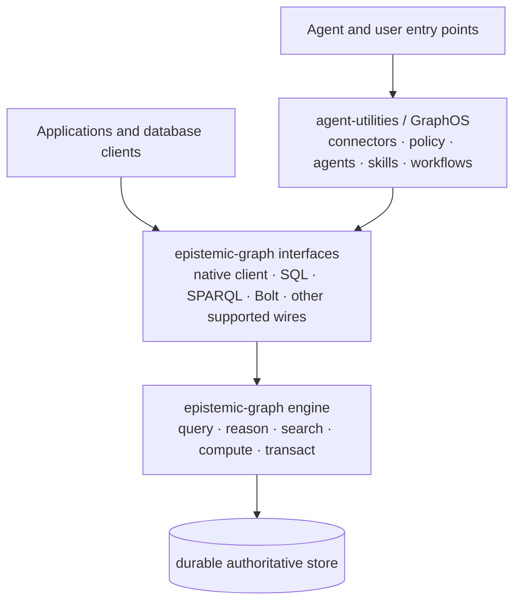
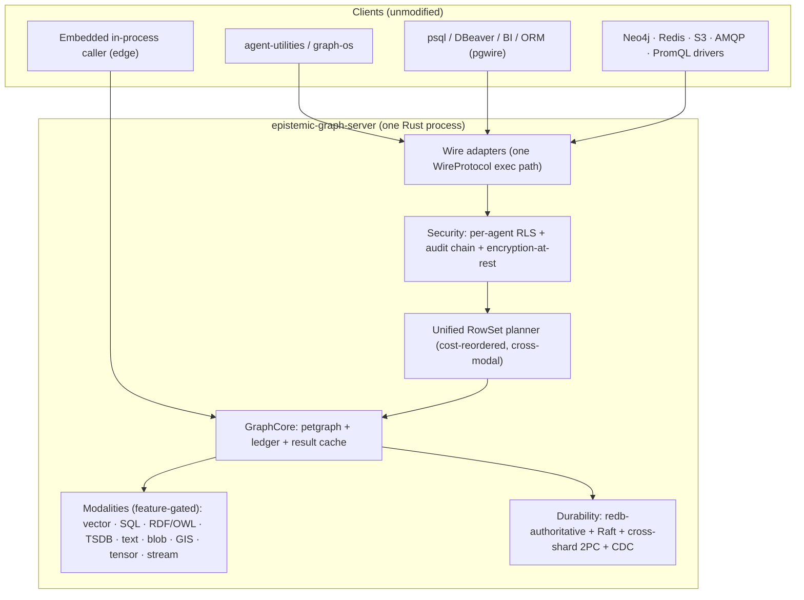

# epistemic-graph

<p align="center">
  <b>A durable database for connected knowledge, evidence, and multimodal data.</b><br>
  <sub>Use it on its own, or use it as the storage and reasoning engine behind agent-utilities.</sub>
</p>

<p align="center">
  
  
  
</p>

> **Looking for technical detail?** The [capability matrix](docs/capabilities.md)
> tracks support operation by operation. The
> [documentation site](https://knuckles-team.github.io/epistemic-graph/) contains
> the interface guides, deployment recipes, and architecture reference. If
> documentation and code disagree, the code is authoritative.

---

## What it is

`epistemic-graph` is a standalone Rust database and compute engine for data whose
meaning depends on connections.

It can keep property graphs, tables, RDF/OWL knowledge, vectors, text,
time-series, events, and files under one durable authority. Those forms of data
are not isolated products that an application must synchronize. The engine can
query and compute across them in one plan and commit related changes through one
transaction boundary.

The word *epistemic* refers to knowledge and how it is supported. In addition to
ordinary records, the engine can represent claims, evidence, provenance,
confidence, time, and relationships. This makes it useful when an answer must be
traceable to what was observed, where it came from, and when it was valid.

It is a database, not an agent framework. You do not need `agent-utilities`, an
LLM, or an MCP server to use it.

## What you get on its own

Applications can use `epistemic-graph` directly through its Python client or
supported database and service interfaces.

| Need | What epistemic-graph provides |
|------|-------------------------------|
| Store connected data | A durable property graph with traversal and graph algorithms |
| Model shared meaning | RDF, SPARQL, OWL reasoning, and shape validation |
| Search mixed content | Vector similarity, full-text search, structured filters, and hybrid ranking |
| Work with operational data | SQL, time-series, events, blobs, streams, and analytical jobs |
| Explain results | Claims, evidence locations, provenance, belief state, and as-of queries |
| Protect shared data | Authenticated requests, tenant and row-level controls, audit history, and optional encryption at rest |
| Grow beyond one node | A single-node default with an opt-in replicated cluster build |

Familiar clients can connect through interfaces such as Postgres, SPARQL, Bolt,
Redis, and S3 where the corresponding surface is supported. Compatibility is
tracked precisely in the [capability matrix](docs/capabilities.md); it should be
checked before treating epistemic-graph as a drop-in replacement for a specific
product.

## What agent-utilities adds

[`agent-utilities`](https://github.com/Knuckles-Team/agent-utilities) uses
epistemic-graph as its authoritative storage and compute layer. The two projects
have separate responsibilities:

| epistemic-graph owns | agent-utilities adds |
|----------------------|----------------------|
| Durable data, transactions, indexes, queries, reasoning, and native compute | Connectors and governed ingestion from external systems |
| Tenant-aware storage, access control, audit, and provenance primitives | GraphOS APIs, MCP tools, identity policy, and user entry points |
| Graph, RDF/OWL, vector, text, time, event, blob, and memory operations | Agent and workflow orchestration, skills, prompts, and model routing |
| Durable jobs, streams, and change events | Background hydration, evaluation, and controlled evolution loops |

Together, they form a persistent agent platform: agent-utilities decides what to
ingest, which capabilities an agent may use, and how work should run;
epistemic-graph stores the resulting knowledge and performs the data-intensive
query, reasoning, and compute operations.

If you only need the database, use epistemic-graph directly. If you need
connectors, agent execution, skills, MCP, and a governed knowledge layer, put
agent-utilities in front of it. See the agent-utilities
[Graph Engine guide](https://github.com/Knuckles-Team/agent-utilities/blob/main/docs/guides/graph_engine.md).

---

## Why use it

Choose epistemic-graph when the relationships between data are as important as
the records themselves—for example, when documents support claims, events change
business objects, ontology terms constrain records, or agents need memory with
provenance.

- **Keep one source of truth.** Related graph, vector, and content changes can
  commit together instead of being copied through application-managed sync
  pipelines.
- **Ask cross-domain questions in the engine.** A query can combine semantic
  reasoning, graph traversal, structured filters, text search, vector ranking,
  and time without moving intermediate results between databases.
- **Retain the reason behind an answer.** Evidence, provenance, temporal state,
  and security context live beside the knowledge they qualify.
- **Start small and retain the same core.** Run embedded or as one durable
  service, then use the cluster build when replication and distribution are
  required.
- **Use familiar tools where practical.** Existing database clients can reach
  supported interfaces while native clients access the complete engine API.

See the [engine architecture](docs/architecture/engine.md), [engine
modes](docs/engine_modes.md), and [measured benchmarks](docs/benchmarks.md) for
the implementation details and current evidence.

## How the pieces fit



Standalone applications connect to the engine interfaces directly.
Agent-utilities is an optional control and orchestration layer; it does not
replace the database. Both paths reach the same engine, transaction boundary,
and durable state.

### Choose a starting path

| Goal | Start here |
|------|------------|
| Evaluate the standalone database | [Single-node deployment](docs/deployment.md#single-node-durable-recommended-start) |
| Connect Python code | [Python client](#python-client) and [client guide](docs/interfaces/clients.md) |
| Connect an existing database tool | [Connecting guide](docs/interfaces/connecting.md) |
| Use it with agent-utilities | [agent-utilities Graph Engine guide](https://github.com/Knuckles-Team/agent-utilities/blob/main/docs/guides/graph_engine.md) |
| Embed it in one process or choose a remote/shared service | [Engine modes](docs/engine_modes.md) |
| Check whether a specific operation is supported | [Capability matrix](docs/capabilities.md) |

---

## Quick start

### Docker

```bash
: "${CONTAINER_DATA_DIR:?set to the image data directory}"
docker volume create eg-data
docker run -d --name epistemic-graph \
  -e GRAPH_SERVICE_AUTH_SECRET \
  -e EPISTEMIC_GRAPH_AUDIENCE=epistemic-graph \
  -e EPISTEMIC_GRAPH_TENANT=tenant:default \
  -e EPISTEMIC_GRAPH_POLICY_VERSION=policy:initial \
  -e EPISTEMIC_GRAPH_SIGNER_KEYS_JSON \
  -e GRAPH_SERVICE_PERSIST_DIR="${CONTAINER_DATA_DIR}" \
  -e GRAPH_SERVICE_TCP_ADDR=0.0.0.0:9100 \
  -e GRAPH_SERVICE_TLS_CERT=/run/secrets/server.crt \
  -e GRAPH_SERVICE_TLS_KEY=/run/secrets/server.key \
  -p 9100:9100 \
  --mount type=bind,src="${TLS_CERT_FILE}",dst=/run/secrets/server.crt,readonly \
  --mount type=bind,src="${TLS_KEY_FILE}",dst=/run/secrets/server.key,readonly \
  -v eg-data:"${CONTAINER_DATA_DIR}" \
  <registry>/epistemic-graph:<tag>
```
> Populate `GRAPH_SERVICE_AUTH_SECRET` and `EPISTEMIC_GRAPH_SIGNER_KEYS_JSON` from
> a runtime secret provider before starting the container. The server accepts only
> `eg2.` request envelopes and requires the audience, tenant, policy revision,
> durable replay state, and trusted signer registry. Routable native TCP always uses
> TLS/mTLS (`GRAPH_SERVICE_TLS_CERT`, `_KEY`, optional `_CLIENT_CA`). Auxiliary
> listeners, including database-protocol and metrics listeners, are loopback-only;
> expose them through a co-located authenticated TLS gateway when needed.
> Full recipes (compose, HA cluster, prebuilt wheels):
> [deployment guide](docs/deployment.md).

### Binary

```bash
# Read all secrets and policy values from deployment configuration.
: "${GRAPH_SERVICE_AUTH_SECRET:?required}"
: "${EPISTEMIC_GRAPH_SIGNER_KEYS_JSON:?required}"
: "${GRAPH_SERVICE_PERSIST_DIR:?required}"
export EPISTEMIC_GRAPH_AUDIENCE=epistemic-graph
export EPISTEMIC_GRAPH_TENANT=tenant:default
export EPISTEMIC_GRAPH_POLICY_VERSION=policy:initial
epistemic-graph-server
```

### Python client

```bash
pip install epistemic-graph
```

The published wheel already contains the complete main Rust build **and** all
runtime Python helpers (OWL/SPARQL, LMCache HTTP acceleration, and numeric
interoperability). `epistemic-graph`, `epistemic-graph[full]`, and
`epistemic-graph[all]` therefore provide the same production runtime. Python extras
do not select Rust features. `test` and `lake-parity` are explicit validation suites;
the latter uses an isolated environment for external Iceberg/Delta reference readers
because their current Rich constraint conflicts with the production workspace.

Run lake parity outside the workspace lock:

```bash
uv venv /tmp/epistemic-graph-lake-parity
uv pip install --python /tmp/epistemic-graph-lake-parity/bin/python \
  -e . -r tests/lake-parity-requirements.txt
/tmp/epistemic-graph-lake-parity/bin/python -m pytest \
  tests/test_lake_iceberg_delta_parity.py
```

```python
from epistemic_graph import SyncEpistemicGraphClient

context = {
    "principal": "service:client",
    "tenant": "tenant:default",
    "audience": "epistemic-graph",
    "agent_id": "service:client",
    "roles": ["graph-client"],
    "scopes": ["kg:read", "kg:write"],
    "policy_version": "policy:initial",
    "delegation": [],
}
with SyncEpistemicGraphClient.connect(verified_context=context) as graph:
    graph.nodes.add("node:a", {"node_type": "coordinator"})
    graph.nodes.add("node:b", {"node_type": "worker"})
    graph.edges.add("node:a", "node:b", {"weight": 1.5})
    print("Order:", graph.graph.topological_sort())
```

More entry points — the remote → shared-local → autostart resolver and the embedded in-process handle —
are in [engine modes](docs/engine_modes.md).

---

## Capabilities

Each surface has a deep-dive; the [capability & parity matrix](docs/capabilities.md) is the
operation-by-operation source of truth.

### Query surfaces & interfaces

| Surface | You can point at it… | Deep dive |
|---------|----------------------|-----------|
| **SQL / pgwire** | `psql`, DBeaver, JDBC/ODBC, BI tools, ORMs — DataFusion `SELECT` (joins/CTE/window), full DML, arbitrary user tables + DDL + `COPY` + `ALTER TABLE`, `CREATE FUNCTION` incl. **PL/pgSQL** bodies, `pg_catalog`/`information_schema`, pgvector/AGE/Timescale/ParadeDB compat. **pgwire is in the one main build.** | [SQL & pgwire](docs/interfaces/sql.md) |
| **SPARQL / RDF / OWL** | Stardog/GraphDB clients — SPARQL 1.1 `SELECT`/`ASK`/`CONSTRUCT`/`DESCRIBE`/`UPDATE`, the W3C `/sparql` endpoint, OWL 2 EL⁺/RL **and** DL-tableau + SWRL, SHACL/ShEx + ICV write-path enforcement, R2RML, GeoSPARQL | [SPARQL & RDF](docs/interfaces/sparql.md) · [Ontology lifecycle](docs/interfaces/ontology.md) |
| **Cypher / Bolt** | Neo4j custom-auth drivers — `MATCH`/writes/`WITH`/aggregation, GDS via `CALL gds.*`, native **Bolt v4.4** wire with signed sessions | [Cypher & Bolt](docs/interfaces/cypher.md) |
| **GraphQL** | Native `Method::GraphQl` reads/mutations and Federation v2 operations; authenticated SSE subscriptions over CDC with eg2 request binding + graph ACL/RLS; fragments/variables/directives, relay pagination, APQ/depth/cost hardening | [GraphQL](docs/interfaces/graphql.md) |
| **Vector / ANN** | Pinecone/Milvus-style kNN — IVF-PQ + OPQ + SQ8 + **HNSW** + exact/flat, hybrid metadata pre-filter, cross-shard scatter-gather, real pgvector ANN pushdown | [Vector / ANN](docs/interfaces/vector.md) |
| **Time-series** | InfluxDB/Timescale-style — tenant/graph-scoped series, `time_bucket`, ASOF, gap-fill, OHLC, decay, SQL window frames, `Op::Window` planner op | [Time-series](docs/interfaces/timeseries.md) |
| **Key-value & Blob** | Redis (RESP2/3 + pub/sub + `MULTI`/`EXEC`) and S3/MinIO (REST, multipart, range GET); content-addressed streaming CAS with content-defined chunking; embedded in-process handle | [Key-value & Blob](docs/interfaces/kv_blob.md) |
| **Messaging & Broker** | RabbitMQ/Kafka clients — exchanges/routing, DLQ, TTL, priority, delayed delivery, consumer groups, publisher confirms + **exactly-once**; **AMQP/MQTT/STOMP** wires; replayable streams | [Messaging & Broker](docs/interfaces/messaging.md) |
| **Observability** | Prometheus/OpenObserve/Jaeger clients — log ingest, **PromQL** (extended fn set), OTLP traces, VRL pipelines, federated search; the engine also **emits** its own OTLP + Prometheus remote-write | [Observability](docs/interfaces/observability.md) |
| **GIS / Spatial** | PostGIS-style — CRS/reprojection, R-tree, GeoJSON/WKB/GPX + **Shapefile/KML/GeoParquet**, MVT + **raster tile pyramids**, routing (turn-restrictions/time-windows)/isochrones/TSP | [GIS / Spatial](docs/interfaces/gis.md) |
| **KV-cache (LLM)** | vLLM/LMCache — tiered hot/warm/cold KV-block cache (zstd/lz4) + shared dedup backend + HTTP endpoint: the durable **L2 tier** under vLLM's GPU cache and LMCache's CPU tier | [KV-cache](docs/interfaces/kvcache.md) |
| **Agent memory** | Zep/mem0/LeanRAG-style — bi-temporal `AsOf`, summary tier, episodic→semantic consolidation, decay/reinforce, hierarchical retrieval, scene/trajectory — all drivable over the wire | [Agent memory](docs/interfaces/memory.md) |
| **Clients** | Python (full) · JS / Go (thin) over framed MessagePack, no PyO3/FFI | [Client drivers](docs/interfaces/clients.md) |

The unified [UQL planner](docs/uql.md) is what lets these compose in a single cross-modal plan;
natural-language → query (`NlQuery`) is a complete, LLM-optional seam.

### Analytics & advanced capabilities

- **[Native program optimization](docs/architecture/native-program-optimization.md).** Typed LM
  programs, evidence across 14 modalities, 13 optimizer families, few-shot/random/KNN selection, ensemble composition,
  instruction/reflection search, finetune plans, and evaluation-gated promotion live inside the
  Rust engine. Provider-dependent steps reuse governed engine runtimes through opaque plan/artifact
  contracts—no embedded DSPy, LiteLLM, provider SDK, raw prompt cache, or second graph-write path.
  Python submits the versioned, named-field MessagePack request with
  `client.jobs.submit_program_optimization(...)` and polls the ordinary durable job surface.
- **[Analytics Program](docs/architecture/analytics_program.md) — "one kernel, two surfaces."** A
  BLAS/LAPACK-free Rust numeric kernel ([`eg-numeric`](docs/architecture/numeric_kernel.md), faer +
  ndarray) exposed as (A) an in-process Python extension + numpy-shim and (B) **in-database DataFusion
  UDFs/UDAFs** — `cosine_sim`/`l2_normalize`/`zscore`/`covariance` scalars + `svd`/`pca`/`kmeans`
  column→matrix aggregates, and the differentiator: **cross-modal join → analytics in-engine** (join
  graph ⋈ vector ⋈ time-series, then run `pca`/`kmeans` over the joined set — impossible in numpy, which
  has no data layer).
- **[Lakehouse LTAP interop](docs/architecture/lakehouse_ltap.md).** The engine's tables materialize as
  open **Parquet + Delta + Iceberg** (real Iceberg v2 **Avro** manifests, per-column stats for predicate
  pushdown) with an Iceberg-REST catalog + LSN as-of, so Databricks/Spark/Trino/DuckDB read them with
  **zero ETL**; every materialize/compact/delete run also emits a real **OpenLineage** `RunEvent`
  (optional HTTP push), feature `lake`.
- **[Distribution / Robotics / GPU tail](docs/architecture/distribution_robotics_gpu.md).** Cross-region
  async read-replicas, Calvin deterministic commit, ROS2 bridge (rosbridge-WS + pure-Rust RTPS), and a
  GPU distance/tensor dispatch seam with a real CUDA backend + CPU fallback.

### Distribution & durability

- **redb-authoritative, commit-before-ack** (`kill -9`-safe), included in the main build.
- **In-engine Raft replication** (`cluster` feature, openraft) with automatic failover; off ⇒ byte-for-byte
  single-node.
- **Cross-shard 2PC** (presumed-abort + parallel-commit + read-only-participant + non-blocking
  Raft-replicated decision), multi-Raft groups + online resharding, and an opt-in **Calvin**
  deterministic-ordering branch.
- **One placement authority.** An epoch'd `PlacementCatalog` (`cluster`/`raft`) drives online
  split/merge/move via a prepare-then-fenced-cutover sequence — a caller holding a stale epoch is
  redirected, never served stale — and takes priority over the hash-ring router for any graph with an
  explicit placement entry. Paired with real multi-group production startup
  (`EPISTEMIC_GRAPH_RAFT_GROUPS`) and cross-shard read fan-out.
- **Durable distributed analytics-job plane** (`eg-jobs`, in the main build) — bounded workers claim
  renewable epoch-fenced leases with tenant quotas, placement and durable checkpoints/cancellation.
  Verified coordinator RPCs let remote worker processes claim, renew, checkpoint, stage, publish,
  fail, and cancel without sharing the coordinator's local database.
  Complete typed `KnowledgeBatch` results are staged before evidence-bearing claims commit; only then
  does `Publishing` become `Succeeded`.
- **Governed first-class modalities** — document, image, audio, and video share stable opaque
  Artifact/Occurrence/Rendition/Segment/Feature/EvidenceLocus identities, atomic served lifecycle
  semantics, and 12/12 component TCKs. Release readiness is established separately by the G-14
  exact-binary campaign and same-artifact G-37 performance evidence. The verified
  `ServedModality` graph method runs all four
  concrete native decoders, maintains lexical/spatial/temporal/signature postings, exposes closed
  document/image/audio/video predicates, enforces exact policy and resource ceilings, and commits only an
  AEAD-sealed runtime snapshot plus digest-only MutationBatch receipt; source bytes and raw identity
  context are never durable. SHA-256 binds normalized records to source content, while the leaf
  component probe executes native codec/index/query/resource checks. Raft deployments replicate only a bounded HMAC-authenticated encrypted
  state command, never the source-bearing wire method. Graph, SQL, RDF, vector, time-series, job, and cross-modal
  results stream through one RequestContext/RLS/placement-bound `KnowledgeStream` method and the
  same bounded Arrow `KnowledgeBatch` currency in the main build. Arrow is the sole
  result projection and every result family uses the same resumable cursor contract. The full
  Python client binds these current protocols as `client.modalities` and
  `client.knowledge.pull(...)`, with exact input/result validation and no compatibility aliases.
  → [Governed modality serving](docs/architecture/modality_serving.md)
  → [Distributed analytics and incremental reasoning](docs/architecture/distributed-analytics-reasoning.md)
- **Lazy graph lifecycle** (`EPISTEMIC_GRAPH_LAZY_STARTUP`/`EPISTEMIC_GRAPH_MAX_RESIDENT_GRAPHS`) —
  catalog-only boot, paged recovery, incarnation/version fencing, and a bounded resident-graph
  cache. Served mode always uses lazy startup, defaults to 1,024 resident graphs and
  4,096 records per page, and rejects unbounded values. A graph is never reported
  available until its source snapshot and maintained indexes are complete and valid.
- **Cross-modal ACID** across all modalities in one transaction.

→ [Engine scaling program](docs/architecture/scaling_program.md) ·
[Multi-Raft status](docs/architecture/m2_raft_status.md) ·
[Catalog-driven resharding](docs/architecture/m3_resharding.md)

### Epistemic reasoning (`eg-epistemic`, in the main build)

The `RowSet` result surface can carry engine-native **Claim/Evidence/BeliefState** with
cycle-guarded confidence propagation and a `BELIEF AS OF`/`EVIDENCE FOR`/`CONTRADICTS` UQL
family (feature `epistemic`); a **paraconsistent truth-maintenance engine** (Dung
grounded/preferred/stable argumentation) that now auto-invalidates dependents on a committed
write via a real server-side CDC hook, plus the bitemporal `epistemic_status`
why/why-not/what-changed capstone (feature `epistemic-tms`); and **policy-aware proof
redaction** — `ExplainBelief`'s `disclosure_level` masks (never silently drops) an evidence
node the caller's row-level-security context can't see (feature `epistemic-redaction`). A
**multimodal evidence graph** (`EvidenceLocus`, 12 located-evidence kinds spanning
text/table/image/audio/video/metric/SQL-row/code/trace) is reachable under
`epistemic`; content resolution uses governed blob-CAS references under `alignment`.
**Calibrated causal reasoning** (a linear-Gaussian structural causal model with genuine Pearl
do-calculus — `observe`/`intervene`/`counterfactual`) is implemented and tested inside
`eg-epistemic` and is served by `CausalEstimate`, `CausalCounterfactual`, and
`RankByProvenance`. The main `full` build includes `epistemic`, TMS, redaction,
evidence, causal reasoning, and alignment. See
[`docs/capabilities.md`](docs/capabilities.md#epistemic-reasoning-eg-epistemic--features-epistemicepistemic-tmsepistemic-redaction).

### Security & isolation

- **Mandatory verified authority** — every RPC carries an auth token, and the
  server accepts only the `eg2.` verified request-context envelope. It
  binds method/body, graph, tenant, audience, authenticated principal, effective
  agent, roles, scopes, policy version, delegation, timestamp, nonce, and
  idempotency key under one constant-time-verified HMAC. A non-empty secret,
  audience/tenant/policy values, durable replay ledger, and signer-key registry
  are startup requirements. Served remote TCP must use the configured TLS/mTLS
  boundary. Auxiliary listeners are loopback-only. pgwire separately adds
  SCRAM-SHA-256. See [Service mode](docs/service_mode.md#authentication-protocol) for the full contract.
- **Per-agent Row-Level Security** applied before any query surface touches the graph; the result cache
  keys on the caller's RLS context. RLS is always **strict/default-deny**: an
  unowned, undecodable, or untagged row is denied unless it is explicitly
  `_visibility: "public"` or `_owner`-tagged. There is no runtime posture toggle.
- **Encryption-at-rest** (ChaCha20-Poly1305, pure-Rust) + a **hash-chained tamper-evident audit log**
  covering every one of the ~80 gateway-routed mutating methods (the single `MutationPlan`/
  `commit_mutation` gateway) plus a documented, machine-checked-empty triage of every other mutating
  method (registry-lifecycle/cluster-admin/process-global/txn-self-routed — `EG-P0-2`).

→ [Service mode](docs/service_mode.md)
| Interface | Operation | Status | Feature | Notes |
|-----------|-----------|:------:|---------|-------|
| **SQL** | `SELECT` (joins, aggregates, CTE, window, subquery) | ✅ | `query` | DataFusion 43 over `nodes` + `edges`; real predicate pushdown (Inexact) |
| **SQL** | `INSERT` / `UPDATE` / `DELETE` (+ `RETURNING`) | ✅ | `query` | `nodes` + user tables (EG-KG.query.follow-up); serializable CAS gates |
| **SQL** | Compound/`AND`/`OR`/`IN`/`BETWEEN`/`IS NULL` WHERE DML, `INSERT…SELECT`, `UPDATE…FROM`/`DELETE…USING`, `ON CONFLICT` upsert | ✅ | `query` | EG-045/046/047/048; serializable re-check under the write guard |
| **SQL** | Mixed-store wire transactions (`BEGIN`/`COMMIT`/`ROLLBACK` + `TransactionStatus`) | ✅ | `pgwire` | EG-KG.compute.kg-transaction-is-pinned; node + user-table ops, read-your-own-writes; documented non-2PC user-table window |
| **SQL** | `CREATE VIEW`/`DROP VIEW`, `CREATE FUNCTION`, arrays/ranges + common functions | ✅ | `query` | EG-072/118/104; durable view + function catalog |
| **SQL** | Arbitrary user tables + DDL (`CREATE`/`ALTER ADD COLUMN`/`DROP`), `COPY` | ✅ | `query` | verified tenant+actor-scoped durable redb catalog with opaque filenames (EG-KG.query.register-user-tables-alongside/EG-KG.query.register-each-user-table); JOINable to that owner's graph projection |
| **SQL** | `ALTER TABLE` beyond ADD COLUMN — `DROP`/`RENAME COLUMN`, `RENAME TO`, `ALTER COLUMN TYPE`, `DROP CONSTRAINT` | ✅ | `query` | durable catalog rewrite with data migration (EG-KG.query.rename-table-moves-catalog) |
| **SQL** | Columnar segments + window functions (`ROW_NUMBER`/`RANK`/`LAG`/`LEAD`/`OVER(…)`) | ✅ | `query` | EG-089; struct-of-arrays analytical scan |
| **Postgres compat** | `pg_catalog` + `information_schema` system views (`\d`/`\dt`/`\l`) | ✅ | `pgwire` | EG-KG.query.route-create-view-create; synthesized from live table/view/function catalogs |
| **Postgres compat** | `CREATE EXTENSION` catalog · pgvector `vector` + `<->`/`<=>`/`<#>` + **real ANN pushdown** to HNSW/IVF + exact re-rank | ✅ | `pgwire` | EG-KG.query.create-drop-extension-over/115/116; real top-k pushdown (EG-KG.query.real-pgvector-ann-top) |
| **Postgres compat** | AGE `cypher()` set-returning function, TimescaleDB hypertables + continuous aggregates, ParadeDB `@@@` **real BM25 ranking + snippets** | ✅ | `pgwire` | EG-KG.query.postgres-family-extension-plan/117/119; real BM25 (EG-311) |
| **Postgres wire** | listener, simple + extended/prepared protocol | ✅ | `pgwire` | `EPISTEMIC_GRAPH_PGWIRE_ADDR`; in the one main build (EG-KG.compute.capability-reference/EG-KG.sharding.deployment-tiers) |
| **Postgres wire** | mandatory SCRAM-SHA-256, `pg_catalog` introspection | ✅ | `pgwire` | EG-KG.query.concept-13 / EG-KG.query.datafusion; verified pg user → engine ACL actor; authentication cannot be disabled |
| **SPARQL** | `SELECT` (BGP, paths, FILTER subset, OPTIONAL, UNION, GROUP/agg, BIND, DISTINCT, SLICE) | ✅ | `sparql` | spargebra parser compiled to LPG scans |
| **SPARQL** | `ASK` / `CONSTRUCT` / `DESCRIBE` | ✅ | `sparql` | template instantiation + bounded description (gated by `rdf`, implied by `sparql`) |
| **SPARQL** | `UPDATE` (`INSERT/DELETE DATA`, `DELETE/INSERT WHERE`, `CLEAR`, `CREATE`/`DROP GRAPH`) | ✅ | `sparql` | `eg-rdf/src/update.rs`; remote-URL `LOAD` is deliberately rejected from the write path—use governed ingestion or local triple updates |
| **SPARQL** | `/sparql` HTTP endpoint (W3C SPARQL 1.1 Protocol) | ✅ | `sparql-http` | `src/server/sparql_http.rs`; GET + POST query/update |
| **SPARQL** | true named graphs (quad dataset) + `FROM`/`FROM NAMED` | ✅ | `sparql` | `GRAPH ?g`/constant-IRI over registry graphs (EG-KG.ontology.from-from-named) |
| **SPARQL** | `ORDER BY` total-ordering, `VALUES`, `MINUS`, `EXISTS`/`NOT EXISTS`, negated property set | ✅ | `sparql` | EG-KG.ontology.completing-eg-order-by/125/055/056; fixes the unordered-results correctness gap |
| **SPARQL** | content negotiation (JSON/XML/CSV/TSV/Turtle/N-Triples), rich FILTER, sub-SELECT, SERVICE federation | ✅ | `sparql` | EG-KG.ontology.content-negotiation-serializers/053/051/052; SSRF allowlist on SERVICE |
| **SPARQL** | SHACL + ShEx validation, ICV integrity constraints (**enforced on the commit/write path**), GeoSPARQL + RCC8/Egenhofer | ✅ | `sparql`/`geosparql` | EG-KG.ontology.concept-6/133/146/261/155; ICV commit-guard (EG-KG.ontology.rdf-update-guard) |
| **RDF I/O** | JSON-LD 1.1, TriG, N-Quads, RDF/XML serialization matrix | ✅ | `rdf` | EG-KG.ontology.eg-concrete-syntax-matrix/137 (alongside Turtle/N-Triples) |
| **Cypher** | `MATCH … WHERE … RETURN … LIMIT` (var-length `[*m..n]`) | ✅ | `cypher` | read over a snapshot; WHERE supports `OR`/`IN`/`STARTS WITH`/`CONTAINS`/`IS NULL` (EG-KG.query.eg-extend-read-side) |
| **Cypher** | writes (`CREATE`/`MERGE`/`SET`/`DELETE`+`DETACH`/`REMOVE`) | ✅ | `cypher` | native eg-core mutations (EG-KG.query.cypher-execution) |
| **Cypher** | `ORDER BY`/`SKIP`/`WITH`/`OPTIONAL MATCH`/`OR`/aggregation/`DISTINCT`/`UNWIND`/`CALL` | ✅ | `cypher` | EG-KG.query.eg-extend-read-side/141/142; GDS via `CALL gds.<algo>(…) YIELD …` streams eg-compute results as rows (EG-KG.query.eg-2/144/298) |
| **Cypher** | Neo4j **Bolt v4.4** wire (PackStream v2 + current signed session) | ✅ | `bolt-wire` | `EPISTEMIC_GRAPH_BOLT_ADDR` (EG-KG.query.bolt-wire-protocol); `eg2.` authority → ACL/RLS; staged MutationBatch writes; loopback direct listener |
| **GraphQL** | read queries (scan + BFS, schema-from-graph, aliases, `first`/`limit`, filters) | ✅ | `graphql` | byte-equal to Cypher path |
| **GraphQL** | mutations (`createNode`/`updateNode`/`deleteNode`/`addEdge`/`removeEdge`) | ✅ | `graphql` | native eg-core mutations |
| **GraphQL** | Apollo Federation v2 subgraph (`_service`/`_entities`, `@key`) + APQ/depth/complexity hardening | ✅ | `graphql` | EG-295/296 |
| **GraphQL** | subscriptions / fragments / variables / directives / relay pagination | ✅ | `graphql` | authenticated loopback SSE carrier: eg2 binds request id + graph + subscription; graph ACL and default-deny RLS are refreshed before publication; hidden-only writes emit no frame; bounded sessions/connections + `$`/`@` lexer + fragments + `@skip`/`@include` + relay envelope (EG-064/065/066) |
| **OWL** | EL⁺ + RL forward-chaining materialization & classification | ✅ | `owl` | pure-Rust; consistency + incremental + justifications |
| **OWL** | confidence-weighting + Ebbinghaus time-decay | ✅ | `owl` | EG-KG.ontology.concept-13; per-axiom `eg:confidence`, fact decay |
| **OWL** | query-time `Op::Reason` (reasoner seeds a RowSet) | ✅ | `owl-plan` | distributed/cross-shard union supported |
| **OWL** | OWL-DL (tableau, cardinality, `allValuesFrom`), SWRL user rules | ✅ | `owl-dl`/`owl` | pure-Rust DL tableau (consistency→classification→instance) + `swrlb:` built-in library; EL/RL fast path stays default (EG-KG.ontology.concept-2/060) |
| **Vector / ANN** | IVF-PQ + OPQ + SQ8-refine, persistent (reopen w/o rebuild), warm-on-start | ✅ | `ann` | parallel/SIMD brute-force fallback below threshold |
| **Vector / ANN** | hybrid metadata pre-filter (kNN + `allow(id)` predicate) | ✅ | `ann` | `search_filtered` (EG-070); filtered during the ADC probe |
| **Vector / ANN** | HNSW index (higher recall-per-probe than IVF-PQ) | ✅ | `ann` | insert/search/serde-persist, recall-harness-tuned (EG-KG.retrieval.hnsw-vector-index) |
| **Vector / ANN** | exact/flat kNN index + ANN-vs-exact re-rank + recall@k/precision harness | ✅ | `ann` | EG-KG.query.concept-5 |
| **Vector / ANN** | cross-shard kNN scatter-gather → deterministic global top-k | ✅ | `ann` | server-layer scatter over per-shard indexes merged via the `merge_topk` leaf (EG-319, completing EG-KG.retrieval.scatter-gather) |
| **Time-series** | store + `time_bucket`, ASOF join, gap-fill LOCF, OHLC, downsample, decay | ✅ | `tsdb` | native redb columnar, no DataFusion |
| **Time-series** | time-ops as unified planner ops (`Op::Window`) | ✅ | `tsdb` | real `window_aggregate` over the RowSet via eg-tsdb `time_bucket` (EG-KG.query.streaming-execution); per-point retention trim (EG-KG.temporal.bucket-cutoff-trim) |
| **Blob / CAS** | content-addressed streaming store (redb-native) | ✅ | `blob` | refcount mark-and-sweep GC; bounded RAM |
| **Blob / CAS** | S3 / MinIO backend behind the same `ChunkStore` trait | ✅ | `blob-s3` | manifest/linkage byte-identical |
| **Blob / CAS** | content-defined chunking | ✅ | `blob` | Gear/FastCDC rolling-hash chunker (variable boundaries); sha256 CAS dedup + refcount GC preserved (EG-KG.storage.backward-manifest-read) |
| **Key-value** | embedded in-process engine API over redb rows | ✅ | `embedded` | `EmbeddedEngine` — no Tokio/socket/HMAC (EG-KG.backend.engine-modes) |
| **Key-value** | generic namespaced `get`/`put`/`scan`/`cas` KV surface over redb | ✅ | `redb` | `src/server/kv.rs` (EG-022); durable, commit-before-ack; not graph-scoped |
| **Multi-wire** | wire-neutral SQL core (`WireProtocol`/`WireSession`, one classify→exec path) | ✅ | `wire` | `src/server/wire` (EG-KG.compute.subsystems-reference); shared by every SQL wire |
| **Multi-wire** | MySQL / MariaDB wire (handshake v10 + `mysql_native_password`) | ✅ | `mysql-wire` | `EPISTEMIC_GRAPH_MYSQL_ADDR` (EG-KG.query.kg-2) |
| **Multi-wire** | MSSQL TDS wire with mandatory HMAC-derived LOGIN7 auth | ✅ | `mssql-wire` | `EPISTEMIC_GRAPH_MSSQL_ADDR` (EG-KG.query.hand-rolled-tds-server); verified user → ACL actor; loopback direct listener |
| **Multi-wire** | SQLite-dialect NDJSON-over-TCP endpoint | ✅ | `sqlite-wire` | `EPISTEMIC_GRAPH_SQLITE_ADDR` (EG-KG.query.concept-3); `.db` file I/O 🔶 forward roadmap |
| **Multi-wire** | Neo4j Bolt v4.4 wire (PackStream v2, native Cypher) | ✅ | `bolt-wire` | `EPISTEMIC_GRAPH_BOLT_ADDR` (EG-KG.query.bolt-wire-protocol) |
| **Broker** | exchanges (direct/topic/fanout) + bindings/routing over the EG-KG.compute.atomically-claim-oldest-pending work-queue | ✅ | `broker` | RabbitMQ-class (EG-275) |
| **Broker** | DLQ · message/queue TTL · priority · delayed/scheduled delivery · consumer-groups + QoS/prefetch | ✅ | `broker` | EG-KG.compute.dead-letter-queues/277/278/279/280 |
| **Broker** | replayable append-log streams (Kafka-style offsets/retention) + publisher confirms + owner/tag-fenced ack/nack + monotonic live-lease renewal | ✅ | `broker` | EG-283/284 |
| **Broker** | exactly-once (idempotent-producer dedup) + stream/confirm/ack over AMQP `confirm.select` + MQTT 5 frames | ✅ | `broker` | effectively-exactly-once atop at-least-once (EG-314) |
| **Broker wires** | AMQP 0.9.1 · MQTT 3.1.1/5.0 · STOMP 1.2 listeners with mandatory domain-separated credential proofs | ✅ | `amqp-wire`/`mqtt-wire`/`stomp-wire` | `EPISTEMIC_GRAPH_{AMQP,MQTT,STOMP}_ADDR` (EG-275/281/282); verified principal → secret-keyed pseudonymous ACL actor reference; loopback direct listeners |
| **KV / structures** | Redis RESP2/3 wire (strings/hashes/lists/sets/sorted-sets) + **pub/sub** + `MULTI`/`EXEC` | ✅ | `redis-wire` | `EPISTEMIC_GRAPH_REDIS_ADDR` (EG-KG.ontology.resp2-resp3-codec-round/307) |
| **Object store** | S3-compatible REST (bucket/object CRUD, SigV4-lite) over the blob CAS + **multipart upload** + **range GET** | ✅ | `s3-api` | EG-KG.ontology.object-put-get-head/307 |
| **Observability** | log ingest + PromQL `/api/v1/query` (extended fn set) + OTLP traces `/v1/traces` + service-dependency map | ✅ | `obs`/`promql`/`traces` | `EPISTEMIC_GRAPH_OBS_ADDR`, default `:5080` (AU-KG.ingest.self-ingest/172/163); PromQL `_over_time`/`topk`/`label_replace`/`clamp*` (EG-302) |
| **Observability** | VRL-style ingest pipelines (parse/filter/enrich, cross-modal) + super-cluster federated search (typed SQL/SPARQL fusion) | ✅ | `obs`/`federation` | EG-165/243; typed result fusion (EG-KG.query.schema-typed-fusion-sql) |
| **Observability** | engine's own telemetry egress — OTLP metrics/traces export + Prometheus remote-write receiver | ✅ | `otel-export` | the engine emits, not just ingests (EG-316) |
| **Lakehouse (LTAP)** | Parquet-on-object-store + Delta log + Iceberg-REST catalog + LSN as-of — external lakehouse engines read with zero ETL | ✅ | `lake` | `eg-lake` (EG-KG.storage.lsn-as-snapshot-returns); real Iceberg v2 Avro manifest and manifest-list writer with per-column statistics |
| **Spatial / GIS** | `SpatialScan` + `ST_Within`/`ST_DWithin`, GeoSPARQL + RCC8/Egenhofer, CRS/reproject, R-tree, GeoJSON/WKB/GPX + **Shapefile/KML/GeoParquet** | ✅ | `geo`/`geosparql` | eg-geo (EG-KG.ontology.singles-concept/261/155/262/263/264); Shapefile/KML/GeoParquet I/O (EG-KG.domains.geo-formats); no GEOS/PROJ |
| **Spatial / GIS** | XYZ/TMS + Mapbox Vector Tiles · weighted routing (+ **turn-restrictions/time-windows**)/isochrones/TSP · map-based task tracking | ✅ | `geo` | EG-KG.domains.map-tiles/266/267; turn-restrictions + time-dependent weights (EG-KG.domains.geo-partitioning) |
| **Document / JSON** | deep JSONPath query + durable inverted path-index (persists to redb + boot-rehydrate + cost `Stats`); PG `->`/`->>`/`@>` + Mongo `$match` | ✅ | (core)/`query` | `Pred::JsonPath` (EG-084); durable path-index (EG-308) |
| **Tensor / probabilistic** | N-D array store (CAS-backed) + `TensorScan`/`TensorOp` (results **written back** to the CAS store); distribution-valued properties | ✅ | `tensor` | EG-085/086; tensor-op CAS write-back (EG-304) |
| **Scene-graph / 3D** | `:SceneObject` pose + transform hierarchy + spatial relations (robotics/AR/urban-3D) | ✅ | (core) | EG-087 |
| **CEP / streams** | windowed event ingest + `Op::Cep` bounded-NFA pattern match over sliding/tumbling windows | ✅ | `stream` | EG-KG.query.pipelined-execution |
| **Robotics** | multimodal sensor fusion (ASOF-aligned) + action/trajectory memory | ✅ | `tensor` | EG-KG.query.multi-rate-sensor-stream/099 |
| **KV-cache (LLM)** | tiered hot/warm/cold KV-block cache (real **zstd/lz4** warm-tier compression) + shared dedup backend + HTTP endpoint (vLLM/LMCache contract) — the durable **L2 tier** under vLLM (L0 GPU) → LMCache (L1 CPU) | ✅ | `kvcache-server` | eg-kvcache (EG-185/186/187); real compression codec (EG-315); see [kvcache interface](docs/interfaces/kvcache.md) |
| **Agent memory** | bi-temporal `AsOf`, decay/reinforce, summary-node tier, episodic→semantic consolidation, LeanRAG retrieval, scene/trajectory — **drivable over the wire** | ✅ | (core) | `Op::AsOf` (AU-KG.compute.kg-2); EG-KG.compute.hierarchical-summary-tier-eg/221/222/195; wire-Op surface (EG-KG.memory.eg-batch-decay-caller) |
| **Epistemic substrate** | belief/confidence propagation + bitemporal why/why-not/what-changed + policy-aware proof redaction + multimodal evidence + calibrated causal reasoning/ranking | ✅ | `epistemic`(+TMS/redaction/evidence/causal, all in `full`) | CONCEPT:EG-KG.epistemic.epistemic-substrate; durable outbox/cursor-driven incremental TMS, conflict, causal, and materialization projection |
| **OBDA** | R2RML virtual graphs — SPARQL over a foreign source rewrites to `ForeignScan` (no materialization); parses **R2RML Turtle** documents | ✅ | `federation` | EG-101; R2RML Turtle parse (EG-305) |
| **RBAC** | durable roles + role hierarchy + resource/action grants over per-agent RLS (persist to redb + boot-reload) | ✅ | `security` | EG-KG.compute.feature; durable persistence (EG-KG.compute.durable-rbac-identity-persistence) |
| **Scheduling / QoS** | real-time QoS/SLO scheduler — per-tenant/priority admission + deadline scheduling + backpressure | ✅ | (server) | EG-320; complements the reserved read-admission lane (EG-KG.coordination.reserved-read-lane) |
| **Backup / DR** | consistent online backup + restore CLI + PITR (`Method::Backup`/`Restore`) | ✅ | `redb` | EG-090 |
| **Full-text** | Tantivy BM25 inverted index, `RankText` + reciprocal-rank fusion | ✅ | `text` | composes in the unified planner |
| **Unified planner** | `Scan·Filter·Traverse·Rank·RankText·FuseRrf·Reason·SparqlBgp·Udf·ForeignScan·AsOf·Limit` | ✅ | `query`+ | each op feature-gated; see [UQL](docs/uql.md) |
| **Unified planner** | `Op::Window` / `Op::Foreign` execution | ✅ | `query` | `Op::Window` = real eg-tsdb windowed aggregate (`timeseries`, EG-KG.query.streaming-execution); `Op::Foreign` resolves the name via the `ForeignSourceRegistry` (`federation`, EG-073) |
| **UQL** | text DSL → `wire::Plan` (one parse, zero new exec path) | ✅ | (front-end always ships) | dependency-free parser |
| **UQL** | natural-language → query (`Method::NlQuery`, `/nl`, `nl_query()` UDF) | ✅ | `nl-query` | EG-078/080; complete LLM-optional seam — inert until an OpenAI-compatible endpoint is set; AU-provider integration tracked on the agent-utilities side |
| **Durability** | redb-authoritative, commit-before-ack (`kill -9`-safe) | ✅ | `redb` | included in the main build |
| **Distribution** | openraft replication + automatic failover | ✅ | `raft` | `cluster` tier; off ⇒ byte-for-byte single-node |
| **Distribution** | cross-shard 2PC + parallel-commit + read-only-participant + non-blocking (Raft-replicated decision) commit | ✅ | `raft` | presumed-abort 2PC (EG-KG.storage.lane-n-increment) + parallel prepare/empty-write-set skip (EG-KG.txn.cross-shard) + Paxos-Commit-lite replicated decision (EG-KG.txn.harness-crash) |
| **Distribution** | Calvin deterministic-ordering cross-shard commit (order-first, vote-free, crash-replay) | ✅ opt-in | `calvin` (⇒ `nonblocking`) | EG-KG.txn.calvin-deterministic-ordering; sequencer, Raft-replicated input log, ordered OLLP locking/restart, deterministic multi-node epoch fan-in, and vote-free execution are implemented; cross-host soak remains exact-release certification evidence—see [distribution / robotics / GPU](docs/architecture/distribution_robotics_gpu.md) |
| **Distribution** | multi-Raft groups (N-group ring, online reshard, hibernate/rehydrate) | ✅ | `raft` | `GroupRouter` + `MultiRaft` (KG-2.266/267/268); online ownership move |
| **Distribution** | cross-region async read-replica tier (bounded-LSN replication log + follower pull → canonical mutation applier) + capacity guardrails (circuit breaker / per-tenant quota / backpressure) | ✅ opt-in | `federation-search` | EG-322/323; off by default (`EPISTEMIC_GRAPH_REPLICATE`); complements the EG-320 QoS scheduler with absolute ceilings |
| **Federation** | remote engine / HTTP-JSON / external SQL (`sqlx`) as a `ForeignScan` | ✅ | `federation`(`-sql`) | in the main build; activates only when a foreign source is registered |
| **Robotics** | ROS2 bridge over rosbridge-WebSocket (CDC↔topic, no DDS/C toolchain) | ✅ opt-in | `ros2-bridge` | EG-KG.domains.robotics-gpu-distribution; pure-Rust `tokio-tungstenite` |
| **Robotics** | native DDS/RTPS ROS2 wire — TWO legs behind one `DdsTransport` trait, both zero-config `rmw`-mangled | ✅ opt-in | `ros2-dds` (pure-Rust `rustdds`) / `ros2-rmw` (real CycloneDDS-C, S5) | EG-KG.ingest.dds-transport / EG-KG.ingest.rmw-cyclonedds-leg; `ros2-rmw` vendors + cmake-builds the CycloneDDS C sources (no network/libclang at build time) for genuine live-`ros2` interop |
| **GPU** | GPU distance/tensor dispatch seam + real CUDA backend (NVRTC, `dynamic-loading`) | ✅ opt-in | `gpu` / `gpu-cuda` | EG-KG.compute.gpu-distance-seam/327; pure-Rust CPU is the byte-for-byte ground truth and CUDA falls back cleanly on a GPU-less host; live-device kernel results belong in exact-release hardware certification |
| **Numeric / analytics** | BLAS/LAPACK-free Rust numeric kernel (`eg-numeric`: reductions/stats · element-wise · linalg via faer · seedable random) | ✅ Python + in-database | Agent Utilities: `epistemic-graph[full]` · Cargo: `full` (includes `numeric`) | AU-KG.compute.numeric-kernel; [Analytics Program](docs/architecture/analytics_program.md) “one kernel, two surfaces.” The Python kernel is folded into the one wheel as `epistemic_graph.numeric`; the main build exposes the same Rust kernels through DataFusion UDF/UDAF and batched engine operations—see [numeric kernel](docs/architecture/numeric_kernel.md) |
| **Clients** | multi-language client drivers — Python (full, including native atomic create-if-absent) · JS / Go (thin: broker/streams/RBAC/backup/NL) over framed MessagePack (no PyO3/FFI) | ✅ | (client) | EG-328; wire-parity gated (`test_protocol_parity.py`) — see [clients](docs/interfaces/clients.md) |

---

## Architecture at a glance



See [technical overview](docs/overview.md) for the crate DAG and the planner pipeline, and
[subsystems](docs/architecture/subsystems.md) for how each modality composes on the one store.

---

## One build, opt-in layers

The engine ships as **one prebuilt binary** — the full-featured build — plus two opt-in build layers.
The target host pulls a prebuilt wheel and never compiles. Full map: [one build, opt-in layers](docs/architecture/tiers.md).

| Build | Carries | For |
|-------|---------|-----|
| **main** (default wheel) | the whole single-node DB: redb-authoritative + cypher + DataFusion SQL + graphql + ann + tsdb + blob + Tantivy text + rdf/sparql/owl + wasm-udf + security + federation + the wire family (**pgwire**/mysql/mssql/sqlite/bolt/redis/amqp/mqtt/stomp) + the `numeric` kernel + kvcache-server + broker | anything single-node, Raspberry Pi 4+ to workstation |
| **+ cluster** | main + **Raft** replication + cross-shard 2PC + distributed compute | multi-node HA |
| **+ full-extras** | main + accelerator legs (`gpu-cuda`, `ros2-bridge`, `ros2-dds`) | GPU / robotics |

`cluster` and `full-extras` are opt-in build flags layered on top of the one main build (openraft is
cluster-only; cudarc/rustdds are full-extras-only) — they are built from source, not published as
separate wheels.

---

## Documentation

- [Capabilities & parity matrix](docs/capabilities.md) — the operation-by-operation truth table.
- [Technical overview](docs/overview.md) · [Master-of-all engine](docs/architecture/engine.md) ·
  [UQL & the unified planner](docs/uql.md).
- Interfaces: [Connecting](docs/interfaces/connecting.md) · [SQL](docs/interfaces/sql.md) ·
  [SPARQL](docs/interfaces/sparql.md) · [Cypher](docs/interfaces/cypher.md) ·
  [GraphQL](docs/interfaces/graphql.md) · [Vector](docs/interfaces/vector.md) ·
  [Time-series](docs/interfaces/timeseries.md) · [KV & Blob](docs/interfaces/kv_blob.md) ·
  [Messaging](docs/interfaces/messaging.md) · [Observability](docs/interfaces/observability.md) ·
  [GIS](docs/interfaces/gis.md) · [KV-cache](docs/interfaces/kvcache.md) ·
  [Agent memory](docs/interfaces/memory.md) · [Ontology](docs/interfaces/ontology.md) ·
  [Clients](docs/interfaces/clients.md).
- Analytics & distribution: [Analytics Program](docs/architecture/analytics_program.md) ·
  [Analytics in UQL](docs/analytics_in_uql.md) · [Numeric kernel](docs/architecture/numeric_kernel.md) ·
  [Lakehouse LTAP](docs/architecture/lakehouse_ltap.md) ·
  [Distribution / Robotics / GPU](docs/architecture/distribution_robotics_gpu.md).
- Deploy & operate: [Standalone deployment](docs/standalone_deployment.md) ·
  [DBeaver / psql quickstart](docs/dbeaver_quickstart.md) ·
  [Deployment topology](docs/deployment_topology.md) · [Tiers & binaries](docs/architecture/tiers.md) ·
  [Deployment](docs/deployment.md) · [Engine modes](docs/engine_modes.md) ·
  [Service mode](docs/service_mode.md) · [Cost model & capacity](docs/cost_model.md) ·
  [Operations runbook](docs/operations/runbook.md).
- Contributing: [AGENTS.md](AGENTS.md) · [Rust compute guide](docs/rust_compute_guide.md) ·
  [CONTRIBUTING.md](CONTRIBUTING.md).

> **Design for a network boundary.** Every out-of-process call is a serialize → socket → deserialize
> round trip, not a function call. **Batch, never per-element:** ship work as one op over data already in
> the graph, and keep tight per-element math in-process. See the
> [Rust compute guide](docs/rust_compute_guide.md).

## License

MIT — see [LICENSE](LICENSE).
