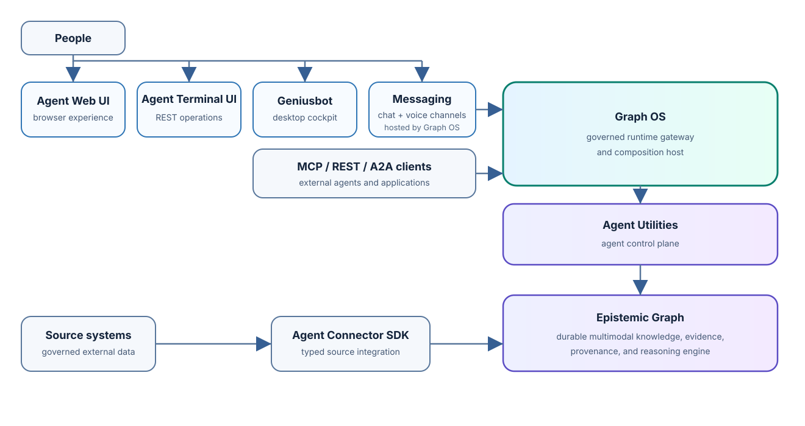
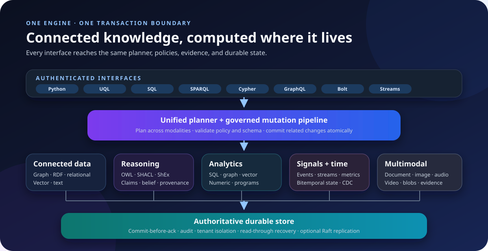

# epistemic-graph

<p align="center">
  <strong>The durable knowledge and reasoning engine for the Knuckles ecosystem.</strong><br>
  <sub>Graph, SQL, RDF/OWL, vectors, time, evidence, and multimodal data under one Rust-native authority.</sub>
</p>

<p align="center">

[](https://pypi.org/project/epistemic-graph/)
[](https://knuckles-team.github.io/epistemic-graph/)
[](LICENSE)

</p>

<p align="center">
  <a href="https://knuckles-team.github.io/epistemic-graph/">Documentation</a> ·
  <a href="https://knuckles-team.github.io/epistemic-graph/capabilities/">Capabilities</a> ·
  <a href="https://knuckles-team.github.io/epistemic-graph/interfaces/">Interfaces</a> ·
  <a href="https://knuckles-team.github.io/epistemic-graph/status/">Status</a>
</p>

## Overview

`epistemic-graph` is a standalone database and compute engine for information
whose meaning depends on connections. It keeps property graphs, relational
tables, RDF/OWL knowledge, vectors, text, time-series, events, blobs, and
multimodal evidence behind one durable transaction boundary.

Alongside ordinary records, the engine represents claims, provenance,
confidence, temporal validity, and contradiction. Applications can trace an
answer to what was observed, where it came from, and when it was valid.

It is a database, not an agent framework. Use it directly from an application,
or place [GraphOS](https://knuckles-team.github.io/graph-os/) and
[agent-utilities](https://knuckles-team.github.io/agent-utilities/) above it
for public APIs, agent orchestration, and governed workflows.

## Key Capabilities

| Area | Included in the main build |
|---|---|
| Connected data | Property graph, Cypher/Bolt, GraphQL, graph algorithms, and UQL |
| Semantic knowledge | RDF, SPARQL, OWL reasoning, SHACL validation, and ShEx |
| Search and analytics | Vector ANN, hybrid retrieval, full text, DataFusion SQL, and numeric kernels |
| Evidence and memory | Claims, provenance, bitemporal validity, confidence, and truth maintenance |
| Content and signals | Documents, images, audio, video, metrics, streams, events, and blobs |
| Operations | Commit-before-ack durability, audit, CDC, tenant isolation, encryption, and observability |
| Distribution | Single-node operation plus the cluster build's replication, placement, and cross-shard coordination |

Compatibility is tracked per operation rather than inferred from a protocol
name. The [capability matrix](https://knuckles-team.github.io/epistemic-graph/capabilities/)
and [generated method ledger](https://knuckles-team.github.io/epistemic-graph/capabilities.generated/)
state the current authority, durability, audit, CDC, and transaction behavior.

<details>
<summary>Project telemetry</summary>

[](https://github.com/Knuckles-Team/epistemic-graph/releases)
[](https://github.com/Knuckles-Team/epistemic-graph/actions/workflows/release.yml)
[](https://github.com/Knuckles-Team/epistemic-graph/stargazers)
[](https://github.com/Knuckles-Team/epistemic-graph/forks)
[](https://github.com/Knuckles-Team/epistemic-graph/graphs/contributors)
[](https://github.com/Knuckles-Team/epistemic-graph/commits/main)
[](https://github.com/Knuckles-Team/epistemic-graph/pulls)
[](https://github.com/Knuckles-Team/epistemic-graph/pulls?q=is%3Apr+is%3Aclosed)
[](https://github.com/Knuckles-Team/epistemic-graph/issues)
[](https://github.com/Knuckles-Team/epistemic-graph)
[](https://github.com/Knuckles-Team/epistemic-graph)
[](https://github.com/Knuckles-Team/epistemic-graph)
[](https://github.com/Knuckles-Team/epistemic-graph)
[](https://pypi.org/project/epistemic-graph/)
[](https://pypi.org/project/epistemic-graph/)
[](https://pypi.org/project/epistemic-graph/)
[](https://pypi.org/project/epistemic-graph/)

</details>

## Documentation

- [Start here](https://knuckles-team.github.io/epistemic-graph/) for a guided engine tour.
- [Interfaces](https://knuckles-team.github.io/epistemic-graph/interfaces/) explains SQL, SPARQL, Cypher, GraphQL, vector, time-series, and native clients.
- [Architecture](https://knuckles-team.github.io/epistemic-graph/architecture/) covers the commit model, planner, reasoning, storage, and distribution.
- [Deploy](https://knuckles-team.github.io/epistemic-graph/standalone_deployment/) covers durable server, TLS, container, and cluster operation.
- [Operations](https://knuckles-team.github.io/epistemic-graph/operations/runbook/) covers day-two procedures and recovery.

## Architecture

<p align="center">
  
</p>

<p align="center">
  
</p>

| This repository owns | Other repositories own |
|---|---|
| Durable graph and multimodal state, native reasoning, query planning, transaction semantics, and engine-level authorization | [GraphOS](https://knuckles-team.github.io/graph-os/) owns the public MCP/REST/A2A gateway and runtime policy |
| Generated engine contracts and capability truth | [agent-utilities](https://knuckles-team.github.io/agent-utilities/) owns agents, workflows, skills, evaluation, and the control plane |
| Source-ingestion admission, schema validation, evidence, and provenance commits | [agent-connector-sdk](https://knuckles-team.github.io/agent-connector-sdk/) owns connector execution and source-system adapters |
| Database and compute execution | [agent-webui](https://knuckles-team.github.io/agent-webui/) owns the browser experience hosted by GraphOS |

## Quick Start

Install the release wheel and open an in-process graph. This mode is explicit,
ephemeral, and needs no server or TLS configuration.

```bash
python -m pip install epistemic-graph
python -m epistemic_graph.cli status  # no server is expected in embedded mode
python - <<'PY'
import msgpack
from epistemic_graph.engine import Engine

engine = Engine(persist_dir=":memory:")
engine.create_graph("demo")
engine.add_node(
    "demo",
    "node:hello",
    msgpack.packb({"kind": "Greeting"}, use_bin_type=True),
)
print(engine.has_node("demo", "node:hello"), engine.node_count("demo"))
PY
```

Expected output:

```text
Status: NOT RUNNING (no PID file)
True 1
```

For durable storage, authenticated clients, containers, TLS, or clustering,
continue with [Deploy epistemic-graph](https://knuckles-team.github.io/epistemic-graph/standalone_deployment/).

## Contributing

Issues and pull requests are welcome. See [CONTRIBUTING.md](CONTRIBUTING.md)
for development setup and review gates. Architecture and implementation guidance
for coding agents lives in [AGENTS.md](AGENTS.md).

## License

Licensed under the [MIT License](LICENSE).
