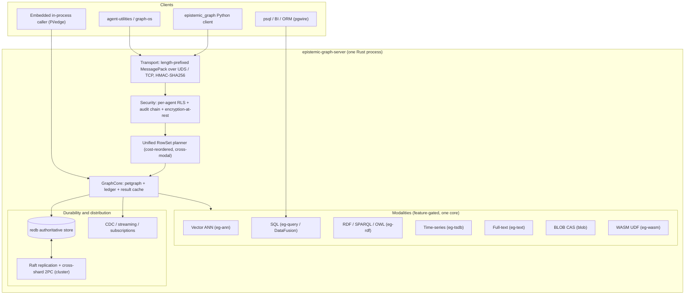
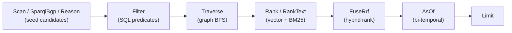

# epistemic-graph

<p align="center">
  <b>One durable, Rust-native engine that is a drop-in substrate for graph · vector · SQL · SPARQL/RDF/OWL · time-series · blob · key-value</b><br>
  <sub>Every modality is a first-class citizen of one <code>RowSet</code> planner — from a Raspberry Pi to a replicated Raft cluster, from one core.</sub>
</p>

<p align="center">
  
  
  
</p>

> **Honesty first.** This README claims only what the code actually does today. Every row in the
> [capability matrix](#capability-matrix) is tagged ✅ supported · 🔶 in-progress · 🗺 roadmap, and the
> [parity roadmap](docs/roadmap.md) names exactly which gaps are being closed and in which order. If a
> doc and the code disagree, the code wins — file an issue.

> **Documentation** — the full architecture, the tier/binary map, deployment recipes, the
> per-interface guides, and the concept registry live in the
> [official documentation](https://knuckles-team.github.io/epistemic-graph/).

> **This is the compute & storage engine for
> [`agent-utilities`](https://github.com/Knuckles-Team/agent-utilities)** — a standalone Rust service
> reached out-of-process over MessagePack/UDS (no PyO3), embedded in-process, or spoken to over the
> Postgres wire protocol. Contributing? See [CONTRIBUTING.md](CONTRIBUTING.md).

---

## The thesis: one engine, every modality

A modern agent platform normally needs a graph database **and** a vector index **and** a SQL warehouse
**and** a triple-store + reasoner **and** a time-series DB **and** a blob store **and** a full-text
index — seven systems, seven copies of the data, six sync pipelines, and a brittle application layer
that stitches results back together.

`epistemic-graph` collapses that rack into **one durable engine with one unified query planner**. Every
modality is a view over the same `RowSet` algebra, so a single plan can seed candidates from an OWL
inference or a SPARQL pattern, filter them with SQL, traverse the graph, re-rank by vector similarity
*and* BM25 text, fuse the two, and run a sandboxed WASM UDF — without ever leaving the engine or
marshalling rows back to Python.

It is **durable by default**: built with the `redb` feature (folded into every deployment tier), the
persist dir is the **authoritative source of truth** and an acked write survives `kill -9`
(commit-before-ack). It scales by configuration alone — the *same binary family* runs as an embedded
in-process library on a Pi, a single durable server, or a multi-node Raft cluster with cross-shard
transactions.

### Drop-in positioning — and the honest parity status

| You run today | epistemic-graph as a drop-in | Current parity |
|---------------|------------------------------|----------------|
| **Postgres** (psql / BI / ORM) | pgwire server: SCRAM/trust auth, simple + extended protocol, `pg_catalog`/`information_schema` | ✅ read SQL · ✅ user tables + DDL + `COPY` · 🔶 compound-WHERE DML + wire transactions |
| **Stardog / GraphDB** (RDF triple-store + reasoner) | RDF dataset over the property graph, SPARQL, OWL 2 EL⁺/RL reasoning | ✅ SELECT/ASK/CONSTRUCT/DESCRIBE + UPDATE + `/sparql` endpoint + reasoning · 🔶 content negotiation, rich FILTER |
| **Neo4j** (property graph) | native petgraph core + Cypher `MATCH…RETURN` + writes + graph algorithms | ✅ read traversal, algorithms, writes (`CREATE/MERGE/SET/DELETE`) · 🔶 `ORDER BY`/`WITH`/aggregation |
| **Pinecone / Milvus** (vector DB) | native IVF-PQ + OPQ + SQ8 ANN, persistent, warm-on-start | ✅ |
| **InfluxDB / TimescaleDB** (time-series) | native redb TSDB: ASOF, gap-fill, `time_bucket`, OHLC, decay | ✅ primitives · 🔶 time-ops as planner ops |
| **S3 / MinIO** (blob) | content-addressed streaming CAS, redb-native or S3-backed | ✅ |
| **SQLite / RocksDB** (embedded KV) | `EmbeddedEngine` in-process handle + generic namespaced KV over the same redb rows | ✅ embedded graph API · ✅ generic KV · 🔶 multi-wire (SQLite/MySQL/MSSQL) |

The point is **convergence, not a checkbox**: the modalities share one snapshot, one ACID transaction,
one security model, and one planner. See the full [capability matrix](#capability-matrix) below for the
operation-by-operation truth.

---

## Capability matrix

Legend: **✅ supported** (implemented & tested) · **🔶 in-progress** (partial or being added now) ·
**🗺 roadmap** (designed, not built). Feature flags are the Cargo features that gate each surface; the
[tier table](#deployment-tiers-and-the-prebuilt-binaries) shows which prebuilt binary carries them.

| Interface | Operation | Status | Feature | Notes |
|-----------|-----------|:------:|---------|-------|
| **SQL** | `SELECT` (joins, aggregates, CTE, window, subquery) | ✅ | `query` | DataFusion 43 over `nodes` + `edges`; real predicate pushdown (Inexact) |
| **SQL** | `INSERT` / `UPDATE` / `DELETE` | ✅ | `query` | **`nodes` table only**, literal `VALUES`, single `col = literal` WHERE (KG-2.198) |
| **SQL** | Complex/compound WHERE, `INSERT…SELECT`, JOIN-in-DML | 🔶 | `query` | KG-2.198 follow-up; explicitly errors today |
| **SQL** | Arbitrary user tables + DDL (`CREATE`/`ALTER ADD COLUMN`/`DROP`), `COPY` | ✅ | `query` | durable redb table catalog (EG-018/EG-020); JOINable to the graph |
| **Postgres wire** | listener, simple + extended/prepared protocol | ✅ | `pgwire` | `EPISTEMIC_GRAPH_PGWIRE_ADDR`; also pulled in by `cluster` |
| **Postgres wire** | SCRAM-SHA-256 / trust auth, `pg_catalog` introspection | ✅ | `pgwire` | KG-2.202 / KG-2.201; pg user → engine ACL actor |
| **SPARQL** | `SELECT` (BGP, paths, FILTER subset, OPTIONAL, UNION, GROUP/agg, BIND, DISTINCT, SLICE) | ✅ | `sparql` | spargebra parser compiled to LPG scans |
| **SPARQL** | `ASK` / `CONSTRUCT` / `DESCRIBE` | ✅ | `sparql` | template instantiation + bounded description (gated by `rdf`, implied by `sparql`) |
| **SPARQL** | `UPDATE` (`INSERT/DELETE DATA`, `DELETE/INSERT WHERE`, `CLEAR`, `CREATE`/`DROP GRAPH`) | ✅ | `sparql` | `eg-rdf/src/update.rs`; `LOAD` intentionally deferred (no HTTP fetch in write path) |
| **SPARQL** | `/sparql` HTTP endpoint (W3C SPARQL 1.1 Protocol) | ✅ | `sparql-http` | `src/server/sparql_http.rs`; GET + POST query/update |
| **SPARQL** | true named graphs (quad dataset) | ✅ | `sparql` | `GRAPH ?g`/constant-IRI over registry graphs (`FROM`/`FROM NAMED` 🔶) |
| **SPARQL** | content negotiation, SPO/POS index, regex/arith FILTER, sub-SELECT, SERVICE, MINUS | 🔶 | `sparql` | results JSON only; naive full-scan; FILTER is a subset |
| **Cypher** | `MATCH … WHERE … RETURN … LIMIT` (var-length `[*m..n]`) | ✅ | `cypher` | read over a snapshot; WHERE is AND-only today |
| **Cypher** | writes (`CREATE`/`MERGE`/`SET`/`DELETE`+`DETACH`) | ✅ | `cypher` | native eg-core mutations; `REMOVE` 🔶 |
| **Cypher** | `ORDER BY`/`SKIP`/`WITH`/`OPTIONAL MATCH`/`OR`/aggregation/`DISTINCT` | 🔶 | `cypher` | not yet in grammar/executor |
| **GraphQL** | read queries (scan + BFS, schema-from-graph, aliases, `first`/`limit`, filters) | ✅ | `graphql` | byte-equal to Cypher path |
| **GraphQL** | mutations (`createNode`/`updateNode`/`deleteNode`/`addEdge`/`removeEdge`) | ✅ | `graphql` | native eg-core mutations |
| **GraphQL** | subscriptions / fragments / variables / directives / relay pagination | 🔶 | `graphql` | poll-only stub; fragments/variables rejected at parse |
| **OWL** | EL⁺ + RL forward-chaining materialization & classification | ✅ | `owl` | pure-Rust; consistency + incremental + justifications |
| **OWL** | confidence-weighting + Ebbinghaus time-decay | ✅ | `owl` | KG-2.236; per-axiom `eg:confidence`, fact decay |
| **OWL** | query-time `Op::Reason` (reasoner seeds a RowSet) | ✅ | `owl-plan` | distributed/cross-shard union supported |
| **OWL** | OWL-DL (tableau, cardinality, `allValuesFrom`), SWRL user rules | 🗺 | — | out of the EL+RL envelope by design |
| **Vector / ANN** | IVF-PQ + OPQ + SQ8-refine, persistent (reopen w/o rebuild), warm-on-start | ✅ | `ann` | parallel/SIMD brute-force fallback below threshold |
| **Vector / ANN** | cross-shard kNN merge, hybrid metadata pre-filter | 🗺 | `ann` | single-shard today |
| **Time-series** | store + `time_bucket`, ASOF join, gap-fill LOCF, OHLC, downsample, decay | ✅ | `tsdb` | native redb columnar, no DataFusion |
| **Time-series** | time-ops as unified planner ops (`Op::Window`) | 🔶 | `tsdb` | functions ready; `Op::Window` is pass-through in the plan today |
| **Blob / CAS** | content-addressed streaming store (redb-native) | ✅ | `blob` | refcount mark-and-sweep GC; bounded RAM |
| **Blob / CAS** | S3 / MinIO backend behind the same `ChunkStore` trait | ✅ | `blob-s3` | manifest/linkage byte-identical |
| **Blob / CAS** | content-defined chunking | 🗺 | `blob` | fixed 2 MiB chunks today |
| **Key-value** | embedded in-process engine API over redb rows | ✅ | `embedded` | `EmbeddedEngine` — no Tokio/socket/HMAC (KG-2.216) |
| **Key-value** | generic namespaced `get`/`put`/`scan`/`cas` KV surface over redb | ✅ | `redb` | `src/server/kv.rs` (EG-022); durable, commit-before-ack; not graph-scoped |
| **Multi-wire** | SQLite / MySQL-MariaDB / MSSQL wires behind one `WireProtocol` trait | 🔶 | (per-wire) | Postgres ✅ via `pgwire`; others being added |
| **Full-text** | Tantivy BM25 inverted index, `RankText` + reciprocal-rank fusion | ✅ | `text` | composes in the unified planner |
| **Unified planner** | `Scan·Filter·Traverse·Rank·RankText·FuseRrf·Reason·SparqlBgp·Udf·ForeignScan·AsOf·Limit` | ✅ | `query`+ | each op feature-gated; see [UQL](docs/uql.md) |
| **Unified planner** | `Op::Window` / `Op::Foreign` execution | 🔶 | `query` | currently pass-through seams |
| **UQL** | text DSL → `wire::Plan` (one parse, zero new exec path) | ✅ | (front-end always ships) | dependency-free parser |
| **UQL** | natural-language → query | 🗺 | — | only a reserved, rejected seam today |
| **Durability** | redb-authoritative, commit-before-ack (`kill -9`-safe) | ✅ | `redb` | folded into every tier |
| **Distribution** | openraft replication + automatic failover | ✅ | `raft` | `cluster` tier; off ⇒ byte-for-byte single-node |
| **Distribution** | cross-shard 2PC (presumed-abort, crash-recoverable) | ✅ | `raft` | classic blocking window; 3PC/non-blocking 🗺 |
| **Distribution** | multi-Raft groups (N-group ring, online reshard, hibernate/rehydrate) | ✅ | `raft` | `GroupRouter` + `MultiRaft` (KG-2.266/267/268); online ownership move |
| **Federation** | remote engine / HTTP-JSON / external SQL (`sqlx`) as a `ForeignScan` | ✅ | `federation`(`-sql`) | OFF by default; never in `pi` |

---

## Architecture at a glance



A single cross-modal plan flows through one snapshot:



See **[docs/overview.md](docs/overview.md)** for the pipeline and
**[docs/architecture/engine.md](docs/architecture/engine.md)** for the full architecture.

---

## Deployment tiers and the prebuilt binaries

The same engine ships as a small family of prebuilt, size-optimized binaries (`release-tiny` profile).
A Pi **pulls a prebuilt wheel and never compiles**. Full build/wheel recipes are in
**[docs/deployment.md](docs/deployment.md)**; the feature-composition map is in
**[docs/architecture/tiers.md](docs/architecture/tiers.md)**.

| Binary | Carries | For |
|--------|---------|-----|
| **pi** | redb-authoritative + cypher + ann + rdf/sparql/owl + streaming + result-cache + cost — **no DataFusion SQL, no Tantivy, no Raft** | Raspberry Pi / edge, ultra-lean |
| **pi-max** | pi + tsdb + blob + security — all pure-Rust, still no C toolchain | Pi "everything without a C compiler" |
| **node** | pi + DataFusion SQL (`query`) + GraphQL + Tantivy text + `owl-plan` + wasm-udf + federation + finance/datascience | single durable server |
| **cluster** | node + Raft replication + **pgwire** + distributed compute + cross-shard 2PC | multi-node HA / SQL clients |
| **full** | every single-node feature, size-optimized (no raft/pgwire) | workstation / one binary, every feature |

> Note: the lean **pi** tier carries SPARQL `SELECT` and OWL reasoning (via the `Method::Owl*` RPCs) but
> **not** the SQL-backed `Op::Reason`/`Op::SparqlBgp` planner ops — those need `owl-plan`, which pulls
> `query` (DataFusion) and lands in **node**. Every tier is **redb-authoritative**.

---

## Three engine modes + the auto-bundle

`agent-utilities` reaches an engine through **one resolver** (`EngineResolver`, CONCEPT:OS-5.63) by a
single precedence — no per-entrypoint code:

```
remote  ->  shared-local  ->  autostart
```

A configured remote (Docker on another host) is used as-is and never autostarts; a co-located engine
already serving is reused; otherwise a **detached, supervised** engine is autostarted under a
first-one-wins lock and **reference-counted idle-shuts-down** after its last client disconnects.
Details + the decision flow: **[docs/engine-modes.md](docs/engine-modes.md)**.

For the embedded/edge story, the `embedded` feature gives a SQLite/DuckDB-style in-process handle
(`EmbeddedEngine`) over the *same* GraphCore + redb durable rows — no Tokio, no socket, no HMAC — the
"100M agents, a local engine each" path.

---

## Distribution & durability

- **redb-authoritative by default.** A committed write is fsynced to redb *before* the client is acked
  (commit-before-ack); an acked write survives a hard crash. Eviction is read-through-safe.
- **In-engine Raft replication (cluster tier, `raft`).** `openraft` replicates the authoritative redb
  store; the Raft log shares the one `graph.redb` (a log append + its graph mutation coalesce into one
  fsync). Leader failover is automatic. Off ⇒ the write path is byte-for-byte single-node.
- **Cross-shard 2PC.** A transaction spanning multiple Raft groups commits atomically via presumed-abort
  two-phase commit, surviving coordinator/participant crashes. Multi-group routing/resharding is a
  scaffold today (single `DEFAULT_GROUP`); the durable machinery is in place.
- **Cross-modal ACID.** A graph mutation + a vector upsert + a blob reference land in **one** redb
  `WriteTransaction` — all modalities commit together or none do.

---

## Security & isolation

- **Auth is mandatory.** Every RPC carries `HMAC-SHA256(secret, request_id)`; the server refuses to
  start with an empty secret (`--allow-insecure` opts out, dev only). The pgwire surface adds
  SCRAM-SHA-256.
- **Per-agent Row-Level Security.** Once any identity is registered, the read/plan-path `GraphView` is
  filtered to the rows the caller may see *before* any query surface (SQL/Cypher/SPARQL/GraphQL/unified)
  touches it. The result cache keys on the caller's RLS context.
- **Encryption-at-rest** (`security`): redb durable value blobs are ChaCha20-Poly1305 AEAD-sealed
  (pure-Rust RustCrypto, no ring/openssl).
- **Hash-chained tamper-evident audit log** over every durable mutation.

See **[docs/service_mode.md](docs/service_mode.md)** for the protocol, auth, and isolation policy.

---

## Quickstart, per interface

### Native client — out-of-process (the standard path)

```python
from epistemic_graph import SyncEpistemicGraphClient

g = SyncEpistemicGraphClient()                    # connects/attaches to the UDS engine

g.nodes.add("AgentA", {"type": "coordinator"})
g.nodes.add("AgentB", {"type": "worker"})
g.edges.add("AgentA", "AgentB", {"weight": 1.5})
print("Order:", g.graph.topological_sort())

# OWL/RDFS forward chaining — materialises inferred edges/types in-graph
result = g.reasoning.reason(subclass_relations=[("Dog", "Animal")],
                            transitive_properties=["ancestor"])
print("Inferred:", result["inferred_count"], "triples")
```

### Postgres wire (`pgwire` / `cluster`) — psql, BI tools, ORMs

```bash
# start the engine with the wire listener
EPISTEMIC_GRAPH_PGWIRE_ADDR=127.0.0.1:5433 \
  epistemic-graph-server --features cluster

# connect with any Postgres client
psql -h 127.0.0.1 -p 5433 -U agent -d epistemic
```
```sql
-- SELECT is full DataFusion: joins, aggregates, CTEs, window functions
SELECT n.id, n.properties->>'type' AS kind
FROM nodes n
WHERE n.properties->>'type' = 'worker';

-- DML on the graph node store, plus arbitrary user tables + DDL
CREATE TABLE metrics (id TEXT PRIMARY KEY, value DOUBLE PRECISION);
INSERT INTO nodes (id, properties) VALUES ('AgentC', '{"type":"worker"}');
UPDATE nodes SET properties = '{"type":"idle"}' WHERE id = 'AgentC';
DELETE FROM nodes WHERE id = 'AgentC';
```
> Arbitrary user tables + DDL (`CREATE`/`ALTER ADD COLUMN`/`DROP`, `COPY`) are supported and JOINable to the
> graph; compound-WHERE DML and wire transactions are 🔶 in-progress.

### SPARQL (`sparql`)

```python
g.rdf.add_triples([("ex:Dog", "rdfs:subClassOf", "ex:Animal")])

rows = g.rdf.sparql("""
  SELECT ?s ?o WHERE { ?s rdfs:subClassOf ?o }
""")                                              # SELECT / ASK / CONSTRUCT / DESCRIBE all supported
```
> `ASK` / `CONSTRUCT` / `DESCRIBE` / `UPDATE` and the W3C `/sparql` HTTP endpoint (feature `sparql-http`) are
> supported. Content negotiation, rich FILTER, sub-SELECT, SERVICE and MINUS are 🔶 in-progress — see the
> [capability matrix](#capability-matrix).

### Embedded in-process (Pi / edge, `embedded` feature)

The `EmbeddedEngine` handle drives the same GraphCore + redb durable rows with no server, socket, or
HMAC — open a persist dir and call core ops as plain methods (SQLite/DuckDB-style).

> **Batch, never per-element.** Every out-of-process call is a serialize → socket → deserialize round
> trip, not a function call. Ship work as one batch op over data already in the graph; keep tight
> per-element math in-process. See [AGENTS.md](AGENTS.md) and [docs/RUST_COMPUTE_GUIDE.md](docs/RUST_COMPUTE_GUIDE.md).

---

## Ontology hosting & lifecycle

epistemic-graph is also an **ontology server**: you load OWL/RDFS as RDF, the engine maps it onto the
property graph, and the EL⁺/RL reasoner materialises the closure (with confidence weights and Ebbinghaus
time-decay). Classification, consistency checking, and incremental re-materialisation are all
in-engine, and inferred members can seed a unified plan via `REASON <Class>`. See
**[docs/interfaces/ontology.md](docs/interfaces/ontology.md)** for the load → reason → query → evolve
lifecycle.

---

## Documentation

- [Capabilities & parity matrix](docs/capabilities.md) — the operation-by-operation truth table.
- [Universal-DB parity roadmap](docs/roadmap.md) — every gap being closed, with status.
- [Technical Overview](docs/overview.md) · [Master-of-all engine](docs/architecture/engine.md).
- Per-interface guides: [SQL](docs/interfaces/sql.md) · [SPARQL](docs/interfaces/sparql.md) ·
  [Cypher](docs/interfaces/cypher.md) · [GraphQL](docs/interfaces/graphql.md) ·
  [Vector](docs/interfaces/vector.md) · [Time-series](docs/interfaces/timeseries.md) ·
  [KV & Blob](docs/interfaces/kv-blob.md) · [Ontology lifecycle](docs/interfaces/ontology.md).
- [UQL & the unified planner](docs/uql.md) · [Tiers & binaries](docs/architecture/tiers.md) ·
  [Deployment](docs/deployment.md) · [Engine modes](docs/engine-modes.md) · [Service Mode](docs/service_mode.md).

## License

MIT — see [LICENSE](LICENSE).
</content>
</invoke>
