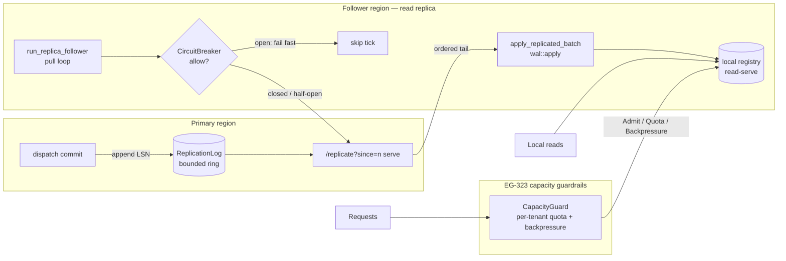
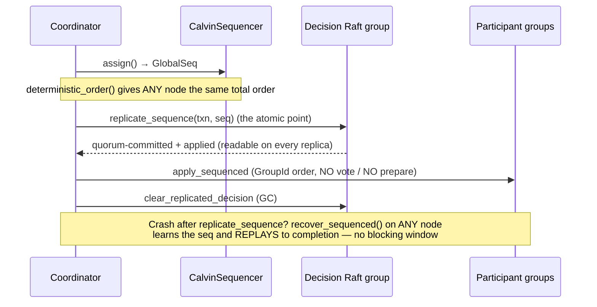
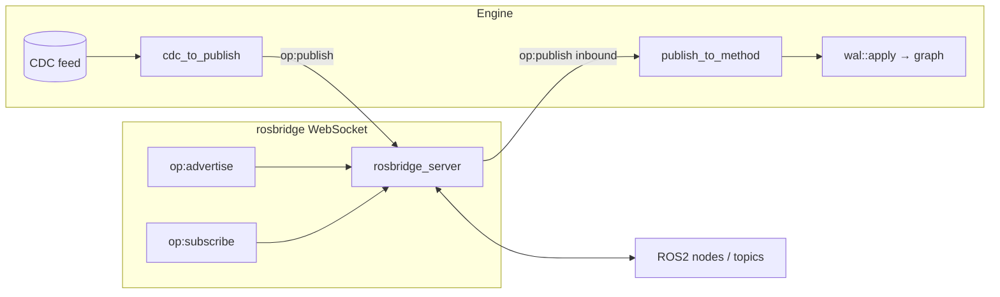
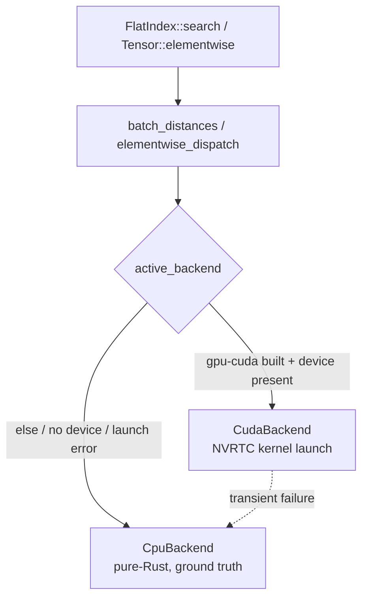

# Distribution, Robotics & GPU tail (EG-3.x)

The last engine features of Program B, closing the distribution / robotics / GPU tail. Every
one is **feature-gated OUT of the Pi tier** — the heavy deps (`cudarc`, `tokio-tungstenite`)
are optional and a `pi`/`default` build links none of them (`cargo tree --features pi` is
clean). This page documents the four subsystems and their control/data flow.

| Feature | Concept | Module | Feature flag |
|---------|---------|--------|--------------|
| Cross-region async read-replica tier | `CONCEPT:EG-322` | `src/server/replica.rs` | `federation-search` |
| Capacity guardrails (breaker/quota/backpressure) | `CONCEPT:EG-323` | `src/server/replica.rs` | `federation-search` |
| Full Calvin deterministic-ordering commit | `CONCEPT:EG-324` | `src/raft/cross_shard_txn.rs` | `calvin` (⇒ `nonblocking`) |
| ROS2 bridge over rosbridge-WebSocket | `CONCEPT:EG-325` | `src/server/ros2_bridge.rs` | `ros2-bridge` |
| GPU distance/tensor dispatch seam | `CONCEPT:EG-326` | `crates/eg-ann/src/distance.rs`, `crates/eg-tensor/src/gpu.rs` | `gpu` |
| Real CUDA distance/tensor backend | `CONCEPT:EG-327` | same | `gpu-cuda` |

---

## Cross-region async read-replica tier + guardrails (EG-322 / EG-323)

Beyond the synchronous multi-Raft groups + the EG-243 federated *read*, a distant region gets
a **local, eventually-consistent read copy** that never pays a cross-region Raft round-trip on
every write. The primary appends every committed mutation to a bounded monotone-LSN
`ReplicationLog` and serves the tail over `/replicate?since=<lsn>`; a follower pulls it and
applies it via the canonical `wal::apply` path (byte-identical to Raft/WAL replay). Capacity
guardrails — a circuit breaker, a per-tenant quota, and backpressure — protect the primary from
a slow/hostile region or a greedy tenant.

* **`ReplicationLog::since(cursor)`** returns the ordered ops after the cursor and a
  `ReplicaLag`: a follower whose cursor predates the retained ring is told `Behind` (re-snapshot)
  rather than silently skipping ops.
* **`CircuitBreaker`** is a pure Closed→Open→HalfOpen state machine driven by an explicit `now:
  Instant` (deterministically testable): it opens after N consecutive failures for a cooldown,
  then admits one half-open trial whose outcome closes or re-opens it.
* **`CapacityGuard`** enforces a per-tenant hard concurrency quota (`QuotaExceeded`) and a global
  high-water backpressure shed (`Backpressure`), complementing the EG-320 QoS scheduler's
  priority reordering with absolute ceilings.

Enabled by `EPISTEMIC_GRAPH_REPLICATE=1` (primary log) + `EPISTEMIC_GRAPH_REPLICA_PRIMARY=<url>`
(follower). Off by default — a non-replicated primary pays nothing.

---

## Full Calvin deterministic-ordering commit (EG-324)

A **third** cross-shard commit branch alongside 2PC (`commit_cross_shard`) and Paxos-Commit-lite
(`commit_cross_shard_nonblocking`). Where those are *agreement-first* (every writing participant
runs an OCC prepare and VOTES), Calvin is *order-first*: a global `CalvinSequencer` stamps the txn
with a monotone total-order `GlobalSeq`, that ORDER is Raft-replicated (the "input log"), and
participants EXECUTE it deterministically with **no vote round and no abort**. Agreement on the
order IS agreement on the outcome, so a crashed coordinator is resolved by any node replaying the
replicated sequence — there is no in-doubt window.

Opt-in per call via the `calvin` feature (implies `nonblocking` to reuse the EG-082 replicated
decision-graph helpers); the default cross-shard path is byte-for-byte unchanged. **Honest
scope:** the sequencer + total order + replicated input log + vote-free deterministic execution +
crash-replay recovery are implemented and proven (live `calvin_*` harness tests). The distributed
OLLP reconnaissance/read-lock phase (full serializable isolation of conflicting sequenced txns
across nodes) and a multi-node sequencer epoch fan-in are documented-deferred — additive, and they
weaken no shipped invariant.

---

## ROS2 bridge over rosbridge-WebSocket (EG-325)

Joins a ROS2 graph WITHOUT a DDS stack by speaking the standard `rosbridge_suite` protocol —
JSON messages over a WebSocket to a `rosbridge_server`. No CycloneDDS/rmw/`ros` C toolchain — a
pure-Rust `tokio-tungstenite` client.

* **Engine → ROS2:** tail the CDC feed for a graph; each change becomes a rosbridge
  `{"op":"publish","topic":…,"msg":{"data":…}}` (`cdc_to_publish`).
* **ROS2 → engine:** `subscribe` a topic; each inbound publish maps to an `AddNode`
  (`publish_to_method`) applied via `wal::apply`.

The protocol framing (`RosbridgeOp`) + the CDC↔ROS2 mapping are pure and unit-tested; the
WebSocket driver (`run_ros2_bridge`) wires them onto a live connection. Enabled by
`EPISTEMIC_GRAPH_ROSBRIDGE_URL=ws://host:9090`. A native DDS/RTPS wire (CycloneDDS) is a documented
optional leg — it needs the CycloneDDS C toolchain, so it is not folded into the workspace
`--all-features` build.

---

## GPU distance/tensor dispatch seam + CUDA backend (EG-326 / EG-327)

Vector search and tensor ops are dominated by one embarrassingly-parallel kernel each (batch
distance; elementwise map). Both are factored behind a backend trait so the compute device is
swappable WITHOUT touching the index/tensor code. The pure-Rust CPU backend is ALWAYS compiled in
and is the byte-for-byte ground truth; the real CUDA backend is selected only when built AND a
device initialises.

* **`DistanceBackend`** (eg-ann) / **`TensorBackend`** (eg-tensor): `batch_distance` /
  `elementwise` over a flat buffer. Every backend must agree with the CPU backend to within
  floating-point tolerance, so GPU and CPU results are interchangeable.
* **`CudaBackend`** (feature `gpu-cuda`): NVRTC-compiles the CUDA-C kernel at first use, ships
  buffers to the device, launches one thread per row/element, copies scores back. `cudarc` is
  `dynamic-loading` — libcuda/libnvrtc are dlopen'd at runtime — so the leg **builds with no CUDA
  toolkit** and, on a GPU-less host, `active_backend` returns the CPU backend (fully functional).

**Pi contract:** the seam is pure-Rust; `gpu`/`gpu-cuda` are OUT of `pi`/`default`/`node`/`full`,
and `cudarc` links only under `gpu-cuda`. **Deferred:** live validation of the kernels on real GPU
hardware (none in CI) and GPU offload of reasoning / ANN *build* beyond the distance/elementwise
kernels.
