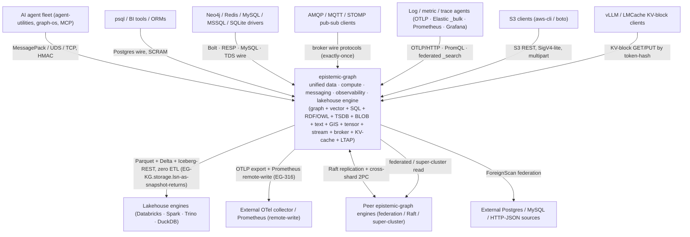
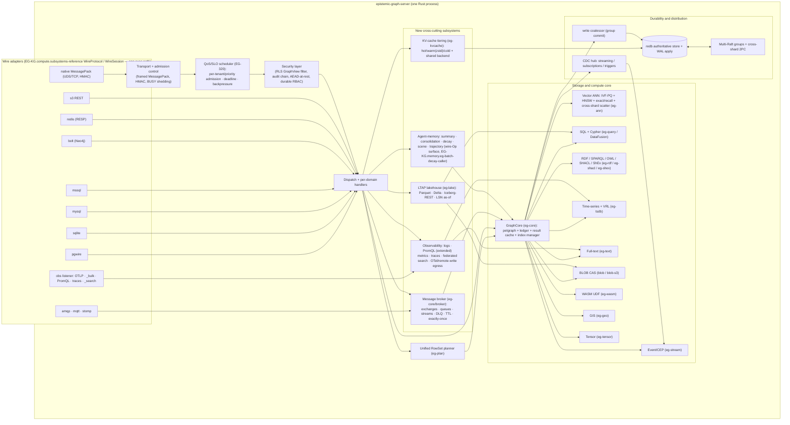
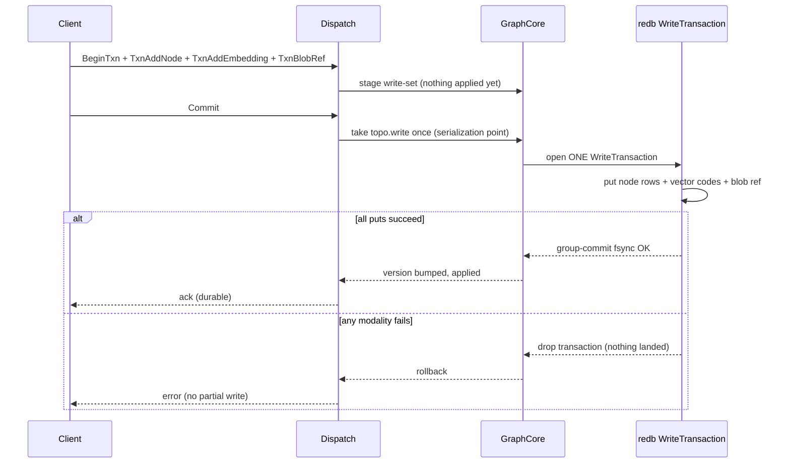
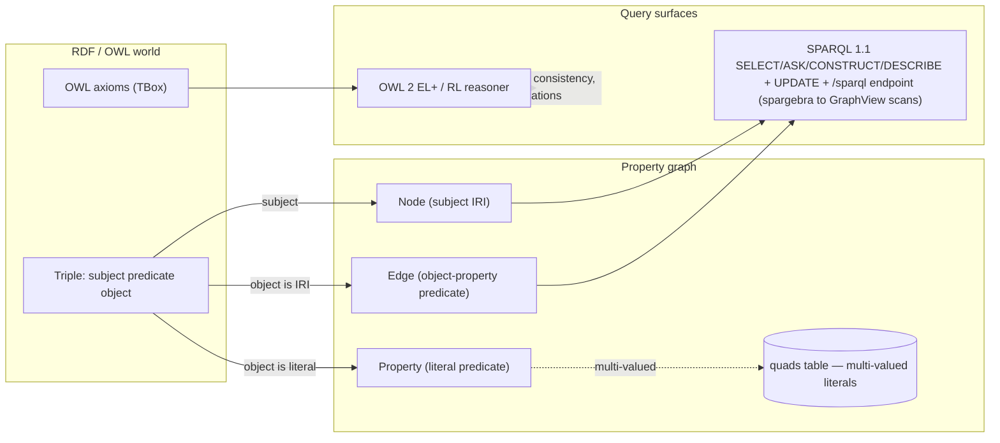
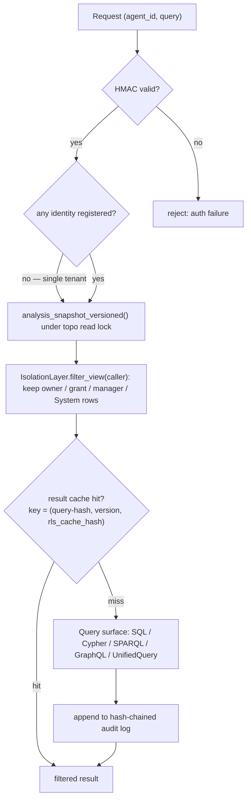
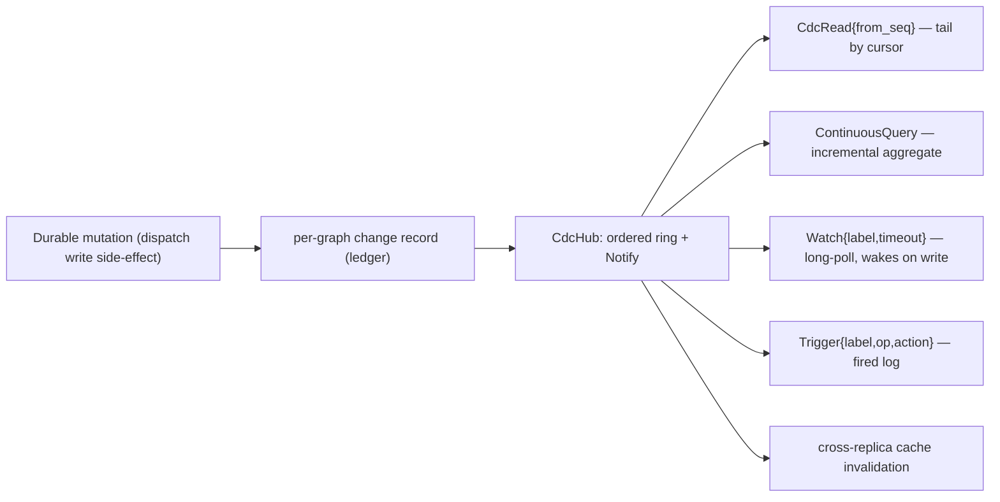
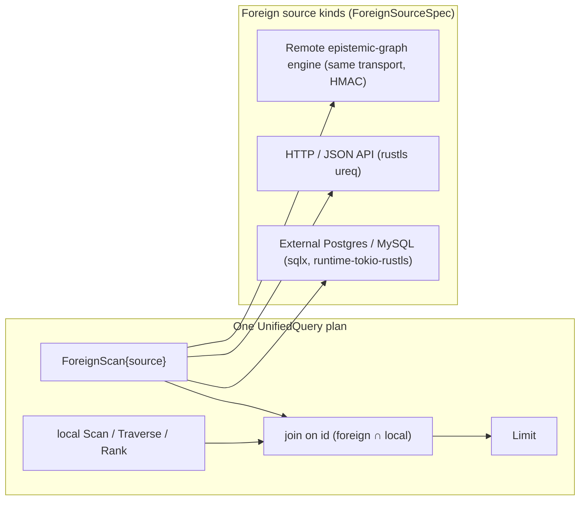
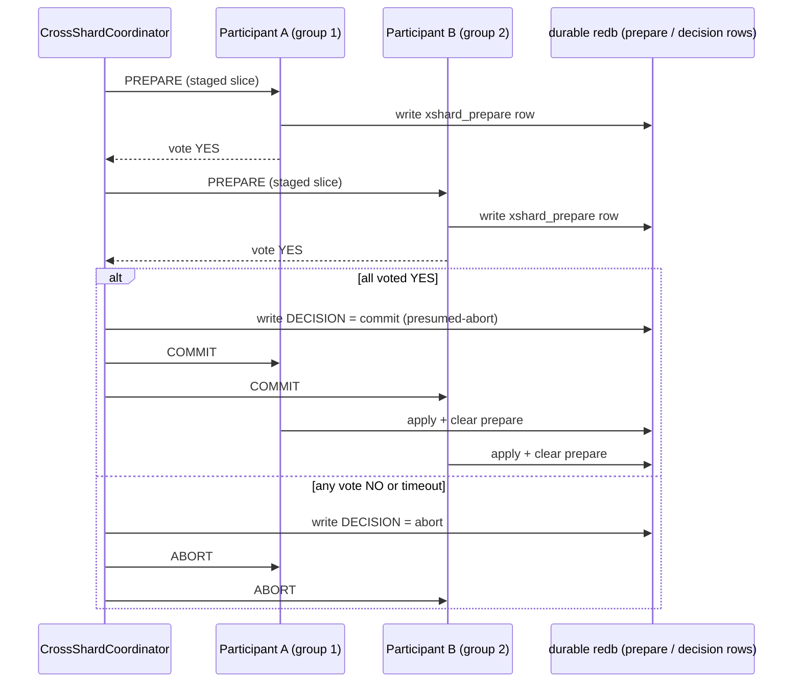
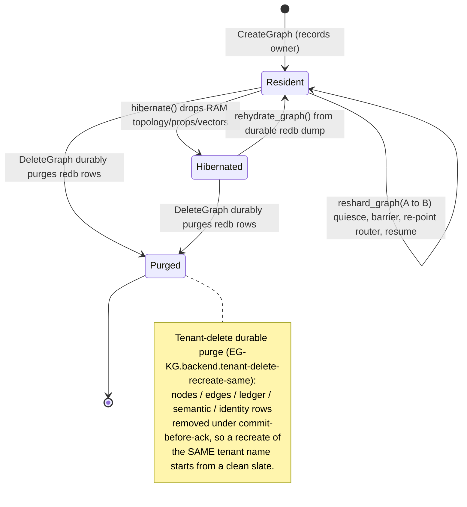

# The master-of-all engine

This is the deep architectural reference for `epistemic-graph` — the one durable engine that unifies
graph, vector, SQL, RDF/SPARQL, OWL-2, time-series, content-addressed BLOB, full-text, and reasoning
behind a single cross-modal planner, distributed and replicated from a Raspberry Pi to an HA cluster.

For the entry-level map see [the overview](../overview.md); for build tiers see
[Tiers & binaries](tiers.md); for the protocol see [Service Mode](../service_mode.md).

---

## System context (C4 level 1)

## Container view (C4 level 2)

---

## Durability: redb-authoritative (the default)

Built with the `redb` feature — in the one main build (and the `cluster` layer) — the persist
dir is the **authoritative source of truth** in authoritative mode (default whenever a persist dir is
set). Three rules make "authoritative" safe:

- **Commit-before-ack.** A durable mutation is fsynced to redb (group-commit) *before* its Response is
  acked. A commit failure becomes an ERROR response, so an acked write is always on disk. Many awaiting
  writers coalesce into one group-commit fsync.
- **Read-through-safe eviction.** The per-graph node cap stays enforced (bounded RAM) without data
  loss: a `ReadThrough` seam serves an evicted node's blob from redb on a RAM miss, and a node is
  dropped from RAM only after a redb read confirms it is on disk.
- **Backpressure, not drop.** The redb writer's bounded channel blocks for capacity off-reactor instead
  of shedding a mutation.

The opt-in `EPISTEMIC_GRAPH_PERSIST_BACKEND=snapshot` mode reverts to the older rebuildable-cache
behavior (an in-memory cache + compute layer over an external system-of-record), where the `.mp`
snapshot + WAL exist only for fast warm restart. This is no longer the default.

---

## Cross-modal ACID write

A single durable `WriteTransaction` lands a graph mutation **and** a vector upsert **and** a blob
reference atomically across modalities — either all commit in the one redb transaction or none do (a
true rollback, no torn cross-modal write).

The content-addressed BLOB substrate (CONCEPT:EG-KG.storage.blob-namespace) is the bytes tier under multimodal
`:Media`/`:Blob` nodes: `begin / chunk / commit / fetch / ref / unref / gc` stream large binaries over
the same transport (a chunk-get returns a raw MessagePack bin). The native CAS lives in `blob.redb`;
an explicit `blob-s3` build routes chunks to S3/MinIO behind the same `ChunkStore` trait — the lean
tiers link no object-store SDK.

---

## RDF / SPARQL / OWL over the property graph

The engine does not bolt on a separate triple-store: an RDF dataset is **projected onto the same
property graph** the rest of the engine uses, and serialized back out (Turtle / N-Triples via
oxrdf/oxttl). Multi-valued-literal predicates the property blob cannot hold live in an opt-in lossless
redb `quads` table (`rdf-redb`) and are unioned back on read.

The OWL 2 reasoner (CONCEPT:EG-KG.ontology.incremental-materialization/2.236) is pure-Rust — EL⁺ completion (the ELK/CEL core) unioned
with OWL 2 RL property rules — and reaches entailments the RL-only reasoner cannot (e.g.
`HumanHeart ⊑ HumanComponent` through `∃partOf.Body`). It is **confidence-weighted and time-decayed**:
each entailment carries a `[0,1]` confidence (axiom annotations × per-node confidence × Ebbinghaus
decay), and `OwlReason` accepts a `min_confidence` threshold. Both SPARQL and OWL plug into the unified
planner as the `SparqlBgp` and `Reason` source ops.

---

## Security & the RLS request path

Three pure-Rust security primitives (the `security` feature, in the one main build) make
the engine multi-tenant-safe: **per-agent Row-Level Security**, **encryption-at-rest**, and a
**hash-chained audit log**. The critical property: RLS filters the `GraphView` *before* any query
surface sees it, so **no query language can exfiltrate a forbidden row**.

With zero registered identities nothing is filtered (single-tenant back-compat). The result cache key
folds in the caller's RLS context (`rls_cache_hash`, agent-id-salted when rules exist), so agent A's
filtered cached result is never served to agent B for the same query text. Encryption-at-rest seals the
redb durable **value** blobs with ChaCha20-Poly1305 (keys stay plaintext so range scans work); a wrong
key fails the read rather than silently returning ciphertext.

---

## Streaming / CDC / the reactive substrate

Every durable mutation the dispatch shell records also emits an ordered, cursor-addressable `CdcEvent`
into a per-graph in-memory feed (a bounded ring + a Tokio `Notify`) — pure-Rust, so `streaming` folds
into every tier. From that one feed the engine drives CDC reads, incremental continuous queries, and
LISTEN/NOTIFY-style watches + triggers, all over the **same one-Response-per-Request transport** (no
side-channel socket).

A continuous query is seeded from the graph's current state at registration and updated by delta on
each change, so it equals a full re-run. A `Watch` returns matching changes since the cursor or awaits
the per-graph `Notify` up to `timeout_ms`, then returns a `WatchBatch{events, next_seq}` the client
resumes from. The same CDC feed drives distributed cache-coherence: a write on replica A retires
replica B's cached result for that graph.

---

## Query federation (including external SQL)

A federated `UnifiedQuery` reads an **external** source as a RowSet and composes it with the local
graph/vector/SQL ops in **one** plan — no Python round-trip. The `Op::ForeignScan` source op is the
resolved executor; the UQL `FOREIGN "<name>"` clause is the lighter name marker resolved against the
server-side `foreign_sources` registry.

The HTTP/SQL clients are pure-Rust rustls stacks (no openssl) and are **in the one main build** —
a minimal server build links no ureq/rustls/sqlx. Federation is in the one main build.

---

## Distribution: multi-Raft, cross-shard 2PC, resharding, hibernation

The cluster tier runs the engine as a multi-node HA cluster. A `MultiRaft` manager holds N openraft
groups keyed by `GroupId`, sharing **one** TCP listener per node (frames tagged + demuxed by group id)
and **one** shared `graph.redb` (the Raft log shares M2's group-commit writer, so a log append + its
graph mutation coalesce into one fsync). A `GroupRouter` maps `graph_name -> GroupId`; a group is the
transaction boundary.

### Cross-shard 2PC (a transaction spanning groups)

In-doubt transactions survive a coordinator or participant crash and are resolved deterministically
from the durable prepare/decision rows on boot (`recover_in_doubt`, run before serving). A single-group
txn stays the byte-for-byte single-node fast path. Distributed Pregel/GAS compute (`compute-dist`) runs
PageRank / connected-components / BFS across graphs whose vertices span multiple groups, and persists
named results as redb-backed materialized views reloaded on boot.

### Tenant lifecycle (create / hibernate / reshard / delete + purge)

Because one shared registry + one shared `graph.redb` is keyed by graph name, a "move" is re-pointing
ownership of future writes, not copying rows — so resharding is zero-downtime.

Cold-tenant hibernation drops the in-RAM state while the durable redb rows + read-through seam stay
intact (extended by the cold-tier object-store seam for whole-graph offload). The per-tenant memory
budget (CONCEPT:EG-KG.compute.lane-v) drives this automatically: a tenant over its byte budget has its coldest
graphs evicted (durability-gated LRU) then hibernated, with a global ceiling + fair per-tenant caps so
one hot tenant cannot starve others. See [the cost model](../cost_model.md).

---

## WASM-sandboxed UDFs

An agent can push a custom compute function as a WebAssembly module the engine runs **sandboxed** over
a RowSet: wasmtime with fuel-metering (an infinite loop is fuel-killed, never a hang), a hard memory
cap, and **no host capabilities** (a module importing fs/net is rejected). `RegisterUdf{id, wasm}`
compiles + caches it; `RunUdf{id, input}` runs it off-reactor; and the `Op::Udf{id}` plan op runs a
registered UDF as a `RowSet -> RowSet` transform inside a unified query. The wasmtime/cranelift runtime
is heavy, but pure-Rust, so it ships in the one main build.

---

## Related references

- [Subsystems (C4 container level)](subsystems.md) — the broker, observability, GIS, tensor, stream, KV-cache, agent-memory, LTAP lakehouse, and multi-wire subsystems and how they compose on the one substrate.
- [Lakehouse LTAP interop (EG-KG.storage.lsn-as-snapshot-returns)](lakehouse_ltap.md) — the eg-lake Parquet/Delta/Iceberg egress tier that makes the engine Databricks-interoperable with zero ETL.
- [Tiers & binaries](tiers.md) — which features ship in which binary, and the prebuilt sizes.
- [Engine modes](../engine_modes.md) — remote / shared-local / autostart resolution + the auto-bundle.
- [Deployment](../deployment.md) — Docker / wheel / single-node / HA recipes.
- [Write coalescer](write_coalescer.md) · [Index manager](index_manager.md) · [Correctness harness](correctness_harness.md).
