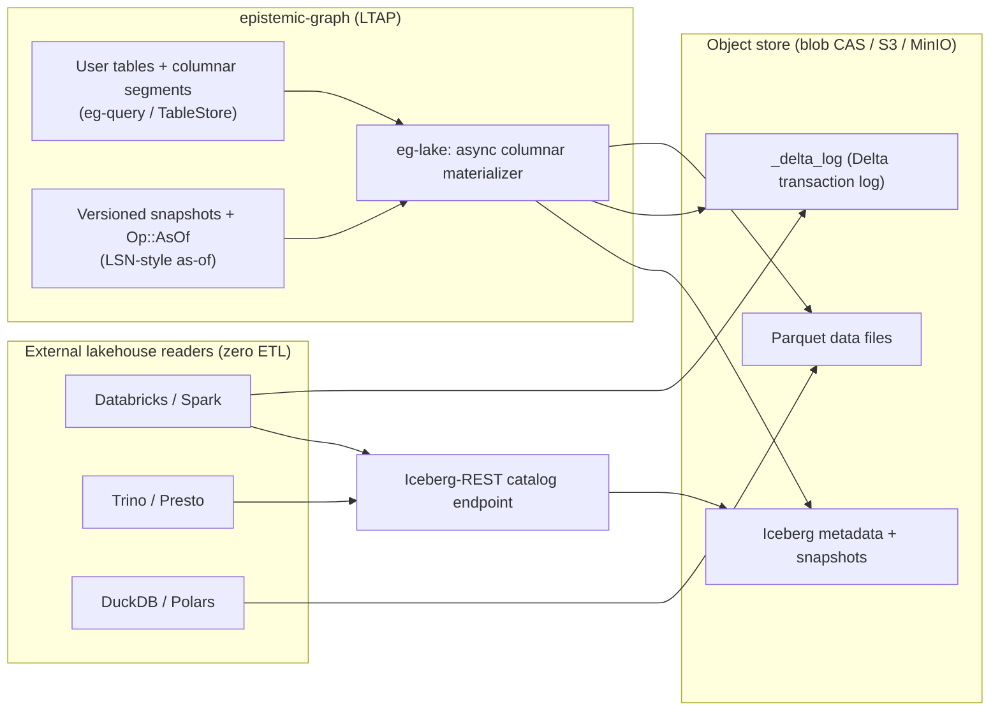

# LTAP lakehouse interop (eg-lake, EG-317)

`epistemic-graph` is transactional (redb-authoritative, cross-modal ACID) **and** analytical (DataFusion
SQL, columnar segments, window frames). Program B adds the third leg — **lakehouse interoperability** —
making the engine an **LTAP** (Lakehouse-Transactional-Analytical Processing) superset: external lakehouse
engines read the engine's own tables as open **Parquet + Delta/Iceberg** with **zero ETL**, while writes
still land through the one ACID write path.

This is the `eg-lake` crate (CONCEPT:EG-317), gated behind the `lake` feature (`arrow`/`parquet` +
delta/iceberg deps), an **opt-in feature (not in the default build)**.

> Positioning: this is what makes the engine a drop-in in front of a **Databricks / Spark / Trino / DuckDB**
> lakehouse — the tables it serves over pgwire/native are *also* an open-format lake the analytical engines
> read directly, with no export pipeline and no second copy of the data to keep in sync.

---

## What it does

- **Parquet materialization.** An async tier transcodes an engine table's (or a columnar segment's) rows
  into Arrow record batches and writes **Parquet** data files onto the object store (the blob CAS, or an
  `s3`/MinIO backend behind the same `ChunkStore` trait). No second storage system — the lake files live in
  the engine's own object tier.
- **Delta transaction log.** Each materialization appends to a Delta `_delta_log` (add/remove file actions +
  schema), so a Delta reader (Databricks / `delta-rs` / Spark) sees a consistent table version.
- **Iceberg logs + REST catalog + real Avro manifest.** Iceberg table metadata + snapshot lineage is
  emitted, an **Iceberg-REST catalog** endpoint lets a Trino/Spark catalog resolve the table by name, and a
  spec-compliant **Iceberg v2 Avro manifest + manifest-list writer** (EG-333/EG-334, `iceberg_avro.rs`,
  behind `lake` via pure-Rust `apache-avro`) is shipped — a committed snapshot's `metadata.json` references
  real Avro that Spark/Trino/DuckDB follow, with per-column stats (`value_counts`/`null_value_counts`/
  `lower_bounds`/`upper_bounds`, keyed by field-id) gathered at materialize time for predicate pushdown /
  file skipping (EG-350). Partition `field_summary` is null by design (the spec is unpartitioned).
- **LSN-style as-of snapshots.** Materialization reuses the engine's versioned snapshots + `Op::AsOf`
  (bi-temporal, KG-2.249/2.250) so a lake snapshot corresponds to a durable engine LSN — an external reader
  can pin a **time-travel** read that matches an exact engine version, not a fuzzy nightly dump.

---

## Why it is an LTAP superset

| Leg | In epistemic-graph |
|-----|--------------------|
| **T**ransactional | redb-authoritative, commit-before-ack, cross-modal ACID `WriteTransaction`, multi-Raft + cross-shard 2PC |
| **A**nalytical | DataFusion 43 `SELECT` (joins/CTE/window), columnar struct-of-arrays segments (EG-089), PromQL/TSDB |
| **L**akehouse interop | **eg-lake (EG-317)**: Parquet + Delta + Iceberg + LSN as-of + Iceberg-REST catalog — external engines read with zero ETL |

The write path is unchanged and stays the single source of truth; `eg-lake` is a **read-side, additive**
projection. A build that does not enable the opt-in `lake` feature (or set the catalog address) is
byte-for-byte the prior engine.

---

## Reaching it

- **Feature:** build with `--features "lake server"`; the catalog + materialization surface activate behind
  their own opt-in env/flag. Out of `pi`.
- **Delta readers** point at the `_delta_log` table path on the object store.
- **Iceberg readers** point a catalog at the Iceberg-REST endpoint.
- **Time-travel** reads pin a snapshot that corresponds to an engine LSN (`Op::AsOf`).

See the [capability matrix](../capabilities.md#lakehouse-interop-eg-lake-ltap) row and
[concepts](../concepts.md) `CONCEPT:EG-317` for the authoritative definition, and
[subsystems](subsystems.md#lakehouse-interop-eg-lake-ltap-eg-317) for how it composes on the one store.

---

**See also:** [Capabilities matrix](../capabilities.md) · [SQL & pgwire](../interfaces/sql.md) · [Analytics Program](analytics_program.md) · [Key-value & Blob](../interfaces/kv_blob.md) · [Cluster Deployment](cluster_deployment.md).
