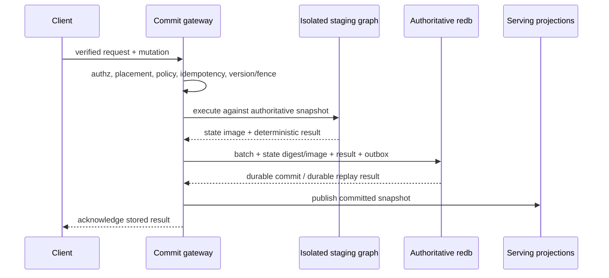

# Authoritative MutationBatch commit protocol

`MutationBatch` is the engine's durable mutation currency. A successful RPC is
acknowledged only after the authoritative state, result, version/fence, durable
status, audit entry, and projection outbox have crossed one commit point. The
in-memory `GraphCore` is a serving projection and can be reconstructed from that
authority.

## Commit sequence

The four concrete process boundaries in this sequence are exercised against the
exact promoted executable, not an in-process substitute. See
[Exact-binary fault and restart certification](../operations/exact-fault-restart-certification.md)
for the 60-case mutation-domain matrix, deterministic abort control, restart
observations, and privacy-safe evidence format.

Compact row operations (`AddNode`, `RemoveNode`, `AddEdge`, `RemoveEdge`, and
`ClearGraph`) are validated and committed directly as canonical methods before
their RAM projection is changed. Runtime-result graph, Cypher, ordinary GraphQL,
and RDF mutations execute against an isolated snapshot. Their bounded affected-row
delta is SHA-256 bound to adjacent source and target graph versions and atomically
updates the durable rows before publication. A complete snapshot uses the same
version contract when a coordinator explicitly supplies one.

RDF multi-valued literals are retained under the reserved
`__rdf_multivalue_literals` node property. This makes the lossless RDF dataset part
of the same authoritative graph image. The RDF view is a derived projection, never
a second write authority or an alternate reader.

SQL graph DML follows the staged graph path. SQL user-table/catalog statements use
the table store's native coordinator: the table/catalog rows, SQL-domain version and
fence, terminal batch/result, idempotency index, and immutable outbox are committed
in one owner-scoped catalog transaction. Each verified tenant+effective actor resolves
to an opaque redb filename under `<persist-dir>/sql-catalog/`; there is no global store,
path override, unsigned reader, or temporary fallback. Query text and bound parameters are represented
only by an operation digest in that metadata. GraphQL cross-modal begin/stage calls
have no durable effect and are keyed by verified owner scope. Staged reads combine an
RLS-projected committed snapshot with only that owner's overlay. A sole-root
`commitTransaction` is consumed by the facade, which revalidates graph and tenant
authority and lands graph, semantic/blob/time-series rows plus the universal
status/fence/idempotency/outbox in one authoritative shard transaction before
publishing RAM state. The lower GraphQL crate has no commit function. This avoids
wrapping either native domain in a second, non-atomic graph-snapshot commit.

## Durable invariants

- The sole current persisted schema is `MutationBatch` v2. Every operation carries
  an explicit durability domain; missing fields, unknown fields, and other schema
  versions are rejected rather than defaulted during replay.
- A batch has one opaque `batch_id` and deterministic idempotency key.
- Verified principals are stored only as SHA-256 pseudonyms.
- State-backed operations store an opaque method digest, not query text, paths,
  document bodies, or caller-provided identifiers.
- `expected_graph_version`, placement epoch, and fencing token are checked inside
  the same write transaction that advances the durable graph version.
- A state descriptor advances exactly one checked graph-version step. Missing
  durable version state is accepted only for a true version-zero bootstrap; an
  advanced or mismatched serving projection cannot substitute its RAM version.
- A retry after durable commit returns the stored result and reconciles RAM from
  the authoritative snapshot; it does not execute the handler again.
- Each outbox record and projection cursor carries the current schema version, a
  required `version_scope`, and a required `source_graph_version`. Graph-authoritative
  rows use `version_scope=graph` and a strictly positive committed graph version.
  Native SQL/KV/blob/job/control stores use `version_scope=non_graph` and the explicit
  value `0`; their independent owner-domain counter is never presented as a graph
  version.
- Graph-domain delivery leases are consumer-specific, ordered by source graph
  version, epoch-fenced, and acknowledged in the same transaction that advances that
  projection's cursor. A cursor can advance within the same batch ordinal or to a
  higher graph version; regressions, a different batch at the same graph version,
  and retries after the cursor has moved past an event fail closed. The SQL native
  store exposes its committed batch and outbox for restart/rebuild consumers from
  the same database that owns the table rows.
- Durable methods fail closed when an authoritative backend is unavailable.

There is no online reader for the pre-v2 mutation/projection shape and no caller-
supplied version seeding when a durable version row is absent. The earlier shape was
never a promoted production format, so this cutover intentionally ships no permanent
migration path. Any retained development data must be rebuilt or converted by a
finite release-specific offline operation before it is opened by a current binary.

The staged image limit is automatically sized from available RAM (bounded between
16 MiB and 2 GiB). `EPISTEMIC_GRAPH_MUTATION_SNAPSHOT_MAX_BYTES` can set an explicit
byte limit; `0` disables the limit. This is a capacity guard only and never changes
the atomicity contract.

## WorkItem authority

Work scheduling is a native MutationBatch state machine:

- `ClaimWorkItem` supports exact-ID delivery or tenant/queue/resource/fairness
  selection, priority/deadline ordering, admission quota, renewable leases, and
  monotonically increasing fencing tokens. `max_tenant_in_flight` is a required,
  validated 1..=4096 limit; zero and out-of-range values are rejected at the
  protocol boundary, so callers cannot disable server admission. An expired lease
  whose current attempt has already reached `max_attempts` is atomically fenced
  and terminalized as `dead_letter` in that same claim transaction; it is never
  re-leased for attempt `max_attempts + 1`.
- `RenewWorkItemLease` rejects stale or expired ownership.
- `CommitWorkItemResult` atomically publishes result/error references, retries with
  bounded exponential backoff, dead-letters exhausted work, and releases dependent
  items after success.
- `CancelWorkItem` cancels submitted/ready work without manufacturing a lease and
  never steals an active lease.
- `DeferWorkItem` releases a fenced lease until `next_retry_at` without consuming an
  attempt, which supports polling barriers without exhausting retry budgets.

Payloads, errors, and cancellation/deferral reasons are opaque references. The
control plane does not retain free-form bodies or personal data.

## Projection recovery

Projection consumers call the persistence claim API with a stable consumer name,
process leased outbox rows in order, and acknowledge with the returned epoch. The
ack and projection cursor update are atomic. An expired lease can be reclaimed;
an old epoch cannot acknowledge it. Any ordering gap fails closed, allowing a
consumer to restart from its durable cursor and rebuild text, vector, RDF, CDC,
audit, or lineage projections deterministically.

The compact reasoning snapshot has its own required v2 schema marker. Its applied
position always contains a positive graph version, rejects a lower watermark or a
different batch at the same version, and is validated before load and before atomic
replacement. Missing snapshots bootstrap from authoritative graph state; malformed
or unsupported snapshots fail closed instead of being interpreted through defaults.

SQL table/catalog recovery follows the same durable-status rule within the SQL
authority: a pre-commit crash reopens with neither table changes nor coordinator
metadata, while an acknowledgement-lost crash reopens with both and returns the
stored affected-row count without re-executing the statement. Cross-modal recovery
likewise rehydrates the serving graph/semantic projection from the committed batch;
its modality manifest contains counts and a payload digest, never raw embeddings,
document bodies, query text, filesystem paths, or caller names.

The current-only persistence contract is guarded by
`python scripts/check_persisted_mutation_contract.py`. It checks the required schema,
version scopes, checked version advancement, strict watermarks, canonical wire names,
and the closed Python MutationBatch serializer without opening a database. The same
source-only gate parses the live `ALL_METHODS` policy ledger, the real durable
classifier and applier, the WorkItem and native-command owners, the gateway/native
partition, dispatch route order, and the clustered consensus inventory. These sets
must agree exactly: a stale Rust mirror, an unowned mutation, an open gateway entry,
or a method that bypasses the routed commit owner fails the source freeze.

Auxiliary write carriers are included in that proof. SPARQL HTTP updates are
signed `ApplyMutation` events planned on detached images. Complete preimages and
forward images are authenticated ciphertext attached to a digest-only durable
parent before any state change. Cross-shard graph slices use retained-decision
2PC; local slices use deterministic child batches. A durable compensation marker
fixes restart direction and drives preimage replay plus lifecycle rollback before
the parent is acknowledged.

Direct blob-artifact insertion, reference acquisition, and its native blob batch
share one redb transaction. Acknowledgement-lost acquisition and release replay
the same batch, and ordinary CAS sweep deterministically reclaims a zero-reference
direct chunk after restart while preserving any chunk still reachable from a live
manifest. External compute uses signed `KnowledgeStream` reads and the native
`AnalyticsJob` result-publication state machine rather than another mutation
carrier. ROS2 inbound writes reconstruct an exact signed request and call ordinary
dispatch. None of these adapters can call live `GraphCore` or backend mutation
primitives directly.
