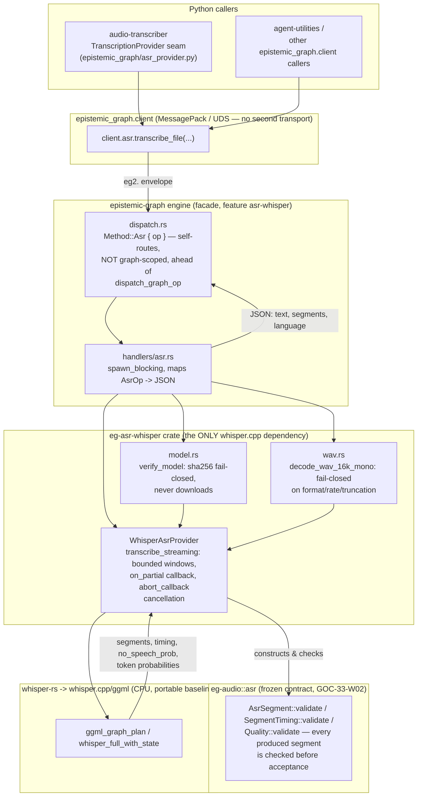

# Native ASR provider (GOC-33)

A native Rust speech-to-text provider, reachable over the engine's own
MessagePack/UDS wire protocol as `Method::Asr { op }`. This closes the first
half of the operator's bi-directional audio goal (audio → text); native
text-to-speech is a sibling lane (GOC-34).

## Scope: what this is, and what it deliberately is not

This lane ships a **direct, non-durable, request/response transcription
call** — the compatibility surface `agent-packages/agents/audio-transcriber`'s
pluggable `TranscriptionProvider` seam reaches to offer a native alternative
to its default Faster-Whisper (Python) backend. It is explicitly **not**:

- the isolated `epistemic-graph-voice-worker` **process** the full GOC-33 lane
  doc describes (`plans/graph-os-completion-program/lanes/GOC-33-native-asr-meetily-runtime.md`,
  work items W03/W06) — that is a separate, larger undertaking (model-pool
  lifecycle, lease/fence/cancellation-generation state, CAS-backed
  `ArtifactBundle`/outbox publication, AU orchestration adapter);
  the isolated worker
- bound to a governed GOC-32 audio stream/`CarrierRef` — a real, policy-
  authorized `asr.result.v1` commit (via `eg_audio::asr::finalize_result`)
  needs both, and neither exists at this simple RPC boundary yet;
- a Parakeet/ONNX provider (see [binding choice](#binding-choice) below).

## Binding choice

Two Rust ASR bindings are proven in `open-source-libraries/meetily`
(`frontend/src-tauri/`): `whisper-rs` over whisper.cpp/ggml, and `ort` (ONNX
Runtime) over a hand-rolled Parakeet decoder. This lane implements
**`whisper-rs`, retained/pinned from crates.io (no vendor fork)** and does
not implement Parakeet:

- `whisper-rs` 0.16's `WhisperSegment`/`WhisperToken` API already exposes
  real provider-derived segment start/end timestamps, `no_speech_probability`,
  and per-token timing/probability — everything the frozen ASR contract
  needs. Meetily's own Parakeet path decodes token timestamps internally but
  its provider trait **discards** them (`ParakeetEngine::transcribe_audio`
  returns only `result.text`); reaching timing parity would mean writing a
  full ONNX decoder/tokenizer pipeline from scratch, not adapting a published
  crate.
- Parakeet's model license (CC-BY-4.0) and custom mirror hosting are exactly
  the kind of acquisition/verification concern GOC-36 (governed model
  acquisition) owns — deferring Parakeet avoids a second, unqualified model
  supply chain in the same change that must prove the CPU-safety build
  contract below.

Full binding-choice justification, licensing/provenance record, and the
CPU-portability build contract live in `crates/eg-asr-whisper/src/lib.rs`'s
module doc (the crate that actually links `whisper-rs`) — this page
summarizes; that module doc is authoritative.

## Architecture

## CPU portability (no x86_64 host in this fleet has AVX2)

Every x86_64 host was individually audited (`/proc/cpuinfo`): the interactive
dev host (Westmere, 2010) and both build hosts (Westmere, 2010, and Sandy
Bridge, 2012) all lack `x86-64-v3`/AVX2 entirely (the fleet's GPU host is a
separate `aarch64` architecture). This is the decisive
reason this lane implements `whisper-rs`/ggml rather than ONNX Runtime: the
sibling native-TTS lane independently hit a dead end because `ort`'s only
x86_64 CPU prebuilt hard-requires AVX2 with no baseline fallback artifact —
no host here can run it natively, and that lane could only prove correctness
under `qemu-x86_64 -cpu max` emulation. ggml does not share that failure
mode: it is compiled from source per target and has genuine non-AVX2 code
paths (the fixed baseline below), so it was verified to **actually run
natively** — see "Hardware verification" below.

`whisper-rs-sys` compiles whisper.cpp/ggml from source via `cmake`, forwarding
any `GGML_*`/`WHISPER_*`/`CMAKE_*` environment variable straight through as a
`-D` define. The repo's `.cargo/config.toml` pins a **fixed, portable
baseline** — `GGML_NATIVE=OFF`, `GGML_AVX=OFF`, `GGML_AVX2=OFF`,
`GGML_FMA=OFF`, `GGML_F16C=OFF`, `GGML_AVX512=OFF`, and (empirically required —
see below) `GGML_BMI2=OFF`.

This was **not** solved by reasoning about flags alone. The first real-fixture
run (`crates/eg-asr-whisper/tests/real_transcription.rs`, GOC-33) SIGILLed
inside `ggml_graph_plan` on a `shlx` (BMI2) instruction *even with every AVX*
flag already off* — `GGML_BMI2`'s CMake default is ON independent of
`GGML_NATIVE`, an upstream detail not documented anywhere obvious. `gdb`'s
backtrace on the actual crash was what surfaced it. ggml's genuine runtime
CPU-dispatch mechanism, `GGML_CPU_ALL_VARIANTS=ON` (the C-side equivalent of
`is_x86_feature_detected!`), was evaluated and rejected for this change: it
hard-requires `GGML_BACKEND_DL=ON`, which turns the CPU backend into a
runtime-`dlopen`ed `.so` selected from a search path — a deploy-image
packaging change outside this lane's scope, and the exact configuration class
the known upstream defect ggml-org/whisper.cpp#2963 was filed against. The
fixed baseline is always safe (never SIGILLs on any x86_64 host in the fleet)
at the cost of leaving AVX2/AVX512 throughput on the table on any FUTURE host
that does have it — an explicit, documented trade-off. See
`.cargo/config.toml`'s own comment for the full record.

## Hardware verification (native, not emulated)

Built and run natively (no `qemu`/emulation) on the Sandy Bridge build host
(`Intel(R) Xeon(R) CPU E5-4620` — `/proc/cpuinfo` confirms
`avx sse4_1 sse4_2` present, `avx2`/`fma`/`f16c`/`bmi2` all absent). A real
`ggml-tiny.en.bin` model (MIT, `huggingface.co/ggerganov/whisper.cpp`,
digest-verified) transcribed a synthesized 16 kHz mono speech fixture
end to end, producing real, recognizable text with real timing/quality, and
a real cancellation-mid-stream `Cancelled` error. This is what actually
surfaced the `GGML_BMI2` requirement above: the first attempt SIGILLed
precisely because it ran on real Sandy Bridge hardware, not a newer or
emulated CPU that would have masked the gap.

## Reachability

- Facade feature `asr-whisper` (off by default, not part of `full`) links the
  `eg-asr-whisper` crate and enables `Method::Asr`.
- `src/server/handlers/asr.rs` self-routes ahead of the per-graph dispatch
  chain (like `Method::Quantum`/`Method::Viz`) — a transcription reads no
  persisted graph state and commits no durable record here.
- `epistemic_graph.client.AsrClient` (`client.asr.transcribe_file(...)`) is
  the Python entry point, wired into both `EpistemicGraphClient` and
  `SyncEpistemicGraphClient`.
- `epistemic_graph/asr_provider.py`'s `build_provider()` registers under the
  `audio_transcriber.asr_providers` entry-point group so `audio-transcriber`
  discovers this provider by entry point (guarded try/except on that side —
  an unreachable engine or missing native dependency never prevents that
  server from starting with Faster-Whisper).

## Honesty guarantees

- **Model verification, never silent download** (GOC-36 owns acquisition):
  `verify_model` reads the caller-declared model path, hashes it, and fails
  closed — distinctly from every other rejection — on an absent file or a
  digest mismatch.
- **Fail closed, never empty-success**: an unsupported sample rate/channel
  layout/bit depth, a truncated `data` chunk, or zero accepted segments (e.g.
  silence) are each a distinct typed `eg_audio::asr::AsrError`, never an
  empty transcript presented as a completed one.
- **Cancellation is real, not cosmetic**: `WhisperAsrProvider::
  transcribe_streaming` checks a shared `CancelFlag` between windows AND wires
  it into whisper.cpp's own `set_abort_callback_safe`, so cancellation can
  interrupt mid-window decode, not only at the next window boundary. A
  cancelled request returns `AsrError::Cancelled`, never a truncated
  "success".
- **Quality is calibrated or explicitly unavailable, never a heuristic
  dressed as a probability**: `avg_logprob` is the mean of `ln(token
  probability)` over a segment's tokens (OpenAI Whisper's own definition,
  not Meetily's discredited text-length heuristic — see
  `crates/eg-audio/src/asr.rs`'s module doc for why that distinction is
  load-bearing here), and `no_speech_prob` comes directly from whisper.cpp's
  `no_speech_probability()`.
- **Word-level timing is provider-derived or absent, never fabricated**: word
  spans are merged from real per-token timestamps using whisper.cpp's own
  space-prefix word-boundary convention; if token timestamps were not
  requested or a token carries no usable timing, no span is invented for it.

## Residual gaps (explicit, not silently deferred)

- No isolated worker process, model pool, lease/fence state, or CAS-backed
  durable `asr.result.v1` publication (W03/W06 in the full lane doc).
- No Parakeet/ONNX provider (W05).
- No WER/RTF/latency/resource qualification evidence (W07).
- `supports_streaming()` on the Python provider honestly answers `False`
  today — it wraps the engine's streaming-capable provider in one batch call;
  a real streaming RPC surface is GOC-35's `VoiceSession` lane to build.
- GPU execution providers (`cuda`/`vulkan`/`metal`/`coreml`/`hipblas` Cargo
  features on `eg-asr-whisper`) are wired but not hardware-qualified in this
  change.
