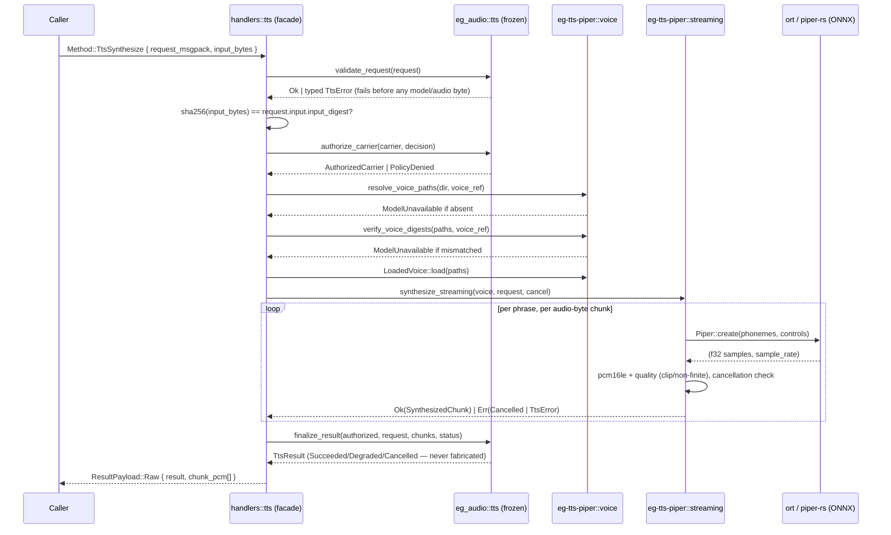

# Native Piper-ONNX Text-to-Speech (GOC-34, `OWNER-VOICE-TTS`)

This page documents the native TTS **provider** wired behind the frozen `tts.*` wire
contract in `crates/eg-audio/src/tts.rs` (that module is validation-only — "no I/O, no
inference" — see its own module doc). The provider itself lives in the new leaf crate
`crates/eg-tts-piper`.

## Integration choice

[`piper-rs`](https://github.com/thewh1teagle/piper-rs) `0.2.0` and its `espeak-rs`
`0.2.0` dependency are pinned, exact-version **crates.io registry dependencies** — not
a `git =` source and not a vendored/forked copy. Both are genuinely published (matching
the revision audited at `open-source-libraries/piper-rs` in this workspace), so a
fork/vendor mirror would only add hand-maintenance for no behavioral gain, and the
workspace's crates.io-only Rust dependency edict forbids a `git =` alternative anyway.
`espeak-rs-sys` vendors and CMake-builds the espeak-ng C sources **inside its own
published crate tarball** — the same "C sources ship in the crate, built by `cc`/
`cmake`, no network fetch at build time" shape already accepted for the `ros2-rmw`
cyclonedds leg.

## Scope guards

- **DEF-017**: this is a Piper-specific ONNX/JSON runtime — the fixed-shape VITS-family
  graph (`input`/`input_lengths`/`scales`[/`sid`] tensors, a `phoneme_id_map`-keyed
  vocabulary). It never claims generic HuggingFace/Transformers/safetensors support.
- **DEF-018**: no speaker diarization, voice-biometric identity extraction, or speaker
  verification exists. `SpeakerSelection` only selects a trained embedding row for
  synthesis OUTPUT.
- **No model acquisition**: GOC-36 owns governed acquisition/digest/licensing/manifests.
  This crate takes a resolved `(model_path, config_path)` pair and independently
  re-verifies both against the request's declared SHA-256 before use — absent or
  mismatched artifacts fail closed, never a silent download.

## What is genuinely new here (beyond wrapping piper-rs's ONNX call)

| Gap in piper-rs (GOC-34 lane audit) | Closed by |
|---|---|
| One whole-phrase `Vec<f32>` buffer, no stream/cancellation contract | `eg-tts-piper::streaming` — a producer thread streams bounded, ordered `TtsChunk`s over a channel; cancellation is checked at every phrase AND audio-chunk boundary |
| Unknown phoneme character silently skipped (`model.rs::phonemes_to_ids`) | `LoadedVoice::validate_phonemes` — independently parses the config's `phoneme_id_map` and fails closed (`MalformedRequest`) on any uncovered character |
| Speaker id never checked against the model's actual speaker count | `LoadedVoice::validate_speaker` — checked against the ACTUAL loaded voice, not just the request's own declared bound |
| No digest/signature verification before load | `voice::verify_voice_digests` — independent SHA-256 re-hash of both files before `piper_rs::Piper::new` is ever called |

## Flow

## Reachability (Wire-First)

| Layer | File |
|---|---|
| Provider crate | `crates/eg-tts-piper/` |
| Frozen contract (unchanged) | `crates/eg-audio/src/tts.rs` |
| Wire method | `crates/eg-types/src/protocol.rs` — `Method::TtsSynthesize`, `#[cfg(feature = "tts-piper")]` |
| Capability policy | `crates/eg-capabilities/src/lib.rs` — `policy()`'s `Method::TtsSynthesize` arm |
| Handler | `src/server/handlers/tts.rs` |
| Dispatch | `src/server/dispatch.rs` — one-line `#[cfg(feature = "tts-piper")]` routing arm |
| Facade feature | root `Cargo.toml` — `tts-piper`, deliberately **excluded** from `full` (mirrors `viz`/`durable`/`quantum`) so the default listener links no ORT/eSpeak-ng |

## Honest gaps (not silently papered over)

- **Authorization** maps "the eg2 transport already authenticated this caller" to
  `PolicyDecision::Authorized`. A real GOC-15/16 consent/classification decision is not
  integrated yet.
- **No durable CAS/rendition publication** (GOC-05/eg-jobs territory). Raw PCM bytes are
  returned inline alongside the typed result rather than published to a durable content
  store.
- **No durable WorkItem/job/lease plane** (GOC-19/20). This is one synchronous
  request/response; cancellation is real INSIDE the streaming synthesis call, but
  nothing external can cancel an in-flight wire call yet.
- **`EPISTEMIC_GRAPH_VOICE_MODEL_DIR`** is an explicit interim seam for voice artifact
  resolution, pending GOC-36's real governed artifact resolver.
