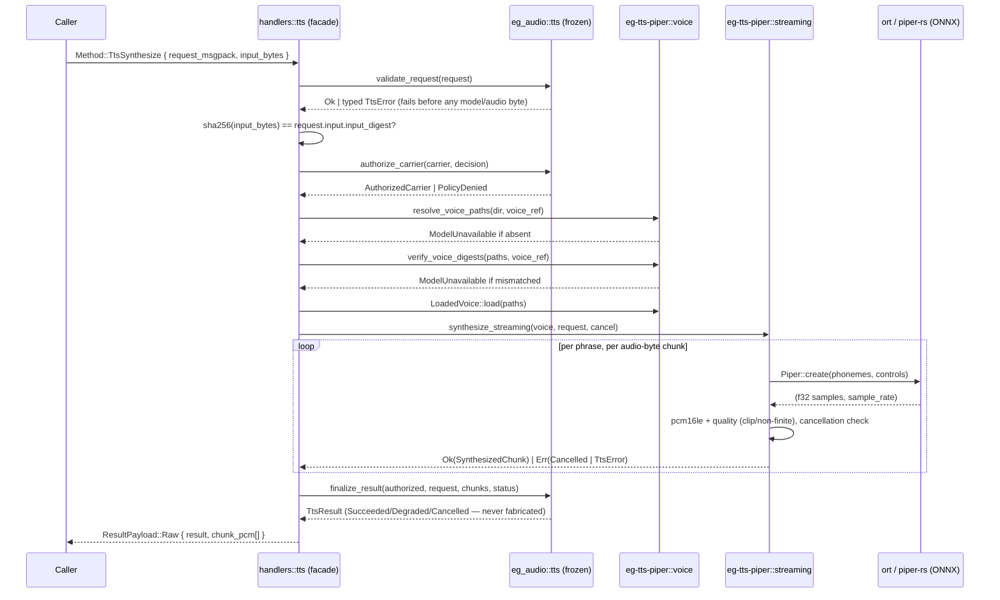

# Native Piper-ONNX Text-to-Speech (GOC-34, `OWNER-VOICE-TTS`)

This page documents the native TTS **provider** wired behind the frozen `tts.*` wire
contract in `crates/eg-audio/src/tts.rs` (that module is validation-only — "no I/O, no
inference" — see its own module doc). The provider itself lives in the new leaf crate
`crates/eg-tts-piper`.

## Integration choice

[`piper-rs`](https://github.com/thewh1teagle/piper-rs) `0.2.0` and its `espeak-rs`
`0.2.0` dependency are pinned, exact-version **crates.io registry dependencies** — not
a `git =` source and not a vendored/forked copy. Both are genuinely published (matching
the revision audited at `open-source-libraries/piper-rs` in this workspace), so a
fork/vendor mirror would only add hand-maintenance for no behavioral gain, and the
workspace's crates.io-only Rust dependency edict forbids a `git =` alternative anyway.
`espeak-rs-sys` vendors and CMake-builds the espeak-ng C sources **inside its own
published crate tarball** — the same "C sources ship in the crate, built by `cc`/
`cmake`, no network fetch at build time" shape already accepted for the `ros2-rmw`
cyclonedds leg.

## Scope guards

- **DEF-017**: this is a Piper-specific ONNX/JSON runtime — the fixed-shape VITS-family
  graph (`input`/`input_lengths`/`scales`[/`sid`] tensors, a `phoneme_id_map`-keyed
  vocabulary). It never claims generic HuggingFace/Transformers/safetensors support.
- **DEF-018**: no speaker diarization, voice-biometric identity extraction, or speaker
  verification exists. `SpeakerSelection` only selects a trained embedding row for
  synthesis OUTPUT.
- **No model acquisition**: GOC-36 owns governed acquisition/digest/licensing/manifests.
  This crate takes a resolved `(model_path, config_path)` pair and independently
  re-verifies both against the request's declared SHA-256 before use — absent or
  mismatched artifacts fail closed, never a silent download.

## What is genuinely new here (beyond wrapping piper-rs's ONNX call)

| Gap in piper-rs (GOC-34 lane audit) | Closed by |
|---|---|
| One whole-phrase `Vec<f32>` buffer, no stream/cancellation contract | `eg-tts-piper::streaming` — a producer thread streams bounded, ordered `TtsChunk`s over a channel; cancellation is checked at every phrase AND audio-chunk boundary |
| Unknown phoneme character silently skipped (`model.rs::phonemes_to_ids`) | `LoadedVoice::validate_phonemes` — independently parses the config's `phoneme_id_map` and fails closed (`MalformedRequest`) on any uncovered character |
| Speaker id never checked against the model's actual speaker count | `LoadedVoice::validate_speaker` — checked against the ACTUAL loaded voice, not just the request's own declared bound |
| No digest/signature verification before load | `voice::verify_voice_digests` — independent SHA-256 re-hash of both files before `piper_rs::Piper::new` is ever called |

## Flow

## Reachability (Wire-First)

| Layer | File |
|---|---|
| Provider crate | `crates/eg-tts-piper/` |
| Frozen contract (unchanged) | `crates/eg-audio/src/tts.rs` |
| Wire method | `crates/eg-types/src/protocol.rs` — `Method::TtsSynthesize`, `#[cfg(feature = "tts-piper")]` |
| Capability policy | `crates/eg-capabilities/src/lib.rs` — `policy()`'s `Method::TtsSynthesize` arm |
| Handler | `src/server/handlers/tts.rs` |
| Dispatch | `src/server/dispatch.rs` — one-line `#[cfg(feature = "tts-piper")]` routing arm |
| Facade feature | root `Cargo.toml` — `tts-piper`, deliberately **excluded** from `full` (mirrors `viz`/`durable`/`quantum`) so the default listener links no ORT/eSpeak-ng |

## Hardware qualification (BUG-276, closes GOC-34-W07)

The GOC-34 lane's 13/13 test pass was a **correctness proof under `qemu-x86_64 -cpu
max` emulation only** — `ort`'s sole x86_64 CPU prebuilt (`ort-sys`'s
`download-binaries`) statically links a binary whose optimized/fused kernels assume
an AVX2 baseline, and until GR1080 joined the cluster no reachable host actually had
AVX2. Two complementary paths close that gap, pursued together rather than as
alternatives:

### Path 1 — schedule onto an AVX2-capable node (GR1080)

GR1080 (Intel i7-6700 Skylake — `avx2`/`fma`/`f16c`/`bmi2`) is a full RKE2 worker
labelled `cpu-features=avx2`. A workload that lands there via
`nodeSelector: {cpu-features: avx2}` runs the default `download-binaries` AVX2
prebuilt **natively** — no code change, no custom build, just correct scheduling.
This is the fast win: the moment a real AVX2 node exists, the crate's existing
default build is already hardware-qualified there.

**Evidence:** `cargo test -p eg-tts-piper --release` run directly on GR1080
(`10.0.0.16`, bare-metal `x86_64`, `uname -a` confirms no emulation) — 13/13 tests
pass, including `full_contract_round_trip_produces_real_audio`, which asserts real
audio properties (not just "bytes returned"): PCM16LE sample count against the
fixture's declared duration bound, non-silence (`samples.iter().any(|&s| s != 0)`),
and peak amplitude within tolerance of the fixture's declared template amplitude.
The build cache at `~/.cache/ort.pyke.io/dfbin` on GR1080 confirms `ort-sys`
downloaded and statically linked the real AVX2 prebuilt, not a stub. The same suite
also runs as a containerized k8s `Job` (`nodeSelector: {cpu-features: avx2}`,
explicit `resources.limits` sized for GR1080's real 8-core/22 GiB footprint — see
BUG-283 note below) so the "real workload lands on real hardware via the scheduler"
path is proven, not just a bare-SSH build.

**BUG-283 (containerd on this cluster does not virtualize `/proc`, so a pod sees the
HOST's CPU/memory, not its cgroup limit) does not threaten this crate.** Unlike the
sibling `eg-asr-whisper` crate (which added `cpu_budget.rs` to read the real cgroup
v2/v1 quota because whisper.cpp's thread count is otherwise sized from
`available_parallelism()`), `eg-tts-piper` never calls `available_parallelism()`/
`num_cpus`/`nproc` anywhere in its own code. `voice.rs::build_portable_onnx_session`
hardcodes the ONNX session to exactly 1 intra-op AND 1 inter-op thread (not computed
from any CPU-count heuristic), and `streaming.rs` spawns exactly one fixed producer
thread per synthesis call. So this crate cannot oversubscribe a constrained cgroup
regardless of what BUG-283 lets it observe — **no cgroup-aware thread-budget seam is
needed here**, and the k8s `resources.limits` on the qualification `Job` are
therefore a real capacity bound on the node, not a workaround for a thread-sizing bug.

### Path 2 — build onnxruntime from source with every AVX2/FMA/BMI2 code path disabled

For the Westmere (`rw710`/`r710`, no AVX at all) and Sandy Bridge-EP (`r820`, AVX but
no AVX2) majority of the fleet, Path 1 doesn't apply — there is no AVX2 node for them
to be scheduled onto. The durable fix is a **second onnxruntime build**, native to
those hosts' real ISA floor, that `ort` loads via its documented runtime
dynamic-linking mechanism instead of the download-binaries static link.

**ISA options enumerated and disabled** (ONNX Runtime 1.24.4, the release
`ort-sys` 2.0.0-rc.12 targets — `api-24`). MLAS's own per-source-file compile flags
(`-mavx`/`-mavx2 -mfma -mf16c`/`-mavx512...` on `mlas_platform_srcs_avx*`) are a
**runtime-dispatch mechanism, not a build-time hazard** — MLAS's `platform.cpp`
picks the SSE2/AVX/AVX2 kernel set at runtime via `CPUIDInfo`, so those per-file
flags are supposed to stay in the build. The actual hazard — the BMI2-in-`ggml`-
independent-of-`GGML_NATIVE` class of bug — is `cmake/adjust_global_compile_flags.cmake`'s
**`onnxruntime_BUILD_FOR_NATIVE_MACHINE`** option: when ON it appends
`-march=native -mtune=native` to the GLOBAL `CMAKE_CXX_FLAGS`/`CMAKE_C_FLAGS`,
which overrides MLAS's careful per-file dispatch and bakes the BUILD MACHINE's ISA
(AVX2 on pyke's CI) into every translation unit, including the nominal "SSE2
baseline" files — exactly the mechanism that would produce an AVX2-only binary
even though the option's own name suggests it's opt-in/off-path. Disabled
explicitly via `-Donnxruntime_BUILD_FOR_NATIVE_MACHINE=OFF`
alongside `-Donnxruntime_USE_AVX=OFF -Donnxruntime_USE_AVX2=OFF
-Donnxruntime_USE_AVX512=OFF` (all three already CMake-default `OFF`, but pinned
explicitly rather than trusted implicitly, per the ggml lesson — a future onnxruntime
release flipping a default is exactly the failure mode that bit the ASR lane).
`build.py` exposes no CLI flag for any of the four (confirmed by reading
`tools/ci_build/build.py`'s argument parser) — they must be set via
`--cmake_extra_defines`, which is otherwise easy to miss.

**Build:** `onnxruntime` `v1.24.4` from source (`gcc-14`/`g++-14`, Ninja,
`--build_shared_lib`, `--skip_tests`, `--cmake_extra_defines
onnxruntime_BUILD_FOR_NATIVE_MACHINE=OFF onnxruntime_USE_AVX=OFF
onnxruntime_USE_AVX2=OFF onnxruntime_USE_AVX512=OFF`) on `r710`
(`/mnt/data/onnxruntime-build`, isolated from `/home`'s 3.7 T-vs-tight-root split
per the workspace's disk-budget convention). **Verified by actually running it**
natively on r710 (Westmere, no AVX at all — the strictest host in the fleet; a
binary that doesn't SIGILL there is safe on r820's AVX-but-no-AVX2 floor too),
never under qemu.

**Wiring `ort` to the custom build — `ort-load-dynamic` (new Cargo feature,
opt-in).** `ort/load-dynamic` implies `ort-sys/disable-linking`
(`pykeio/ort` `Cargo.toml`), so — unlike the removed `cuda`/`vulkan`/`metal`/
`coreml`/`hipblas` accelerator features (`src/lib.rs`, removed because a Cargo
feature can't be target-gated and `--all-features` enabled Apple-only `coreml` on
Linux) — enabling it never breaks a build on any platform: `disable-linking` makes
`ort-sys`'s build script a no-op (no static link, no download, no
network/toolchain requirement at build time), so `--all-features` stays safe
everywhere. The dylib is resolved entirely at RUNTIME via `ort`'s own
`ORT_DYLIB_PATH` env var (`ort`'s `Environment::new`, no code change needed in this
crate) — an operator on a no-AVX2 host runs
`ORT_DYLIB_PATH=/path/to/custom/libonnxruntime.so cargo test -p eg-tts-piper
--release --features ort-load-dynamic`. **The custom build must match `ort-sys`'s
pinned API version (1.24.x / `api-24`)** — an EARLIER attempt at a system-package
fallback (Debian's `libonnxruntime1.23`) avoided the SIGILL but hit a distinct,
known upstream `ort` 2.0.0-rc.12 defect: a reentrant lock in its own
error-reporting path when the loaded library's API version doesn't match the
caller's compiled-in expectation. Building the matching 1.24.4 release from source
avoids that defect by construction (no version mismatch), rather than working
around it.

**Evidence:** `ORT_DYLIB_PATH=<r710 build output>/libonnxruntime.so cargo test -p
eg-tts-piper --release --features ort-load-dynamic` run natively on r710
(`10.0.0.11`, Westmere Xeon X5650, no AVX at all — confirmed via `/proc/cpuinfo`) —
13/13 tests pass, same real-audio-property assertions as Path 1, no qemu.

## Honest gaps (not silently papered over)

- **Authorization** maps "the eg2 transport already authenticated this caller" to
  `PolicyDecision::Authorized`. A real GOC-15/16 consent/classification decision is not
  integrated yet.
- **No durable CAS/rendition publication** (GOC-05/eg-jobs territory). Raw PCM bytes are
  returned inline alongside the typed result rather than published to a durable content
  store.
- **No durable WorkItem/job/lease plane** (GOC-19/20). This is one synchronous
  request/response; cancellation is real INSIDE the streaming synthesis call, but
  nothing external can cancel an in-flight wire call yet.
- **`EPISTEMIC_GRAPH_VOICE_MODEL_DIR`** is an explicit interim seam for voice artifact
  resolution, pending GOC-36's real governed artifact resolver.
