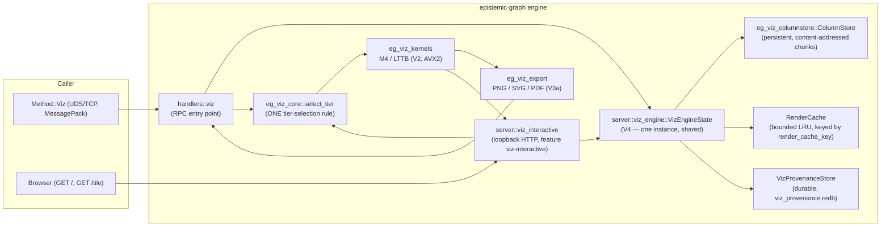
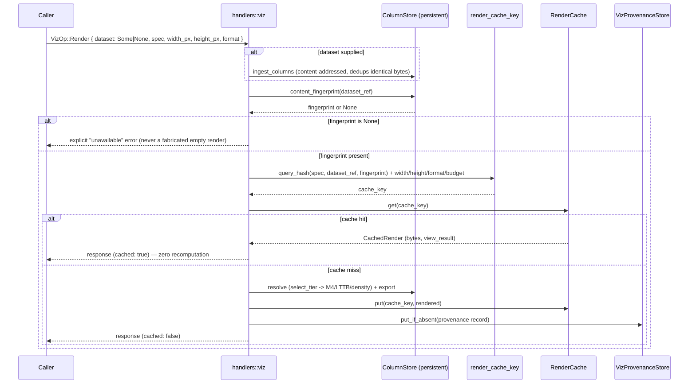

# Native Visualization (D-VZ-1)

Neither `agent-utilities` nor `epistemic-graph` ships a visualization library, and
`matplotlib` does not scale — it draws every point regardless of how many pixels
exist on screen. This engine ships its own **LOD-native** visualization stack
instead: a declarative chart IR, a columnar store, decimation/density kernels, a
static export backend, an interactive rendering surface, and a content-addressed
render cache — architecturally inspired by `open-source-libraries/xy`
(Apache-2.0), reimplemented in-tree rather than depended on (that project is
alpha and Python-first; a dependency there would put this engine's visualization
surface behind someone else's API churn).

## Lane map

| Lane | Crate / module | What it is | Status |
|---|---|---|---|
| **V0** | `eg-viz-core` | `ViewSpec` chart IR, `ViewResult` exact-vs-reduced metadata, the mark×surface capability matrix, `select_tier` | Shipped |
| **V1** | `eg-viz-columnstore` | Canonical columns, zone maps, content-addressed chunks, dictionary categoricals | Shipped |
| **V2** | `eg-viz-kernels` | M4 + LTTB decimation, runtime-detected AVX2 | **Shipped this change** |
| **V3a** | `eg-viz-export` | Static PNG/SVG/PDF export | Shipped (now wired to V2's M4) |
| **V3b** | `server::viz_interactive` | Interactive WebGPU/WebGL2 client + binary tile protocol | **Shipped this change** |
| **V4** | `server::viz_engine` / `server::viz_provenance` | Persistent engine state: content-addressed render cache + durable provenance | **Shipped this change** |
| **V6** | `eg-viz-export::graph_layout` + `resolve_graph` | Graph-native marks (force-directed layout) | Shipped (static export only) |
| **V7/V8** | — | Temporal repository visualization; agent-webui adoption | Not started |

## Architecture

## The LOD ladder

`eg_viz_core::select_tier` is the **one** place tier selection happens — every
caller (static export, the interactive tile endpoint) hands it a row count, a
mark kind, its encodings, and a `FrameBudget` (primitives + bytes, never a raw
row count), and gets back a tier. No caller re-derives its own budget.

| Tier | Behavior | Kernel |
|---|---|---|
| 0 Direct | every real row/point | — |
| 1 Decimate | shape-preserving per-pixel-column reduction | **M4** (static export, Line/Area) or **LTTB** (interactive tiles, any mark) |
| 2 Density | screen-bounded count/mean grid | `density_grid` |
| 3 Tiled | out-of-core viewport streaming | not yet implemented (typed error) |

### V2 — M4 and LTTB

Both live in `crates/eg-viz-kernels`, operate on plain `&[f64]` slices (no
ColumnStore dependency), and are property-tested (`proptest`) for: output size
bounds, y-range containment, x-sortedness, NaN/Infinity exclusion, and
scalar/SIMD equivalence — see that crate's `tests/proptest_invariants.rs`.

- **M4** (`m4_reduce`) — four points per pixel column (first/min/max/last),
  `O(n)` single pass, bucketed by x-VALUE so unsorted input needs no sort. The
  default Decimate-tier kernel for `Line`/`Area` in the static-export path
  (`eg-viz-export::reduce::decimate_m4`), superseding the plain min-max stand-in
  V3a shipped before V2 landed.
- **LTTB** (`lttb_reduce`) — Largest Triangle Three Buckets, selecting REAL
  data points (never a synthetic aggregate). Used by the interactive tile
  protocol (V3b), where a client hovering/picking a point must see a genuine
  row, not a synthesized extremum.
- **SIMD.** A cached `is_x86_feature_detected!("avx2")` check (never a
  compile-time `target-feature` assumption — this fleet's interactive dev host lacks
  `x86-64-v3` and would SIGILL on a build that assumed AVX2) gates a
  vectorized fast path for the genuinely regular, independent arithmetic each
  kernel needs (M4's bucket-index/finite-mask precompute; LTTB's
  per-candidate triangle-area evaluation) — never the inherently scalar
  scatter-reduce/serial-selection around it. Both paths are proved equivalent
  by proptest.

Measured (criterion, `cargo bench -p eg-viz-kernels`), both kernels hold
`O(n)` — throughput stays in the same order of magnitude across four orders
of magnitude of row count:

| Rows | M4 | LTTB |
|---|---|---|
| 1e4 | 250 µs (40 Melem/s) | 182 µs (55 Melem/s) |
| 1e6 | 17.3 ms (58 Melem/s) | 16.3 ms (61 Melem/s) |
| 1e8 | 1.56 s (64 Melem/s) | 2.44 s (41 Melem/s) |

## V4 — engine integration: persistent state, render cache, provenance

Before this change, `handlers::viz` built a **fresh** `ColumnStore` per
request and discarded it after responding — no reuse, no cache, no
provenance. `server::viz_engine::VizEngineState` (lazily created on first use,
shared between the RPC and interactive-HTTP paths) now holds:

1. **A persistent `ColumnStore`.** `VizRenderRequest::dataset` is `Option` — a
   caller who already ingested a `dataset_ref` may omit it on a later request
   (a different spec/canvas/format over the same data, or a pan/zoom
   follow-up) without resending it over the wire.
2. **A content-addressed render cache.**
3. **Durable render provenance**, queryable via `VizOp::RenderProvenance`.

### The cache key, and the mistake it avoids

This program's own `D-OP-1` regression is the cautionary example: an RLS
projection cache keyed on `GraphCore::version()` is *correct* there (a
correctness control that must invalidate on any write to the graph it
protects), but that same shape would be a **performance-cache mistake** —
keying a render cache on a whole-graph or whole-engine version means any
write anywhere invalidates every cached render, driving the hit rate toward
zero under real write traffic.

Instead, `eg_viz_columnstore::ColumnStore::content_fingerprint(dataset_ref)`
hashes the dataset's chunk `content_id`s — already computed at ingest,
content-addressed, no rescan. Writing an **unrelated** dataset never touches
this fingerprint; re-ingesting **byte-identical** data still fingerprints
identically (a real cache hit a monotonic counter could never give).

`render_cache_key` (`server::viz_engine`) folds `width_px`/`height_px`/
`format`/`budget` into `query_hash` — those are NOT covered by `query_hash`
itself (a caller can request the same spec+dataset at a different canvas size
and legitimately get different pixel-space geometry back).

### Provenance

`server::viz_provenance::VizProvenanceStore` mirrors
`persistence::tenant_catalog::TenantCatalog`'s shape (an in-memory
authoritative view, optionally backed by its own small `viz_provenance.redb`
file — durability strictly opt-in). A render is **not** routed through the
full `eg-jobs` `AnalyticsJob`/`JobStore` machinery: that plane is built for
graph-scoped, worker-claimed, asynchronously-executed jobs, a real mismatch
for a synchronous, non-graph-scoped render. Instead, each record is keyed by
`provenance_result_ref` — a namespaced reuse of the SAME content-addressed
`render_cache_key`, so cache entries and provenance records for one render
always agree on "which render this is." Recording is `put_if_absent`: a
render's provenance is written once; a later cache hit needs no new entry.

## V3b — interactive rendering

A browser cannot speak this engine's primary transport (length-prefixed
MessagePack over UDS/TCP, `eg2.`-enveloped). V3b is its own small,
**loopback-only, dependency-free HTTP/1.1 listener**
(`EPISTEMIC_GRAPH_VIZ_INTERACTIVE_ADDR`, feature `viz-interactive`) — the same
hand-rolled idiom `--metrics-addr`/`--obs-addr`/the Iceberg-REST listener
already use (no axum/hyper/websocket dependency).

- **`GET /`** — a self-contained reference client. Feature-detects
  `navigator.gpu` (WebGPU); on failure, falls back to a WebGL2 context; if
  **neither** is available, shows a visible "cannot accelerate this view"
  message and stops — never a silently blank canvas.
- **`GET /tile?dataset_ref=&x=&y=&x0=&x1=&width_px=`** — one viewport's worth
  of real geometry, in a small binary format (48-byte header + interleaved
  `f32` `(x,y)` pairs) decoded straight into a GPU vertex buffer, no JSON
  parsing. LOD tier selection reuses `select_tier` — the SAME rule the static
  path uses — with a `FrameBudget` derived from `width_px`, so Direct wins
  exactly when the viewport's row count already fits one point per pixel
  column and Decimate (LTTB, `threshold = width_px`) applies otherwise.
- **Pan/zoom** updates GPU uniforms immediately (the already-fetched vertex
  buffer is reused for instant visual feedback) and schedules a **debounced**
  re-fetch of `/tile` for the new viewport — never a full-series re-download.
- **No usable data** (unknown `dataset_ref`, or a viewport disjoint from the
  data) returns a distinct `Unavailable` status in the SAME binary format; the
  reference client shows a visible "no data" state, never an empty chart that
  reads as real.

### Why a plain `GET`, not a WebSocket

A per-request `GET /tile` (not a persistent WebSocket) is the standard shape
every tile server — including `xy`'s own tile-pyramid design — already uses:
the browser's `fetch()` cache/coalescing/cancellation semantics apply for
free, no new framing to hand-roll, and pan/zoom naturally becomes "issue a new
GET for the new viewport." A WebSocket would need this crate to hand-roll RFC
6455 framing (or add `tokio-tungstenite`, already a dependency elsewhere in
this workspace via `ros2-bridge`, but not one this lane needs) for a benefit
(lower per-request overhead) that does not matter at human interaction rates.

### Deliberately different reduction choice than static export

`eg-viz-export::render::resolve` uses M4 for `Line`/`Area` and refuses
Decimate for `Scatter` entirely (`mark_supports_tier`: "unordered decimation
lies," routing Scatter to a Density surface instead). The interactive tile
endpoint uses **LTTB unconditionally for every mark it serves, including
Scatter** — and that is honest specifically because LTTB never aggregates:
every returned point is a real row, so "here are some of the real points,
zoom in for more" carries no synthetic-aggregate lie the way a min/max marker
would.

## Honest gaps

- **Density/Tiled-tier interactive tiles.** V3b's `/tile` endpoint only
  reaches Direct/Decimate (by construction, for `MarkKind::Line`'s tier
  ladder). A still-too-large-after-LTTB series, or a Scatter/Graph mark that
  needs a mean-color/heatmap tile surface, is a documented gap for a later
  lane — not silently truncated (a request exceeding `MAX_TILE_ROWS` is a
  clear typed error, never a silent partial result).
- **Client-side tile pyramid caching.** V3b re-fetches per debounced viewport
  change; it does not (yet) maintain `xy`'s `(level, tx, ty)` tile-pyramid
  cache client-side. The V4 server-side render cache still avoids
  recomputation for a REPEATED identical viewport request.
- **Non-linear scales in the interactive path.** Like V3a, only linear
  domain mapping is implemented; log/time/category axis transforms remain a
  documented gap.
- **Per-column (not whole-dataset) cache-key scoping.** `content_fingerprint`
  hashes an entire dataset's columns, not only the columns a given `ViewSpec`
  actually reads — a write to an unrelated column in the SAME dataset still
  invalidates the cache for a spec that never read it. Correctly scoped to
  the DATASET (never a whole-graph/engine version), just not maximally tight
  within a wide multi-column dataset.

## Source map

| Path | What |
|---|---|
| `crates/eg-viz-core/` | V0 — IR, tier rules, trait boundaries |
| `crates/eg-viz-columnstore/` | V1 — ColumnStore, `content_fingerprint` |
| `crates/eg-viz-kernels/` | V2 — M4, LTTB, SIMD |
| `crates/eg-viz-export/` | V3a — static PNG/SVG/PDF |
| `src/server/handlers/viz.rs` | RPC entry point (`Method::Viz`) |
| `src/server/viz_engine.rs` | V4 — persistent state, render cache |
| `src/server/viz_provenance.rs` | V4 — durable provenance |
| `src/server/viz_interactive.rs` | V3b — HTTP listener, tile protocol |
| `src/server/viz_interactive_client.html` | V3b — reference WebGPU/WebGL2 client |
