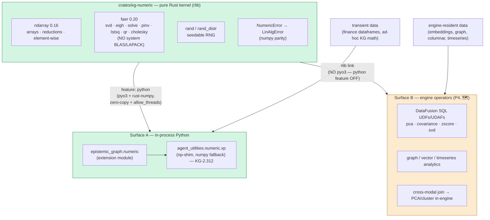

# Numeric kernel — one kernel, two surfaces (CONCEPT:EG-321)

> **P1 of the Analytics Program** (`plans/epistemic-graph-analytics-program.md`,
> design `reports/epistemic-graph-numeric-kernel-handoff.md`). A slim, **BLAS/LAPACK-free**
> Rust numeric kernel that serves **both** Python-side array math (replacing numpy in
> agent-utilities) **and** — in later phases — in-database analytics over engine-resident
> data. This doc covers the shipped P1 kernel; P2–P5 are on the [roadmap](../roadmap.md).

## Thesis

epistemic-graph already does **compute-near-data** for vectors
(`batch_cosine_similarity`, `semantic_search` run server-side in Rust, zero numpy).
The Analytics Program generalizes that proven pattern into **one numeric kernel**
(`crates/eg-numeric`) exposed on **two surfaces**.

**Decision rule (which surface):** data **already in the engine** → Surface B
(compute-near-data, no FFI). Data **transient in Python** (API dataframes, in-memory
arrays) → Surface A (in-process). Never round-trip transient data into the DB just to
compute (anti-pattern).

## Crate layout & feature gating

`crates/eg-numeric` is a workspace member with `crate-type = ["cdylib", "rlib"]`:

- **`rlib`** — the pure kernel (`reductions`, `elementwise`, `linalg`, `random`,
  `error`). No pyo3. This is what the engine links for Surface B.
- **`cdylib`** — the Surface-A Python extension, built only with `--features python`
  (pulls `pyo3` + `numpy`/`rust-numpy`).

Feature discipline (the Pi contract):

| build | pulls eg-numeric? | faer/ndarray? | pyo3? |
|-------|:---:|:---:|:---:|
| `--features pi` / `pi-max` / `node` / default | ❌ | ❌ | ❌ |
| `--features full` (→ `numeric`) | ✅ (rlib) | ✅ | ❌ |
| `maturin ... -m crates/eg-numeric/Cargo.toml --features python` | ✅ (cdylib) | ✅ | ✅ |

- The top-level `numeric` cargo feature (`numeric = ["dep:eg-numeric"]`) is in `full`
  only — **out of `pi`/`pi-max`/`node`** and the size-optimized `release-tiny` profile,
  so faer/ndarray never bloat the lean Raspberry-Pi tier. Verified:
  `cargo tree --no-default-features --features pi` links **no** eg-numeric/faer/ndarray.
- pyo3 is behind eg-numeric's **own** `python` feature (off in every engine build), so a
  `numeric` engine build links the kernel rlib but **no Python extension** — the Plan-01
  "no Python extension in the engine binary" contract holds (`scripts/check_no_pyo3.sh`
  stays green; the main wheel remains `bindings = "bin"`).

## Op-surface (P1)

Curated from the real audit (`grep np\.` over `agent_utilities/`) — **not** "all of numpy":

- **Reductions / stats:** `sum · prod · mean · var(ddof) · std(ddof) · min · max ·
  argmin · argmax · argsort · cumsum · cumprod · percentile · quantile`.
- **Element-wise:** `sqrt · log · exp · abs · tanh · clip · maximum · minimum · where ·
  nan_to_num · isnan`.
- **Linalg (faer):** `norm(+ord) · dot · matmul · solve · svd · svdvals · eigh · pinv ·
  lstsq · qr · cholesky · det · inv · matrix_power`, plus a `LinAlgError` exception that
  mirrors `numpy.linalg.LinAlgError` (raised on singular / non-PD).
- **Random:** `normal · uniform · integers` (seedable ChaCha20; deterministic, and
  distribution-parity — bit-for-bit parity with numpy's PCG64 is a non-goal).

## Parity

Every op is asserted `np.allclose` vs numpy on randomized inputs, with mandatory edge
cases (nan/inf, singular matrices, empty arrays). P1 landed **847 parity checks, 0
failures**. The corpus lives in agent-utilities (`tests/test_numeric_parity.py`, KG-2.312)
and runs against the compiled kernel when present, else the numpy fallback.

## Surfaces in later phases

- **Surface A migration (P2–P3):** mechanical `import numpy as np` →
  `from agent_utilities.numeric import xp as np` across the 32 light-op files then the 6
  linalg files.
- **Surface B (P4):** the SAME rlib exposed as DataFusion UDFs/UDAFs + graph/vector/
  timeseries operators, re-homing KG-resident numerics (spectral_navigator, world_model)
  to compute-near-data; cross-modal joins then PCA/cluster in-engine.
- **P5:** drop numpy/scipy from agent-utilities; the `eg-numeric` wheel is the dep. The
  `xp` shim stays so future backend swaps remain mechanical.
