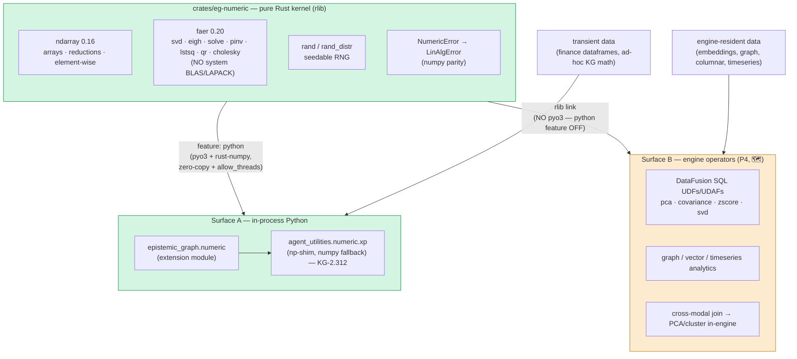
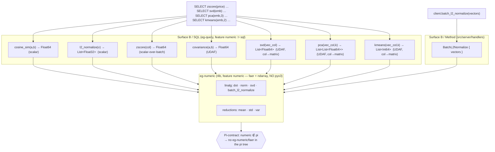
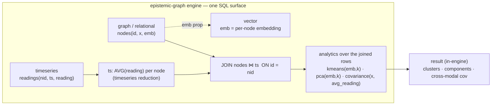

# Numeric kernel — one kernel, two surfaces (CONCEPT:EG-321)

> **P1 of the Analytics Program** (`plans/epistemic-graph-analytics-program.md`,
> design `reports/epistemic-graph-numeric-kernel-handoff.md`). A slim, **BLAS/LAPACK-free**
> Rust numeric kernel that serves **both** Python-side array math (replacing numpy in
> agent-utilities) **and** — in later phases — in-database analytics over engine-resident
> data. This doc covers the shipped P1 kernel; P2–P5 are on the [roadmap](../roadmap.md).

## Thesis

epistemic-graph already does **compute-near-data** for vectors
(`batch_cosine_similarity`, `semantic_search` run server-side in Rust, zero numpy).
The Analytics Program generalizes that proven pattern into **one numeric kernel**
(`crates/eg-numeric`) exposed on **two surfaces**.



**Decision rule (which surface):** data **already in the engine** → Surface B
(compute-near-data, no FFI). Data **transient in Python** (API dataframes, in-memory
arrays) → Surface A (in-process). Never round-trip transient data into the DB just to
compute (anti-pattern).

## Crate layout & feature gating

`crates/eg-numeric` is a workspace member with `crate-type = ["cdylib", "rlib"]`:

- **`rlib`** — the pure kernel (`reductions`, `elementwise`, `linalg`, `random`,
  `error`). No pyo3. This is what the engine links for Surface B.
- **`cdylib`** — the Surface-A Python extension, built only with `--features python`
  (pulls `pyo3` + `numpy`/`rust-numpy`).

Feature discipline (the Pi contract):

| build | pulls eg-numeric? | faer/ndarray? | pyo3? |
|-------|:---:|:---:|:---:|
| `--features pi` / `pi-max` / `node` / default | ❌ | ❌ | ❌ |
| `--features full` (→ `numeric`) | ✅ (rlib) | ✅ | ❌ |
| `maturin ... -m crates/eg-numeric/Cargo.toml --features python` | ✅ (cdylib) | ✅ | ✅ |

- The top-level `numeric` cargo feature (`numeric = ["dep:eg-numeric"]`) is in `full`
  only — **out of `pi`/`pi-max`/`node`** and the size-optimized `release-tiny` profile,
  so faer/ndarray never bloat the lean Raspberry-Pi tier. Verified:
  `cargo tree --no-default-features --features pi` links **no** eg-numeric/faer/ndarray.
- pyo3 is behind eg-numeric's **own** `python` feature (off in every engine build), so a
  `numeric` engine build links the kernel rlib but **no Python extension** — the Plan-01
  "no Python extension in the engine binary" contract holds (`scripts/check_no_pyo3.sh`
  stays green; the main wheel remains `bindings = "bin"`).

## Op-surface (P1)

Curated from the real audit (`grep np\.` over `agent_utilities/`) — **not** "all of numpy":

- **Reductions / stats:** `sum · prod · mean · var(ddof) · std(ddof) · min · max ·
  argmin · argmax · argsort · cumsum · cumprod · percentile · quantile`.
- **Element-wise:** `sqrt · log · exp · abs · tanh · clip · maximum · minimum · where ·
  nan_to_num · isnan`.
- **Linalg (faer):** `norm(+ord) · dot · matmul · solve · svd · svdvals · eigh · pinv ·
  lstsq · qr · cholesky · det · inv · matrix_power`, plus a `LinAlgError` exception that
  mirrors `numpy.linalg.LinAlgError` (raised on singular / non-PD).
- **Random:** `normal · uniform · integers` (seedable ChaCha20; deterministic, and
  distribution-parity — bit-for-bit parity with numpy's PCG64 is a non-goal).

## Parity

Every op is asserted `np.allclose` vs numpy on randomized inputs, with mandatory edge
cases (nan/inf, singular matrices, empty arrays). P1 landed **847 parity checks, 0
failures**. The corpus lives in agent-utilities (`tests/test_numeric_parity.py`, KG-2.312)
and runs against the compiled kernel when present, else the numpy fallback.

## Surfaces in later phases

- **Surface A migration (P2–P3):** mechanical `import numpy as np` →
  `from agent_utilities.numeric import xp as np` across the 32 light-op files then the 6
  linalg files.
- **Surface B (P4):** the SAME rlib exposed as DataFusion UDFs/UDAFs + graph/vector/
  timeseries operators, re-homing KG-resident numerics (spectral_navigator, world_model)
  to compute-near-data; cross-modal joins then PCA/cluster in-engine. **First increment
  shipped — see below.**
- **P5:** drop numpy/scipy from agent-utilities; the `eg-numeric` wheel is the dep. The
  `xp` shim stays so future backend swaps remain mechanical.

## Surface B — in-database analytics operators (P4, CONCEPT:EG-329/EG-330/EG-335/EG-336/EG-344/EG-345)

The pure kernel rlib is wired into the engine's query surface so analytics run **where the
data lives** — no fetch-to-Python, no FFI. Two reach paths:



**SQL operators** (registered on the graph-exec AND obs-tables `SessionContext`, gated
`#[cfg(feature = "numeric")]` in `crates/eg-query/src/sql/exec.rs::register_numeric`,
implemented in `crates/eg-query/src/sql/numeric.rs`):

| Operator | Kind | Kernel | Semantics |
|----------|------|--------|-----------|
| `cosine_sim(a, b)` | scalar → `Float64` | `linalg::dot`/`norm` | `a·b/(‖a‖‖b‖)`; the raw-similarity complement to EG-115 `vector_cosine` (distance). Accepts a stored `List<Float{32,64}>` column or a `'[1,2,3]'` text literal; NULL on a dimension mismatch. |
| `l2_normalize(v)` | scalar → `List<Float32>` | `linalg::norm` | unit vector `v/‖v‖` (pgvector type — feeds `cosine_sim`/ANN in-query); zero-norm returned unchanged. |
| `zscore(col)` | scalar-over-batch → `Float64` | `reductions::mean`/`std` | standardize `(x-mean)/std` (population `ddof=0`) over the materialized batch. Exact for the engine's single-partition MemTable/`NodesTableProvider` (one batch/table); a global two-pass is the `(x-avg(x) OVER())/stddev(x) OVER()` window form. |
| `covariance(a, b)` | UDAF → `Float64` | `reductions::mean` | sample covariance `Σ(aᵢ-ā)(bᵢ-b̄)/(n-1)`; buffers aligned non-null pairs, merge state = two `List<Float64>` columns. |
| `svd(vec_col)` (EG-336) | UDAF → `List<Float64>` | `linalg::svdvals` | **column→matrix**: stacks the aggregated vector column into an `n×d` matrix (each row = one matrix row; same operand forms as `cosine_sim` — a `List<Float{32,64}>` column or `'[..]'` text) and returns its singular values (descending). |
| `pca(vec_col, k)` (EG-335) | UDAF → `List<List<Float64>>` | `reductions::mean` + `linalg::eigh` | **column→matrix**: mean-centers the `n×d` matrix, eigendecomposes the `d×d` sample covariance (`ddof=1`), and returns the top-`k` principal-component DIRECTIONS as `k` unit vectors of length `d`, **descending by explained variance** (sign arbitrary; `k` clamped to `d`; projected coords = `X_centered·componentsᵀ` downstream). |
| `kmeans(vec_col, k)` (EG-344) | UDAF → `List<Int64>` | `cluster::kmeans_labels` | **column→matrix**: stacks the aggregated vector column into an `n×d` matrix and returns **one hard cluster label (`0..k`) per row, in ingestion order**. Pure-Rust Lloyd + k-means++ (`eg-numeric`'s ChaCha20 RNG, seeded → deterministic; **no linfa/BLAS**); `k` clamped to `n`, empty clusters re-seeded to the farthest point. |

**Column→matrix marshalling** (the deferred-in-P4 bridge, `svd`/`pca`/`kmeans`): all three
are UDAFs whose `Accumulator` (`MatrixAcc`) decodes each ingested row via `row_to_vector` (the
same operand forms `cosine_sim` accepts) and buffers it row-major into a flat `Vec<f64>` +
fixed `dim` (ragged rows skipped, NULL-safe); `evaluate()` reshapes to a dense
`ndarray::Array2` and runs the kernel (faer for `svd`/`pca`, the `cluster` k-means for
`kmeans`). Partial-aggregate state is the flat buffer as a `List<Float64>` plus `dim` (and `k`
for `pca`/`kmeans`, via `MatrixOp::takes_k`) as `Int64`, so multi-phase grouping merges
losslessly. The `List<Float64>` / `List<List<Float64>>` / `List<Int64>` results render as
structural JSON arrays via `cell_to_json` (alongside the pgvector `List<Float32>` path).

Example — standardize a price column, rank rows by similarity, and reduce embeddings, all in-engine:

```sql
SELECT id, zscore(price) AS z FROM nodes ORDER BY z DESC;
SELECT a.id, cosine_sim(a.emb, b.emb) AS sim FROM nodes a JOIN nodes b ON a.id <> b.id;
SELECT svd(emb) AS singular_values FROM nodes;        -- singular values of the emb matrix
SELECT pca(emb, 3) AS top3_components FROM nodes;     -- top-3 principal-component directions
SELECT kmeans(emb, 4) AS cluster_labels FROM nodes;  -- 4-way clustering, one label per row
```

**Batch Method** — `Method::BatchL2Normalize { vectors }` (`src/server/handlers/graph_ops.rs`,
handler `#[cfg(feature = "numeric")]`) L2-normalizes a batch in-engine via
`eg_numeric::linalg::batch_l2_normalize`; the kernel-backed successor to the deprecated
`BatchCosineSimilarity` on the same client path (`client.batch_l2_normalize()`).

**Feature wiring & Pi-contract.** eg-query gains a `numeric` feature (`["sql", "dep:eg-numeric",
"dep:ndarray"]`); the engine's top-level `numeric = ["dep:eg-numeric", "eg-query?/numeric"]`
turns the SQL operators on whenever the query surface is also built (i.e. `full`). `numeric`
stays OUT of `pi`/`node`/`pi-max`/`release-tiny`, and eg-numeric's pyo3 (`python`) feature is
off in every engine build, so a `numeric` engine links faer/ndarray but **no Python extension**.
Verified: `cargo tree --no-default-features --features pi` links **no** eg-numeric/faer/ndarray.

**Shipped this increment:** `kmeans(vec_col, k)` (EG-344) — the clustering column→matrix UDAF,
backed by a new pure-Rust `eg-numeric::cluster` k-means kernel (Lloyd + k-means++, NO linfa) —
and **cross-modal join→analytics** (EG-345, below). Prior increment: `svd`/`pca` (EG-336/335).
**Still deferred (later P4):** graph-algo/timeseries unification under the one kernel (native
`Method` surfaces beyond SQL).

---

## The differentiator — cross-modal join → PCA/cluster in-engine (CONCEPT:EG-345)

This is the capability that lets epistemic-graph **surpass numpy**: **join graph + vector +
timeseries, then run PCA / k-means / covariance over the JOINED result set IN-ENGINE.** numpy
has *no data layer* — to do this it must first fetch each modality into a separate array and
align them by hand in Python. Here the join and the analytics are **one SQL statement over
resident data**, computed where the data lives (compute-near-data, no FFI, no round-trip).



**One query, three modalities** (from `crates/eg-query/tests/cross_modal_analytics.rs`, the
proof test — synthetic data with hand-computed answers):

```sql
WITH readings(nid, ts, reading) AS (VALUES         -- ── timeseries modality ──
    ('n1',1,1.0),('n1',2,3.0), ('n2',1,3.0),('n2',2,5.0), ('n3',1,5.0),('n3',2,7.0),
    ('n4',1,7.0),('n4',2,9.0), ('n5',1,9.0),('n5',2,11.0),('n6',1,11.0),('n6',2,13.0)),
     ts AS (SELECT nid, avg(reading) AS avg_reading FROM readings GROUP BY nid)
SELECT kmeans(json_get(n.props, 'emb'), 2)                        AS clusters,   -- vector
       covariance(json_get_f64(n.props, 'x'), t.avg_reading)      AS xcov        -- graph×ts
FROM nodes n JOIN ts t ON n.id = t.nid;                           -- ── graph ⋈ timeseries ──
```

The six nodes form two communities (embeddings near `[10,10]` / `[-10,-10]`, all on the line
`y = x`); each `avg_reading = 2·x` by construction. The in-engine result:

| column | value | why |
|--------|-------|-----|
| `clusters` | `[0,0,0,1,1,1]` (2 balanced clusters of 3) | k-means over the joined `emb` vectors recovers the two communities |
| `xcov` | `7.0` | `cov(x, 2·x) = 2·var_sample(1..6) = 2·3.5` — a statistic spanning the **graph** scalar `x` and the **timeseries** aggregate `avg_reading`, aligned by the join |
| `pca(emb,1)` | `±[1/√2, 1/√2]` | all variance lies on the `y=x` diagonal, so PC1 is the diagonal direction |

`json_get(props,'emb')` recovers each node's embedding (a JSON-array prop) as the pgvector
text `row_to_vector` decodes — so the **vector modality is a resident graph property**, the
**graph modality** is the `nodes` table, and the **timeseries modality** is the per-node
`AVG(reading)` aggregate; the `JOIN` fuses them and the kernel UDAFs analyze the joined rows.
The cross-modal `covariance(x, avg_reading)` is the sharpest "impossible in numpy" moment: two
different modalities correlated in a single expression over the joined result set.
