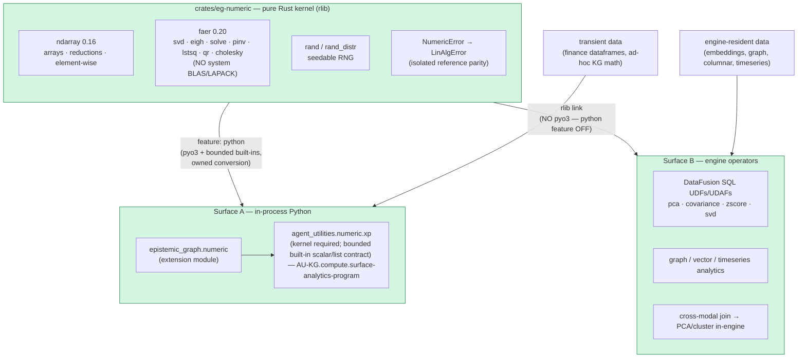
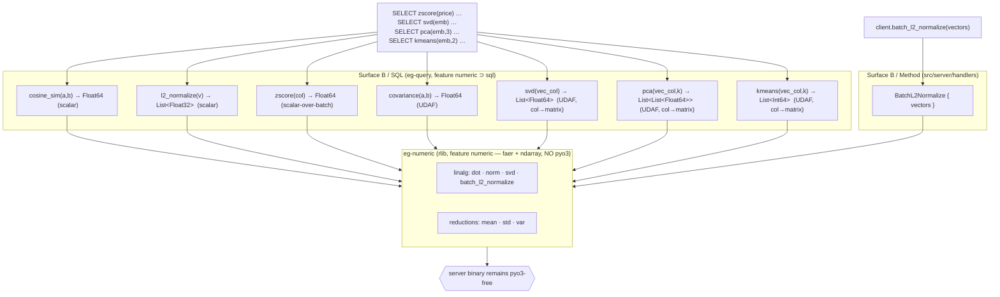
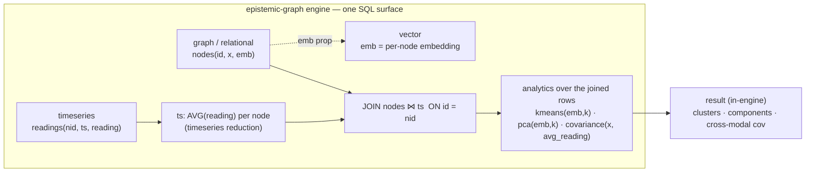

# Numeric kernel — one kernel, two surfaces (CONCEPT:AU-KG.compute.numeric-kernel)

> **Kernel foundation of the Analytics Program.** A slim, **BLAS/LAPACK-free**
> Rust numeric kernel that serves **both** Python-side array math without a Python
> numeric runtime dependency **and** in-database analytics over engine-resident data. The
> compiled kernel, Agent Utilities numeric surface, and native engine operators
> described here are the current contract.

## Thesis

epistemic-graph already does **compute-near-data** for vectors
(`semantic_search` and `batch_l2_normalize` run server-side in Rust, without a Python
numeric runtime dependency).
The Analytics Program generalizes that proven pattern into **one numeric kernel**
(`crates/eg-numeric`) exposed on **two surfaces**.



**Decision rule (which surface):** data **already in the engine** → Surface B
(compute-near-data, no FFI). Data **transient in Python** (API dataframes, in-memory
arrays) → Surface A (in-process). Never round-trip transient data into the DB just to
compute (anti-pattern).

## Crate layout & feature gating

`crates/eg-numeric` is a workspace member with `crate-type = ["cdylib", "rlib"]`:

- **`rlib`** — the pure kernel (`reductions`, `elementwise`, `linalg`, `random`,
  `error`). No pyo3. This is what the engine links for Surface B.
- **`cdylib`** — the Surface-A Python extension, built only with `--features python`
  (pulls `pyo3` only; Python values cross the boundary as bounded built-in
  scalars/rectangular sequences and scalar/nested-list results).

Feature boundaries:

| build | pulls eg-numeric? | faer/ndarray? | pyo3? |
|-------|:---:|:---:|:---:|
| `--no-default-features --features server` (lib/minimal) | ❌ | ❌ | ❌ |
| default / `--features full` (→ `numeric`) | ✅ (rlib) | ✅ | ❌ |
| numeric extension component compiled for wheel composition | ✅ (cdylib) | ✅ | ✅ |

- The top-level `numeric` cargo feature (`numeric = ["dep:eg-numeric"]`) is part of the
  one main build (`default`/`full`), so a full-featured engine links the pure faer/ndarray
  kernel. A minimal `--no-default-features --features server` build links **no**
  eg-numeric/faer/ndarray.
- pyo3 is behind the kernel crate's **own** `python` feature (off in every engine build), so a
  `numeric` engine build links the kernel rlib but **no Python extension**. The
  server no-extension contract holds (`scripts/check_no_pyo3.sh`
  stays green; the main wheel remains `bindings = "bin"`).

## Operation surface

Curated from the real operation-compatibility inventory — this is a bounded API,
not a Python array-runtime dependency:

- **Reductions / stats:** `sum · prod · mean · var(ddof) · std(ddof) · min · max ·
  argmin · argmax · argsort · cumsum · cumprod · percentile · quantile`.
- **Element-wise:** `sqrt · log · exp · abs · tanh · clip · maximum · minimum · where ·
  nan_to_num · isnan`.
- **Linalg (faer):** `norm(+ord) · dot · matmul · solve · svd · svdvals · eigh · pinv ·
  lstsq · qr · cholesky · det · inv · matrix_power`, plus a `LinAlgError` exception that
  mirrors the isolated parity reference's `LinAlgError` (raised on singular / non-PD).
- **Random:** `normal · uniform · integers · choice_indices · permutation_indices`
  (seedable ChaCha20; deterministic, and distribution-parity — bit-for-bit parity with
  the isolated oracle's PCG64 is a non-goal). `choice_indices` is one bounded batch
  supporting uniform or finite non-negative weights, with or without replacement;
  no-replacement sampling is native and unbiased.

## Parity

Every op is asserted against an isolated NumPy parity oracle on randomized inputs, with
mandatory edge cases (nan/inf, singular matrices, empty arrays). The corpus contains
**847 parity checks with 0 failures**. It lives in agent-utilities
(`tests/test_numeric_parity.py`, AU-KG.compute.surface-analytics-program) and requires
the compiled kernel; a missing kernel is an import failure. A **second, engine-side**
corpus (`crates/eg-numeric/tests/test_kernel_parity.py`,
CONCEPT:AU-KG.compute.is-installed-kernel-discovery) tests the compiled kernel
DIRECTLY (not the shim) and is what the developer-only parity gate runs — see below.
NumPy is installed for these reference checks only; the runtime package and wheel do
not import or depend on it.

## Packaging: one published package — `epistemic-graph[full]` (CONCEPT:AU-KG.compute.is-installed-kernel-discovery / AU-KG.compute.shim-goes-kernel-live)

The Surface-A kernel ships as package data folded into the single `epistemic-graph`
wheel. The approved Agent Utilities runtime requires `epistemic-graph[full]`, which provides
the compiled kernel importable as **`epistemic_graph.numeric`**.
`agent_utilities.numeric.xp` is therefore **kernel-LIVE** (`HAVE_KERNEL == True`)
or fails to import; it has no missing-kernel fallback
(AU-KG.compute.shim-goes-kernel-live). Python `[full]` and `[numeric]` are no-op
compatibility aliases; they add no numeric runtime dependency. The extension is
self-contained and BLAS/LAPACK-free. Its PyO3 boundary accepts bounded built-in
scalars or rectangular sequences and returns scalars or nested lists (the
scalar↔nested-list PyO3 contract); conversion owns Rust storage and does not expose
an array-buffer aliasing contract.
The Rust `Generator` keeps its established `Vec`-valued methods for in-process
engine consumers; the extension routes random calls through checked `try_*`
adapters so invalid parameters and output budgets become Python `ValueError`s
before sampling or allocation.
Cross-component engine results use the bounded Arrow `KnowledgeBatch` currency; Arrow
is not an additional dependency of the low-level Python boundary.

**How release and development composition works.** The build compiles the kernel
crate's pyo3 cdylib with its `python` feature while the server binary stays
pyo3-free. The PEP 517 backend (`build_backend.py`) composes every ordinary and
editable local build: it builds the main server wheel, builds the host-native
kernel component, then **injects its compiled `.so` into the server wheel** as
`epistemic_graph/numeric.abi3.so` (`scripts/inject_numeric_kernel.py`, which
recomputes `RECORD`). Editable installs keep the native overlay in the installed
wheel, not the checkout. The release `wheels` job performs the same composition
explicitly for each cross-compiled target. The result is one
`epistemic_graph-<ver>` wheel carrying both the server binary and the numeric kernel.

The parity job compiles the same intermediate component and injects it into the
main wheel before installation. The component is never installed or published as
another package:

### Editable native-artifact cache

PEP-660 environments must still carry the real server executable and numeric
extension; an editable source pointer alone is incomplete. To avoid rebuilding
those native payloads for every Agent Utilities worktree virtual environment,
`build_backend.build_editable` keeps a per-user, content-addressed immutable cache
under `$XDG_CACHE_HOME/epistemic-graph/native-artifacts/v1` (override with
`EPISTEMIC_GRAPH_NATIVE_ARTIFACT_CACHE`).

The cache key binds the resolved source root and native/packaging source-content
digest (including dirty and untracked Rust/build inputs), PEP build settings,
Python implementation/cache-tag/ABI, target platform, Rust/maturin identities,
and native compiler flags. A Rust or packaging edit therefore cannot silently use
an earlier payload, while ordinary Python, documentation, and test edits remain
live through the editable source pointer without forcing a native rebuild. The
cached wheel remains a PEP-660 editable wheel: its `.pth` points to the current
source checkout while its server and `epistemic_graph.numeric` payload remain
wheel-owned. The installer, not the cache, records the environment-specific
`direct_url.json`.

Each key is file-locked. The first builder creates the composed wheel, validates
its `RECORD`, source pointer, executable permissions, and both required native
payloads, then atomically publishes it read-only. Concurrent builders reuse that
single artifact. A missing, malformed, hash-mismatched, or structurally invalid
entry is discarded and rebuilt while holding the key lock; it is never installed.

```bash
# On interpreters supported by the current pyo3 abi3 build no flag is needed.
# On a newer interpreter that requires forward-compatible abi3 compilation, opt in:
export PYO3_USE_ABI3_FORWARD_COMPATIBILITY=1
maturin build --release -m crates/eg-numeric/Cargo.toml --features python --out target/wheels
python scripts/inject_numeric_kernel.py <server-wheel> <numeric-component-wheel>
```

The `#[pymodule]` is named `numeric` with `m.add("__kernel__", "eg-numeric")`. The folded
product build homes the extension at `epistemic_graph.numeric`; the `xp` shim
checks that import and its `__kernel__` marker. With the kernel present:

```python
>>> from agent_utilities.numeric import xp, HAVE_KERNEL, KERNEL_SOURCE
>>> HAVE_KERNEL, KERNEL_SOURCE
(True, 'epistemic_graph.numeric')   # every routed 1-D/2-D float64 op now hits faer/ndarray
```

The server facade uses `bindings = "bin"` and does not link pyo3 even though the
composed wheel also carries the numeric extension.
`scripts/check_no_pyo3.sh` guards the *facade* (`src/`, `epistemic_graph/`, top-level
`Cargo.toml`/`pyproject.toml`) and never scans `crates/`; `cargo tree | grep -ci pyo3`
remains 0 because pyo3 is only pulled by the kernel crate's own
`python` feature, which no engine build enables. The folded `.so` is named `numeric.abi3.so`,
which the guard's `epistemic_graph/epistemic_graph*.so` / `_epistemic_graph*.so` patterns do
not match, and it exists only in the built wheel, never in the source tree.

### Isolated NumPy parity gate

The developer-only `numeric-parity` job in `.github/workflows/rust-ci.yml`
maturin-builds the wheel, installs NumPy as a reference oracle in its isolated
environment, and runs `crates/eg-numeric/tests/test_kernel_parity.py` — a self-contained
corpus that asserts **every** compiled-kernel op against that oracle across the full
op-surface, including the mandatory edge cases (nan/inf, singular matrix, empty). The
job **fails if the Rust kernel diverges from the reference**. Release/runtime smoke
tests separately block NumPy imports; the published wheel never requires it. CI uses
Python 3.12 for the developer parity environment.

## Current surfaces

- **Surface A:** `from agent_utilities.numeric import xp as np` is the supported
  import across Agent Utilities. A missing compiled kernel raises immediately; the
  native boundary accepts bounded Python built-in scalars/rectangular sequences and
  returns Python scalars/nested lists.
- **Surface B:** the same rlib is exposed as DataFusion UDFs/UDAFs + graph/vector/
  timeseries operators, re-homing KG-resident numerics (spectral_navigator, world_model)
  to compute-near-data; cross-modal joins then PCA/cluster in-engine. See the
  operator inventory below.
- **Agent Utilities:** contains no direct NumPy/SciPy runtime dependency or
  import. The approved dependency is `epistemic-graph[full]`; its Python `full`
  extra is a no-op compatibility alias. Unsupported shapes fail explicitly at the
  bounded native boundary; NumPy appears only in isolated developer parity tests.

## Surface B — in-database analytics operators (CONCEPT:EG-KG.query.surface-b-numeric-operators/EG-KG.compute.l2-normalize-batch-vectors/EG-KG.query.concept-6/EG-KG.query.svd-eg-pca-column/EG-KG.query.kmeans-clustering-half-one/EG-KG.query.eg-3)

The pure kernel rlib is wired into the engine's query surface so analytics run **where the
data lives** — no fetch-to-Python, no FFI. Two reach paths:



**SQL operators** (registered on the graph-exec AND obs-tables `SessionContext`, gated
`#[cfg(feature = "numeric")]` in `crates/eg-query/src/sql/exec.rs::register_numeric`,
implemented in `crates/eg-query/src/sql/numeric.rs`):

| Operator | Kind | Kernel | Semantics |
|----------|------|--------|-----------|
| `cosine_sim(a, b)` | scalar → `Float64` | `linalg::dot`/`norm` | `a·b/(‖a‖‖b‖)`; the raw-similarity complement to EG-115 `vector_cosine` (distance). Accepts a stored `List<Float{32,64}>` column or a `'[1,2,3]'` text literal; NULL on a dimension mismatch. |
| `l2_normalize(v)` | scalar → `List<Float32>` | `linalg::norm` | unit vector `v/‖v‖` (pgvector type — feeds `cosine_sim`/ANN in-query); zero-norm returned unchanged. |
| `zscore(col)` | scalar-over-batch → `Float64` | `reductions::mean`/`std` | standardize `(x-mean)/std` (population `ddof=0`) over the materialized batch. Exact for the engine's single-partition MemTable/`NodesTableProvider` (one batch/table); a global two-pass is the `(x-avg(x) OVER())/stddev(x) OVER()` window form. |
| `covariance(a, b)` | UDAF → `Float64` | `reductions::mean` | sample covariance `Σ(aᵢ-ā)(bᵢ-b̄)/(n-1)`; buffers aligned non-null pairs, merge state = two `List<Float64>` columns. |
| `svd(vec_col)` (EG-KG.query.svd-eg-pca-column) | UDAF → `List<Float64>` | `linalg::svdvals` | **column→matrix**: stacks the aggregated vector column into an `n×d` matrix (each row = one matrix row; same operand forms as `cosine_sim` — a `List<Float{32,64}>` column or `'[..]'` text) and returns its singular values (descending). |
| `pca(vec_col, k)` (EG-KG.query.concept-6) | UDAF → `List<List<Float64>>` | `reductions::mean` + `linalg::eigh` | **column→matrix**: mean-centers the `n×d` matrix, eigendecomposes the `d×d` sample covariance (`ddof=1`), and returns the top-`k` principal-component DIRECTIONS as `k` unit vectors of length `d`, **descending by explained variance** (sign arbitrary; `k` clamped to `d`; projected coords = `X_centered·componentsᵀ` downstream). |
| `kmeans(vec_col, k)` (EG-KG.query.kmeans-clustering-half-one) | UDAF → `List<Int64>` | `cluster::kmeans_labels` | **column→matrix**: stacks the aggregated vector column into an `n×d` matrix and returns **one hard cluster label (`0..k`) per row, in ingestion order**. Pure-Rust Lloyd + k-means++ (`eg-numeric`'s ChaCha20 RNG, seeded → deterministic; **no linfa/BLAS**); `k` clamped to `n`, empty clusters re-seeded to the farthest point. |

**Column→matrix marshalling** (`svd`/`pca`/`kmeans`): all three
are UDAFs whose `Accumulator` (`MatrixAcc`) decodes each ingested row via `row_to_vector` (the
same operand forms `cosine_sim` accepts) and buffers it row-major into a flat `Vec<f64>` +
fixed `dim` (ragged rows skipped, NULL-safe); `evaluate()` reshapes to a dense
`ndarray::Array2` and runs the kernel (faer for `svd`/`pca`, the `cluster` k-means for
`kmeans`). Partial-aggregate state is the flat buffer as a `List<Float64>` plus `dim` (and `k`
for `pca`/`kmeans`, via `MatrixOp::takes_k`) as `Int64`, so multi-phase grouping merges
losslessly. The `List<Float64>` / `List<List<Float64>>` / `List<Int64>` results render as
structural JSON arrays via `cell_to_json` (alongside the pgvector `List<Float32>` path).

Example — standardize a price column, rank rows by similarity, and reduce embeddings, all in-engine:

```sql
SELECT id, zscore(price) AS z FROM nodes ORDER BY z DESC;
SELECT a.id, cosine_sim(a.emb, b.emb) AS sim FROM nodes a JOIN nodes b ON a.id <> b.id;
SELECT svd(emb) AS singular_values FROM nodes;        -- singular values of the emb matrix
SELECT pca(emb, 3) AS top3_components FROM nodes;     -- top-3 principal-component directions
SELECT kmeans(emb, 4) AS cluster_labels FROM nodes;  -- 4-way clustering, one label per row
```

**Batch Method** — `Method::BatchL2Normalize { vectors }` (`src/server/handlers/graph_ops.rs`,
handler `#[cfg(feature = "numeric")]`) L2-normalizes a batch in-engine via
`eg_numeric::linalg::batch_l2_normalize` through the sole current client method,
`client.batch_l2_normalize()`.

**Feature wiring and server boundary.** eg-query gains a `numeric` feature (`["sql", "dep:eg-numeric",
"dep:ndarray"]`); the engine's top-level `numeric = ["dep:eg-numeric", "eg-query?/numeric"]`
turns the SQL operators on whenever the query surface is also built (i.e. the main build).
eg-numeric's pyo3 (`python`) feature is off in every engine build, so a `numeric` engine links
faer/ndarray but **no Python extension**. Verified: `cargo tree | grep -ci pyo3` = 0.

The current native surface includes `BatchL2Normalize`, `svd`, `pca`, `kmeans`,
and cross-modal graph/vector/time-series analytics through the shared query path.
The capability matrix is authoritative for any additional operator.

---

## The differentiator — cross-modal join → PCA/cluster in-engine (CONCEPT:EG-KG.query.eg-3)

This is the capability that goes beyond Python-only array computation: **join graph ⋈ vector
⋈ timeseries, then run PCA / k-means / covariance over the JOINED result set IN-ENGINE.** A
Python-only array workflow must first fetch each modality into a separate array and align them
by hand. Here the join and the analytics are **one SQL statement over resident data**, computed
where the data lives (compute-near-data, no FFI, no round-trip).



**One query, three modalities** (from `crates/eg-query/tests/cross_modal_analytics.rs`, the
proof test — synthetic data with hand-computed answers):

```sql
WITH readings(nid, ts, reading) AS (VALUES         -- ── timeseries modality ──
    ('n1',1,1.0),('n1',2,3.0), ('n2',1,3.0),('n2',2,5.0), ('n3',1,5.0),('n3',2,7.0),
    ('n4',1,7.0),('n4',2,9.0), ('n5',1,9.0),('n5',2,11.0),('n6',1,11.0),('n6',2,13.0)),
     ts AS (SELECT nid, avg(reading) AS avg_reading FROM readings GROUP BY nid)
SELECT kmeans(json_get(n.props, 'emb'), 2)                        AS clusters,   -- vector
       covariance(json_get_f64(n.props, 'x'), t.avg_reading)      AS xcov        -- graph×ts
FROM nodes n JOIN ts t ON n.id = t.nid;                           -- ── graph ⋈ timeseries ──
```

The six nodes form two communities (embeddings near `[10,10]` / `[-10,-10]`, all on the line
`y = x`); each `avg_reading = 2·x` by construction. The in-engine result:

| column | value | why |
|--------|-------|-----|
| `clusters` | `[0,0,0,1,1,1]` (2 balanced clusters of 3) | k-means over the joined `emb` vectors recovers the two communities |
| `xcov` | `7.0` | `cov(x, 2·x) = 2·var_sample(1..6) = 2·3.5` — a statistic spanning the **graph** scalar `x` and the **timeseries** aggregate `avg_reading`, aligned by the join |
| `pca(emb,1)` | `±[1/√2, 1/√2]` | all variance lies on the `y=x` diagonal, so PC1 is the diagonal direction |

`json_get(props,'emb')` recovers each node's embedding (a JSON-array prop) as the pgvector
text `row_to_vector` decodes — so the **vector modality is a resident graph property**, the
**graph modality** is the `nodes` table, and the **timeseries modality** is the per-node
`AVG(reading)` aggregate; the `JOIN` fuses them and the kernel UDAFs analyze the joined rows.
The cross-modal `covariance(x, avg_reading)` demonstrates the value of a data-resident query:
two different modalities are correlated in a single expression over the joined result set.

---

**See also:** [Capabilities matrix](../capabilities.md) · [Analytics Program](analytics_program.md) · [Vector / ANN](../interfaces/vector.md) · [Distribution / Robotics / GPU](distribution_robotics_gpu.md).
