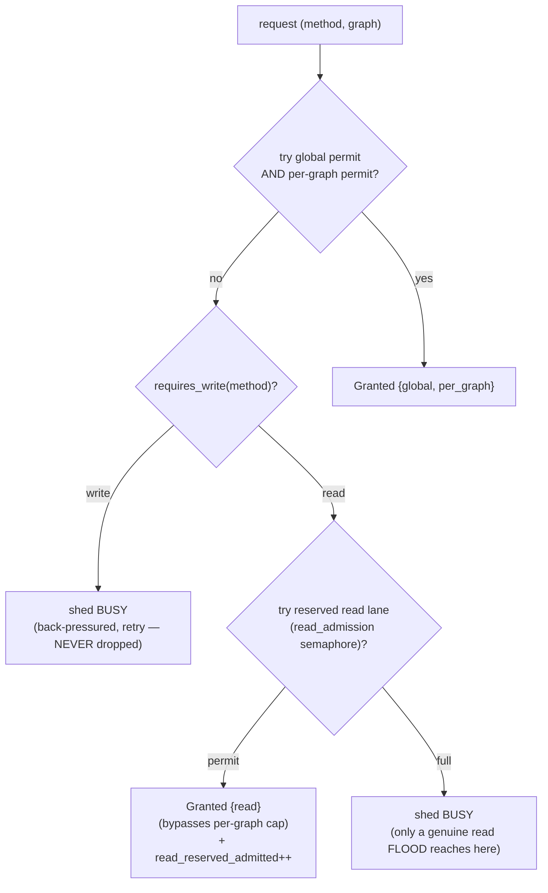

# Reserved read-admission lane (`CONCEPT:EG-044`)

> A reserved admission lane that **only** reads/queries may use, so an interactive
> MCP read or query is **never** shed to `BUSY` behind an ingestion **write**
> firehose. The engine stays responsive while it ingests 24/7.

This page is the deep reference for `CONCEPT:EG-044`. For where it sits in the
broader scaling story see the **[Engine Scaling Program](scaling-program.md)**
(the responsiveness layer); for the MVCC read path it relies on see
[`engine.md`](engine.md) and `CONCEPT:EG-027`.

---

## WHAT

EG-044 adds a small, dedicated **read-admission semaphore**
(`ServerState::read_admission`) alongside the existing global backpressure pool
(`max_in_flight`) and the per-graph fairness cap (`per_graph_inflight`). When a
read loses the normal admission path under write saturation, it **falls back to
this reserved lane** instead of being shed `BUSY`. Writes can never acquire the
lane, and it bypasses the per-graph cap entirely.

The contract is one sentence: *under any amount of ingestion write load, an
interactive read keeps an open lane* — and only a genuine **read** flood that
also fills the small reserved lane is shed (so memory stays bounded).

!!! note "This is an admission-layer fix, not a locking fix"
    Reads already serve from MVCC snapshots and so never contended for a write
    lock (see [HOW](#how) below). EG-044 fixes the one place the engine *did*
    couple reads to writes: the **global admission semaphore**, which shed reads
    to `BUSY` indiscriminately once writes saturated it. EG-044 gives reads their
    own lane through that gate.

---

## WHY

The engine's `__commons__` graph is a 24/7 ingestion firehose. Under saturation
two admission resources fill up:

1. The **global** `max_in_flight` pool (`EPISTEMIC_GRAPH_MAX_INFLIGHT`, default
   `cpus*64` clamped `256..8192`) — shared by reads *and* writes.
2. The **per-graph fairness permit** (`per_graph_inflight`, default
   `max_in_flight/4`) for `__commons__` itself.

Before EG-044 a read that lost both was shed `BUSY` exactly like a write — so a
heavy ingestion stream could starve interactive MCP reads/queries even though a
read is cheap and never blocks a write. The engine must **stay responsive while
ingesting**, so an interactive read must outrank background ingestion at the
admission gate.

### The "database is locked" red herring

The live symptom that motivated EG-044 was a `database is locked` error under K=4
ingestion. The root cause was traced and is **not the engine**:

- redb is **MVCC** and never emits that string — its errors are
  `Database already open` / `transaction in progress`.
- Engine reads already serve from `begin_read()` / in-memory snapshots
  (`CONCEPT:EG-027`), so they never contend for the write lock.
- The literal `sqlite3.OperationalError: database is locked` came from the
  agent-utilities **FanOut outbox** (`KG-2.74`, a sibling SQLite component).

The engine's *only* contribution to the unresponsiveness was the global
`max_in_flight` semaphore shedding reads to `BUSY` under write saturation — which
is exactly what the reserved lane fixes.

---

## HOW

The transport admission lives in
[`src/server/transport.rs::handle_connection`](../../src/server/transport.rs).
Each request is classified by
[`src/server/access.rs::requires_write`](../../src/server/access.rs) and resolved
through a **pure, unit-testable** `admit_request`:

```rust
fn admit_request(
    sem: &Arc<Semaphore>,        // global max_in_flight pool
    read_sem: &Arc<Semaphore>,   // reserved read lane (EG-044)
    pg_map: &DashMap<String, Arc<Semaphore>>,  // per-graph fairness permits
    pg_limit: usize,
    graph: &str,
    is_write: bool,              // from requires_write(&req.method)
) -> Admission { … }
```

The classifier `requires_write` is the canonical read/write split: structural
mutations (`AddNode`/`AddEdge`/`CompareAndSetNodeFields`/`BatchUpdate`/…),
RDF mutations, KV mutations, and — crucially — **statement-aware** query writes
(it parses just enough of a `Sql`/`CypherQuery`/`GraphQl` *string* to tell a
mutating statement from a read) all classify as writes; everything else
(including pure-compute finance/datascience methods) classifies as a read.

### The admission algorithm

Both reads and writes try the **normal path first** (a global permit, then the
graph's per-graph permit). The split only happens when that path is lost:



Key invariants, straight from the code:

- **A write that loses the normal path is shed `BUSY`** — strictly
  back-pressured (retry with backoff), **never dropped**. The durable write path
  stays the bottleneck; the reserved lane is *not* a relief valve for writes
  (the `is_write` branch returns `Admission::Busy` before the lane is even
  tried).
- **A read that loses the normal path falls back to `read_sem`**, which writes
  can never acquire, and which **bypasses the per-graph cap** — so even when
  `__commons__` has saturated both the global pool and its own fairness permit,
  an MCP read keeps an open lane. A read "pays no fairness tax" because it is
  cheap and must stay live.
- **The reserved lane is bounded.** Only a genuine read *flood* that also fills
  `read_sem` is shed `BUSY`, so the lane can never grow unbounded in-flight work.
- The three permit slots are **mutually exclusive**: a normal admission holds
  `global` + `per_graph`; a reserved-read admission holds only `read`.

### Reads never touch a write lock (the EG-027 tie-in)

The reserved lane is safe to grant aggressively because a read **never contends
for a write lock**:

- Cypher / SQL / GraphQL / SPARQL read off an in-memory `GraphCore`
  `analysis_snapshot_versioned()` taken under the topology *read* lock (heavy
  compute runs off the lock entirely, `CONCEPT:KG-2.51`).
- The redb read-through (`read_node`, hit only on a RAM miss) serves the evicted
  node directly off a `Database::begin_read()` MVCC snapshot on the target shard,
  concurrently with the single writer (`CONCEPT:EG-027`) — it never routes
  through the writer thread and never forces a group-commit.

So the engine's redb tier never returns "database is locked", and a read admitted
on the reserved lane completes against a consistent snapshot without ever waiting
on the write firehose.

---

## CONFIG

| Knob | Default | Meaning |
|------|---------|---------|
| `EPISTEMIC_GRAPH_READ_RESERVED` | auto-sized (see below) | Size of the reserved read-admission lane (in-flight read slots). An explicit value `> 0` wins; otherwise the auto-size is used. |

The auto-size is `Capacity::read_reserved()`
([`src/autosize.rs`](../../src/autosize.rs)):

```text
read_reserved = (max_inflight / 8).clamp(8, 1024)
```

i.e. an eighth of the global admission cap, floored at 8 so a 1–2 core box still
keeps several read lanes open, ceilinged at 1024. Reads hold a slot only for the
brief off-lock snapshot, so even a small reservation keeps the read path alive.
The value is read once at startup in [`src/main.rs`](../../src/main.rs) and logged
(`Backpressure: max in-flight = … (per-graph cap = …, reserved read lane = …)`).

### Observability

A read admitted via the reserved lane increments the Prometheus counter:

```text
epistemic_graph_read_reserved_admitted_total
```

> *"Read/query requests admitted via the RESERVED read lane (CONCEPT:EG-044)
> after the global pool / per-graph cap was saturated by writes — each is an
> interactive read that would otherwise have been shed BUSY behind ingestion."*

A rising `read_reserved_admitted_total` alongside `busy_rejections_total` is the
signal that the reserved lane is actively keeping reads alive under ingestion
pressure.

---

## Proof tests

Three tests in `transport::tests`
([`src/server/transport.rs`](../../src/server/transport.rs)) prove the guarantee
deterministically against the pure `admit_request`:

| Test | What it proves |
|------|----------------|
| `read_is_admitted_when_write_pool_is_saturated` | With the global pool fully drained by writers, a **write** sheds `BUSY` while a **read** is still `Granted` via the reserved lane (`global.is_none()`, `read.is_some()`). The core "interactive read is never starved behind ingestion" guarantee. |
| `read_lane_is_bounded_under_a_read_flood` | The reserved lane is itself bounded: holding all reserved permits, the next read floods the lane → `BUSY`; once a slot frees, reads admit again. The reservation guarantees *availability*, not unbounded admission. |
| `reads_survive_under_max_write_load_on_hot_graph` | Concurrency stress: while writers saturate the global pool, a burst of concurrent reads on the **same hot graph** (`__commons__`, `pg_limit = 4` like the live default) are **all** admitted, never `BUSY` — mirrors the live K=4 ingestion symptom at the admission layer. |

All three are pure-function / in-process tests, so the responsiveness guarantee is
asserted without standing up a server.

---

## Operating notes — end-to-end resource priority

EG-044 is the **engine half** of an end-to-end "interactive reads outrank
background ingestion" guarantee. It composes with the agent-utilities
**resource-priority edict** (ORCH-1.98/1.99) on the orchestration side:

- **agent-utilities** keeps interactive orchestration from being starved by
  background ingestion at the *task scheduling / lane* level (background
  ingestion lanes are capped so they cannot crowd out interactive work).
- **EG-044** enforces the same priority one layer down, at the *engine
  admission gate*: even when ingestion has saturated the engine's global pool and
  the `__commons__` per-graph cap, an interactive read still gets a lane.

Together they mean an MCP read/query stays responsive end-to-end while the
ecosystem ingests continuously. Tuning guidance:

- **Default is usually right.** The auto-size tracks `max_inflight`, so a bigger
  box gets a bigger reserved lane automatically.
- **Raise `EPISTEMIC_GRAPH_READ_RESERVED`** only if you observe reads shedding
  `BUSY` (the reserved lane filling) under a genuinely read-heavy *and*
  write-heavy mix — e.g. many concurrent interactive agents querying while
  ingestion runs. Keep it well below `max_inflight` so the reserved reads can't
  themselves exhaust the box.
- **It is harmless on a Pi.** The lane floors at 8; reads hold a slot only for a
  snapshot, so the reservation costs almost nothing when idle.
