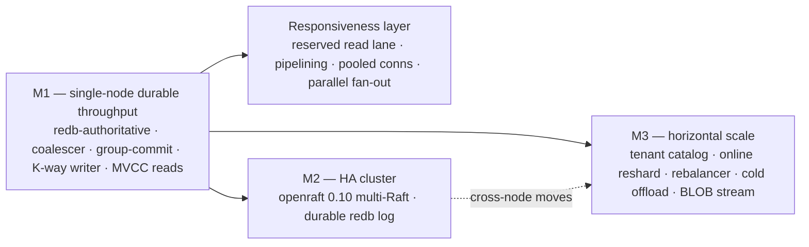
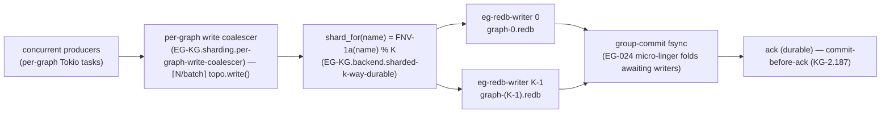
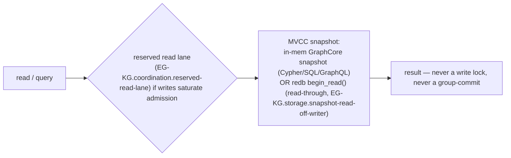

# Engine Scaling Program (M1 / M2 / M3)

> **Claim status:** `DESIGNED` is a contract or future capability; `IMPLEMENTED`
> means the current `main` source contains it; `UNIT-PROVEN` means a focused
> repository fixture is the evidence; `LAB-PROVEN` means a bounded throwaway run
> produced evidence; `LIVE` means a deployed observation identifies the artifact;
> `1M-CERTIFIED` means the exact one-million-user/agent workload report identifies
> the artifact and result. See the [scale claim register](scale_claims.md), which
> is checked against source anchors. This page makes no `LIVE` or `1M-CERTIFIED`
> claim unless it names that evidence explicitly.

> The top-level map of how `epistemic-graph` scales from a Raspberry Pi to an HA
> cluster while staying a durable source of truth **and** responsive under a 24/7
> ingestion firehose. This page ties the three waves together and links out to the
> deep references — it does **not** duplicate them.

## North star

**One engine that saturates the hardware it is on while staying responsive.** Three
properties, held at every scale:

1. **Durable source of truth.** A `kill -9` never loses an acked write — redb is
   authoritative by default (`CONCEPT:AU-KG.backend.backend-modes`), commit-before-ack
   (`CONCEPT:EG-KG.backend.authoritative-dispatch`), read-through-safe eviction (`CONCEPT:EG-KG.storage.read-through-seam-exercised`).
2. **Non-blocking under ingestion load.** The `__commons__` ingestion firehose must
   not serialize the box or starve interactive reads. This is the whole point of the
   write coalescer, the sharded writer, MVCC reads, and the reserved read lane.
3. **Scales single-node → cluster.** The *same* binary is an embedded library, a single
   durable server, or — with the opt-in `cluster` [layer](tiers.md) — a replicated
   multi-node cluster. Runs on Raspberry Pi 4+ up to a 64-core box.

The program is three waves:

| Wave | Theme | What it buys |
|------|-------|--------------|
| **M1** | Single-node durable throughput | Saturate one box's cores for durable writes; keep reads responsive. |
| **M2** | HA cluster | Replicate the authoritative store across nodes (openraft 0.10 multi-Raft). |
| **M3** | Horizontal / elastic scale | Distribute tenants across shards/nodes, reshard online, offload cold tenants. |

---

## M1 — single-node durable throughput

The foundation: make one box a durable source of truth that saturates its cores for
writes without serializing on a single lock or a single fsync. The canonical detailed
description is the **"Durability model" section of
[`AGENTS.md`](https://github.com/Knuckles-Team/epistemic-graph/blob/main/AGENTS.md)**; this is the spine.

### Authoritative durability (the floor)

- **redb-authoritative by default** (`CONCEPT:AU-KG.backend.backend-modes`) — a stock build with a
  mandatory persist dir is durable out of the box; redb is the sole served persistence backend.
- **Commit-before-ack** (`CONCEPT:EG-KG.backend.authoritative-dispatch`) — a durable mutation is group-commit
  fsynced to redb *before* its Response is acked; a commit failure is an ERROR
  response, so an acked write is always on disk.
- **Read-through-safe eviction** (`CONCEPT:EG-KG.storage.read-through-seam-exercised`) — the per-graph node cap keeps
  RAM bounded *without* data loss: an evicted node serves from redb on a RAM miss, and
  a node leaves RAM only after a redb read confirms it is on disk.
- **Backpressure, not drop** — the writer's bounded channel blocks for capacity
  off-reactor instead of shedding a mutation.

### Throughput: how one box stops serializing

Four layered optimizations turn the durable path from "one lock, one fsync, one core"
into "K writers, batched fsyncs, parallel cores":

- **Per-graph write coalescer** (`CONCEPT:EG-KG.sharding.per-graph-write-coalescer`) — N concurrent single-op writes
  to ONE hot graph batch onto a lazily-created per-graph writer and apply under **one**
  `topo.write()` per batch, collapsing N lock acquisitions into ⌈N/batch⌉. Default ON,
  auto-sized from the shared cgroup-aware CPU capacity. → [`write_coalescer.md`](write_coalescer.md).
- **Adaptive group-commit micro-linger** (`CONCEPT:EG-KG.backend.adaptive-linger-coalesce`) — when the `eg-redb-writer`
  is about to commit a *shallow* batch it spends ONE bounded `recv_timeout(linger)`
  (default 1 ms) letting concurrent in-flight authoritative writers fold into the SAME
  fsync — the profiled write ceiling was ~1 op/fsync from serial awaits. Adaptive: a
  deep batch already coalesces, so it commits immediately (no added latency). Durability
  is unchanged.
- **O(1) audit-chain tail cache** (`CONCEPT:EG-KG.storage.embedded-store`) — the EG-KG.sharding.row-level-security hash-chained `AUDIT`
  log appends in O(1) by caching the per-graph chain tail in-process, so a high-rate
  ingestion stream no longer pays a durable tail read on every audited write.
- **Sharded K-way durable writer** (`CONCEPT:EG-KG.backend.sharded-k-way-durable`) — redb is single-writer-PER-FILE,
  so the writer shards by graph into **K independent `graph-<n>.redb` files**, each with
  its own writer thread / bounded channel / `Pending`. All of the above (micro-linger,
  audit cache, commit-before-ack, group-commit, backpressure) hold **per shard**, so
  K cores commit in parallel. A graph always routes to the same shard by
  `FNV-1a(sanitized_name) % K`. In the non-Raft main build K is the
  effective-cgroup auto-size bounded by `clamp(cpu/2, 1, 8)`; under an active
  Raft node K=N groups, with N using the separate cgroup-derived default bounded
  by `MAX_SHARD_COUNT` (64) or an explicit `EPISTEMIC_GRAPH_RAFT_GROUPS`.
  **K=1 is a valid constrained-host result, not a universal Raft rule.** →
  [`engine.md` § Sharded K-way durable writer](engine.md).

### Reads that never block on the writer

- **Snapshot/MVCC reads off the writer** (`CONCEPT:EG-KG.storage.snapshot-read-off-writer`) — the point-read /
  read-through path serves an evicted node directly off a `Database::begin_read()` MVCC
  snapshot on the target shard, **concurrently** with the single writer. A read never
  routes through the writer thread and never forces a group-commit. Consistency: reads
  see the latest *committed* state per shard, and commit-before-ack guarantees any acked
  write is already committed (so visible to a later `begin_read()`).

### Sizing the box automatically

- **Dynamic capacity auto-sizing + Pi-OOM cap** (`CONCEPT:AU-KG.backend.b-auto-size`) — the same binary
  sizes its concurrency / buffer / per-graph-node-cap defaults from the shared
  effective host/cgroup CPU+RAM capacity at startup. Finite ancestor quotas and
  memory limits are retained even when a child reports `max`; automatic values
  reserve headroom and explicit values cannot widen them. The per-graph node cap
  remains RAM-derived so a constrained cgroup caps a runaway graph instead of
  OOM-killing every tenant, while a large box stays effectively unbounded. Safe
  because eviction is read-through (no data loss). See [`cgroup_capacity.md`](cgroup_capacity.md).

### The M1 write path

### The M1 read path (never the writer)

---

## The responsiveness layer

Durable throughput is only half of "saturate the box while staying responsive." These
keep **interactive** traffic alive while ingestion runs flat-out:

- **Reserved read-admission lane** (`CONCEPT:EG-KG.coordination.reserved-read-lane`) — an interactive MCP read/query is
  **never** shed `BUSY` behind a write firehose. Under `__commons__` saturation both the
  global `max_in_flight` pool and the per-graph cap fill; a write that loses is
  back-pressured (`BUSY`, retry), but a **read** falls back to a dedicated
  `read_admission` semaphore writes can never acquire, bypassing the per-graph cap. Only
  a genuine read flood that also fills the small reserved lane is shed. →
  **[reserved_read_lane.md](reserved_read_lane.md)** (full page).
- **Pooled / multiplexed engine connections** (`CONCEPT:EG-KG.backend.multiplexed-connections`, roadmap E) —
  client-side: the Python `ConnectionPool` / `ShardRouter` auto-size to the box
  (`2*cpu` clamped 8..64) and fan independent ops across N connections; the engine
  spawns one task per connection, so N connections = N parallel server tasks.
- **True single-connection request pipelining** (`CONCEPT:EG-KG.backend.framed-response`) — server-side: the
  per-connection loop `tokio::io::split`s the stream and `tokio::spawn`s a dispatch task
  per frame whose id-tagged Response is written back out of order through a single
  writer task — so many requests on ONE connection process concurrently. Composes with
  EG-037 (the pool multiplexes connections AND each connection multiplexes requests).
- **Parallel cross-shard read fan-out** (`CONCEPT:AU-KG.backend.roadmap-f-parallel-cross`) — a cross-shard read
  (`load_all`/`load_into`) fans each shard's dump concurrently off its OWN `begin_read()`
  MVCC snapshot on the blocking pool (K reads on K cores), never touching a writer
  thread. → [`m3_resharding.md`](m3_resharding.md).

---

## M2 — HA cluster (openraft 0.10 multi-Raft) — `IMPLEMENTED` / `UNIT-PROVEN`

The opt-in `cluster` layer (cargo `raft` feature, cluster-only — the main `default`/`full` build links
**no** openraft) runs the engine as a multi-node HA cluster replicating its
**authoritative** redb state via **openraft 0.10** (`CONCEPT:AU-KG.backend.authority-has-already-acked` — the v2
split-storage API + native graceful leader transfer). Off ⇒ the write path is
byte-for-byte the single-node path.

- **Durable redb Raft log** (`CONCEPT:EG-KG.storage.one-fsync-covers-raft`) — the Raft log + vote + applied state
  live in the SAME authoritative shard as the graph data, so a log append and its mutation
  coalesce into **one** `WriteTransaction` / one fsync; a restarted node recovers its
  log tail locally. The separate `raft.redb` sidecar is gone.
- **Multi-Raft scaffold** (`CONCEPT:EG-KG.sharding.raft-resharding`) — a `MultiRaft` manager holds N openraft
  groups keyed by `GroupId`, sharing ONE TCP listener per node (frames tagged + demuxed
  by group id) and ONE shared authoritative shard; a `GroupRouter` maps `graph_name → GroupId`.
  Group = transaction boundary.
- **M2 hardening** (`CONCEPT:AU-KG.ontology.manage-arbitrary/266/267/268/271`) — pooled per-peer connections,
  group-per-tenant-range routing ring, per-group snapshot scoping, multi-node membership
  join, leader balancing (now the native `trigger().transfer_leader(target)` handoff),
  and heartbeat coalescing — all done + lib-tested.
- **Bounded shard/Raft drain contract (NE-167)** — a typed drain operation stops
  admission, waits for an explicit zero-work observation, preserves the
  authoritative writer and quorum/PDB-equivalent health floor, then commits the
  fenced voter shrink. Stale acknowledgements are denied and restart recovery
  fails closed; a post-shrink failure enters an explicit rollback state. See
  [`shard_drain.md`](shard_drain.md).

!!! note "K=N under Raft"
    Under an active Raft node the durable writer count is **K=N groups** (one group
    owns one shard), so HA and write scaling coexist. `EPISTEMIC_GRAPH_RAFT_GROUPS`
    requests N for a fresh store, with the effective cgroup-aware CPU-derived default;
    on restart the existing on-disk K is authoritative and node startup adopts it
    before creating groups/ring. Each group's log and graph data remain
    single-writer-correct on its shard; changing K requires offline migration.

The focused Raft fixtures are the `UNIT-PROVEN` evidence for the source paths. The
throwaway loopback harness (`scripts/validate-raft-cluster.sh`) is an implemented
`LAB-PROVEN` route only after it is run against the exact artifact; this page does
not claim that run, live deployment, or one-million-user certification. The
DONE-vs-REMAINING handoff (including what still needs real multi-node hardware) is
**[m2_raft_status.md](m2_raft_status.md)**; the deploy recipe is `cluster_deployment.md`.

---

## M3 — horizontal / elastic scale — `IMPLEMENTED` / `UNIT-PROVEN` where marked

The "horizontal scale spine": distribute tenants across the K durable shards (and,
behind M2, across nodes), reshard online, and offload cold tenants — a design target
for allowing 100M graphs to share an engine without all being resident. This target is
not a live or 1M certification result. Full handoff:
**[m3_resharding.md](m3_resharding.md)**.

| Capability | Concept | Status | One-liner |
|------------|---------|--------|-----------|
| Tenant catalog routing-override seam | `EG-031` | `IMPLEMENTED` | Durable `graph → {shard, node}` map overrides hash routing per graph; an **empty** catalog is byte-for-byte FNV-1a. |
| Catalog auto-attach gate | `EG-KG.sharding.r5-feature` | `UNIT-PROVEN` | `RedbBackend::open` attaches `catalog.redb` when explicitly enabled or already present; default remains OFF. |
| Offline K-shard migration tool | `EG-030` | `UNIT-PROVEN` | OFFLINE `migrate-shards` rewrites a store into a new K with the same FNV-1a routing and verbatim rows. |
| Online single-node resharding | `EG-032` | `UNIT-PROVEN` | Moves one graph between shards while the engine runs, then flips the catalog route under `routing_epoch`. |
| Online-reshard snapshot+delta copy | `EG-KG.backend.flush-pending-first` | `IMPLEMENTED` | Bulk-copies from a snapshot, then performs delta-flip-purge during the bounded quiesce. |
| Rebalancing planner | `EG-035` | `UNIT-PROVEN` | Pure deterministic planner emits an ordered move plan; source integration and policy remain separate. |
| Rebalance plan execution | `EG-KG.backend.r3-plan-execution` | `IMPLEMENTED` | `rebalance_execute(plan)` applies catalog-backed moves one graph at a time. |
| Cold-tenant whole-graph offload | `EG-KG.sharding.eg-r6` | `UNIT-PROVEN` | Durably gated, read-through-safe hibernation of idle graphs; `__commons__` is never offloaded. |
| Cold-tenant `touch()` + sweep | `EG-KG.backend.r6-feature` | `IMPLEMENTED` | The live path updates the tracker and an interval sweep uses `EPISTEMIC_GRAPH_COLD_OFFLOAD_SECS`. |
| In-process BLOB streaming facade | `EG-KG.sharding.m3-r4` | `UNIT-PROVEN` | Streams large content between `Read`/`Write` and CAS without buffering the whole blob. |
| Catalog-driven resharding admin RPC | `EG-038` | `IMPLEMENTED` | `Reshard`/`Catalog*`/`RebalancePlan`/`RebalanceExecute` drive M3 operations over the protocol. |
| Parallel cross-shard read fan-out | `AU-KG.backend.roadmap-f-parallel-cross` | `UNIT-PROVEN` | Cross-shard reads fan out from per-shard MVCC snapshots without entering writer threads. |
| Cross-node tenant distribution (R2) | — | `DESIGNED` | Requires cross-node row movement through the destination Raft group; it is not a current live capability. |
| Object-store cold arm of R6 | — | `DESIGNED` | Colder-than-redb spill to `cold-tier-s3`/`blob-s3` remains a follow-on. |

**Still remaining:** R2 (cross-node tenant distribution — needs the cross-node
consensus/transport integration), and the object-store arm of R6 (cold tenants
colder than redb spilled to `cold-tier-s3`/`blob-s3`). `UNIT-PROVEN` and
`IMPLEMENTED` above are source/repository evidence only; neither is a `LIVE` or
`1M-CERTIFIED` result.

---

## Tiers — what scales where

There is one main build plus the opt-in `cluster` layer (full map: **[tiers.md](tiers.md)**;
feature flags in [`AGENTS.md`](https://github.com/Knuckles-Team/epistemic-graph/blob/main/AGENTS.md)). The scaling capabilities partition as:

| Capability | main build (`default`/`full`) | `+ cluster` |
|------------|:-----------------------------:|:-----------:|
| redb-authoritative durability (M1 floor) | ✅ | ✅ |
| Write coalescer · K-way sharded writer · MVCC reads · group-commit linger | ✅ | ✅ |
| Reserved read lane (EG-KG.coordination.reserved-read-lane) · auto-sizing (AU-KG.backend.b-auto-size) | ✅ | ✅ |
| Tenant catalog · online reshard · rebalancer · cold offload (M3, `redb`) | ✅ | ✅ |
| BLOB CAS + streaming facade | ✅ | ✅ |
| DataFusion SQL / pg-wire (+ the whole wire family) | ✅ | ✅ |
| openraft multi-Raft replication (M2) | ❌ | ✅ |
| Cross-node resharding (M3 R2) · distributed Pregel · cross-shard 2PC | ❌ | ✅ |

!!! note "The invariant"
    The main build (`default`/`full`) links **no openraft** — HA replication and cross-node
    distribution force the opt-in `cluster` layer. Everything else, including DataFusion SQL
    and the M3 single-node resharding machinery, is in the one main build. It targets
    Raspberry Pi 4+.

---

## Operating notes

### Key environment knobs

| Variable | Layer | What to tune |
|----------|-------|--------------|
| `EPISTEMIC_GRAPH_REDB_SHARDS` | M1 | K independent writer files/threads. Non-Raft default `clamp(effective-cgroup-cpu/2,1,8)`; explicit values clamp to the current layout ceiling of 64. **K=1 is a constrained-host result**; changing an existing persist-dir needs the `migrate-shards` tool. Ignored under active Raft, where K=N groups. |
| `EPISTEMIC_GRAPH_REDB_GROUP_LINGER_US` | M1 | Positive group-commit micro-linger (default 1000 µs). |
| `EPISTEMIC_GRAPH_REDB_GROUP_SHALLOW` | M1 | Shallow-batch op threshold the linger applies below (default 32). |
| `EPISTEMIC_GRAPH_REDB_FLUSH_THRESHOLD` | M1 | Per-shard early-flush op threshold (auto ≈ half the cgroup-aware durable-writer queue, clamped 256..16384). A positive override may lower but cannot raise the automatic bound. |
| `EPISTEMIC_GRAPH_MAX_INFLIGHT` | M1 / resp. | Global admission cap (default effective `cpus*64`, clamped 64..8192). A positive override may lower it but is clamped to the cgroup-aware default; excess → `BUSY`. |
| `EPISTEMIC_GRAPH_READ_RESERVED` | resp. | Reserved read lane size (default `max_inflight/8` clamped 8..1024). A positive override is clamped to the global cgroup-aware admission bound. |
| `EPISTEMIC_GRAPH_COLD_OFFLOAD_SECS` | M3 | Idle-offload sweep window (`0`/absent = disabled). |
| `EPISTEMIC_GRAPH_TENANT_CATALOG` | M3 | Attach the durable tenant catalog (default OFF = pure FNV-1a). |
| `EPISTEMIC_GRAPH_RAFT_NODE_ID` / `_PEERS` / `_BIND_ADDR` | M2 | Activate the cluster (with `--features raft` + a persist dir). |
| `EPISTEMIC_GRAPH_RAFT_FAILURE_DOMAINS` | M2 / NE-171 | Optional complete `node_id=domain` map for bounded automatic leader transfer. Distinct known domains are required; unset derives the advertised endpoint host and fails closed for same-host targets. |

### What to tune for a Pi vs a 64-core box

- **Raspberry Pi 4+:** the auto-sizer will generally resolve `REDB_SHARDS` to K=1
  on a one- or two-core constrained capacity (inspect the resolved startup config;
  it is not a hard-coded host-class rule). Adding shards just adds threads it can't parallelize. The auto-sizer already
  derives a cgroup-aware admission cap, a RAM-derived per-graph node cap, and floors
  the reserved read lane at 8. Consider `COLD_OFFLOAD_SECS` to bound RAM
  across many tenants. No openraft, no DataFusion.
- **64-core box:** let non-Raft auto-sizing pick `REDB_SHARDS` toward its current
  ceiling of 8 (or choose a smaller stable K; changing an existing persist-dir
  needs the migration tool). An active Raft node instead sizes K=N groups up to
  the 64-shard layout ceiling. Set `max_in_flight`
  ≈ 4096, reserved read lane ≈ 512. This is where the K-way writer + parallel cross-shard
  fan-out actually saturate the cores.
- **HA cluster:** build `--features cluster`, set the `RAFT_*` env, and remember the
  durable shard count is **K=N groups per node** under active Raft — scale write
  throughput by adding groups (multi-Raft), with each group owning its shard.

### How to verify

- **Transport / admission + responsiveness:** `python3 scripts/bench_transport.py`
  (measured baseline: `AddNode` p50 ≈ 0.187 ms over UDS) and the
  `transport::tests` reserved-lane suite (see [reserved_read_lane.md](reserved_read_lane.md)).
- **Write coalescer:** `write_coalescer::tests::bench_inline_vs_coalesced` (57.5× fewer
  lock acquisitions under a pipelined firehose — see [write_coalescer.md](write_coalescer.md)).
- **Cluster:** `scripts/validate-raft-cluster.sh` on loopback nodes (formation /
  replication / failover / native transfer / durable log).
- **Prometheus:** watch `epistemic_graph_read_reserved_admitted_total`,
  `epistemic_graph_busy_rejections_total`, the per-graph
  `epistemic_graph_write_batches_total` / `…_batched_ops_total`, and
  `graph_memory_bytes` / `budget_evictions_total` on the `/metrics` listener.

---

## Related references

- [`AGENTS.md`](https://github.com/Knuckles-Team/epistemic-graph/blob/main/AGENTS.md) — canonical "Durability model" section (the source of
  truth for M1/M2 mechanics + the Environment Variables table).
- [engine.md](engine.md) — the master-of-all engine deep reference (C4 views, all modalities).
- [write_coalescer.md](write_coalescer.md) — `CONCEPT:EG-KG.sharding.per-graph-write-coalescer` in depth.
- [reserved_read_lane.md](reserved_read_lane.md) — `CONCEPT:EG-KG.coordination.reserved-read-lane` in depth.
- [m2_raft_status.md](m2_raft_status.md) — M2 DONE-vs-REMAINING handoff.
- [m3_resharding.md](m3_resharding.md) — M3 DONE-vs-REMAINING handoff.
- [tiers.md](tiers.md) — feature-composition map + prebuilt binary sizes.
- [concepts.md](../concepts.md) — the concept registry.

---

**See also:** [Capabilities matrix](../capabilities.md) · [Multi-Raft Cluster Status](m2_raft_status.md) · [Catalog-driven Resharding](m3_resharding.md) · [Cluster Deployment](cluster_deployment.md) · [Per-Graph Write Coalescer](write_coalescer.md).
