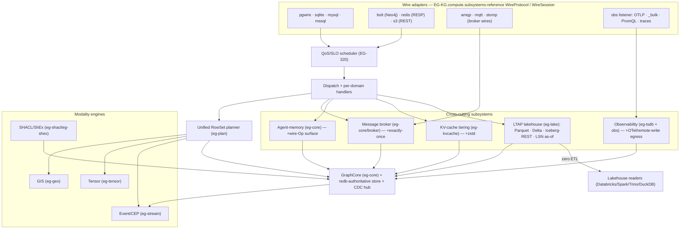

# Subsystems — the one substrate, many surfaces

`epistemic-graph` is one durable engine, but this cycle (waves 18–22) added several **cross-cutting
subsystems** and a fan of **wire adapters** that all compose on the *same* `GraphCore` + redb-authoritative
store + unified `RowSet` planner. None is a bolt-on service: a broker queue, a log stream, a KV block, and
a geometry are all rows in the one store, reached through the one dispatch shell and (where relevant) the
one planner. This is the C4-container-level reference for those subsystems; for the deep engine internals
see [the master-of-all engine](engine.md), and for the crate DAG see [the overview](../overview.md).

---

## Multi-wire adapters — one exec path, many databases

The keystone is the **`WireProtocol` / `WireSession` trait** (CONCEPT:EG-KG.compute.subsystems-reference): the wire-agnostic core was
extracted from the Postgres `pgwire` module into a trait — `parse → classify → eg_query exec → encode` —
so **every** wire reuses the one exec path against the one store, differing only in framing + dialect
translation. Postgres was refactored behind it (no behavior change) as the first impl; the rest are
hand-rolled listeners, each behind its own cargo feature + `EPISTEMIC_GRAPH_*_ADDR` env var, all kept
in the one main build:

| Adapter | Protocol | Concept | Backing surface |
|---------|----------|---------|-----------------|
| pgwire | Postgres v3, SCRAM | (pre-existing, now trait-based) | SQL / eg-query |
| sqlite | served SQL + `.db` export | EG-KG.query.concept-3 | SQL / eg-query |
| mysql | MySQL/MariaDB handshake v10, `COM_QUERY` | EG-KG.query.kg-2 | SQL / eg-query |
| mssql | TDS PRELOGIN/LOGIN7 | EG-KG.query.hand-rolled-tds-server | SQL / eg-query |
| bolt | Neo4j Bolt v4.4, PackStream v2 | EG-KG.query.bolt-wire-protocol | Cypher engine |
| redis | RESP2/RESP3 core + **pub/sub** + `MULTI`/`EXEC` | EG-KG.ontology.resp2-resp3-codec-round/307 | KV surface |
| s3 | S3 REST + SigV4-lite + **multipart** + range GET | EG-KG.ontology.object-put-get-head/307 | BLOB CAS |
| amqp | AMQP 0.9.1 + `confirm.select` | EG-275/314 | message broker |
| mqtt | MQTT 3.1.1 / 5.0 + user-props | EG-281/314 | message broker |
| stomp | STOMP 1.2 | EG-KG.ontology.stomp-frame-codec-unit | message broker |

A Neo4j driver, a `redis-cli`, an `aws s3` client, a `psql`, and a MySQL ORM all talk to the **same
durable graph** — the engine *is* those databases, not a gateway in front of them.

---

## Message broker (eg-core/broker)

The broker grows out of the **native engine task queue** (CONCEPT:EG-KG.compute.atomically-claim-oldest-pending): tasks and staged work are
nodes in the isolated `__control__` graph, and `Method::ClaimNext` is a single-round-trip, Raft/WAL-safe
atomic claim (under the write guard, pick the smallest-`seq` `pending` node and CAS `pending → claimed`).
That claim/ack primitive is extended into a **RabbitMQ-class broker** (CONCEPT:EG-KG.compute.message-broker-exchanges): durable
exchanges (direct/topic/fanout) + bindings/routing-keys + queues, publish/consume/ack over additive
`Method::*` ops. Because it rides `__control__` graph nodes, every broker message is durable and
crash-safe for free.

Full broker semantics ship on top of it: dead-letter queues (EG-KG.compute.dead-letter-queues), message + queue TTL (EG-KG.compute.message-ttl-expiry),
priority queues (EG-KG.compute.priority-queues), delayed/scheduled delivery (EG-KG.compute.delayed-scheduled-delivery), consumer groups with prefetch/QoS
(EG-KG.compute.groups-qos-prefetch-honoring), publisher confirms + manual consumer acks for at-least-once delivery (EG-KG.compute.publisher-confirms-consumer-qos), and Kafka/Streams-style
**replayable append-log streams** with offset-addressed replay + retention (EG-283). Program B adds
**effectively-exactly-once** delivery via an **idempotent producer** (producer-id + sequence → drop
duplicate publishes) and exposes the stream/confirm/ack ops over the **AMQP `confirm.select`** and
**MQTT 5** wire frames (EG-314). The AMQP, MQTT, and STOMP wire adapters (EG-275/281/282) are three front
doors onto this one broker. A **live-CEP standing-query subscription** surface (EG-KG.query.protocol-types) lets a client
register a CEP pattern and receive pushed matches fed by the same CDC bus (see the stream/CEP section).

---

## Observability (eg-tsdb + the `obs` listener)

An OpenObserve-class logs + metrics + traces stack, all landing in the engine's own storage — **not** a
separate TSDB or Elasticsearch. A hand-rolled HTTP ingestion listener (OTLP/HTTP, Elastic `_bulk`, syslog;
CONCEPT:AU-KG.ingest.self-ingest) writes each record as an eg-tsdb time-series point + an eg-text BM25 document (schema-on-read
streams), optionally after a **VRL-style transform pipeline** (parse/filter/set/route; EG-165) that can
enrich cross-modally from the graph. Cold data persists as **Parquet columnar segments** in the blob CAS /
S3 backend (EG-KG.retrieval.observability-search) for cheap object-store storage + DataFusion query.

Three query surfaces close the trilogy: a **PromQL** evaluator on a Prometheus-compatible
`/api/v1/query[_range]` (EG-172) — with the Program-B **extended function set** (`_over_time` family,
`delta`/`idelta`/`deriv`, `topk`/`bottomk`/`quantile`, `label_replace`/`label_join`, `clamp*`; EG-302) —
an **O2/ES-shaped `_search`** over the Parquet segments unioned with the hot tsdb series + BM25 index
(EG-KG.query.concept-4), and **distributed traces** — OTLP span ingest on `/v1/traces` with trace-tree assembly,
tag/service/duration search, and service-dependency-graph derivation (EG-163). A **super-cluster federated
search** (EG-KG.ontology.federation-client) fans a read out to a registry of peer engines and merges + re-ranks the partials
(with **typed SQL/SPARQL result fusion** — schema-aware column union + typed dedup, EG-KG.query.schema-typed-fusion-sql), tolerating a
slow/dead peer. Program B also closes the loop the other way: the engine **emits its own** telemetry via
**OTLP export + a Prometheus remote-write receiver** (`otel-export`, EG-316), so it both ingests and pushes.
Gated `obs`, in the main build.

---

## GIS (eg-geo)

A pure-Rust geospatial modality (NO GEOS/PROJ C deps) built as a leaf crate. The base spatial modality
(CONCEPT:EG-KG.ontology.singles-concept) persists geometries as a typed redb value and adds `Op::SpatialScan` + `Pred::Spatial*`
to the wire algebra so a spatial filter composes with `Traverse`/`Rank`/`Filter` in one plan. Built out
this cycle to real-GIS depth: the **full geometry model** (Multi*/GeometryCollection/holes + EWKT; EG-KG.domains.geometry-collections),
**DE-9IM topological relations** (EG-KG.ontology.de-9im-relations) with **RCC8 + Egenhofer** families (EG-KG.ontology.concept-7), **constructive
algebra** (buffer/hull/union/simplify/centroid; EG-KG.ontology.concept-9), **geodesic** distance/area (EG-KG.ontology.concept-8), a
**CRS registry + reprojection** (EPSG, WGS84↔Web-Mercator; EG-KG.domains.coordinate-reference-system/262), a durable **STR R-tree** spatial
index (EG-KG.domains.spatial-strtree-index), **format I/O** (GeoJSON/WKB/GPX — plus Program-B **Shapefile/KML/GeoParquet**, EG-KG.domains.geojson-gpx-formats/306),
**map tiling** (XYZ/TMS + Mapbox Vector Tiles; EG-KG.domains.map-tiles), **routing/isochrones/TSP** (EG-KG.domains.geo-routing) — extended in
Program B with **turn-restriction penalties + time-window/time-dependent edge weights** for realistic
logistics (EG-KG.domains.geo-partitioning) — and **map-anchored task tracking** (`:GeoTask`; EG-KG.domains.geo-task). It surfaces through SQL `st_*`
and a **GeoSPARQL** vocabulary (EG-KG.ontology.concept-10). In the one main build.

---

## Tensor (eg-tensor)

A pure-Rust N-D array store (CONCEPT:EG-KG.storage.content-addressed-dedup) for images/sensor frames/genomics/ML features, distinct from
eg-ann's fixed-D ANN vectors. Dense/chunked arrays are content-addressed in the existing blob CAS (reusing
`ChunkStore` + CDC), with a dtype/shape manifest as a node property. It adds `Op::TensorScan { layer }` +
`Op::TensorOp { kind }` (slice/reduce/elementwise) to the pure-serde wire algebra, executed in eg-plan.
Program B adds **CAS write-back**: derived tensors from `Op::TensorOp`/`Op::TensorScan` persist into the
content-addressed store on the exec path, so computed tensors are durable + dedup-shared (EG-304). Depends
on eg-tsdb; in the one main build.

---

## Stream / CEP (eg-stream)

A pure-Rust event-stream + complex-event-processing crate (CONCEPT:EG-KG.query.pipelined-execution). High-velocity windowed events
append to the eg-tsdb columnar store (`Op::Window` is the windowing primitive), and `Op::Cep { pattern }`
runs a **bounded NFA** over a sliding/tumbling window (sequence/within/absence operators), emitting matches
as a RowSet. The engine's **CDC broadcast bus feeds live windows**, so standing CEP queries subscribe to the
same reactive substrate that drives continuous queries and watches. Program B adds a **live-CEP
standing-query subscription surface** (Method + subscription stream): register a CEP pattern, subscribe, and
receive **pushed** matches fed by the CDC bus (EG-KG.query.protocol-types). Gated `stream`, in the one main build.

---

## KV-cache tiering (eg-kvcache)

A tiered key→block cache (CONCEPT:EG-KG.memory.byte-bounded-tiers): a hot in-RAM tier (LRU + importance/recency scoring), a warm
compressed-RAM tier (real **zstd** — optional lz4 — codec, not the earlier RLE fallback; EG-315), and a
cold redb/blob tier, with automatic promotion/demotion on access + capacity
pressure — the substrate for an **LLM KV-block cache that survives OOM** by offloading to RAM/disk
(LMCache/vLLM-style). A `SharedKvBackend` trait + content-addressed shared index (EG-186) lets
parallel-deployed engine/vLLM instances **share KV blocks** (hash-keyed, dedup, ref-count), and a gated HTTP
surface (EG-KG.backend.is-configured-so-co) exposes GET/PUT/EXISTS a block by token-hash + stats, so external vLLM/LMCache instances
reuse blocks across the fleet. Pure-Rust leaf crate, in the one main build.

---

## Agent-memory (eg-core)

Native, engine-side memory primitives for agents (the arXiv agent-native-memory work), so the maintenance
loop is a *scheduled engine op*, not a Python reindex:

- **Hierarchical summary-node tier** (CONCEPT:EG-KG.compute.hierarchical-summary-tier-eg) — `:SummaryNode` rollups with a level + provenance
  links; a `summarize/rollup` primitive materializes a higher level from a cluster of lower memories.
- **Episodic → semantic consolidation** (EG-KG.compute.consolidate-cluster) — a *localized* op that promotes a cluster of episodic
  nodes into one consolidated semantic node, merging properties, redirecting edges, preserving provenance +
  bitemporal `tx_from/tx_to`.
- **Decay + reinforcement** (EG-222) — each memory carries importance/access-count/last-access; `reinforce`
  bumps on retrieval, `decay` applies Ebbinghaus time-decay, `evict_below`/`forget` prune locally.
- **Action/policy/trajectory memory** (EG-099) — ordered `:Trajectory` of `:Step{state,action,reward,…}` with
  discounted-return + best/worst retrieval, the substrate for policy learning + replay.
- **LeanRAG hierarchical retrieval** (EG-195) — vector-retrieve at the summary level then drill down through
  provenance edges, beating flat top-k RAG on redundancy/coverage.

The LLM *content* (distillation/summary text) stays in agent-utilities; the engine owns the deterministic
graph primitives. All in eg-core, Pi-safe. Program B **exposes these primitives over the wire** — additive
`Method`s (CreateSummary/Consolidate/Maintain/SceneObject/Trajectory ops) + dispatch handlers + WAL replay
so AU/MCP drive summary/consolidation/decay, scene-object, and trajectory ops **remotely** (previously
in-process only; EG-KG.memory.eg-batch-decay-caller).

---

## RDF shape validation (eg-shacl / eg-shex)

Two pure-Rust leaf crates above eg-rdf that validate the RDF projection of the property graph:
**eg-shacl** (CONCEPT:EG-KG.ontology.concept-6) — SHACL Core node/property shapes, targets, cardinality/datatype/pattern/`in`/logical
+ SPARQL-based constraints, producing an `sh:ValidationReport` via `Method::ShaclValidate`; and **eg-shex**
(EG-KG.compute.concept-2) — ShEx shape-expression validation (triple constraints, cardinality, AND/OR/NOT) via
`Method::ShexValidate`. **Integrity Constraint Validation** (EG-KG.ontology.wired-into-commit-write) reinterprets SHACL shapes under the
closed-world / unique-name assumption as database constraints, with an optional guard mode that *rejects* a
violating write — and can run in the OWL-reasoned view, surpassing Stardog ICV.

---

## Lakehouse interop (eg-lake — LTAP, EG-KG.storage.lsn-as-snapshot-returns)

A new leaf crate `eg-lake` (feature `lake`, an opt-in feature not in the default build) is the **read-side lakehouse egress** that makes
the engine an **LTAP** (Lakehouse-Transactional-Analytical) superset — **Databricks-interoperable**. An async
columnar-materialization tier transcodes an engine table / columnar segment into Arrow record batches and
writes **Parquet** onto the object store (the same blob CAS / S3 tier), appending a **Delta** `_delta_log`
and **Iceberg** snapshot metadata, and serving an **Iceberg-REST catalog** so external lakehouse engines
(Databricks / Spark / Trino / DuckDB) read the engine's own tables with **zero ETL**. Materialization reuses
the engine's versioned snapshots + `Op::AsOf` for **LSN-style as-of / time-travel** reads that pin an exact
engine version. The write path is unchanged — this is an additive projection, not a second store. *(The
Iceberg **Avro manifest** writer is currently a stub; the Delta path + Iceberg-REST catalog are the
complete reader-ready surfaces.)* Deep dive: [lakehouse-ltap](lakehouse_ltap.md).

## QoS/SLO scheduler (server, EG-320)

In front of dispatch, a **real-time QoS/SLO scheduler** does per-tenant/priority **admission** + **deadline**
scheduling + **backpressure**, so latency-critical requests meet SLOs under load. It complements the reserved
read-admission lane (EG-KG.coordination.reserved-read-lane) — the lane guarantees interactive reads a slice; the scheduler orders and
deadlines *all* admitted work by tenant/priority. Server-side, in the one main build.

## How they compose

Every subsystem above shares four invariants that keep this "one engine" and not a suite:

1. **One store.** Broker queues, log streams, geometries, tensors, memories, and KV blocks are all rows in
   the redb-authoritative store (or the blob CAS behind it) — durable, crash-safe, RLS-filtered.
2. **One dispatch shell.** They are reached by additive `Method::*` ops through the same per-domain handler
   table, so each inherits the centralized write side-effects (in-flight gauge, WAL enqueue, CDC emit) for
   free.
3. **One planner where it matters.** GIS, tensor, and stream expose `Op::*` variants that compose in a single
   `RowSet` plan with graph/vector/SQL/OWL ops — a spatial filter re-ranked by a vector and fused with BM25 is
   one plan, not three systems.
4. **One reactive substrate.** The CDC hub that drives streaming/continuous-queries also feeds eg-stream
   windows and cross-replica cache invalidation, so the broker, CEP, and observability all ride the same feed.

See the [capabilities matrix](../capabilities.md) for the per-operation truth table and
[concepts](../concepts.md) for the authoritative `CONCEPT:EG-*` definitions.
