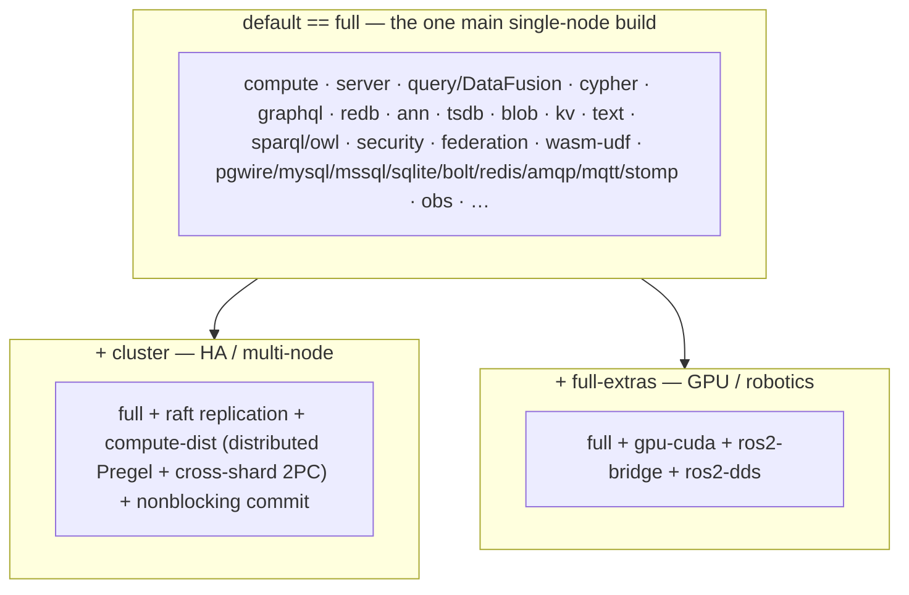

# One build, opt-in layers

The engine ships as **one binary** built from a single Cargo workspace. The `default`
build *is* the full-featured Rust build: every main feature that compiles without an
external GPU or robotics toolchain. Two **opt-in feature layers** stack on top for the cases the
single-node main build cannot cover on its own. This page is the **feature-composition
map**; for build commands, wheel recipes, and Docker, see [Deployment](../deployment.md).

The engine is the same redb-authoritative store at every supported scale. The
published wheel contains the main Rust build; Python extras select Python runtime
dependencies and never recompile or reduce the Rust binary.

---

## The one main build (`default` == `full`)

`cargo build` — with no flags — produces the full-featured engine. It carries:

- durable **redb-authoritative** storage, the embedded/served transports;
- **graph + algorithms**, ANN vectors, **Cypher**, **GraphQL**;
- **SQL** via DataFusion (`query`) + the cross-modal unified planner;
- **RDF / SPARQL / OWL** reasoning (incl. OWL-DL, SHACL, ShEx, GeoSPARQL);
- **time-series** (tsdb), the **BLOB** CAS, the generic **KV** surface;
- **BM25 full-text** (Tantivy), federation (HTTP + external SQL);
- the **security** stack (RLS, hash-chained audit, ChaCha20 encryption-at-rest);
- **WASM UDFs**, streaming/CDC, the result cache, cold-tier seam, per-tenant cost budget;
- observability ingest **and** egress (logs/metrics/PromQL/traces, `otel` + `otel-export`);
- the **compressed KV-cache** warm tier + redb-persisted ANN codes;
- the entire hand-rolled **wire family**: `pgwire` (Postgres), `mysql-wire`, `mssql-wire`,
  `sqlite-wire`, `bolt-wire` (Neo4j), `redis-wire`, and the broker wires
  `amqp-wire` / `mqtt-wire` / `stomp-wire`.

Every one of those is either pure-Rust or vendors its C dependency (Tantivy's `zstd-sys`,
bundled `rusqlite`), so the whole build needs no external toolchain — just a C compiler,
which every manylinux/CI image already has.

---

## The two opt-in layers

Selected explicitly at build time; **neither is published as its own wheel**.

| Layer | Adds | Why it is not in the default build |
|-------|------|------------------------------------|
| **`cluster`** | openraft replication, `compute-dist` (cross-shard Pregel + 2PC), `nonblocking` commit | Raft/HA is a **multi-node** concern; the single-node main build links no openraft |
| **`full-extras`** | `gpu-cuda` (real CUDA backends), `ros2-bridge` + `ros2-dds` (ROS2 over rosbridge/DDS) | Need a **GPU / robotics toolchain** to RUN (they build clean everywhere via dynamic-loading) |

Both layers are a strict superset of the main build, so each is a complete full-featured
engine **plus** its extra capability.

---

## Invariants (asserted by `cargo tree`)

SQL/DataFusion is part of the main build. These dependency boundaries gate the tree:

| Dependency | In the default/main build? | Enforced by |
|------------|:--------------------------:|-------------|
| DataFusion | **yes** (query is a main feature) | `cargo tree -i datafusion` on default |
| PyO3 | **no** — in any build (`bindings = "bin"`) | `scripts/check_no_pyo3.sh` |
| openraft | **no** — `cluster`-only | `cargo tree -i openraft` on default ⇒ none |
| cudarc / rustdds | **no** — `full-extras`-only | `cargo tree -i cudarc` / `-i rustdds` on default ⇒ none |

The engine binary never links a Python extension. Release composition places the
compiled numeric extension at `epistemic_graph.numeric` in the same wheel while
preserving the server binary's no-PyO3 boundary.

## Cargo `full` and Python `[full]`

These names apply at different layers:

- Cargo `full` is the Rust feature aggregate and is enabled by `default`; it includes
  the server, query engines, durable store, wire surfaces, native analytics, numeric
  kernels, and program optimization.
- Python `[full]` is an installation extra for the already-compiled wheel. It adds
  Python-side OWL, LMCache, and numeric-interoperability dependencies. It includes
  the Python `numeric` extra, so no second numeric extra is needed.

See [Deployment](../deployment.md) for the `cargo build` / `maturin` / Docker recipes and
[the cost model](../cost_model.md) for mapping a workload to RAM and shard count.
