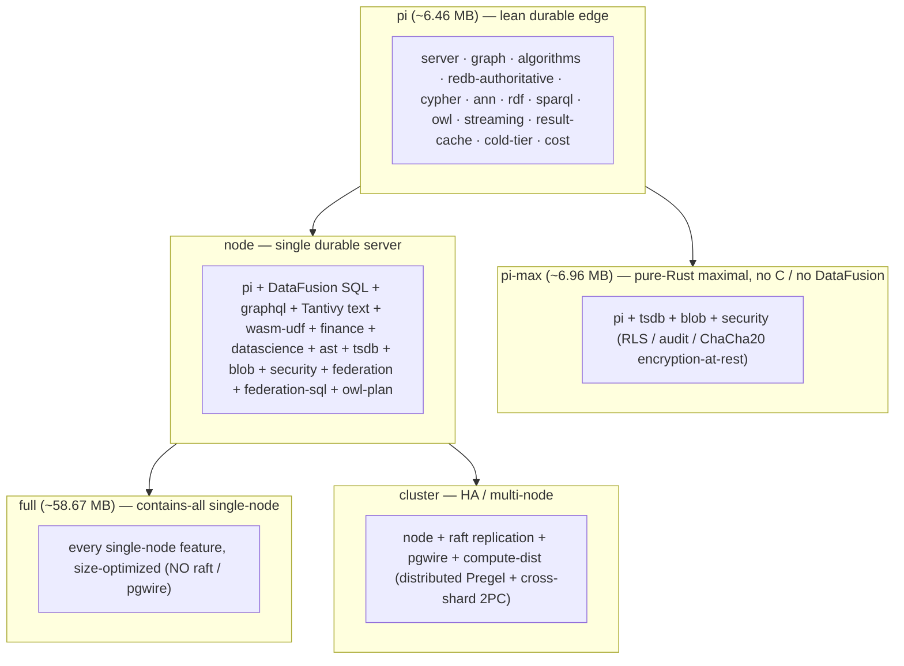

# Tiers & binaries

The engine ships as **one binary family** built from a single Cargo workspace, where deployment tiers
are cargo feature bundles. The same code is an embedded library on a Pi, a single durable server, or a
replicated cluster — you pick the smallest tier that fits. This page is the **feature-composition map**;
for build commands, wheel recipes, and Docker, see [Deployment](../deployment.md).

> **Vocabulary note.** There is **no "tiny = SQLite/LadybugDB"** and **no L0/L1/L2/L3 tier** model.
> "Tiny" is simply the auto-started **`pi`-tier engine binary**. The engine is the one store at every
> scale, redb-authoritative throughout.

---

## Feature containment

Each larger tier is a strict superset of the one below it (except `pi-max`, which is a pure-Rust
sideways maximal of `pi`, and `full`, which is the contains-all single-node build). Raft + pgwire +
distributed compute are **cluster-only**, so a `pi` / `node` / `full` build links no openraft and (for
`pi` / `pi-max`) no DataFusion — the Pi contract.

---

## The four prebuilt binaries (plus full)

CI cross-builds size-optimized wheels per platform/arch, so a Pi pulls a prebuilt wheel and **never
compiles** (the long LTO / C-dep build is a build-host concern only). The `release-tiny` profile
(`opt-level = "z"`, fat LTO, one codegen unit, `strip`, `panic = "unwind"` kept — a panic stays
recoverable) produces these sizes:

| Binary | Approx. size | DataFusion? | Tantivy? | Raft / pgwire? | Notes |
|--------|--------------|:-----------:|:--------:|:--------------:|-------|
| **pi** | ~6.46 MB | no | no | no | lean durable edge; ships native RDF/SPARQL/OWL + ANN + Cypher, all pure-Rust |
| **pi-max** | ~6.96 MB | no | no | no | every pure-Rust feature that fits a Pi-3 without a C toolchain (+tsdb/blob/security) |
| **node** | single-node | **yes** | **yes** | no | adds SQL/GraphQL/text/wasm-udf/federation + finance/datascience/ast |
| **cluster** | HA | yes | yes | **yes** | adds Raft replication, pg-wire SQL, distributed compute, cross-shard 2PC |
| **full** | ~58.67 MB | yes | yes | no | the "contains-all smallest": every single-node feature in one size-optimized binary |

The genuinely-Pi-3-friendly maximal build is **`pi-max`** — it links **no** DataFusion, Tantivy/zstd,
openraft, pgwire, ring/openssl, or any C-toolchain dependency (asserted by `cargo tree` in CI), while
still carrying time-series, the BLOB CAS, and the full RLS/audit/encryption security stack.

---

## What forces a heavier tier

The Pi contract — "no DataFusion and no C toolchain on `pi`/`pi-max`" — is what partitions the feature
set. Reach for a heavier tier only when you need:

| You need… | Tier | Why it is not in `pi` |
|-----------|------|-----------------------|
| SQL `SELECT` / cross-modal `Filter` / pg-wire | `node` (+ `cluster` for pg-wire) | DataFusion + Arrow are heavy |
| BM25 full-text + RRF hybrid | `node` | Tantivy pulls a C `zstd-sys` build |
| WASM UDFs | `node` | wasmtime + cranelift are heavy |
| Query federation (remote / HTTP / external SQL) | `node` | a rustls/sqlx TLS stack |
| GraphQL read surface | `node` | kept out of the lean tier (not a Pi requirement) |
| Replication / HA / cross-shard txns / distributed compute | `cluster` | openraft + the multi-Raft coordinator |
| Time-series, BLOB CAS, RLS/audit/encryption | `pi-max` or up | pure-Rust, but not part of the leanest `pi` |

Everything in `pi` — durable redb authority, ANN vectors, Cypher, RDF/SPARQL/OWL reasoning, streaming
CDC, the result cache, the cold-tier seam, and the per-tenant cost budget — is **pure-Rust and
Pi-safe**, so even the smallest binary is a durable, reasoning, vector-searchable engine.

See [Deployment](../deployment.md) for the `cargo build` / `maturin` / Docker recipes per tier and
[the cost model](../cost-model.md) for mapping a workload to RAM and shard count.
