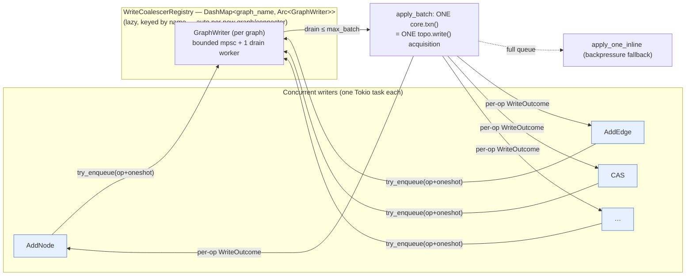

# Per-Graph Write Coalescer (`CONCEPT:KG-2.182`)

> Turns N concurrent single-op writes to ONE graph into ONE topology-lock
> acquisition per batch — the within-graph parallelism that lets the `__commons__`
> ingestion firehose stop serializing one-op-at-a-time on a single lock.

## The contention point

Every structural write to a graph (`add_node` / `add_edge` / `compare_and_set` /
`remove_*`) opens a one-shot [`GraphTxn`](../../crates/eg-core/src/graph.rs), which
holds that graph's single `topo.write()` lock for the op's duration
(`GraphCore::topo`, `graph.rs`). DIFFERENT graphs already isolate — each has its own
`GraphCore` with its own lock, so `__control__` vs `__commons__` never contend (proved
by `test_writers_to_distinct_graphs_do_not_serialize`). The remaining bottleneck is
**within one graph**: M writers to the same hot graph each take and release that one
lock in turn — M acquisitions, M ledger pushes, and any control-plane work sharing
that graph waits behind the ingestion stream.

## The design

For each graph, a lazily-created **`GraphWriter`** (`src/write_coalescer.rs`) owns a
bounded `tokio::mpsc` channel and a single drain worker. Producers enqueue a
`WriteOp` (carrying a `oneshot` reply) instead of taking the lock themselves; the
worker greedily drains up to `max_batch` queued ops, opens **ONE** `core.txn()`,
applies the whole batch under that single guard, then replies to each producer. So M
concurrent writers cost **⌈M / batch⌉** lock acquisitions instead of M, while each op
still gets its own result (an `add_edge` to a missing endpoint returns its own `Err`;
CAS returns its own boolean).

### Lazy, dynamic, NOT hardcoded

Writers live in a `DashMap<String, Arc<GraphWriter>>` (`ServerState.write_coalescer`)
keyed by graph name and created on the first write to a name
(`WriteCoalescerRegistry::writer_for`) — the exact lazy-keyed pattern already used by
`ServerState::per_graph_inflight` (the per-graph admission semaphore). A brand-new
graph — a future per-connector channel, or `__commons__` itself — gets its own writer
**automatically, with no code change and no hardcoded list**. (Regression:
`lazy_writer_is_created_per_new_graph_name`.)

### Side-effects stay centralized in the dispatch shell

The worker applies ONLY the in-memory mutation under the txn and returns its outcome.
`mark_dirty` / WAL append (`svc.append`) / size gauges remain in
`dispatch::dispatch_graph_op`, run per-op against the returned `Response` — so the
crash-consistency (WAL) and checkpoint (dirty) contracts are byte-for-byte unchanged;
only **where** the lock is taken moved. The `wal_method` is captured *before* the
coalesced fast path runs, so a coalesced write logs to the WAL exactly as the inline
path did. (Verified by `wal_service_logs_dispatch_then_checkpoint_truncates`, which
exercises the dispatch path and still passes.)

### CAS exactly-once is preserved

A `compare_and_set` batched with other CAS ops on the same node still executes its
read-modify-write under the single held guard, one op at a time, so the claim path's
exactly-once invariant holds: of N concurrent claimers of one node, exactly one wins.
A decode failure short-circuits to `Bool(false)` without enqueuing — identical to the
inline handler. (Regressions: `cas_is_exactly_once_under_coalescing`,
`dispatch_cas_exactly_once_under_coalescing`.)

### Backpressure — never a stall, never a drop

`try_enqueue` is non-blocking. On a full bounded queue (or a gone worker) the op is
handed BACK and applied inline under its own txn (`apply_one_inline`) — so a saturated
worker degrades to the pre-coalescer behavior rather than stalling the reactor or
losing a write.

## Auto-sizing (no per-connector knob)

`CoalescerConfig::auto()` derives the tuning from `available_parallelism()` (per
*Configuration discipline* — a hardware/load tunable is auto-sized, not a flag):

| Field | Default | Rationale |
|------|---------|-----------|
| `max_batch` | `(cpus*8).clamp(16,256)` | more cores → more concurrent producers → a larger batch amortizes the lock further, while a clamp keeps p99 lock-hold low |
| `queue_capacity` | `(max_batch*4).clamp(256,4096)` | a few batches in flight without unbounded growth |
| `max_linger` | 200 µs | a tiny window for a lone op to let a burst coalesce; a single write is essentially undelayed |

The **only** env is the opt-out master switch `EPISTEMIC_GRAPH_WRITE_COALESCE=0`
(read once at startup) for an operator who needs the strictly-inline path. Default ON.

## Observability

Two Prometheus counters per graph (bounded label space):

- `epistemic_graph_write_batches_total{graph}` — topology-lock acquisitions on the
  coalesced path (= committed batches).
- `epistemic_graph_write_batched_ops_total{graph}` — single-op writes those
  acquisitions applied.

`ops / batches` is the average batch size = the lock-acquisitions-saved ratio. The
same counts are also kept process-locally (`GraphWriter::stats()`) for tests.

## Benchmark (before / after)

`write_coalescer::tests::bench_inline_vs_coalesced` (release, 8 worker threads,
N = 50,000 writes, 64 pipelined producers to ONE graph):

| Path | Wall-clock | Topology-lock acquisitions | Avg batch |
|------|-----------:|---------------------------:|----------:|
| **Inline** (one txn/op — pre-coalescer) | 286 ms | 50,000 (1/op) | 1.0 |
| **Coalesced** | 144 ms | 870 | 57.5 ops/lock |

→ **57.5× fewer lock acquisitions, ~2× wall-clock** under a realistic *pipelined*
firehose. Note the win requires producers that pipeline (fire ops without blocking on
each reply — how the ingestion client actually streams); a synthetic
request-reply-per-op loop coalesces poorly (avg batch ~5) and the oneshot overhead can
make it slower, so the headline guarantee asserted by the suite is the lock-acquisition
reduction (the contention property), not a fixed wall-clock multiple.

## Files

- `src/write_coalescer.rs` — `WriteOp`, `WriteOutcome`, `GraphWriter`,
  `WriteCoalescerRegistry`, `BatchStats`, `CoalescerConfig`.
- `src/server/state.rs` — `ServerState.write_coalescer` field.
- `src/server/dispatch.rs` — `try_coalesce_write` fast path in `dispatch_graph_op`.
- `src/metrics.rs` — `write_batch_committed` + the two counters.
