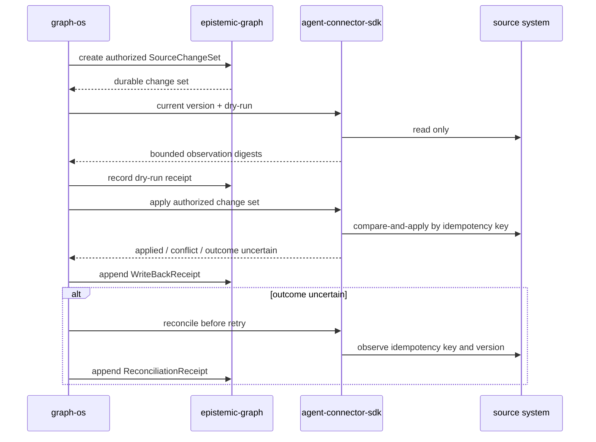

# Governed connector write-back

`Method::WriteBack` is the durable half of RF-ADR-009 D18. Epistemic-graph owns
versioned `SourceChangeSet` records and append-only `WriteBackReceipt` and
`ReconciliationReceipt` streams. It does not contain a vendor client and never
calls a source system. The agent-connector-sdk owns those source transports.

Every create or append is bound again at the EG server boundary to the verified
tenant, opaque actor and idempotency key. A caller-provided authorization mode or
reference is not authority: the change set also records an affirmative decision,
its policy digest, and its input/output/decision digests. The closed modes are
`proposal_approval`, `standing_policy`, and `manual_trigger`.

The records share the existing tenant-scoped Agent Library ControlRedb owner and
mutation kernel. Change-set, idempotency and receipt rows commit before the
response is acknowledged; receipts are keyed by monotonically increasing sequence
and can only be inserted. There is no second database, write-behind path, receipt
deletion, or compatibility schema.

The change-set digest is the framed SHA-256 of the named MessagePack record with
its own digest field set to 32 zero bytes; nested JSON objects are key-sorted
recursively before encoding. EG recomputes it on admission. Attempt receipts also
recompute the digest of the exact authorized field scope and patch, and reject a
different patch or base source version.

An apply is accepted only after a successful dry-run, or after reconciliation has
proved a prior uncertain attempt had no effect and explicitly permits retry. An
uncertain effect blocks retry until a reconciliation receipt is appended. An
applied effect is never retryable. Rollback is represented by a new authorized
change set.

## Agent Library successor layout

Connector-pack import and governed write-back must ship as one Agent Library
physical-layout successor, not as two intermediate generations. The frozen
predecessor contains the original eight owner tables:

- `agent_library`, `agent_library_heads`
- `agent_graph`, `agent_graph_heads`
- `agent_component`, `agent_component_heads`
- `agent_template`, `agent_template_heads`

The combined successor contains those eight, the five connector-pack tables
`connector_pack_heads`, `connector_pack_members`, `connector_pack_imports`,
`connector_pack_body_holders`, and `connector_pack_bindings`, plus the four D18
tables `write_back_change_sets`, `write_back_idempotency`,
`write_back_receipts`, and `write_back_receipt_heads`. No ConnectorPack-only or
D18-only layout is a recognized predecessor.

Until an additive migration is separately accepted, the current safe transition
is one named refusal for the original-eight predecessor: `Agent Library before
connector packs and governed write-back`. The operator must preserve and move the
old file aside before creating the 17-table successor. This lane does not invent
a live manifest rewrite or a second write-back authority.
