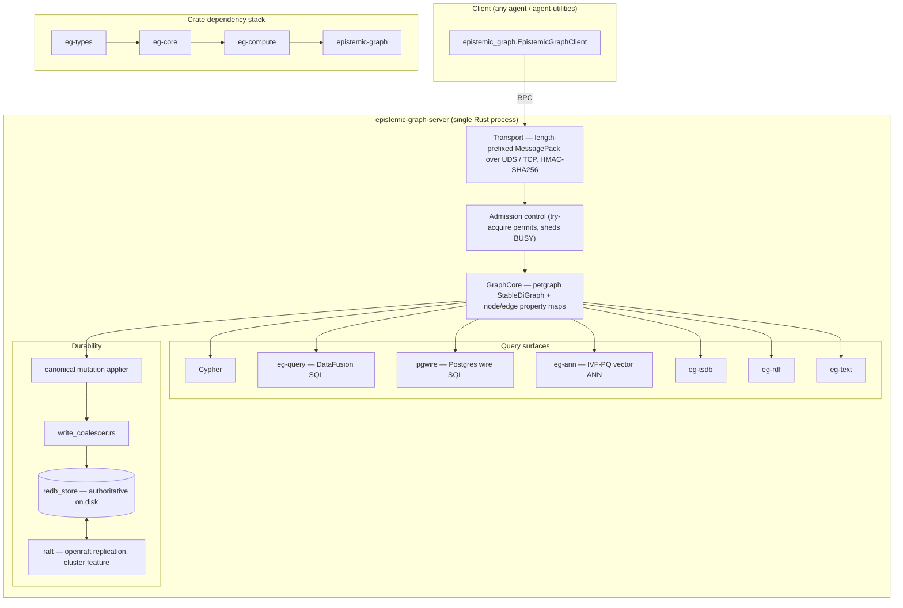
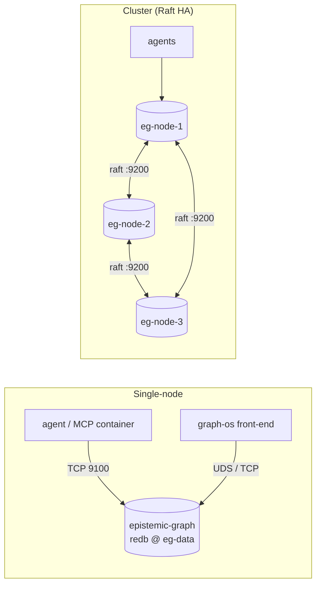
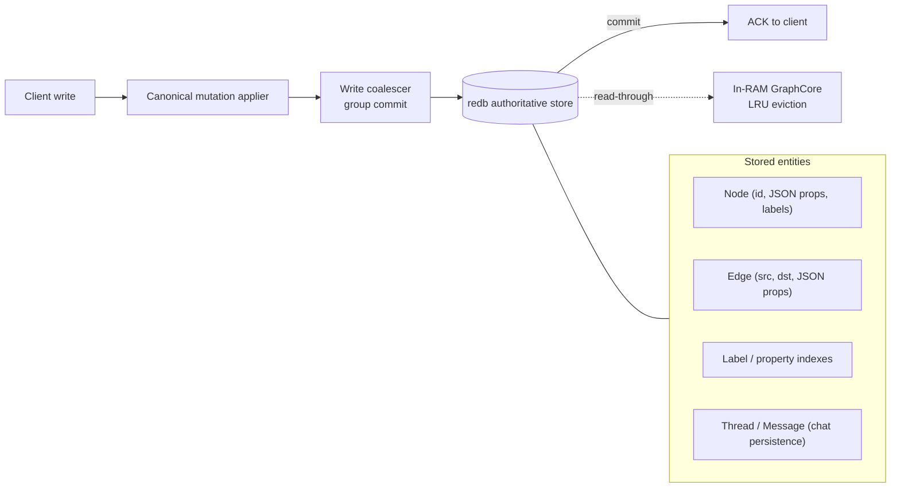

# Deploying epistemic-graph as a database

`epistemic-graph` is a **durable, Rust-native graph database engine**. It is a hard base
dependency of `agent-utilities`, so every Agent Utilities install carries the one supported
`epistemic-graph[full]` artifact. A local GraphOS process can autostart and supervise that
artifact over a private UDS socket, or it can connect to a **standalone, centralized database
container** shared across many agents. This guide covers the standalone deployment: container
recipes, connection configuration, the configuration surface, and the database architecture.

> **Managed local process vs centralized service.** The `agent-utilities[mcp]` extra adds the
> MCP serving surface on top of the same mandatory full engine; `agent-utilities[agent-runtime]`
> additionally adds model orchestration. Neither extra selects or owns a different engine
> build. Run the standalone server (below) when you want **one knowledge graph shared by
> multiple agents**, durable separately from any agent process, or replicated for high
> availability.

---

## One build + two opt-in layers (cargo feature flags)

> This section is the **build-recipe** view. For the conceptual **feature-composition
> map** (what the main build contains and the two opt-in layers) see
> [One build, opt-in layers](architecture/tiers.md).

There is **one build** (CONCEPT:EG-KG.sharding.deployment-tiers): `cargo build` (== `--features full`) is the
full-featured engine — all MAIN features that compile without an external GPU/robotics
toolchain. The **release Docker image installs the published main wheel via `uv`** (no
cargo compile — see [`docker/Dockerfile`](https://github.com/Knuckles-Team/epistemic-graph/blob/main/docker/Dockerfile)). Two opt-in layers stack on top, built explicitly
from source (they are NOT published wheels):

| Build | `--features` | Adds on top of the main build | Use when |
|-------|--------------|-------------------------------|----------|
| **main** (default wheel) | *(none)* / `full,ast-extended` | — the full single-node DB: query/DataFusion + cypher + graphql + redb + ann + tsdb + blob + kv + text + sparql/rdf/owl/owl-plan + streaming + wasm-udf + security + federation + the whole wire family (**pgwire**/mysql/mssql/sqlite/bolt/redis/amqp/mqtt/stomp) + obs + result-cache + cold-tier + cost | Any single-node deployment, Pi 4+ to workstation |
| **cluster** | `cluster,ast-extended` | **Raft replication** + `compute-dist` (distributed Pregel + cross-shard 2PC) + `nonblocking` commit | HA / multi-node |
| **full-extras** | `full-extras,ast-extended` | real **CUDA** backends + **ROS2** bridge/DDS | GPU / robotics hosts |

The main build includes `redb`, so the **persist dir is the authoritative source of
truth** and a committed write survives `kill -9` (commit-before-ack). It targets
**Raspberry Pi 4+** (not Pi 3).

### Size-optimized build (`release-tiny` profile)

For a smaller binary, build with the size-optimized `release-tiny` cargo profile (in the
workspace `Cargo.toml`). It inherits `release` but uses `opt-level = "z"`, fat LTO, one
codegen unit, `strip = true`, and `panic = "unwind"` (kept — this is a DB; unwind keeps a
panic recoverable rather than aborting the process). The default `release` profile is
untouched, so normal builds are unaffected.

```bash
# the main build, smallest binary
cargo build --profile release-tiny
```

Because the CI matrix cross-builds the wheel per platform/arch (`.github/workflows/release-build.yml`),
the target host pulls a prebuilt wheel and **never compiles** — the C-dep / long LTO build
is a build-host concern only.

### Wheel packaging recipes (prebuilt, no target-side compile)

`maturin` forwards `--profile` to cargo. `--no-default-features` keeps the selected layer
as the exact feature set (so the `[tool.maturin]` default is not unioned on top).

```bash
# THE published wheel — the one main build
maturin build --release

# HA layer wheel (built from source, not published to PyPI)
maturin build --release --no-default-features --features cluster,ast-extended

# GPU/robotics layer wheel (built from source, not published to PyPI)
maturin build --release --no-default-features --features full-extras,ast-extended
```

The CI `wheels` job reads the exact compiler version from the tracked
`rust-toolchain.toml`, derives `SOURCE_DATE_EPOCH` from the source revision, and keeps
native work serial. For every platform it builds the full server and numeric component
twice from clean Cargo state into independent output roots, folds and normalizes both
wheels, privacy-audits every member, and requires matching SHA-256 digests before staging
the sole publish candidate. Publication remains restricted to an authorized release tag.
`cluster` and `full-extras` are source-built feature layers and are not additional
published wheel variants.

---

## Single-node (durable, recommended start)

### Docker Compose

```bash
export GRAPH_SERVICE_AUTH_SECRET="$(openssl rand -hex 32)"
: "${EPISTEMIC_GRAPH_SIGNER_KEYS_JSON:?load from a secret provider}"
: "${TLS_CERT_FILE:?required}"
: "${TLS_KEY_FILE:?required}"
export EPISTEMIC_GRAPH_AUDIENCE=epistemic-graph
export EPISTEMIC_GRAPH_TENANT=tenant:default
export EPISTEMIC_GRAPH_POLICY_VERSION=policy:initial
docker compose -f docker/compose.yml up -d server
```

The bundled [`docker/compose.yml`](https://github.com/Knuckles-Team/epistemic-graph/blob/main/docker/compose.yml)
builds the image, exposes TLS native RPC, and persists to the named volume
`eg-data`. Auxiliary listeners remain loopback-only inside the deployment.

### Plain `docker run`

```bash
: "${CONTAINER_DATA_DIR:?set to the image data directory}"
docker volume create eg-data
docker run -d --name epistemic-graph \
  -e GRAPH_SERVICE_AUTH_SECRET \
  -e EPISTEMIC_GRAPH_AUDIENCE=epistemic-graph \
  -e EPISTEMIC_GRAPH_TENANT=tenant:default \
  -e EPISTEMIC_GRAPH_POLICY_VERSION=policy:initial \
  -e EPISTEMIC_GRAPH_SIGNER_KEYS_JSON \
  -e GRAPH_SERVICE_PERSIST_DIR="${CONTAINER_DATA_DIR}" \
  -e GRAPH_SERVICE_TCP_ADDR=0.0.0.0:9100 \
  -e GRAPH_SERVICE_TLS_CERT=/run/secrets/server.crt \
  -e GRAPH_SERVICE_TLS_KEY=/run/secrets/server.key \
  -p 9100:9100 \
  --mount type=bind,src="${TLS_CERT_FILE}",dst=/run/secrets/server.crt,readonly \
  --mount type=bind,src="${TLS_KEY_FILE}",dst=/run/secrets/server.key,readonly \
  -v eg-data:"${CONTAINER_DATA_DIR}" \
  <registry>/epistemic-graph:<tag>
```

> Load `GRAPH_SERVICE_AUTH_SECRET` and `EPISTEMIC_GRAPH_SIGNER_KEYS_JSON` from a
> runtime secret provider. The served binary requires `security`, accepts only
> `eg2.` envelopes, and refuses to start without its audience, tenant, policy
> revision, signer registry, and durable replay store. Routable native TCP requires
> TLS/mTLS. Auxiliary listeners are loopback-only; use a co-located authenticated
> TLS gateway instead of binding them to a routable interface.

---

## High availability (Raft, `cluster` feature)

The `cluster` feature replicates the authoritative redb store across nodes via in-engine openraft.
Run one container per node with a matching node id and the shared peer list:

```bash
: "${CONTAINER_DATA_DIR:?set to the image data directory}"
: "${EPISTEMIC_GRAPH_SIGNER_KEYS_JSON:?load from a secret provider}"
: "${TLS_CERT_FILE:?required}"
: "${TLS_KEY_FILE:?required}"
: "${RAFT_AUTH_SECRET_FILE:?required}"
SECRET="$(openssl rand -hex 32)"
docker run -d --name eg-node-1 \
  -e GRAPH_SERVICE_AUTH_SECRET="$SECRET" \
  -e EPISTEMIC_GRAPH_AUDIENCE=epistemic-graph \
  -e EPISTEMIC_GRAPH_TENANT=tenant:default \
  -e EPISTEMIC_GRAPH_POLICY_VERSION=policy:initial \
  -e EPISTEMIC_GRAPH_SIGNER_KEYS_JSON \
  -e GRAPH_SERVICE_TCP_ADDR=0.0.0.0:9100 \
  -e GRAPH_SERVICE_TLS_CERT=/run/secrets/server.crt \
  -e GRAPH_SERVICE_TLS_KEY=/run/secrets/server.key \
  -e EPISTEMIC_GRAPH_RAFT_NODE_ID=1 \
  -e EPISTEMIC_GRAPH_RAFT_PEERS="1@eg-node-1:9200,2@eg-node-2:9200,3@eg-node-3:9200" \
  -e EPISTEMIC_GRAPH_RAFT_AUTH_SECRET_FILE=/run/secrets/raft-auth \
  -e GRAPH_SERVICE_PERSIST_DIR="${CONTAINER_DATA_DIR}" \
  --mount type=bind,src="$RAFT_AUTH_SECRET_FILE",dst=/run/secrets/raft-auth,readonly \
  --mount type=bind,src="${TLS_CERT_FILE}",dst=/run/secrets/server.crt,readonly \
  --mount type=bind,src="${TLS_KEY_FILE}",dst=/run/secrets/server.key,readonly \
  -p 9100:9100 \
  -v eg-data-1:"${CONTAINER_DATA_DIR}" \
  <registry>/epistemic-graph:<tag>
# repeat for eg-node-2 (NODE_ID=2) and eg-node-3 (NODE_ID=3)
```

`RAFT_AUTH_SECRET_FILE` must reference the same operator-provisioned random secret
(at least 32 bytes) on every member and must be service-account-only (`0600` on
Unix). Raft authenticates peer ids during a nonce handshake and encrypts every frame;
multi-member or non-loopback startup fails closed without this key. The inline
`EPISTEMIC_GRAPH_RAFT_AUTH_SECRET` alternative is supported but exposes the key to
process-environment inspection and is not recommended.

---

## Connecting an agent

Local native clients use the per-platform **UDS**; remote native clients use
verified **TLS** (`9100`). Agent Utilities and GraphOS select topology only from
`GRAPH_SERVICE_ENDPOINTS` and resolve authentication and trust through named
AgentConfig references. The native Epistemic Graph client instead receives
`socket_path` or `tcp_addr` explicitly; the listener variables in the
configuration table below are server settings, not Agent Utilities topology
selectors.

```bash
# GraphOS / Agent Utilities topology (remote or local URI list)
: "${GRAPH_SERVICE_ENDPOINTS:?set canonical service endpoints}"
# Select named authentication and TLS profiles in AgentConfig. Secrets and
# certificate paths are resolved from references at runtime, not embedded here.

# A direct native client passes socket_path=... or tcp_addr=... explicitly.
```

```python
from epistemic_graph import EpistemicGraphClient
import asyncio

async def main():
    context = {
        "principal": "service:client",
        "tenant": "tenant:default",
        "audience": "epistemic-graph",
        "agent_id": "service:client",
        "roles": ["graph-client"],
        "scopes": ["kg:read", "kg:write"],
        "policy_version": "policy:initial",
        "delegation": [],
    }
    client = await EpistemicGraphClient.connect(verified_context=context)
    await client.nodes.add("node:example", {"type": "Entity"})
    print(await client.nodes.has("node:example"))
    await client.close()

asyncio.run(main())
```

---

## Configuration reference

| Argument | Env var | Default | Description |
|----------|---------|---------|-------------|
| `--socket-path` | `GRAPH_SERVICE_SOCKET` | platform runtime socket | UDS socket path (local clients) |
| `--tcp-addr` | `GRAPH_SERVICE_TCP_ADDR` | loopback | Native TCP/TLS RPC listener |
| `--tcp-tls-cert` / `--tcp-tls-key` | `GRAPH_SERVICE_TLS_CERT` / `GRAPH_SERVICE_TLS_KEY` | — | PEM server identity; required together for routable native TCP |
| `--tcp-tls-client-ca` | `GRAPH_SERVICE_TLS_CLIENT_CA` | — | Optional CA bundle that enables required client certificates |
| — | `EPISTEMIC_GRAPH_PGWIRE_AUTH` | `scram` | Mandatory SCRAM; any other value or missing key material fails startup |
| — | `EPISTEMIC_GRAPH_MYSQL_AUTH` | `native` | Mandatory native-password proof; any other value or missing key material fails startup |
| — | Bolt auth token | `epistemic` | Fresh hex-MessagePack `Health` request carrying the current `eg2.` envelope; its signed graph/tenant/audience/policy/scopes become the session authority |
| — | MSSQL/AMQP/MQTT/STOMP protocol auth | fixed HMAC derivation | Mandatory domain-separated credential proof from `GRAPH_SERVICE_AUTH_SECRET`; missing key material fails startup |
| `--auth-secret` | `GRAPH_SERVICE_AUTH_SECRET` | — (**required**) | Non-empty HMAC-SHA256 secret for `eg2.` envelopes |
| — | `EPISTEMIC_GRAPH_REQUIRE_OIDC` | unset ⇒ **required** (secure by default since 2026-07-22) | MANDATORY-OIDC posture. Unset/unrecognized ⇒ every request must carry a verified OIDC bearer token bound to its `principal`/`tenant`, and the server refuses to **start** if no OIDC issuer is configured. Explicit, deliberate opt-out for local/dev only: `false`/`0`/`no`/`off` restores pre-2026-07-22 HMAC-only-permitted behavior. See [Migrating to OIDC-required](#migrating-to-oidc-required) below. |
| — | `EPISTEMIC_GRAPH_OIDC_JWT_ISSUER` (falls back to `OIDC_ISSUER`) | — (required when `EPISTEMIC_GRAPH_REQUIRE_OIDC` is not explicitly opted out) | Keycloak realm issuer URL, e.g. `https://keycloak.example/realms/eg` |
| — | `EPISTEMIC_GRAPH_OIDC_JWT_AUDIENCE` (falls back to `OIDC_AUDIENCE`) | — (required alongside the issuer) | Expected `aud` claim — the Keycloak client id/audience minted for `epistemic-graph` |
| — | `EPISTEMIC_GRAPH_OIDC_JWKS_URL` | — (required alongside the issuer, no fallback) | Keycloak realm JWKS endpoint, e.g. `https://keycloak.example/realms/eg/protocol/openid-connect/certs` |
| — | `EPISTEMIC_GRAPH_AUDIENCE` | — (**required**) | Exact audience accepted by request verification |
| — | `EPISTEMIC_GRAPH_TENANT` | — (**required**) | Exact tenant accepted by request verification |
| — | `EPISTEMIC_GRAPH_POLICY_VERSION` | — (**required**) | Exact authorization-policy revision accepted by request verification |
| — | `EPISTEMIC_GRAPH_SIGNER_KEYS_JSON` | — (**required**) | Runtime secret map of trusted operation signer ids to HMAC keys |
| — | `EPISTEMIC_GRAPH_BACKUP_ROOT` | unset (RPC disabled) | Private operator-owned root for logical-name online backup/restore RPCs |
| — | `EPISTEMIC_GRAPH_SQLITE_TRANSFER_ROOT` | unset (RPC disabled) | Private operator-owned root for logical `.db` import/export names |
| — | `EPISTEMIC_GRAPH_SQLITE_MAX_BYTES` / `EPISTEMIC_GRAPH_SQLITE_MAX_ROWS` | 256 MiB / 1,000,000 | SQLite transfer resource ceilings |
| `--persist-dir` | `GRAPH_SERVICE_PERSIST_DIR` | image data volume | Mandatory durable redb store and replay ledger |
| — | `EPISTEMIC_GRAPH_REDB_COMMIT_POLICY` | engine default | `each`, `interval`, or positive milliseconds; invalid/zero values fail startup and durability cannot be disabled |
| `--metrics-addr` | `GRAPH_SERVICE_METRICS_ADDR` | `127.0.0.1:9101` (image) | Prometheus `/metrics` listener |
| — | `EPISTEMIC_GRAPH_RAFT_NODE_ID` | — | Raft node id (`cluster`) |
| — | `EPISTEMIC_GRAPH_RAFT_PEERS` | — | `id@host:port` peer list (`cluster`) |
| — | `EPISTEMIC_GRAPH_RAFT_AUTH_SECRET_FILE` | — (**required outside one-member loopback**) | Runtime file reference for the shared Raft transport key; inline `…_RAFT_AUTH_SECRET` is the less-private alternative |

Ports: **9100** RPC (clients), **9101** Prometheus metrics. Mount a
deployment-managed durable volume at the configured data directory.

### Direct plaintext protocol listener boundary

PGWire, MySQL, MSSQL TDS, Bolt, AMQP, MQTT and STOMP are plaintext protocol
backends, not production ingress stacks. They reject non-loopback binds
unconditionally. To serve remote clients, place an authenticated TLS/mTLS
sidecar or gateway in the same host/pod network
namespace and forward it to the loopback listener. The protocol's own cryptographic
login remains mandatory and binds the verified principal to engine ACLs; a
gateway-supplied principal string alone is never authority.

Authentication cannot be disabled on any of these listeners. Missing key material,
unknown auth values and self-asserted principals fail startup or
authentication in every profile. Fixed credential derivations are domain-separated:
`mssql:`, `amqp:`, `mqtt:` and `stomp:` plus the verified principal.

### Migrating to OIDC-required

Since 2026-07-22, `EPISTEMIC_GRAPH_REQUIRE_OIDC` defaults ON (unset ⇒ required — see
`src/server/auth.rs`'s `require_oidc()`). This closes the primary `eg2.` protocol's
Identity boundary seam: previously, the HMAC envelope alone (`GRAPH_SERVICE_AUTH_SECRET`)
was sufficient to claim ANY principal/tenant/roles/scopes; OIDC verification was real but
opt-in. Today, absent explicit configuration, **the server refuses to start** rather than
silently accept HMAC-only identity — the same fail-closed posture as the mandatory
`GRAPH_SERVICE_AUTH_SECRET` gate.

A deployment upgrading past this point needs exactly one of:

1. **Configure OIDC** (recommended for every non-trivial deployment) — set all three:
   - `EPISTEMIC_GRAPH_OIDC_JWT_ISSUER` (or the shared `OIDC_ISSUER`) — the realm issuer URL
   - `EPISTEMIC_GRAPH_OIDC_JWT_AUDIENCE` (or the shared `OIDC_AUDIENCE`) — the expected `aud`
   - `EPISTEMIC_GRAPH_OIDC_JWKS_URL` — the realm JWKS endpoint (no shared fallback)

   Every client must then present a real `oidc_token` (a bearer token from that issuer) inside
   its `eg2.` envelope whose verified `sub`/tenant/roles/scopes match what it self-asserts.
   Homelab deployments point these at **Keycloak** — see the Keycloak-specific note below.

2. **Explicit local/dev opt-out** — set `EPISTEMIC_GRAPH_REQUIRE_OIDC=false` (or `0`/`no`/`off`)
   to keep the pre-2026-07-22 HMAC-only-permitted posture. This must be a deliberate,
   documented choice per deployment; it is never the default.

**What breaks if neither is done:** the server prints
`EPISTEMIC_GRAPH_REQUIRE_OIDC requires OIDC identity binding ... but no usable OIDC verifier
is configured` and exits with status `1` before opening any listener — an immediate, loud
boot failure, not a degraded or partially-open service.

**Keycloak-side configuration this implies:** a confidential OIDC client registered for
`epistemic-graph` in the target realm, with:
- Client authentication ON (confidential client), so callers exchange credentials for a
  real access token — matches the existing SSO pattern the rest of the homelab already uses.
- The access token's issuer (`iss`) reachable at `EPISTEMIC_GRAPH_OIDC_JWT_ISSUER` and its
  audience (`aud`) matching `EPISTEMIC_GRAPH_OIDC_JWT_AUDIENCE` — in Keycloak terms, either
  the client id itself or a configured audience mapper/scope that stamps that value into `aud`.
- The realm's JWKS reachable (network-wise, from every `epistemic-graph` node) at
  `.../realms/<realm>/protocol/openid-connect/certs` — `EPISTEMIC_GRAPH_OIDC_JWKS_URL`.
- Token claims carrying subject (`sub`), a tenant claim (`tenant_id`/`tenant`/`org_id`/`tid`/
  `org` — any one), and roles/scopes the caller's `eg2.` envelope self-asserts (via
  `realm_access.roles`, `resource_access.<client>.roles`, and `scope`/`scp`) — every caller
  (human SSO session or service account/client-credentials grant) must carry a **tenant**
  claim or its requests are rejected (`bind_verified_identity` treats an absent tenant claim
  as proof of nothing, not a wildcard).
- RS256/RS384/RS512 signing only (Keycloak's default) — this verifier explicitly rejects
  `none`/HMAC-signed tokens to prevent an algorithm-downgrade attack.

Nothing about this changes how Keycloak SSO works for humans; it only requires that the
`epistemic-graph` server itself, and every direct `eg2.`-protocol caller (agent-utilities'
`GraphSession`, service accounts, CLI tooling), present a Keycloak-issued token instead of
relying on the shared HMAC secret alone.

---

## Database architecture

### Engine components

The engine is a Cargo workspace: a layered crate stack under one server process that opens the
RPC transports and owns the durable store.



### Deployment topologies



### Write path & data model

Writes are durable **before** the client is acked (commit-before-ack); reads are served from RAM
with a redb read-through for evicted nodes.



---

## Durability & backup

- The configured **persist dir** is the authoritative store — back it up
  by snapshotting the volume. A committed write survives `kill -9`.
- With the `cluster` feature, openraft replicates the authoritative store across nodes.

### Online backup / restore (CONCEPT:EG-KG.sharding.reshard-on-restore)

The redb tier takes a **consistent backup while the engine keeps serving** — no quiesce,
no downtime. Per shard it opens a `begin_read()` MVCC snapshot (CONCEPT:EG-KG.storage.snapshot-read-off-writer) and streams
every table **verbatim** into a portable *backup bundle*: a directory of canonical
`graph-<n>.redb` shard files plus a `MANIFEST.json` (format version, engine version, shard
count K, timestamp + label, row totals). Because the copy is byte-for-byte, encryption-at-rest
ciphertext and the tamper-evident EG-KG.sharding.row-level-security audit chain survive without the key and stay
verifiable. Cross-shard consistency rides commit-before-ack (CONCEPT:EG-KG.backend.authoritative-dispatch): any acked write
is already durably committed, so each per-shard snapshot is a self-consistent committed prefix.

Trigger it live over the wire (mirrors the EG-038 admin RPCs):

```jsonc
// Backup: stream a bundle to a directory.
{"method": {"Backup": {"destination": "scheduled-001", "label": "scheduled"}}}
// Restore: the running engine holds an exclusive lock on its live persist dir, so this
// STAGES the rebuilt copy in a sibling dir and returns only an opaque `stage_ref` plus
// aggregate counts. `target_shards` is required even when K is unchanged.
{"method": {"Restore": {"source": "scheduled-001", "target_shards": 1}}}
```

For an **in-place** restore, stop the engine and use the offline CLI (it can also re-shard on
restore — every graph re-routed by the same EG-KG.backend.sharded-k-way-durable `FNV-1a % K`):

```bash
# Restore at the bundle's own K (state K explicitly).
restore --bundle "${BACKUP_BUNDLE:?}" --persist-dir "${GRAPH_SERVICE_PERSIST_DIR:?}" --shards 1
# Re-shard on restore.
restore --bundle "${BACKUP_BUNDLE:?}" --persist-dir "${TARGET_PERSIST_DIR:?}" --shards 8
```

Both paths are redb-only; a non-redb build returns a clean "not available" error.

### Point-in-time recovery (PITR)

Backup + restore are the low-RPO/RTO DR primitives. PITR to a target instant `T` is:

1. **Restore** the most recent backup bundle taken at or before `T` (`restore` CLI, above) —
   this rebuilds the durable store to that bundle's crash-consistent point.
2. **Replay the durable change-ledger tail forward** from the bundle's timestamp up to `T`. The
   per-graph `LEDGER` table (`(graph, seq) → line`) captured verbatim in the bundle is the
   ordered, timestamped durable history; replaying its entries whose commit time `≤ T` (and
   discarding the tail beyond `T`) rolls the store to the exact instant. Restoring a *fresh*
   bundle with no replay recovers to the backup instant (RPO = backup interval).

The recovery objective is therefore tuned by backup cadence (RPO) and bundle size / shard count
(RTO). Frequent bundles + ledger replay give a low-RPO, low-RTO disaster-recovery story.

## Observability

With `--metrics-addr` set (default `127.0.0.1:9101` in the image), the server exposes
Prometheus text-format metrics — request counts/latency, in-flight permits, `BUSY` rejections,
per-graph node/edge gauges, and auth/ACL failures. See
[service_mode.md](service_mode.md#prometheus-metrics) for the full metric list.
