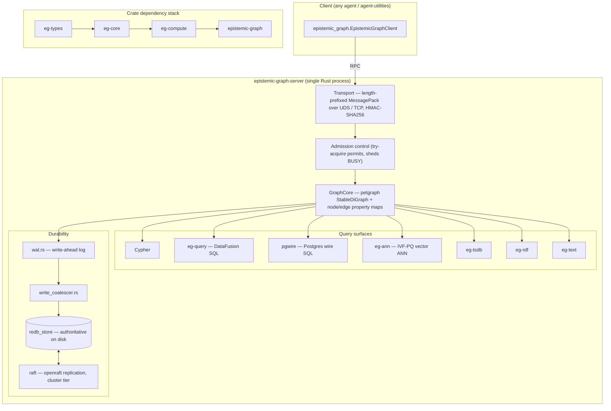
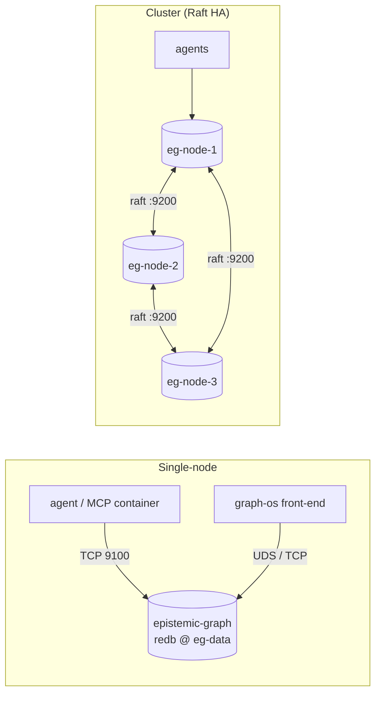
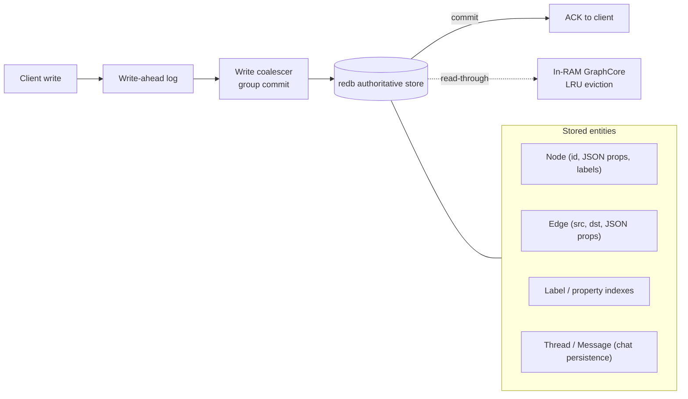

# Deploying epistemic-graph as a database

`epistemic-graph` is a **durable, Rust-native graph database engine**. Agents in the
`agent-packages` fleet can either **embed** it (it ships transitively with
`agent-utilities[agent]`) or connect to a **standalone, centralized database container**
shared across many agents. This guide covers the standalone deployment: container recipes,
connection configuration, the configuration surface, and the database architecture.

> **Embedded vs centralized.** The slim MCP-server install (`<pkg>[mcp]`) does **not** include
> the engine. The full agent install (`<pkg>[agent]`) embeds it for single-process use. Run the
> standalone server (below) when you want **one knowledge graph shared by multiple agents**,
> durable separately from any agent process, or replicated for high availability.

---

## One build + two opt-in layers (cargo feature flags)

> This section is the **build-recipe** view. For the conceptual **feature-composition
> map** (what the main build contains and the two opt-in layers) see
> [One build, opt-in layers](architecture/tiers.md).

There is **one build** (CONCEPT:EG-371): `cargo build` (== `--features full`) is the
full-featured engine — all MAIN features that compile without an external GPU/robotics
toolchain. The **release Docker image installs the published main wheel via `uv`** (no
cargo compile — see [`docker/Dockerfile`](https://github.com/Knuckles-Team/epistemic-graph/blob/main/docker/Dockerfile)). Two opt-in layers stack on top, built explicitly
from source (they are NOT published wheels):

| Build | `--features` | Adds on top of the main build | Use when |
|-------|--------------|-------------------------------|----------|
| **main** (default wheel) | *(none)* / `full,ast-extended` | — the full single-node DB: query/DataFusion + cypher + graphql + redb + ann + tsdb + blob + kv + text + sparql/rdf/owl/owl-plan + streaming + wasm-udf + security + federation + the whole wire family (**pgwire**/mysql/mssql/sqlite/bolt/redis/amqp/mqtt/stomp) + obs + result-cache + cold-tier + cost | Any single-node deployment, Pi 4+ to workstation |
| **cluster** | `cluster,ast-extended` | **Raft replication** + `compute-dist` (distributed Pregel + cross-shard 2PC) + `nonblocking` commit | HA / multi-node |
| **full-extras** | `full-extras,ast-extended` | real **CUDA** backends + **ROS2** bridge/DDS | GPU / robotics hosts |

The main build includes `redb`, so the **persist dir is the authoritative source of
truth** and a committed write survives `kill -9` (commit-before-ack). It targets
**Raspberry Pi 4+** (not Pi 3).

### Size-optimized build (`release-tiny` profile)

For a smaller binary, build with the size-optimized `release-tiny` cargo profile (in the
workspace `Cargo.toml`). It inherits `release` but uses `opt-level = "z"`, fat LTO, one
codegen unit, `strip = true`, and `panic = "unwind"` (kept — this is a DB; unwind keeps a
panic recoverable rather than aborting the process). The default `release` profile is
untouched, so normal builds are unaffected.

```bash
# the main build, smallest binary
cargo build --profile release-tiny
```

Because the CI matrix cross-builds the wheel per platform/arch (`.github/workflows/release-build.yml`),
the target host pulls a prebuilt wheel and **never compiles** — the C-dep / long LTO build
is a build-host concern only.

### Wheel packaging recipes (prebuilt, no target-side compile)

`maturin` forwards `--profile` to cargo. `--no-default-features` keeps the selected layer
as the exact feature set (so the `[tool.maturin]` default is not unioned on top).

```bash
# THE published wheel — the one main build
maturin build --release

# HA layer wheel (built from source, not published to PyPI)
maturin build --release --no-default-features --features cluster,ast-extended

# GPU/robotics layer wheel (built from source, not published to PyPI)
maturin build --release --no-default-features --features full-extras,ast-extended
```

The CI `wheels` job builds the ONE main wheel per platform (linux x86_64 + aarch64) and
publishes it (publish-gated on a `v*` tag). With the tiers collapsed there is exactly ONE
wheel filename per platform, so the old cross-tier `.whl` filename collision — every tier
shared `epistemic_graph-<ver>-py3-none-<platform>`, so only one could publish — is gone.

---

## Single-node (durable, recommended start)

### Docker Compose

```bash
export GRAPH_SERVICE_AUTH_SECRET="$(openssl rand -hex 32)"
docker compose -f docker/compose.yml up -d server
```

The bundled [`docker/compose.yml`](https://github.com/Knuckles-Team/epistemic-graph/blob/main/docker/compose.yml) builds the image, binds RPC `9100`
and metrics `9101` to `127.0.0.1`, and persists to the named volume `eg-data`.

### Plain `docker run`

```bash
docker volume create eg-data
docker run -d --name epistemic-graph \
  -e GRAPH_SERVICE_AUTH_SECRET="$(openssl rand -hex 32)" \
  -p 127.0.0.1:9100:9100 -p 127.0.0.1:9101:9101 \
  -v eg-data:/var/lib/epistemic-graph/data \
  <registry>/epistemic-graph:<tag>
```

> The server **refuses to start without `GRAPH_SERVICE_AUTH_SECRET`** (HMAC-SHA256 auth on the
> RPC transport). For development only, you may pass `--allow-insecure` /
> `EPISTEMIC_GRAPH_ALLOW_INSECURE=1` to run unauthenticated.

---

## High availability (Raft, cluster tier)

The cluster tier replicates the authoritative redb store across nodes via in-engine openraft.
Run one container per node with a matching node id and the shared peer list:

```bash
SECRET="$(openssl rand -hex 32)"
docker run -d --name eg-node-1 \
  -e GRAPH_SERVICE_AUTH_SECRET="$SECRET" \
  -e EPISTEMIC_GRAPH_RAFT_NODE_ID=1 \
  -e EPISTEMIC_GRAPH_RAFT_PEERS="1@eg-node-1:9200,2@eg-node-2:9200,3@eg-node-3:9200" \
  -p 9100:9100 -p 9101:9101 \
  -v eg-data-1:/var/lib/epistemic-graph/data \
  <registry>/epistemic-graph:<tag>
# repeat for eg-node-2 (NODE_ID=2) and eg-node-3 (NODE_ID=3)
```

---

## Connecting an agent

Local clients use the per-platform **UDS**; remote clients use **TCP** (`9100`). Configure via
environment, then `agent-utilities` (and any fleet agent) picks it up automatically.

```bash
# Remote TCP (the standalone container)
export GRAPH_SERVICE_TCP_ADDR=epistemic-graph:9100
export GRAPH_SERVICE_AUTH_SECRET=<same secret as the server>

# OR local UDS (same host)
export GRAPH_SERVICE_SOCKET=/run/epistemic-graph/epistemic-graph.sock
export GRAPH_SERVICE_AUTH_SECRET=<secret>
```

```python
from epistemic_graph import EpistemicGraphClient
import asyncio

async def main():
    client = await EpistemicGraphClient.connect()   # reads GRAPH_SERVICE_* env
    await client.nodes.add("agent:planner", {"type": "Agent"})
    print(await client.nodes.has("agent:planner"))  # True
    await client.close()

asyncio.run(main())
```

---

## Configuration reference

| Argument | Env var | Default | Description |
|----------|---------|---------|-------------|
| `--socket-path` | `GRAPH_SERVICE_SOCKET` | `/tmp/epistemic-graph.sock` | UDS socket path (local clients) |
| `--tcp-addr` | `GRAPH_SERVICE_TCP_ADDR` | `0.0.0.0:9100` (image) | TCP RPC listener (remote clients) |
| `--auth-secret` | `GRAPH_SERVICE_AUTH_SECRET` | — (**required**) | HMAC-SHA256 secret; empty refuses to start |
| `--allow-insecure` | `EPISTEMIC_GRAPH_ALLOW_INSECURE` | off | Dev-only: start unauthenticated |
| `--persist-dir` | `GRAPH_SERVICE_PERSIST_DIR` | `/var/lib/epistemic-graph/data` (image) | Durable redb-authoritative store (mount a volume) |
| `--checkpoint-interval` | — | `300` | Auto-checkpoint interval (seconds) |
| `--metrics-addr` | `GRAPH_SERVICE_METRICS_ADDR` | `0.0.0.0:9101` (image) | Prometheus `/metrics` listener |
| — | `EPISTEMIC_GRAPH_PERSIST_BACKEND` | `redb` | Persist backend (`redb` authoritative; `snapshot` legacy) |
| — | `EPISTEMIC_GRAPH_RAFT_NODE_ID` | — | Raft node id (cluster tier) |
| — | `EPISTEMIC_GRAPH_RAFT_PEERS` | — | `id@host:port` peer list (cluster tier) |

Ports: **9100** RPC (clients), **9101** Prometheus metrics. Volume: `/var/lib/epistemic-graph/data`.

---

## Database architecture

### Engine components

The engine is a Cargo workspace: a layered crate stack under one server process that opens the
RPC transports and owns the durable store.



### Deployment topologies



### Write path & data model

Writes are durable **before** the client is acked (commit-before-ack); reads are served from RAM
with a redb read-through for evicted nodes.



---

## Durability & backup

- The **persist dir** (`/var/lib/epistemic-graph/data`) is the authoritative store — back it up
  by snapshotting the volume. A committed write survives `kill -9`.
- Auto-checkpoints run every `--checkpoint-interval` seconds and on `SIGTERM`.
- In the cluster tier, openraft replicates the authoritative store across nodes.

### Online backup / restore (CONCEPT:EG-090)

The redb tier takes a **consistent backup while the engine keeps serving** — no quiesce,
no downtime. Per shard it opens a `begin_read()` MVCC snapshot (CONCEPT:EG-027) and streams
every table **verbatim** into a portable *backup bundle*: a directory of `graph.redb` /
`graph-<n>.redb` shard files plus a `MANIFEST.json` (format version, engine version, shard
count K, timestamp + label, row totals). Because the copy is byte-for-byte, encryption-at-rest
ciphertext and the tamper-evident KG-2.231 audit chain survive without the key and stay
verifiable. Cross-shard consistency rides commit-before-ack (CONCEPT:KG-2.187): any acked write
is already durably committed, so each per-shard snapshot is a self-consistent committed prefix.

Trigger it live over the wire (mirrors the EG-038 admin RPCs):

```jsonc
// Backup: stream a bundle to a directory.
{"method": {"Backup": {"destination": "/backups/eg-2026-07-01", "label": "nightly"}}}
// Restore: the running engine holds an exclusive lock on its live persist dir, so this
// STAGES the rebuilt copy in a sibling dir (returned as `staged_dir`) for you to swap in
// after stopping the engine.
{"method": {"Restore": {"source": "/backups/eg-2026-07-01"}}}
```

For an **in-place** restore, stop the engine and use the offline CLI (it can also re-shard on
restore — every graph re-routed by the same EG-026 `FNV-1a % K`):

```bash
# Restore at the bundle's own K.
restore --bundle /backups/eg-2026-07-01 --persist-dir /var/lib/epistemic-graph/data
# Re-shard on restore.
restore --bundle /backups/eg-2026-07-01 --persist-dir /var/lib/eg-k8 --shards 8
```

Both paths are redb-only; a non-redb build returns a clean "not available" error.

### Point-in-time recovery (PITR)

Backup + restore are the low-RPO/RTO DR primitives. PITR to a target instant `T` is:

1. **Restore** the most recent backup bundle taken at or before `T` (`restore` CLI, above) —
   this rebuilds the durable store to that bundle's crash-consistent point.
2. **Replay the durable ledger/WAL tail forward** from the bundle's timestamp up to `T`. The
   per-graph `LEDGER` table (`(graph, seq) → line`) captured verbatim in the bundle is the
   ordered, timestamped durable history; replaying its entries whose commit time `≤ T` (and
   discarding the tail beyond `T`) rolls the store to the exact instant. Restoring a *fresh*
   bundle with no replay recovers to the backup instant (RPO = backup interval).

The recovery objective is therefore tuned by backup cadence (RPO) and bundle size / shard count
(RTO). Frequent bundles + ledger replay give a low-RPO, low-RTO disaster-recovery story.

## Observability

With `--metrics-addr` set (default `0.0.0.0:9101` in the image), the server exposes
Prometheus text-format metrics — request counts/latency, in-flight permits, `BUSY` rejections,
per-graph node/edge gauges, checkpoint timing, and auth/ACL failures. See
[service_mode.md](service_mode.md#prometheus-metrics) for the full metric list.
