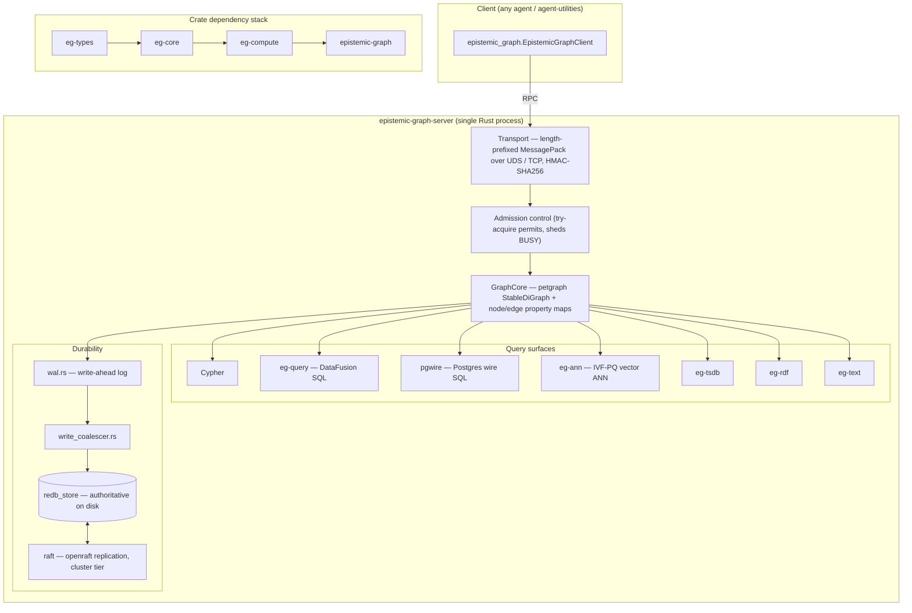
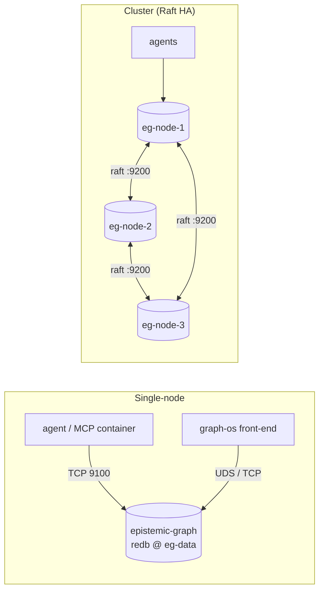
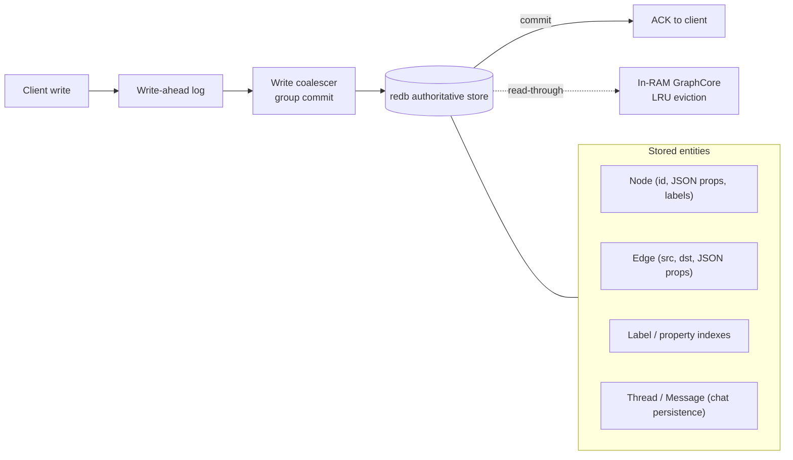

# Deploying epistemic-graph as a database

`epistemic-graph` is a **durable, Rust-native graph database engine**. Agents in the
`agent-packages` fleet can either **embed** it (it ships transitively with
`agent-utilities[agent]`) or connect to a **standalone, centralized database container**
shared across many agents. This guide covers the standalone deployment: container recipes,
connection configuration, the configuration surface, and the database architecture.

> **Embedded vs centralized.** The slim MCP-server install (`<pkg>[mcp]`) does **not** include
> the engine. The full agent install (`<pkg>[agent]`) embeds it for single-process use. Run the
> standalone server (below) when you want **one knowledge graph shared by multiple agents**,
> durable separately from any agent process, or replicated for high availability.

---

## Deployment tiers (cargo feature flags)

The server binary is built for one tier; pick the smallest that fits. Build with
`--build-arg EG_FEATURES=...` (see [`docker/Dockerfile`](../docker/Dockerfile)).

| Tier | `EG_FEATURES` | Includes | Use when |
|------|---------------|----------|----------|
| **pi** | `pi,ast-extended` | redb-authoritative store + cypher (no DataFusion/pgwire/raft) | Raspberry Pi / edge, lean single node |
| **node** | `node,ast-extended` | pi + DataFusion SQL + ANN vectors + tsdb | Single-node server |
| **cluster** (default) | `cluster,ast-extended` | node + **Raft replication** + **pgwire** (Postgres wire SQL) | HA / multi-node / SQL clients |

All tiers include the `redb` feature, so the **persist dir is the authoritative source of
truth** and a committed write survives `kill -9` (commit-before-ack).

---

## Single-node (durable, recommended start)

### Docker Compose

```bash
export GRAPH_SERVICE_AUTH_SECRET="$(openssl rand -hex 32)"
docker compose -f docker/compose.yml up -d server
```

The bundled [`docker/compose.yml`](../docker/compose.yml) builds the image, binds RPC `9100`
and metrics `9101` to `127.0.0.1`, and persists to the named volume `eg-data`.

### Plain `docker run`

```bash
docker volume create eg-data
docker run -d --name epistemic-graph \
  -e GRAPH_SERVICE_AUTH_SECRET="$(openssl rand -hex 32)" \
  -p 127.0.0.1:9100:9100 -p 127.0.0.1:9101:9101 \
  -v eg-data:/var/lib/epistemic-graph/data \
  <registry>/epistemic-graph:<tag>
```

> The server **refuses to start without `GRAPH_SERVICE_AUTH_SECRET`** (HMAC-SHA256 auth on the
> RPC transport). For development only, you may pass `--allow-insecure` /
> `EPISTEMIC_GRAPH_ALLOW_INSECURE=1` to run unauthenticated.

---

## High availability (Raft, cluster tier)

The cluster tier replicates the authoritative redb store across nodes via in-engine openraft.
Run one container per node with a matching node id and the shared peer list:

```bash
SECRET="$(openssl rand -hex 32)"
docker run -d --name eg-node-1 \
  -e GRAPH_SERVICE_AUTH_SECRET="$SECRET" \
  -e EPISTEMIC_GRAPH_RAFT_NODE_ID=1 \
  -e EPISTEMIC_GRAPH_RAFT_PEERS="1@eg-node-1:9200,2@eg-node-2:9200,3@eg-node-3:9200" \
  -p 9100:9100 -p 9101:9101 \
  -v eg-data-1:/var/lib/epistemic-graph/data \
  <registry>/epistemic-graph:<tag>
# repeat for eg-node-2 (NODE_ID=2) and eg-node-3 (NODE_ID=3)
```

---

## Connecting an agent

Local clients use the per-platform **UDS**; remote clients use **TCP** (`9100`). Configure via
environment, then `agent-utilities` (and any fleet agent) picks it up automatically.

```bash
# Remote TCP (the standalone container)
export GRAPH_SERVICE_TCP_ADDR=epistemic-graph:9100
export GRAPH_SERVICE_AUTH_SECRET=<same secret as the server>

# OR local UDS (same host)
export GRAPH_SERVICE_SOCKET=/run/epistemic-graph/epistemic-graph.sock
export GRAPH_SERVICE_AUTH_SECRET=<secret>
```

```python
from epistemic_graph import EpistemicGraphClient
import asyncio

async def main():
    client = await EpistemicGraphClient.connect()   # reads GRAPH_SERVICE_* env
    await client.nodes.add("agent:planner", {"type": "Agent"})
    print(await client.nodes.has("agent:planner"))  # True
    await client.close()

asyncio.run(main())
```

---

## Configuration reference

| Argument | Env var | Default | Description |
|----------|---------|---------|-------------|
| `--socket-path` | `GRAPH_SERVICE_SOCKET` | `/tmp/epistemic-graph.sock` | UDS socket path (local clients) |
| `--tcp-addr` | `GRAPH_SERVICE_TCP_ADDR` | `0.0.0.0:9100` (image) | TCP RPC listener (remote clients) |
| `--auth-secret` | `GRAPH_SERVICE_AUTH_SECRET` | — (**required**) | HMAC-SHA256 secret; empty refuses to start |
| `--allow-insecure` | `EPISTEMIC_GRAPH_ALLOW_INSECURE` | off | Dev-only: start unauthenticated |
| `--persist-dir` | `GRAPH_SERVICE_PERSIST_DIR` | `/var/lib/epistemic-graph/data` (image) | Durable redb-authoritative store (mount a volume) |
| `--checkpoint-interval` | — | `300` | Auto-checkpoint interval (seconds) |
| `--metrics-addr` | `GRAPH_SERVICE_METRICS_ADDR` | `0.0.0.0:9101` (image) | Prometheus `/metrics` listener |
| — | `EPISTEMIC_GRAPH_PERSIST_BACKEND` | `redb` | Persist backend (`redb` authoritative; `snapshot` legacy) |
| — | `EPISTEMIC_GRAPH_RAFT_NODE_ID` | — | Raft node id (cluster tier) |
| — | `EPISTEMIC_GRAPH_RAFT_PEERS` | — | `id@host:port` peer list (cluster tier) |

Ports: **9100** RPC (clients), **9101** Prometheus metrics. Volume: `/var/lib/epistemic-graph/data`.

---

## Database architecture

### Engine components

The engine is a Cargo workspace: a layered crate stack under one server process that opens the
RPC transports and owns the durable store.



### Deployment topologies



### Write path & data model

Writes are durable **before** the client is acked (commit-before-ack); reads are served from RAM
with a redb read-through for evicted nodes.



---

## Durability & backup

- The **persist dir** (`/var/lib/epistemic-graph/data`) is the authoritative store — back it up
  by snapshotting the volume. A committed write survives `kill -9`.
- Auto-checkpoints run every `--checkpoint-interval` seconds and on `SIGTERM`.
- In the cluster tier, openraft replicates the authoritative store across nodes.

## Observability

With `--metrics-addr` set (default `0.0.0.0:9101` in the image), the server exposes
Prometheus text-format metrics — request counts/latency, in-flight permits, `BUSY` rejections,
per-graph node/edge gauges, checkpoint timing, and auth/ACL failures. See
[service_mode.md](service_mode.md#prometheus-metrics) for the full metric list.
