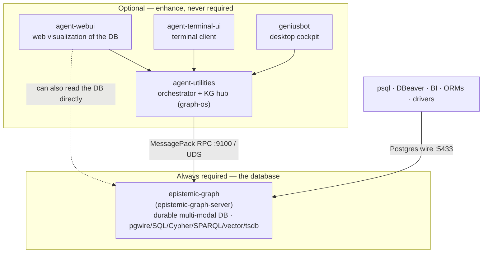

# Deployment topology — the engine, and what you can bolt onto it

`epistemic-graph` runs **standalone**. It is a complete durable database on its own —
you can deploy *only* the engine and talk to it over the Postgres wire (or any of the
other wire protocols) with nothing else installed. Everything below the engine in the
diagram is **optional** and additive: each component uses the engine, none is required
to run it.

---

## Component matrix

| Component | Repo | What it is | Needs | Talks to the engine via | Required? |
|-----------|------|------------|-------|-------------------------|-----------|
| **epistemic-graph** | `epistemic-graph` | The durable multi-modal database engine — the whole product. | nothing | *is* the engine | **Always** |
| **agent-utilities** | `agent-utilities` | The orchestrator + Knowledge-Graph hub (`graph-os`). Uses **every** engine feature — ontology/OWL reasoning, ingestion, agents, the loop engine — and exposes it to the fleet over MCP. | epistemic-graph | MessagePack RPC (`GRAPH_SERVICE_TCP_ADDR`) or UDS + the native `epistemic_graph` client | Optional |
| **agent-webui** | `agent-webui` | A web UI to **visualize and explore the database** (graphs, tables, query results). | agent-utilities (and/or direct engine reads) | through agent-utilities; can also read the DB directly | Optional |
| **agent-terminal-ui** | `agent-terminal-ui` | A terminal client for the fleet. | agent-utilities | through agent-utilities | Optional |
| **geniusbot** | `geniusbot` | A desktop "cockpit" (PySide6/Qt) — visual command centre over the fleet. | agent-utilities | through agent-utilities | Optional |

> **The line to hold:** epistemic-graph is a **stand-alone database**. It does not
> depend on any of the components above and never calls back into them. They are
> *clients* of the engine. Deploy just the engine and you have a working, durable,
> multi-wire DB.

---

## Deployment shapes

### 1. Just the engine (this repo)

A durable database for SQL/graph/vector/etc. clients. No orchestrator, no UI.

→ **[Standalone deployment](standalone_deployment.md)** (pure binary or
`docker/compose.standalone.yml`) and the **[DBeaver/psql quickstart](dbeaver_quickstart.md)**.

Use when: you want a Postgres-wire-speaking graph+vector+SQL database and will drive
it with your own clients (psql, DBeaver, a BI tool, an app, an ORM).

### 2. Engine + agent-utilities (the full platform)

Add the orchestrator/KG hub. The `agent-utilities` base install always carries the
mandatory `epistemic-graph[full]` artifact. For a local dev box, GraphOS autostarts and
supervises its server binary over a private UDS socket; alternatively it connects to the
**standalone engine container** you deployed in shape (1) for a shared, durable,
separately-scaled database. It layers on ontology-driven ingestion, an agent fleet, MCP
tools, and the loop engine — turning the raw database into a reasoning knowledge-graph
platform.

The engine is deployed **exactly the same way** whether or not agent-utilities is
present; agent-utilities simply points its `GRAPH_SERVICE_TCP_ADDR` /
`GRAPH_SERVICE_AUTH_SECRET` at the running engine.

→ agent-utilities deployment docs (see [interlinks](#interlinks-with-agent-utilities)).

### 3. Engine + agent-utilities + UIs

Add any of **agent-webui** (visualize the database in a browser),
**agent-terminal-ui**, or **geniusbot** (desktop cockpit). These are front-ends over
the orchestrator; **agent-webui** is the visualization tool for the database.

→ agent-utilities [ecosystem / frontends docs](#interlinks-with-agent-utilities).

---

## How agent-utilities enhances the engine

Deploying agent-utilities on top of a standalone engine adds, without changing how the
engine itself is deployed:

- **Ontology-driven modeling & OWL/RDF reasoning** over the graph.
- **Ingestion pipelines** (connectors, feeds, codebase ingestion) that populate the DB.
- **An agent fleet + MCP tool surface** (`graph-os`, the multiplexer) so LLMs/agents
  query and mutate the DB through governed tools.
- **The loop / evolution engine** that reasons across the whole knowledge graph.

All of that is *value added on top of* the database. Remove it and the engine keeps
serving every query over every wire — it just does so as a plain database rather than
a reasoning platform.

---

## Interlinks with agent-utilities

If you are deploying the full platform, these agent-utilities docs are the companion
reading (paths are in the `agent-utilities` repo under `docs/`):

- **`docs/guides/deployment.md`** — canonical "Deploying agent-utilities" reference;
  install extras, backend selection, running `graph-os` and the multiplexer. It uses
  this engine as the default backend.
- **`docs/deploy.md`** — the top-level one-link self-deploy entry point (tiny /
  single-node-prod / enterprise profiles; lists the optional UIs).
- **`docs/guides/deployment-configurations.md`** — the five-rung configuration ladder
  (zero-infra dev → autonomous ops); each rung names its engine deployment shape.
- **`docs/guides/day0.md`** — the day-0 / `agent-os-genesis` bootstrap workflow.
- **`docs/recipes/tiny.md`** — zero-infra, engine-embedded laptop/edge recipe.
- **`docs/recipes/single-node-prod.md`** — one durable server (engine + optional
  Postgres/pg-age mirror).
- **`docs/recipes/enterprise.md`** — multi-host Swarm; the engine deployed as a
  shared/remote database.
- **`docs/pillars/6_geniusbot_cockpit.md`** — the geniusbot desktop cockpit.
- **`docs/ecosystem.md`** — how agent-webui / agent-terminal-ui / geniusbot fit as
  peripherals to the platform.

> **Reverse links wanted.** The agent-utilities docs above currently reference the
> engine but do **not** link out to these standalone deploy docs. A docs pass should
> add reverse-links from those AU pages to
> [standalone deployment](standalone_deployment.md) and this topology page, so a
> reader coming from either side lands on the right recipe.
