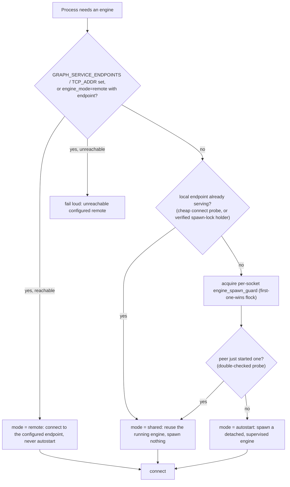
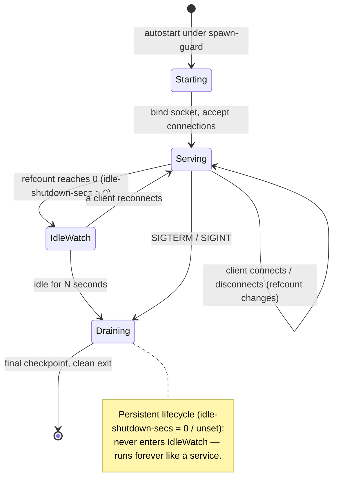

# Engine modes & the auto-bundle

`epistemic-graph` is reachable three ways, resolved by **one** precedence so every entrypoint provisions
an engine identically with no per-entrypoint code. In `agent-utilities` this is the `EngineResolver`
(CONCEPT:OS-5.63); every entrypoint — the graph-os MCP server, the gateway/host daemon, the facade, the
tenant engine pool, messaging, agent/serving — funnels through it.

```
remote  ->  shared-local  ->  autostart
```

For the on-disk durability story see [the engine architecture](architecture/engine.md); for the
service protocol see [Service Mode](service_mode.md).

---

## The resolution decision flow



- **remote** — an endpoint is configured (e.g. the engine runs in Docker on another host). The resolver
  returns it and **never autostarts**; an unreachable configured remote stays fail-loud rather than
  silently spawning a divergent local engine.
- **shared-local** — the default/local endpoint is already serving (a cheap connect probe succeeds, or a
  recorded spawn-lock holder is verified by a probe). Reuse it. This is how co-located entrypoints on
  one host share the **one** engine.
- **autostart** — nothing reachable. Under a per-socket first-one-wins `flock`, a double-checked probe
  re-shares a peer's just-started engine; otherwise spawn a **detached, supervised** engine. Detached =
  it survives the spawning process, so other entrypoints share it. Supervised = reference-counted idle
  shutdown.

---

## The auto-bundle: a supervised, idle-shutting tiny engine

The autostarted engine is the **tiny** engine — the auto-started `pi`-tier binary (not a separate
SQLite/embedded DB; the engine is the one store at every scale). Two lifecycle behaviours make sharing
safe:

- **Reference-counted graceful shutdown** (CONCEPT:KG-2.223). The accept loop selects the next
  connection against a `ShutdownCoordinator` (an active-connection refcount + a `Notify`). With
  `--idle-shutdown-secs N` (`EPISTEMIC_GRAPH_IDLE_SHUTDOWN_SECS`), the engine self-terminates — cleanly
  checkpointing — once the refcount has been zero for `N` seconds. So the auto-bundled tiny daemon
  vanishes after its last client disconnects (robust to client crashes).
- **Persistent lifecycle.** Absent or `0` ⇒ the engine never idle-terminates: it runs forever like a
  normal service. SIGTERM/SIGINT is a clean, checkpointed shutdown in **both** modes — commit-before-ack
  is intact, so a stop never drops an acked write.



---

## Embedded in-process (the edge path)

For a Pi or a single-process deployment that wants **no** Tokio server, socket, or HMAC at all, the
`embedded` feature gives an `EmbeddedEngine` handle (CONCEPT:KG-2.216) that owns a `GraphRegistry` + the
redb durable store directly and exposes core ops as plain method calls — SQLite/DuckDB-style: open a
persist dir, call ops. It drives the **same** `GraphCore` + redb-authoritative durable rows the socket
dispatch does (via `wal::apply` + the server-independent `redb_store`) — one core, two transports. This
is the "100M agents, a local engine each" path: `--features "embedded redb"` builds with no Tokio
runtime. Gated query/tsdb/rdf surfaces light up when those features are also compiled.

---

## Which mode am I in?

| Symptom | Mode |
|---------|------|
| `GRAPH_SERVICE_ENDPOINTS` / `GRAPH_SERVICE_TCP_ADDR` set | **remote** (or shared, if local) |
| Several processes on one host, one `epistemic-graph-server` PID | **shared-local** |
| First process on a host, an engine appears under the socket | **autostart** (detached, supervised) |
| No socket, calls go straight to the library | **embedded** |

See [Service Mode](service_mode.md) for the environment variables (`GRAPH_SERVICE_*`,
`EPISTEMIC_GRAPH_IDLE_SHUTDOWN_SECS`) and [Deployment](deployment.md) for the standalone-container path
the `remote` mode connects to.
