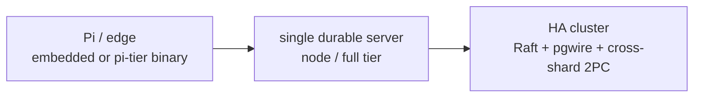
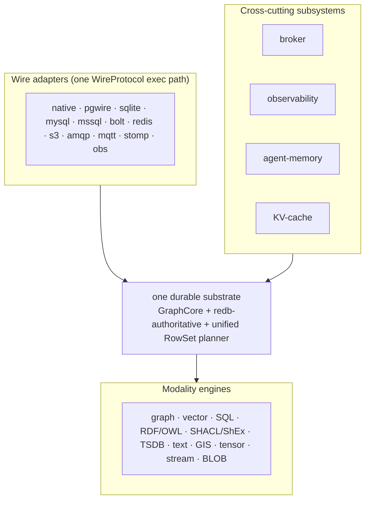

# Epistemic Graph

`epistemic-graph` is the unified, Rust-native **"master-of-all" data & compute engine** for the
agent-utilities ecosystem. It collapses a graph database, vector index, SQL warehouse, triple-store +
OWL reasoner, time-series DB, content-addressed blob store, and full-text index into **one durable
engine** with **one cross-modal `RowSet` planner**, exposed to Python out-of-process over
length-prefixed **MessagePack on UDS/TCP** (HMAC-authenticated, no PyO3) or embedded in-process on the
edge.

It is **durable by default** (redb-authoritative — an acked write survives `kill -9`) and scales by
configuration alone, from a Raspberry Pi single binary to a multi-node Raft cluster with cross-shard
transactions.

It also fronts **many wire protocols** and **cross-cutting subsystems** on that one substrate — a
message broker, an observability stack, GIS, tensors, streams, and an LLM KV-cache — so the same durable
store answers a Postgres, Neo4j, Redis, S3, AMQP, or PromQL client:

See the [subsystems reference](architecture/subsystems.md) for how each composes on the substrate.

> **Honesty first.** Every capability is tracked operation-by-operation in the
> **[capabilities & parity matrix](capabilities.md)** with a status tag (✅ supported · 🔶 in-progress ·
> 🗺 roadmap), and the **[parity roadmap](roadmap.md)** names exactly which drop-in gaps are being
> closed. If a doc and the code disagree, the code wins.

## Start here

- **[Capabilities & parity matrix](capabilities.md)** — the operation-by-operation truth table per
  interface. Read this to know exactly what works today.
- **[Technical Overview](overview.md)** — the crate DAG, the unified `RowSet` planner pipeline, and the
  always-on graph algorithms.
- **Per-interface guides** — [SQL](interfaces/sql.md) · [SPARQL](interfaces/sparql.md) ·
  [Cypher](interfaces/cypher.md) · [GraphQL](interfaces/graphql.md) · [Vector](interfaces/vector.md) ·
  [Time-series](interfaces/timeseries.md) · [KV & Blob](interfaces/kv_blob.md) ·
  [Ontology lifecycle](interfaces/ontology.md).
- **[Master-of-all engine](architecture/engine.md)** — the deep architecture: durability, cross-modal
  ACID, RDF/OWL mapping, the RLS request path, streaming/CDC, federation, multi-Raft + cross-shard 2PC,
  and the tenant lifecycle.

## Operate & deploy

- **[One build, opt-in layers](architecture/tiers.md)** — the feature-composition map: the one main
  full-featured build plus the `cluster` (HA raft) and `full-extras` (GPU/ROS2) opt-in build layers.
- **[Engine modes](engine_modes.md)** — the remote → shared-local → autostart resolver, the auto-bundled
  tiny engine, and the embedded in-process path.
- **[Deployment (database)](deployment.md)** — Docker, prebuilt wheels, single-node, and HA-cluster
  recipes for every scale.
- **[Service Mode](service_mode.md)** — the wire protocol, authentication, multi-graph management,
  isolation policy, and Prometheus metrics.
- **[Cost model & capacity](cost_model.md)** — the per-tenant memory budget, autoscale signals, and
  Pi→cluster footprint planning.

## Reference

- **[Rust Compute Guide](rust_compute_guide.md)** — adding a capability across protocol/server/client.
- **[Transport Benchmarks](benchmarks.md)** — measured per-operation latency over MessagePack.
- **[Concept Registry](concepts.md)** — the stable `CONCEPT` identifiers that trace the engine's ideas.
- **[Binary promotion](deploy/binary_promotion.md)** — shipping a new engine binary into the homelab.
- Architecture deep-dives: [Write coalescer](architecture/write_coalescer.md) ·
  [Index manager](architecture/index_manager.md) · [Correctness harness](architecture/correctness_harness.md).

## Design principle: design for a network boundary

Every out-of-process invocation crosses a process boundary — serialize, socket round-trip, deserialize.
A call is **not** a cheap function call. **Batch, never per-element:** ship work into a single
round-trip over data already resident in the graph (one all-pairs op, not a Python loop), and keep
tight per-element math in-process. The [Rust Compute Guide](rust_compute_guide.md) explains how this
shapes every caller.
