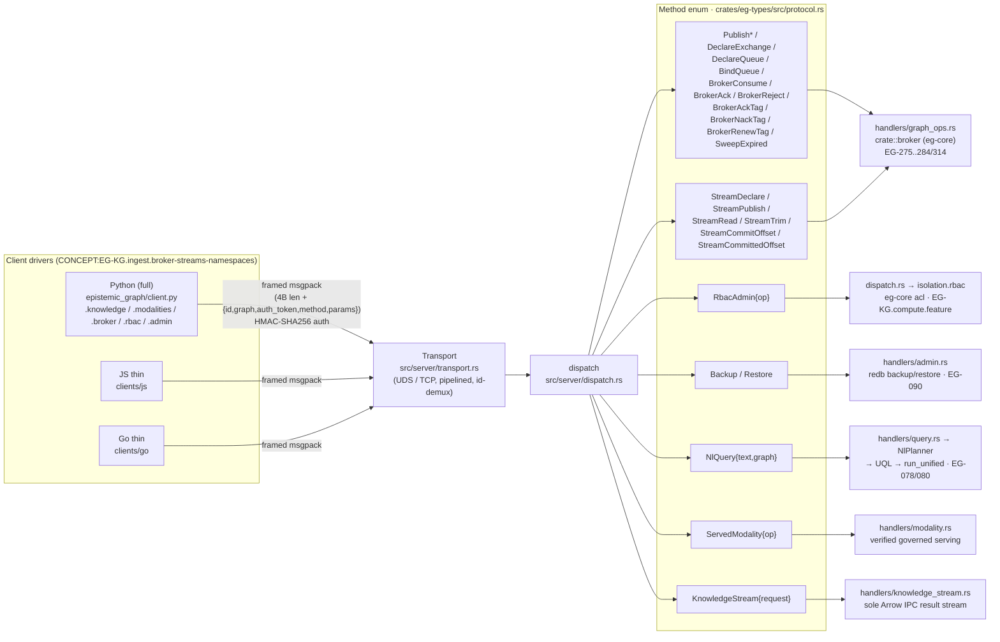

# Client drivers (CONCEPT:EG-KG.ingest.broker-streams-namespaces)

The Python package is the complete current client. JavaScript and Go are deliberately
thin bindings for the native message **broker**, append-log **streams**, **RBAC**
administration, online **backup/restore**, and **NL→query** surfaces.

There is **no PyO3 / FFI** between a client and the engine — the boundary is
out-of-process **framed MessagePack** over UDS/TCP. So the wire IS the API: every client
(Python, JS, Go) hand-mirrors the serde-tagged `Method` enum in
[`crates/eg-types/src/protocol.rs`](https://github.com/Knuckles-Team/epistemic-graph/blob/main/crates/eg-types/src/protocol.rs) by sending the
variant name + its exact param fields.

## Full vs thin, per language

| Language | Location | Scope | Tested |
|----------|----------|-------|--------|
| **Python** | [`epistemic_graph/client.py`](https://github.com/Knuckles-Team/epistemic-graph/blob/main/epistemic_graph/client.py) | **Full** — graph/vector/RDF/SQL/txn/broker plus governed `modalities` and native `knowledge` streaming. | `tests/test_pb_clients.py`, `tests/test_modality_stream_clients.py`, and the `tests/test_protocol_parity.py` drift gate. |
| **JS / Node** | [`clients/js`](https://github.com/Knuckles-Team/epistemic-graph/tree/main/clients/js) | **Thin** — ONLY the B1.7 methods, generated from the Method list. Not a full SDK. | Current `eg2.` binding; run the package tests before release. |
| **Go** | [`clients/go`](https://github.com/Knuckles-Team/epistemic-graph/tree/main/clients/go) | **Thin** — ONLY the B1.7 methods, generated from the Method list. Not a full SDK. | Current `eg2.` binding; run `go test ./...` before release. |

The thin clients are honest reference bindings: they carry the transport (framing + HMAC
auth + result decode) and the B1.7 method surface, and each README states plainly that
the full graph/vector/RDF/SQL API is Python-only. **No faked SDK.**

## Governed Python namespaces

The complete Python client binds the two served protocols directly:

| Namespace | Current operation | Result |
|---|---|---|
| `client.knowledge` | `pull(query, batch_size=..., cursor=...)` | One `arrow_ipc_v1` payload and an authority-/placement-/snapshot-bound cursor |
| `client.modalities` | `authority()` | Opaque tenant, access-policy, and purpose references derived from the verified request |
| `client.modalities` | `ingest(...)` | Atomic native decode/create/update outcome |
| `client.modalities` | `query(...)` | Bounded page of active or authorized cold records |
| `client.modalities` | `search_documents(...)`, `query_image_region(...)`, `query_similar_images(...)`, `query_audio_window(...)`, `query_video_window(...)` | Bounded native-posting query with exact policy and predicate filtering |
| `client.modalities` | `delete(...)`, `move_to_cold(...)`, `restore(...)` | Versioned governed lifecycle outcome |
| `client.modalities` | `events(...)` | Bounded, ordered, policy-filtered replay events |
| `client.modalities` | `capabilities(modality)` | Exact 12 PASS / 0 N/A component result; release readiness comes from G-14/G-37 evidence |

```python
batch = await client.knowledge.pull(
    {"family": "graph", "label": "Capability", "limit": 100},
    batch_size=32,
)
arrow_ipc = batch["payload"]

authority = await client.modalities.authority()
page = await client.modalities.query(
    "document",
    segment_kind="paragraph",
    limit=100,
)
```

`KnowledgeStream` has one projection (`arrow_ipc_v1`) and one pull method. The
binding does not expose an alternate projection or direct-family aliases. It validates
the complete query, cursor, and response shape, including matching family and batch
size. The modality binding likewise emits only the current tagged operation shapes and
rejects unknown fields, retired segment kinds, malformed opaque references, drifted
artifact-bundle tiers, and non-certified capability reports. The synchronous client
exposes the same namespaces and method names.

For create-once coordination, Python exposes
`await client.nodes.create_if_absent(node_id, properties)`. It sends the sole
`CreateNodeIfAbsent` operation and returns `True` only to the inserting writer; it
does not compose `has` and `add`, so there is no client-side check-then-write race.

For ingest, `bundle_msgpack` is a certified `ArtifactBundle` encoded as MessagePack;
`source_bytes` is ephemeral request content. URLs, credentials, filesystem paths,
tenant names, and deployment profiles are not fields in either operation. Connection
and trust configuration remains outside these protocol payloads.

## Wire contract (all three)

- **Framing:** a 4-byte **big-endian** length prefix + a MessagePack request
  `{ id, graph, auth_token, method, params }`.
- **Auth:** every driver requires complete verified-context claims and signs the
  sole `eg2.` identity/policy envelope. GraphOS binds those claims from the
  immutable authenticated `GraphSession`. There is no anonymous or reduced-claim
  client mode. See [Service mode](../service_mode.md#authentication-protocol).
- **Correlation:** each response carries the request `id`. The Python client demuxes
  out-of-order responses on one pipelined connection (EG-043); the thin JS client does the
  same by `id`; the thin Go client serializes one round-trip at a time (in-order).
- **Compact results:** a top-level MessagePack `bin` result is a second `Raw` layer and is
  decoded once more.

## Methods covered (B1.7)

| Domain | Engine `Method`s | Concept | Python | JS | Go |
|--------|------------------|---------|--------|----|----|
| Broker admin | `DeclareExchange` `DeleteExchange` `DeclareQueue` `BindQueue` `UnbindQueue` | EG-275/276/277/278 | `client.broker.*` | ✓ | ✓ |
| Broker publish | `Publish` `PublishEx` `PublishConfirmed` `PublishIdempotent` | EG-275/279/284/314 | `client.broker.publish*` | ✓ | ✓ |
| Broker consume | `BrokerConsume` `BrokerAck` `BrokerReject` `BrokerAckTag` `BrokerNackTag` `BrokerRenewTag` `SweepExpired` | EG-KG.compute.groups-qos-prefetch-honoring/276/284 | `client.broker.consume`/`ack_tag`/`nack_tag`/`renew_tag`/… | ✓ | ✓ |
| Streams | `StreamDeclare` `StreamPublish` `StreamRead` `StreamTrim` `StreamCommitOffset` `StreamCommittedOffset` | EG-283 | `client.broker.stream_*` | ✓ | ✓ |
| RBAC admin | `RbacAdmin` (AddRole/RemoveRole/AddGrant/RemoveGrant/List) | EG-KG.compute.feature | `client.rbac.*` | ✓ | ✓ |
| Ops | `Backup` `Restore` | EG-090 | `client.admin.*` | ✓ | ✓ |
| NL→query | `NlQuery` | EG-080 | `client.query.nl_query` | ✓ | ✓ |

Every served build requires `security`. Other ops remain feature-gated on the server:
`broker` (broker + streams), redb (backup/restore), and `nl-query` plus a configured
planner (NL). A build/deploy without one
returns a clear "not available in this build" / "no planner configured" error — never a
panic. NL→query also needs a configured `NlPlanner` (an OpenAI-compatible endpoint, e.g.
agent-utilities' LLM); the client just carries the text.

## Client → Method → engine



## Parity gate

`tests/test_protocol_parity.py` enforces the Python client ⇄ `Method` enum contract:
every method the client sends must be a real variant, and the set of UNBOUND variants must
equal `tests/protocol_unbound_baseline.txt`. B1.7 removed the broker/streams/NL/RBAC/backup
entries from that baseline (they now have Python senders) and baselined the remaining
un-bound EG-KG.memory.eg-batch-decay-caller memory/scene/trajectory + CEP ops (deferred to roadmap B3.16 / B3.14).
The JS/Go thin clients are generated from the same `Method` list by hand and kept in sync
by review against `protocol.rs`.

---

**See also:** [Capabilities matrix](../capabilities.md) · [Connecting (per-wire guide)](connecting.md) · [SQL & pgwire](sql.md) · [Messaging & Broker](messaging.md) · [KV-cache (vLLM/LMCache)](kvcache.md).
