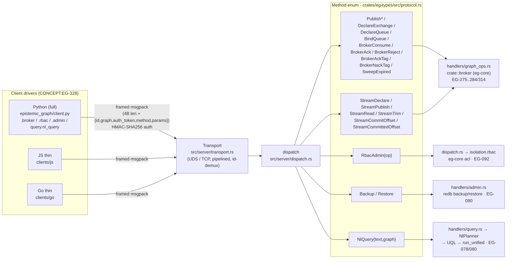

# Client drivers (CONCEPT:EG-328)

> B1.7 — thin multi-language client drivers binding the Program-B engine `Method`s that
> had no client surface: the native message **broker** + append-log **streams**
> (EG-275..284/314), **RBAC** admin (EG-092), online **backup/restore** (EG-090), and
> **NL→query** (EG-080).

There is **no PyO3 / FFI** between a client and the engine — the boundary is
out-of-process **framed MessagePack** over UDS/TCP. So the wire IS the API: every client
(Python, JS, Go) hand-mirrors the serde-tagged `Method` enum in
[`crates/eg-types/src/protocol.rs`](https://github.com/Knuckles-Team/epistemic-graph/blob/main/crates/eg-types/src/protocol.rs) by sending the
variant name + its exact param fields.

## Full vs thin, per language

| Language | Location | Scope | Tested |
|----------|----------|-------|--------|
| **Python** | [`epistemic_graph/client.py`](https://github.com/Knuckles-Team/epistemic-graph/blob/main/epistemic_graph/client.py) | **Full** — the canonical client agent-utilities uses. B1.7 adds the `broker`/`rbac`/`admin` namespaces + `query.nl_query` on top of the existing graph/vector/RDF/SQL/txn/stream surfaces. | Yes — `tests/test_pb_clients.py` (fake-client wire-shape + live E2E vs the ephemeral engine) + the `tests/test_protocol_parity.py` drift gate. |
| **JS / Node** | [`clients/js`](../../clients/js) | **Thin** — ONLY the B1.7 methods, generated-from-the-Method-list. Not a full SDK. | Reference binding (no Node CI harness yet); framing/auth mirror the verified Python transport. |
| **Go** | [`clients/go`](../../clients/go) | **Thin** — ONLY the B1.7 methods, generated-from-the-Method-list. Not a full SDK. | Reference binding (no Go CI harness yet); framing/auth mirror the verified Python transport. |

The thin clients are honest reference bindings: they carry the transport (framing + HMAC
auth + result decode) and the B1.7 method surface, and each README states plainly that
the full graph/vector/RDF/SQL API is Python-only. **No faked SDK.**

## Wire contract (all three)

- **Framing:** a 4-byte **big-endian** length prefix + a MessagePack request
  `{ id, graph, auth_token, method, params }`.
- **Auth:** `auth_token = hex(HMAC_SHA256(auth_secret, str(id)))` (empty when no secret).
- **Correlation:** each response carries the request `id`. The Python client demuxes
  out-of-order responses on one pipelined connection (EG-043); the thin JS client does the
  same by `id`; the thin Go client serializes one round-trip at a time (in-order).
- **Compact results:** a top-level MessagePack `bin` result is a second `Raw` layer and is
  decoded once more.

## Methods covered (B1.7)

| Domain | Engine `Method`s | Concept | Python | JS | Go |
|--------|------------------|---------|--------|----|----|
| Broker admin | `DeclareExchange` `DeleteExchange` `DeclareQueue` `BindQueue` `UnbindQueue` | EG-275/276/277/278 | `client.broker.*` | ✓ | ✓ |
| Broker publish | `Publish` `PublishEx` `PublishConfirmed` `PublishIdempotent` | EG-275/279/284/314 | `client.broker.publish*` | ✓ | ✓ |
| Broker consume | `BrokerConsume` `BrokerAck` `BrokerReject` `BrokerAckTag` `BrokerNackTag` `SweepExpired` | EG-280/276/284 | `client.broker.consume`/`ack`/`reject`/… | ✓ | ✓ |
| Streams | `StreamDeclare` `StreamPublish` `StreamRead` `StreamTrim` `StreamCommitOffset` `StreamCommittedOffset` | EG-283 | `client.broker.stream_*` | ✓ | ✓ |
| RBAC admin | `RbacAdmin` (AddRole/RemoveRole/AddGrant/RemoveGrant/List) | EG-092 | `client.rbac.*` | ✓ | ✓ |
| Ops | `Backup` `Restore` | EG-090 | `client.admin.*` | ✓ | ✓ |
| NL→query | `NlQuery` | EG-080 | `client.query.nl_query` | ✓ | ✓ |

Each op is feature-gated on the SERVER: `broker` (broker + streams), `security` (RBAC),
redb (backup/restore), `nl-query` + a configured planner (NL). A build/deploy without one
returns a clear "not available in this build" / "no planner configured" error — never a
panic. NL→query also needs a configured `NlPlanner` (an OpenAI-compatible endpoint, e.g.
agent-utilities' LLM); the client just carries the text.

## Client → Method → engine

## Parity gate

`tests/test_protocol_parity.py` enforces the Python client ⇄ `Method` enum contract:
every method the client sends must be a real variant, and the set of UNBOUND variants must
equal `tests/protocol_unbound_baseline.txt`. B1.7 removed the broker/streams/NL/RBAC/backup
entries from that baseline (they now have Python senders) and baselined the remaining
un-bound EG-318 memory/scene/trajectory + CEP ops (deferred to roadmap B3.16 / B3.14).
The JS/Go thin clients are generated from the same `Method` list by hand and kept in sync
by review against `protocol.rs`.

---

**See also:** [Capabilities matrix](../capabilities.md) · [Connecting (per-wire guide)](connecting.md) · [SQL & pgwire](sql.md) · [Messaging & Broker](messaging.md) · [KV-cache (vLLM/LMCache)](kvcache.md).
