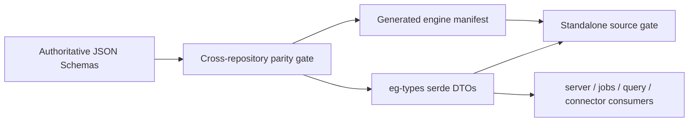

# Epistemic Operations Protocol

`eg-types::epistemic_operations` is the strict Rust projection of the shared
Epistemic Operations Protocol. It gives the engine one current-only vocabulary
for request authority, mutation, ingestion, delegation, artifacts, streamed
knowledge, analytics jobs, trace outcomes, placement, atomic claims, evidence,
and structured operation results.

The authoritative JSON Schema catalog is packaged by agent-utilities. The
engine does not depend on that Python package at runtime: it ships serde DTOs
and a generated, digest-pinned manifest. The workspace parity gate proves the
catalog, generated Pydantic models, manifest, and generated Rust structs have
identical ordered fields; the engine's standalone gate rechecks manifest
integrity and Rust field parity without compiling the binary.

## Engine projection



The DTOs use `#[serde(deny_unknown_fields)]`. Catalog version `1` accepts only
the current `RequestContext` schema version `"2"` and version `"1"` for the
other eleven root schemas. There is no older-version parser, alias, or fallback
branch. An intentional contract change updates all consumers in one ecosystem
change.

Run the engine-local proof:

```bash
python3 scripts/check_epistemic_operations_protocol.py
```

This verifies all twelve schema digests, the full catalog digest, 23 bound
root/nested objects, both `eg-types` module exports, and the generated Rust
constants. The workspace cross-repository gate remains the release authority.

The live placement route, WorkItem claim, provenance-evidence, and placement
redirect handlers serialize these generated DTOs directly. Deployment endpoints
remain topology configuration and never enter the shared records.

## Privacy boundary

These control records carry opaque identifiers and governed or
content-addressed references. They do not define fields for credentials,
deployment endpoints, trust-bundle locations, personal names, email addresses,
or local filesystem paths. `TraceOutcome` is deliberately content-free: raw
prompts, responses, and exception text belong in separately governed artifacts
and are referenced only when policy permits.
