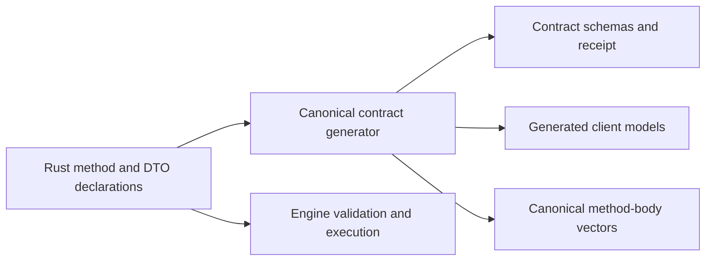

# Epistemic Operations Protocol

`eg-types::epistemic_operations` declares the current engine-owned
Epistemic Operations Protocol. It gives the engine one current-only vocabulary
for request authority, mutation, ingestion, delegation, artifacts, streamed
knowledge, analytics jobs, trace outcomes, placement, atomic claims, evidence,
structured operation results, and native development-lane lease/quota authority.

Rust method and DTO declarations are the authority for request/result shapes.
The canonical contract generator derives schemas, client models, method-body
vectors and contract receipts from those declarations. Agent Utilities consumes
the generated public engine client; its retired schema catalog is not an
alternate authority or a compatibility contract. This is the current hard
cutover contract under EG-C-01 and EG-C-04.

## Engine contract and projections


```mermaid
flowchart LR
    Rust[Rust method and DTO declarations] --> Generator[Canonical contract generator]
    Generator --> Schemas[Contract schemas and receipt]
    Generator --> Clients[Generated client models]
    Generator --> Vectors[Canonical method-body vectors]
    Rust --> Engine[Engine validation and execution]
```

Unknown fields are refused. Primitive values are validated without coercing
strings, booleans or floating-point values into integer fields. Wire enum tags
remain ordinary strings, including `schema_version: "1"` and lane host target
kinds `"local"` and `"inventory_alias"`; valid JSON does not require language-
specific enum objects. Constraint metadata and generated validation must agree
with the engine's admission rules.

### Development-lane intent bounds

The following opaque text fields contain **1 through 512 UTF-8 bytes**, with
no byte below `0x20`: `tenant_ref`, `request_id`, `lane_id`, `repository_id`,
`base_ref`, `branch`, `workspace_ref`, `owner_id`, `session_id`, `fairness_group`,
`quota_policy_name`, `quota_policy_version`, `host_ref`,
`resource_reservation_id`, and a non-null `host_target_alias`. The limit counts
encoded bytes, not Unicode characters. For example, 512 ASCII characters,
256 copies of `é`, or 128 four-byte Unicode characters reach the limit; one
additional character in each example is refused. The retired AU limit of
256 characters does not apply.

`worktree_locator` has the same text bounds and additionally must be a relative
locator with no backslash, leading slash, empty component, `.` component or
`..` component. `base_sha` instead requires exactly 40 or 64 lowercase ASCII
hexadecimal digits. `input_fingerprint` requires exactly `v1:` followed by
64 lowercase ASCII hexadecimal digits: 67 bytes total, with no trailing
characters or newline. Other existing lane admission checks, including host
kind/alias agreement, positive bounded TTL and disk demand, remain in force.

These are the current rules implemented by
`src/redb_store/development_lane/links.rs`; generated schema/client checks must
represent the same semantics. JSON Schema `maxLength` alone cannot express a
UTF-8 byte limit and must not substitute a character bound.

### WorkItem claim bounds

`ClaimWorkItemRequest.lease_ms` is a positive integer.
`max_tenant_in_flight` is an integer in the inclusive range **1 through 4096**.
`tenant_ref` and `worker_ref` must not be empty after trimming whitespace.
Generated request validation must reject invalid values before transport,
consistently with `src/redb_store/work_item/claim.rs`. It must not normalize an
invalid request into a different valid request.

Nullable does not mean optional presence. Claim selectors `work_item_id`,
`queue_ref`, `resource_class`, and `fairness_group`, and lane
`host_target_alias`, must be present on the wire; their value may be `null`
where the operation permits it. Generated models must preserve the Rust
`deserialize_required_option` distinction between explicit null and omission.

The protocol source gate remains an engine-owned check:

```bash
python3 scripts/check_epistemic_operations_protocol.py
```

The required cutover target is to bind this gate to the current Rust/generated
engine contract. That transfer is not implemented at this revision: the checker
still validates the legacy manifest/catalog and generated Rust digest bindings.
It must retain meaningful field, version and artifact integrity checks through
the transfer; a renamed or always-passing check does not establish parity.
Generated artifacts and signed vectors must be regenerated together and checked
against the same source revision. This documentation does not establish that
the checker transfer or generated-client validation is complete.

Lane requests carry `now_ms` only as a deterministic replay field: dispatch
normalizes it from the authoritative engine clock before freshness, expiry or
lease decisions. Deployment endpoints remain topology configuration and never
enter the shared records.

## Privacy boundary

These public control/result records carry opaque identifiers and governed or
content-addressed references. They do not expose credentials, deployment
endpoints, trust-bundle locations, personal names, email addresses, or local
filesystem paths. `TraceOutcome` is deliberately content-free: raw prompts,
responses, and exception text belong in separately governed artifacts and are
referenced only when policy permits.

The native development-lane authority keeps the managed worktree locator and
host placement identity only in its encrypted durable hold. Reserve, renew,
observe, finish, cleanup, exact-query, and status results project the bounded
public hold with `worktree_locator` and `host_ref` set to `redacted` and
`host_target_alias` omitted; no result or status page leaks a local path or
private host alias.
