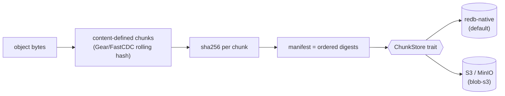

# Key-value, embedded & blob interface

This page covers the storage-substrate surfaces: the **embedded in-process engine** (the SQLite-style
edge path), the **content-addressed blob store**, and the honest status of a **generic key-value**
surface.

> Status snapshot: the embedded engine, the blob CAS, the generic namespaced KV `get`/`put`/`scan`/`cas`
> surface (`kv` feature, EG-022) and the Redis RESP + SQLite-dialect wires are all **supported**. See the
> [capability matrix](../capabilities.md#key-value-embedded-redb-embedded).

## Embedded engine (`embedded` feature)

`EmbeddedEngine::open(persist_dir, options)` is an in-process handle over the **same** redb durable rows
the server uses — with no Tokio, no socket, and no HMAC (EG-KG.backend.engine-modes). It is the "100M agents, a local
engine each" path: open a persist dir and call graph ops as plain methods, with commit-before-return
durability.

```rust
let eng = EmbeddedEngine::open(persist_dir, Options::default())?;
eng.add_node("AgentA", json!({"type": "coordinator"}))?;   // durable on return
```

Read-only SQL (`query` feature, DataFusion) and Cypher (`cypher` feature) layer on top of the same
handle. Note: the embedded surface is a **Rust graph API**, not a SQLite-compatible SQL/wire surface —
SQL is DataFusion-gated and the wire SQL that exists is Postgres [pgwire](sql.md).

## redb storage tables

redb is the storage engine; the durable tables are **graph-shaped**, not a generic KV namespace:
`nodes (graph,id)`, `edges (graph,src,tgt,ord)`, `ledger (graph,seq)`, `semantic_store`, `graph_meta`.
Alongside them, the **`kv` feature (EG-022)** exposes a *generic* namespaced `(namespace, key) -> bytes`
store via the `Method::Kv*` ops (`get`/`put`/`scan`/`cas`) — durable, commit-before-ack, and not
graph-scoped — so the engine is a drop-in RocksDB/redb-style KV store. The Redis **RESP2/3 wire**
(`redis-wire`, EG-KG.ontology.resp2-resp3-codec-round) speaks the same surface with strings/hashes/lists/sets/sorted-sets + pub/sub +
`MULTI`/`EXEC`.

## Content-addressed blob store (`blob` / `blob-s3`)

The blob tier is a streaming content-addressed store (CAS): each blob is a MessagePack manifest of
sha256 chunk digests, keyed by its own sha256.



- **redb-native backend** (default, in `{persist_dir}/blob.redb`): group-commit with bounded RAM
  (resident memory tracks the commit group, not the blob size), streaming read/write cursors, and a
  refcount mark-and-sweep GC.
- **S3 / MinIO backend** (`blob-s3`, not in any tier bundle): chunk bytes go to object storage via the
  `object_store` SDK while manifests + refcounts stay in a redb sidecar — the protocol, manifest, and
  linkage are byte-identical to the redb backend.
- **Content-defined chunking** (Gear/FastCDC rolling-hash, variable boundaries) is shipped (EG-KG.storage.backward-manifest-read),
  replacing the earlier fixed 2 MiB split — sha256 CAS dedup + refcount GC are preserved.

The blob tier is the bytes substrate under multimodal `:Media` / `:Blob` nodes, so a blob reference
participates in the same cross-modal ACID transaction as the graph mutation that points at it.

---

**See also:** [Capabilities matrix](../capabilities.md) · [SQL & pgwire](sql.md) ·
[Connecting (per-wire guide)](connecting.md) · [Messaging & Broker](messaging.md) ·
[Object store / S3 REST](messaging.md).
</content>
