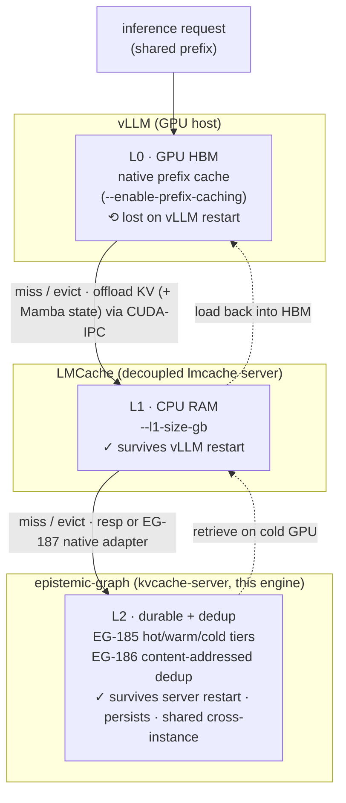

# KV-cache interface (vLLM / LMCache shared blocks)

epistemic-graph can act as a **tiered, shared LLM KV-block cache** — an LMCache/vLLM-style remote backend
so parallel-deployed inference instances share KV blocks by token-hash (prefix-cache dedup) and survive
OOM by offloading blocks to RAM/disk. This is a distinct modality from the vector [ANN](vector.md) index:
ANN stores fixed-dimension embedding vectors; the KV-cache stores opaque attention KV **blocks** keyed by
a token-hash.

> Status snapshot: the tiered store (EG-185), the shared multi-instance backend (EG-186), and the HTTP
> server + vLLM/LMCache connector (EG-187) are shipped. Pure-Rust, out of the lean `pi` tier. See the
> [capability matrix](../capabilities.md).

## Where the engine sits: the caching levels (L0 GPU → L1 CPU → L2 engine)

The engine is the **L2 tier** in the layered KV-cache hierarchy vLLM and LMCache build on top of it —
the widest, slowest, most persistent tier, and the only one that **dedups and survives everything**.
Each level up is smaller/faster/more volatile. (The vLLM- and LMCache-side wiring is documented in
agent-utilities' `docs/guides/kvcache-vllm-lmcache.md` and `services/vllm/AGENTS.md`; this mirrors the
concept engine-side.)



- **L0** = vLLM's in-process GPU prefix cache — fastest, but lost on restart and per-worker.
- **L1** = LMCache's CPU-RAM tier — survives a vLLM restart (the cross-restart win); still per-box.
- **L2** = **this engine** (`kvcache-server`): the durable, content-addressed, deduplicating tier that
  survives everything and is **shared across instances** — two workers that PUT the same token-hash
  store the bytes **once**. LMCache reaches it either via the built-in `resp` Redis wire or the
  engine-native EG-187 HTTP adapter (dedup + live `/kv/stats`).

## The tiered store (EG-185, crate `eg-kvcache`)

A tiered key→block cache with automatic promotion/demotion (paging) on access + capacity pressure:

| Tier | Backing | Policy |
|------|---------|--------|
| **hot** | in-RAM | LRU + importance/recency scoring |
| **warm** | compressed-RAM | demoted from hot under pressure |
| **cold** | redb / blob CAS | evicted-but-durable; re-promotes on access |

`get`/`put`/`pin`/`evict` operate across the tiers — the substrate that lets a KV cache survive OOM by
offloading to RAM/disk instead of dropping blocks.

## Shared multi-instance backend (EG-186)

A `SharedKvBackend` trait + a **content-addressed shared index** so parallel-deployed engine / vLLM
instances share KV blocks: blocks are hash-keyed, deduplicated, and ref-counted, and a lookup/publish API
lets an external vLLM/LMCache connector fetch or store a block by its token-hash. Two workers that PUT the
same token-hash store the bytes **once** — the LMCache dedup / prefix-cache win.

## HTTP server + connector (EG-187, feature `kvcache-server`)

A gated HTTP surface over the `SharedKvBackend`:

```bash
EPISTEMIC_GRAPH_KVCACHE_ADDR=127.0.0.1:9130 \
EPISTEMIC_GRAPH_KVCACHE_TOKEN=$SECRET \
  epistemic-graph-server --persist-dir /var/lib/eg   # --features "kvcache-server server"
```

| Route | Behaviour |
|-------|-----------|
| `PUT /kv/<hash>` (binary body) | store the block under `<hash>` (`201 Created`; a duplicate stores once) |
| `GET /kv/<hash>` | the block bytes (`200`) or `404` if absent |
| `GET /kv/<hash>/exists` | `200` JSON `{"hash":…,"exists":bool}` (a cheap existence probe) |
| `GET /kv/stats` | `200` JSON occupancy + dedup stats |

```bash
curl -s -XPUT --data-binary @block.bin http://127.0.0.1:9130/kv/<token-hash>
curl -s http://127.0.0.1:9130/kv/<token-hash>
curl -s http://127.0.0.1:9130/kv/<token-hash>/exists
curl -s http://127.0.0.1:9130/kv/stats
```

- **Auth**: bearer `EPISTEMIC_GRAPH_KVCACHE_TOKEN` when set (`Authorization: Bearer …`); unset ⇒ no auth
  (dev / loopback).

## LMCache remote-backend contract

The server shapes the **LMCache remote-backend** contract, so an external vLLM/LMCache instance points its
remote KV backend at this endpoint to fetch/store blocks (OOM-offload + cross-instance reuse). For the wire
contract, block key derivation, and the connector adapter, see the architecture note:
[kvcache-remote-backend](../architecture/kvcache-remote-backend.md).
