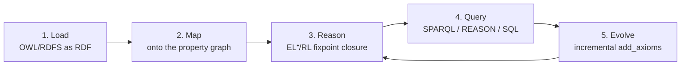

# Ontology hosting & lifecycle

epistemic-graph is an **ontology server**: it hosts OWL/RDFS ontologies, maps them onto the property
graph, and reasons over them in-engine with the OWL 2 EL⁺/RL reasoner (`eg-rdf/owl`). Reasoning is
pure-Rust (no horned-owl, no whelk-rs) and adds two things most triple-stores don't: **confidence
weighting** and **Ebbinghaus time-decay** of derived facts.

> Status snapshot: EL⁺ + RL classification, consistency, incremental materialization, confidence
> weighting, time-decay, and distributed reasoning are supported. OWL-DL and SWRL are roadmap. See the
> [capability matrix](../capabilities.md#owl-reasoning-eg-rdfowl).

## The lifecycle



### 1–2. Load & map

Load triples (`AddTriples`) or a Turtle/RDF document; the engine maps subjects/objects to nodes,
resource triples to typed edges, and literals to properties (see the [SPARQL/RDF guide](sparql.md)).

### 3. Reason

The reasoner saturates the ontology to a monotone fixpoint:

- **OWL 2 EL⁺ completion** — the named completion rules (CR-sub, CR-conj, CR-some±, CR-chain, CR-subrole,
  CR-bot, CR-disjoint) compute subsumers `S(A)` and role relations `R(r)`. This reaches concept-level
  entailments (e.g. `HumanHeart ⊑ HumanComponent` through `∃partOf.Body`) that a plain RL/Datalog pass
  cannot.
- **OWL 2 RL property rules** — `subPropertyOf`, property chains, transitive/symmetric/inverse
  properties, `rdfs:domain` (lifted to EL `∃r.⊤ ⊑ D`).
- **Consistency** — any satisfiable class forced to subsume `owl:Nothing` flags the ontology
  inconsistent.
- **Confidence weighting** (KG-2.236) — a per-axiom `eg:confidence` annotation propagates as a
  noisy-OR (MAX over derivations of `axiom_conf × ∏ premise_conf`).
- **Ebbinghaus time-decay** — derived facts decay by `conf · exp(−ln2 · age / half_life)` against
  `now − last_access` (`GRAPH_SERVICE_DECAY_HALF_LIFE`, default 7 days).

Materialization is **incremental**: `add_axioms` keeps the prior `S`/`R` and resumes the fixpoint,
provably equal to a from-scratch run. Reasoning runs single-graph (`Method::OwlReason`) or **distributed**
across shards (`Method::OwlReasonDistributed`), unioning TBox + ABox into one weighted closure.

### 4. Query

- **SPARQL** over the materialized graph (see the [SPARQL guide](sparql.md)).
- **`REASON <Class>`** as a [UQL](../uql.md) source — the `Op::Reason` op (under `owl-plan`) seeds a
  RowSet with the inferred members of a class, which then composes with traversal, vector rank, etc.:

  ```text
  REASON HumanComponent
    |> TRAVERSE -[:partOf]->{1,2}
    |> LIMIT 50
  ```
- **SQL / Cypher / GraphQL** see the inferred `type` edges and properties like any other graph data.

### 5. Evolve

Add or retract axioms and re-run the incremental closure; confidence and decay keep the derived set
honest about how strong and how fresh each inference is.

## Scope

- **Supported envelope**: OWL 2 EL⁺ + RL. `owl:Restriction` is `someValuesFrom`-only.
- **Roadmap**: OWL-DL (tableau — cardinality, `allValuesFrom`, nominals, negation) and SWRL user rules.
  `rdfs:range` is parsed but not yet enforced in completion. See the
  [roadmap](../roadmap.md#owl-toward-full-dl-reasoner-parity).

## Tier note

The lean **pi** tier carries SPARQL `SELECT` + OWL reasoning via the `Method::Owl*` RPCs, but the
SQL-backed `Op::Reason` planner op needs `owl-plan` (which pulls DataFusion) and lands in the **node**
tier. See [tiers & binaries](../architecture/tiers.md).
</content>
