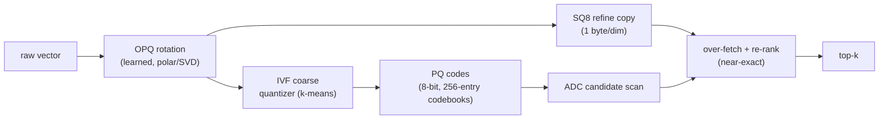

# Vector / ANN interface

The `ann` feature gives a native, pure-Rust approximate-nearest-neighbour index (`eg-ann`) as the
`SemanticStore` backend — no faiss, no GPU at serve time, no rebuild-on-load. Cargo
`full` includes it in the main durable server.

> Status snapshot: single-shard ANN is production-grade. An **HNSW** index (EG-KG.retrieval.hnsw-vector-index), **cross-shard kNN
> scatter-gather** (EG-319, completing the EG-KG.retrieval.scatter-gather gather leaf), hybrid metadata pre-filtering pushed into the
> ANN probe (EG-070), an exact/flat index + recall harness (EG-KG.query.concept-5), and pgvector distance operators + **real
> ANN index pushdown** (EG-115/116/313) are all shipped. See the
> [capability matrix](../capabilities.md#vector-ann-eg-ann-eg-core).

## What the index is



- **IVF-PQ**: an inverted-file coarse quantizer plus product-quantized residual codes scored by
  asymmetric distance computation (ADC).
- **OPQ**: a learned orthogonal rotation (alternating rotate → train-PQ → polar/SVD update) applied
  before PQ; `opq_iters = 0` falls back to plain IVF-PQ.
- **SQ8 refine**: a scalar-quantized (1 byte/dim) copy of the rotated vectors; search over-fetches
  `refine_factor × k` ADC candidates and re-ranks them by near-exact SQ8 distance (recall ≥ 0.95 in
  tests).

## Persistence — reopen without rebuild

The headline win: a persisted index **reopens without re-training or reconstructing f32 vectors**. On
`open`, the metadata is bincode-loaded, `codes.bin` / `refine.bin` are mmapped, and posting lists are
rebuilt in a single O(N) integer pass. Writes are atomic (temp + rename). A redb-backed variant
(`ann-redb`) persists the codes into the durable tier too.

## Brute-force fallback & warming

- Below a build threshold (a few thousand vectors), or while the index is `Cold` or a warm holds the
  write lock, search uses a **rayon-parallel, SIMD (AVX2) brute-force** scan over a contiguous arena
  with cached L2 norms and a partial-select top-k. This is exact and always available.
- The ANN index is built **off the query path** by a background warm-on-start task; searches never block
  on indexing.
- Cosine similarity is served via normalized-L2 (`cos = 1 − d/2`); overwrites tombstone the prior row,
  and a VACUUM compaction reclaims them.

## HNSW index (EG-KG.retrieval.hnsw-vector-index)

Alongside IVF-PQ, eg-ann carries an **HNSW** (hierarchical-navigable-small-world) graph index for **higher
recall-per-probe** than IVF-PQ on many datasets. It supports insert, search, and **serde persistence**
(load without rebuild), and is tuned against the EG-KG.query.concept-5 recall@k harness so you can pick IVF-PQ vs HNSW by
the measured accuracy/latency trade-off. Over pgwire, `CREATE INDEX … USING hnsw` selects it for the
pgvector pushdown (EG-KG.query.real-pgvector-ann-top).

## Exact / flat index & recall harness (EG-KG.query.concept-5)

Alongside the IVF-PQ ANN, a **brute-force exact kNN index** provides ground truth for small sets and a
**re-rank stage** over ANN candidates for high precision (a hybrid combining ANN recall with exact-distance
refinement). A **recall@k / precision self-evaluation harness** measures the ANN against the exact ground
truth, so you can quantify the accuracy/latency trade-off for a given dataset.

## Cross-shard & pre-filtered search (EG-319/070)

- **Cross-shard kNN scatter-gather** (EG-319): a vector search **scatters** across shards / Raft groups and
  merges the per-shard top-k into a **deterministic global top-k** via the `merge_topk` gather leaf (EG-KG.retrieval.scatter-gather).
  Program B wires the full scatter (per-shard fan-out over the `eg-ann` indexes at the server/router layer),
  completing the earlier gather-only primitive — so a kNN query on a resharded, multi-group cluster returns
  the true global neighbours.
- **Hybrid pre-filter** (EG-070): a graph/SQL predicate is pushed *into* the `ivfpq::search` scan (a
  candidate-id allowlist / predicate arg) so filtering happens during the ANN probe, not as
  over-fetch-then-post-filter.

## Using it

Vector rank is a first-class planner op — `Rank { query }` — so an ANN search composes with graph
traversal, SQL filters, and BM25 text in one [UQL](../uql.md) pipeline:

```text
MATCH (:Doc) WHERE year > 2024
  |> RANK BY ~[0.1, 0.9, 0.0]
  |> LIMIT 10
```

Over pgwire, the same index answers pgvector `ORDER BY emb <-> $1 LIMIT k` (L2 `<->` / cosine `<=>` /
neg-inner `<#>`), pushed down to the ANN index by `CREATE INDEX … USING hnsw/ivfflat` — a **real ANN top-k**
(HNSW/IVF) with an exact re-rank tier, not the brute-force fallback (EG-115/116/313) — see
[sql](sql.md#create-extension).

---

**See also:** [Capabilities matrix](../capabilities.md) · [SQL & pgwire](sql.md) · [Agent Memory](memory.md) · [Numeric Kernel](../architecture/numeric_kernel.md) · [Analytics Program](../architecture/analytics_program.md) · [Connecting (per-wire guide)](connecting.md).
