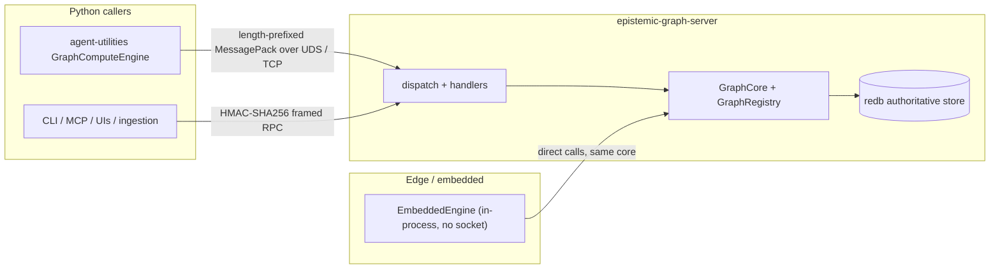
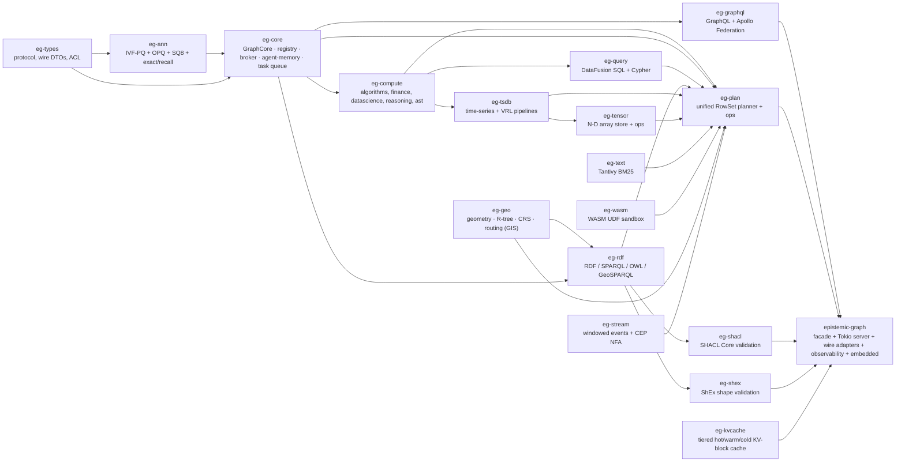

# Technical Overview — epistemic-graph

`epistemic-graph` is the Rust-native compute & storage engine for the agent-utilities ecosystem. It
is a **single durable engine** that unifies a property graph, vector ANN, SQL, RDF/SPARQL, OWL-2
reasoning, time-series, content-addressed BLOB, full-text, and finance/data-science compute behind
**one cross-modal `RowSet` planner**. Python reaches it **out-of-process** over length-prefixed
**MessagePack on UDS/TCP**, HMAC-authenticated — there is **no PyO3 / in-process FFI** — or, on the
edge, embeds it in-process via the `embedded` feature.

This page is the architectural map. For the operational protocol see
[Service Mode](service_mode.md); for the deep dive (distribution, security, streaming, federation,
multimodal) see [the master-of-all engine](architecture/engine.md); for build tiers see
[Tiers & binaries](architecture/tiers.md).

---

## One core, two transports

Both transports drive the **same** `GraphCore` + redb-authoritative durable rows (via `wal::apply` +
the server-independent `redb_store`). The socket path adds Tokio + HMAC; the embedded path is a plain
library handle. One core, two front doors.

---

## The crate workspace (a dependency DAG)

The engine is a Cargo workspace whose member crates map 1:1 to an acyclic dependency DAG. A crate may
only `use` crates to its left; a cycle will not compile, which is the enforcement.

The facade re-exports `eg-{types,core,compute}` under the historical `crate::` paths and adds the
server-side modules (dispatch, handlers, persistence, raft, embedded, **the multi-wire adapters**, and
**the observability listener**). Server dispatch is a thin routing table: each `Method` routes to a
`handlers::<domain>::try_handle` and the write side-effects (in-flight gauge, dirty mark, WAL enqueue,
CDC emit) stay centralized in the shell so every write handler gets durability + reactivity for free.

Six leaf/modality crates were added this cycle: **eg-geo** (GIS — geometry, R-tree, CRS, routing;
CONCEPT:EG-083/255-267/155), **eg-tensor** (N-D arrays; CONCEPT:EG-085), **eg-stream** (windowed CEP;
CONCEPT:EG-088), **eg-shacl** / **eg-shex** (RDF shape validation; CONCEPT:EG-132/133), and
**eg-kvcache** (LLM KV-block tiering; CONCEPT:EG-185/186/187). The **message broker** (CONCEPT:EG-275
family) and **agent-memory** primitives (CONCEPT:EG-099/220/221/222) live in `eg-core`; the
**observability** stack (logs/metrics/traces/VRL/federated-search; CONCEPT:EG-160-165/172/243) lives in
`eg-tsdb` + the facade's `obs` listener. See [subsystems](architecture/subsystems.md) for how they
compose on the one substrate.

---

## The unified `RowSet` planner

The heart of the "master-of-all" claim is a single closed algebra. A `Method::UnifiedQuery` (or its
text front-end `UnifiedQueryText` / UQL) carries a `Plan` — a list of `Op`s that each transform a
`RowSet` (a candidate set of `(id, score)`), composing graph, vector, SQL, OWL, SPARQL, text, time, and
federation in **one** execution pipeline.

```mermaid
flowchart LR
    subgraph Sources["Source ops (seed the RowSet)"]
        SCAN["Scan{label}"]
        REASON["Reason{class} — OWL inference"]
        SPARQL["SparqlBgp{query,var}"]
        FOREIGN["ForeignScan{source} — federation"]
    end
    subgraph Transforms["Transform ops (RowSet to RowSet)"]
        FILTER["Filter{preds} — DataFusion SQL"]
        TRAVERSE["Traverse{rel,min,max} — graph BFS"]
        RANK["Rank{vector} — ANN cosine"]
        RANKTEXT["RankText{query} — BM25"]
        FUSE["FuseRrf{left,right,k} — hybrid fusion"]
        UDF["Udf{id} — sandboxed WASM"]
        ASOF["AsOf / Window — time context"]
    end
    LIMIT["Limit{k} — top-k"]
    OUT["RowSet result"]

    Sources --> Transforms --> LIMIT --> OUT
```

- **Source ops** seed candidates: `Scan` (label), `Reason` (every individual the OWL reasoner *infers*
  to be a class member, including ids with no explicit type edge), `SparqlBgp` (a SPARQL SELECT's
  bindings), `ForeignScan` (rows from a remote engine or HTTP/JSON/SQL foreign source).
- **Transform ops** refine: relational `Filter` (real DataFusion), graph `Traverse`, vector `Rank`,
  lexical `RankText`, hybrid `FuseRrf` (reciprocal-rank fusion of two sub-plans — a doc strong in both
  modalities out-ranks one strong in only one), `Udf` (a registered WASM module run over the rows),
  and the time-context ops `AsOf` / `Window`.
- The planner is **cost-reordered** (CONCEPT:KG-2.208/2.209): a selective predicate runs before a broad
  one, so the most selective stage prunes the candidate set first. The result is served through the
  version-keyed, **RLS-aware** result cache (CONCEPT:KG-2.233), so a repeated identical query on an
  unchanged graph hits — and an agent never sees another agent's filtered result.

A worked example in one plan: *"members the OWL reasoner infers for `Device`, that have a `partOf`
path to a `Rack`, re-ranked by similarity to a query vector, fused with a BM25 text match, top 10"* —
`Reason -> Traverse -> Rank` fused with `Scan -> RankText` via `FuseRrf -> Limit`.

---

## Always-on graph algorithms

Beyond the planner, the property-graph core exposes the classic algorithms directly (one round-trip
each), computed off the per-graph lock on a structural snapshot so analytics never starves writers
(CONCEPT:KG-2.51):

- **Topological sort** — Kahn's algorithm (`petgraph::algo::toposort`); raises on a cycle.
- **Cycle detection** — DFS coloring; returns the precise cycle path, e.g. `["A","B","C","A"]`.
- **Shortest path** — unweighted BFS with predecessor backtrack.
- **Blast radius** — BFS to `max_depth`, returning all downstream transitive dependents.
- **PageRank / PPR, betweenness, community detection (Louvain), MST, VF2 subgraph isomorphism.**
- **Distributed Pregel/GAS** (cluster tier) — PageRank / connected-components / BFS across graphs that
  span multiple Raft shards, with incrementally-maintained materialized views.

See the [Rust Compute Guide](RUST_COMPUTE_GUIDE.md) for the procedure to add a capability across the
`protocol.rs` / `dispatch.rs` / `handlers` / client layers, and [benchmarks](benchmarks.md) for measured
per-op latency.
