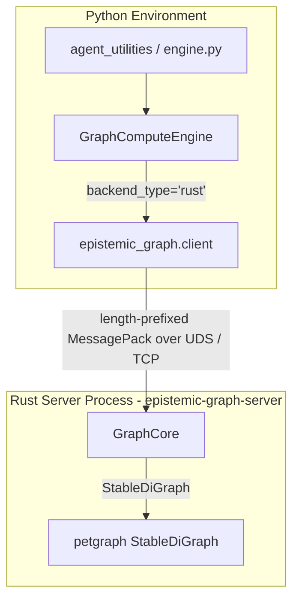

# Technical Overview — epistemic-graph

The `epistemic-graph` project implements the high-performance graph compute backend for the Knowledge Graph in the agent ecosystem. By leveraging **Rust's `petgraph`** library and running as an **out-of-process Tokio service** (length-prefixed **MessagePack over UDS/TCP**, HMAC-authenticated — **no PyO3/FFI**), it provides sub-millisecond graph processing operations, including dependency cycle detection, topological sorting, and shortest path search.

---

## Architecture



### Core Struct (`src/lib.rs`)

The memory model tracks:
- **`graph`**: `StableDiGraph<String, String>` where nodes and edges hold string identifiers.
- **`node_map`**: `HashMap<String, NodeIndex>` to quickly map string IDs to petgraph node indices.
- **`node_properties`**: `HashMap<String, String>` mapping node IDs to JSON property strings.
- **`edge_properties`**: `HashMap<(String, String), String>` mapping source/target node ID pairs to JSON edge property strings.

---

## Algorithms Realized in Rust

### 1. Cycle Detection (`find_cycle`)
Uses depth-first search (DFS) with node coloring:
- `0`: Unvisited
- `1`: Visiting (on active recursion stack)
- `2`: Fully Visited

If a neighbor is encountered with state `1`, a cycle exists. The cycle path is reconstructed back to the cycle root using a predecessor map and returned as a list of strings, e.g., `["A", "B", "C", "A"]`.

### 2. Topological Sort (`topological_sort`)
Applies Kahn's algorithm via `petgraph::algo::toposort`. It returns a valid sequence list of strings representing the order of dependencies. If a cycle exists, it raises a `ValueError` with `"Graph contains cycles"`.

### 3. Shortest Path (`get_shortest_path`)
Uses Breadth-First Search (BFS) to identify the shortest unweighted path between any two node IDs. It populates a predecessor map during traversal and backtracks from the target node to source to yield the exact list.

### 4. Blast Radius (`get_blast_radius`)
Performs a BFS starting from a node up to `max_depth`. It computes all downstream transitive dependencies, returning their IDs.

---

## Direct Extension Usage

This module can be compiled and installed independently using `maturin` and consumed like any standard Python module:

```python
from epistemic_graph import EpistemicGraph

g = EpistemicGraph()
g.add_node("AgentA", '{"status": "idle"}')
g.add_node("AgentB", '{"status": "busy"}')
g.add_edge("AgentA", "AgentB", '{"rel": "depends_on"}')

print("Path:", g.get_shortest_path("AgentA", "AgentB"))
```
