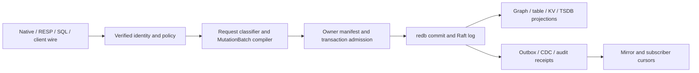

# Architecture and contracts

## Existing path to extend

`src/server/mutation_batch.rs` compiles and commits the request, `crates/eg-types/src/mutation_batch/` defines its persisted envelope, `crates/eg-transaction` admits it, `crates/eg-storage/src/owner/` binds a store owner, and `src/redb_store/` applies it. `src/raft/store/` handles replicated log/state-machine commits. `src/server/{auth,authority_context,sql_catalog_acl,kv,cdc}.rs` and the wire directories feed that same kernel. `crates/eg-tsdb/src/store.rs` and `crates/eg-stream/` are existing series and stream owners. These are extension points, not proposals to replace them.

No arrow bypasses identity, owner binding, or transaction admission. A native fast path may skip the SQL planner only. Derived hot structures and Parquet copies can be rebuilt from committed authority; they cannot accept independent authoritative writes.

## Stable interfaces

| Contract | Producer → consumer | Invariant |
|---|---|---|
| `MutationBatch` + terminal result | wire/compiler → transaction + redb/Raft | canonical request digest, verified scope, idempotency key, member set and one terminal outcome |
| `OwnerManifest` lineage | storage registry → loader/writer | version and member ownership checked on read; unsupported layout gives named refusal |
| `ChangeEnvelope` + position | committed stream → CDC subscriber | monotonic source position, replay-safe key, schema version, no uncommitted event |
| Audit reservation/outcome | effect caller → EG audit store | `PENDING` before effect; linked completed/failed/indeterminate result; no outcome forgery |
| Mirror cursor | committed stream → target sink | per-target durable checkpoint advanced only after idempotent target apply |
| Auth context | verified transport → all executors | tenant and principal survive every route; no caller-supplied scope substitution |

## Commit and recovery

Admission checks identity, scope, capability, owner member set, lineage, size and idempotency before opening a write transaction. For a single redb shard, graph and table members should share one redb `WriteTransaction`; if they cannot, an ADR must choose a recoverable intent protocol or a clear pre-effect refusal. A multi-shard/replicated batch must identify the commitment and replay boundary, preserve deterministic ordering, and return one terminal result after durable acknowledgement. Crash injection at before-admission, after-intent, after-member-write, before-seal, after-seal, before-reply and after-reply must yield only absent or fully committed state, with idempotent retry after lost acknowledgement.

Owner binding is validated once per write transaction and cached only for that transaction. A manifest format bump retains a golden fixture for each supported predecessor and a named refusal for unsupported lineage. A background scrub uses bounded read transactions, a persisted/resumable key cursor and a rate cap; it never repairs data silently. Typed findings include member, key digest, error class and first/last observed time without leaking payloads.

## Policy, audit and streaming

The transport verifies claims; all read executors and the native fast path take an immutable scoped authority context. RLS predicates apply before returning or joining user data. Explicit grants are resolved at use time, so revoke takes effect on the next request. KV keys retain principal-bound HMAC partitioning in every durability class. Audit reservation must be durable before any governed effect; an interrupted worker leaves `PENDING` for reconciliation, not a fabricated success. The outbox increments attempts for the head actually tried. Rejected reasoning projections require rebuild rather than skip-ack. CDC and mirror checkpoints move after target apply and can replay from the previous checkpoint safely. Delivery-side cursor rows stay local to their owner unless a versioned replicated contract proves otherwise.

The deployment may offer `none`, `local`, or `external` authentication, but all modes produce the same internal principal/RBAC context before dispatch. `none` is an explicit single-principal development mode and must not mint an administrative identity from a client-supplied name. `local` owns password/session lifecycle in EG; `external` validates issuer, audience, tenant and policy-version binding before mapping claims. Switching modes must not reinterpret an old session as another principal. Every mode uses the same scope checks, request digest, audit class and access-denied errors. JIT elevation is a separate reserved `rbac.elevation` lease: the proposer and approver are distinct verified principals, the digest is exact, expiry is checked on every use, and ordinary lease-write capability cannot issue it. Schema repair uses its own reserved kind with the same two-person invariant.

## Native storage expansion

Classify requests before planner allocation. Only an exact supported point/structure form takes the native route; ambiguous SQL stays in the SQL planner. Prepared SQL cache keys include statement digest, dialect, schema version, authorization scope and relevant dependency-clock generation. Schema or policy changes invalidate before reuse. `sync` is default and cannot be silently changed. `async` acknowledges within its advertised maximum loss window, exports observed oldest-unflushed age, and blocks/degrades explicitly if it cannot honor ≤100 ms. `ephemeral` is advertised as non-recoverable. Hot structures are reconstructed deterministically from the durability log; compaction and hot/cold union preserve tombstone/version order. The store-engine comparison is an ADR based on reproducible captured workload fixtures, not a second authority design.

## Cross-product boundaries

The [`unified-data-plane`](../unified-data-plane/spec.md) spec owns attached-source adapters, catalog mapping, upstream CDC capture, and federated query routing. It submits canonical envelopes and consumes EG positions. Serving products may call the audit API but cannot implement an independent audit ledger or skip reservation when unavailable. Finance can use TSDB and transactions, but this kernel contains no trading decision or order policy. These links are to local repository contracts; implementing this spec requires no private inventory.

## Design decisions to record before implementation

1. Cross-store atomicity ADR: same redb transaction versus recoverable intent versus bounded refusal, with measured failure matrix.
2. Native hot-store ADR: redb versus alternatives with persistence/latency/restore comparisons.
3. Durability-class wire contract: how class, measured loss window and failure state are exposed for each protocol.
4. Mirror/replication compatibility contract: schema evolution, ordering, cursor, restore and security behavior.
