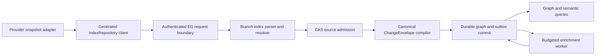

# EG-REPO-INGEST architecture and contracts

Status: PROPOSED. This document defines the engine-owned boundary and data model for [spec.md](spec.md).

## Authority and flow

The adapter is transport only. EG verifies graph write access before invoking parser work. The request boundary validates a portable repository-relative path, digest spelling, bounded scope, and feature availability. Parse and projection run off the network reactor. CAS admission can precede the graph transaction; a CAS holder has no graph visibility until the one envelope commits. The envelope is the sole graph writer for this path. The response is emitted after the commit, or on exact digest replay after reading its durable receipt.

`SourceIngest` is the parallel entrypoint for governed connector observations. It uses approved manifest mapping references, EG-computed live-set differences and the same `ChangeEnvelope` commit authority. A source-position bridge or index update is a consumer of that committed envelope, keyed by tenant, source ID, partition and position; it cannot reimplement graph mutation outside the envelope path.

## Entity and identity model

| Entity | Identity | Required durable fields |
|---|---|---|
| Repository | verified tenant + canonical repository ID | source kind, schema version, access class |
| Ref | repository + ref name | status and immutable current revision ID |
| Revision | repository + canonical immutable commit ID | parent IDs if supplied, observed time, evidence digest |
| Blob | content SHA-256 (stored under tenant/repository holder) | content reference, length, parser capability digest, parse disposition |
| FileVersion | repository + revision + normalized relative path + blob digest | path, blob link, validity and provenance |
| SymbolOccurrence | FileVersion + byte start/end + symbol kind + disambiguator | declaration name, language, span, parse evidence |
| Resolved edge | relation + source occurrence + target occurrence + algorithm/schema version | provenance, confidence when statistical |
| Work item | snapshot digest + enrichment kind + policy/admission version | budget, attempt, lease, state, output receipt |

Never key an occurrence solely by source text or blob digest: one blob can be mounted at different paths and refs, and identical declarations can appear twice. Branch membership is a relation to an immutable `FileVersion`; removing membership does not delete another ref's graph. Ref names can move, commit IDs cannot. Exact path normalization rejects absolute paths, traversal and URI-like host paths. Hash digests use lowercase `sha256:<64 hex>`.

The parser outcome is one `IndexFileOutcome` per submitted unique blob, preserving order. `success`, `unsupported` and `error` are distinct. A parse capability digest identifies the parser grammar/configuration so a later capability revision can retry failed/unsupported material without changing the immutable source digest. Diagnostics are bounded and machine readable. Rung evidence is derived inside EG and is not trusted from the request.

## Symbol resolution and semantic bridge

Parsing first produces file-local declarations and unresolved references. A deterministic second pass builds lookup indexes by language, module path, scope, exported name and arity. It resolves within the admitted snapshot, prioritizes exact receiver/import scope, and records ambiguity or external-package references as unresolved counts. Candidate ordering is canonical; neither filesystem enumeration nor hash-map order changes the result. Statistical `similar_to` edges require a versioned algorithm, score threshold, deterministic tie-break and provenance. An inferred target must already be an admitted node. `depends_on` connects actual source file versions, never raw import strings.

The semantic bridge projects typed relations for `declares`, `calls`, `inherits`, `realizes`, `depends_on`, `definedBy`, `testedBy`, `specifiedBy` and `releasedIn`. All relations point to stable graph IDs and carry the source evidence digest plus projection schema version. A spec, test or release artifact can enter only through authenticated source indexing or another approved ingestion contract; a missing target is recorded as unresolved rather than fabricated. Query permissions are evaluated before returning content or provenance. Bridge projection shares the envelope writer and tombstone rules.

## Atomicity, replay and recovery

Lowering canonicalizes properties and graph methods, validates the complete operation and MessagePack item/byte budget, and hashes the lowered write set. The envelope includes policy and privacy attestation, source references, provenance, tombstones and optional outbox intent. The graph version, projection, cursor/marker and receipt commit together. Identical request digests replay; same external id with different content is a conflict. Over-limit requests return `REPOSITORY_BATCH_TOO_LARGE` before graph commit. A client may split the batch; each split remains independently atomic and converges to the same final graph.

A restart reads the committed envelope and source marker from durable storage. Incomplete CAS admission is recoverable or garbage-collectable by holder policy but never advertised as indexed. Outbox leases are durable and fenced; a worker may reattempt after crash without duplicating a completed result. With replication enabled, write and worker submission require current placement/leader authority. An unsupported feature build returns a stable feature refusal; it cannot return a success shaped like an empty index.

## Security and operational decisions

- The verified request identity sets tenant and graph. A repository ID in payload is an identifier inside that authority, not an authorization credential.
- Preserve useful code text while replacing host identity in materialized properties. Raw bytes are tenant-scoped in CAS and subject to the graph's read policy.
- No live provider, credential, local inventory or model endpoint is needed for unit/contract tests. Provider adapters must supply their own reproducible fixtures.
- The native commit path is independent of enrichment. The worker uses engine-controlled admission, budget, grant and retry policy; model failure cannot roll back an already accepted native snapshot.
- Reuse the existing graph ACL, CAS, `ChangeEnvelope`, mutation outbox and generated contract mechanisms. New parser or projection abstractions need a demonstrated gap and a caller through the real service route.

## Recorded design decision: edge identity is the `(source, target, relation_type)` triple

The graph previously keyed some edges by endpoint pair alone, so multiple relation types between the same two endpoints had no canonical representation. Decided (operator-approved, EG-REPO-INGEST-R009.1/R009.2): an edge's identity is the triple `(source_id, target_id, relation_type)`, not the bare `(source_id, target_id)` pair. An untyped legacy edge migrates deterministically by reading its stored blob's `type`/`label` field as `relation_type`, falling back to `related_to` when neither is present; a migration collision (two untyped edges landing on the same triple) is resolved by a deterministic collapse rule and recorded in a collision receipt rather than silently dropped. The semantic bridge's nine relations (`declares`, `calls`, `inherits`, `realizes`, `depends_on`, `definedBy`, `testedBy`, `specifiedBy`, `releasedIn`) each project onto their own typed triple between the same two endpoints, so they never collide with each other or with an untyped edge.

Rejected alternatives:

- **Priority rule.** Pick one relation type to "win" per endpoint pair by a fixed precedence order. Rejected: it is not a representation at all — every lower-priority relation between the same two endpoints is unrepresentable the moment a higher-priority one exists, which is exactly the silent-drop failure mode this decision exists to close.
- **Set-of-types on one edge.** Keep one edge per endpoint pair and widen its `relation_type` field to a set. Rejected: it collapses distinct relations' independent properties, provenance and lifecycle (add/remove/invalidate timing) onto one shared record, and a removal of one type cannot be expressed without either deleting the whole edge or mutating the set in place with no edge-level audit trail.
- **Reified relation nodes.** Model each relation as its own graph node with edges to its source and target. Rejected: it multiplies node count by the relation volume, forces every relation-aware query through an extra hop, and provides no benefit over a typed edge for a binary relation that carries no further relations of its own.
