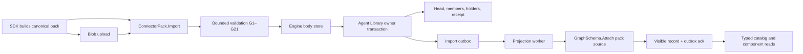

# Architecture and data contract

## Existing path to extend

`crates/eg-types/src/connector_pack/{index,digest,annotations,ops,result,record}.rs` defines the wire values and bounds. `crates/eg-capabilities/src/domains/` owns method descriptors; `gen_contract` emits the public contract, receipt and clients. `src/server/handlers/admin/connector_pack/import/` validates and plans; `src/server/persistence/connector_pack/` owns the head, membership, receipt, bindings, visibility and outbox; `src/server/blob/engine_bodies.rs` owns bodies; `src/server/connector_pack_projection.rs` and `src/server/graph_schema/attach_pack.rs` provide projection and schema attachment. `src/server/handlers/admin/component_content.rs` serves bodies. New code must enter through these paths, not create a second registry or a detached adapter.

## Data flow and durable boundaries

The body store can commit before the Agent Library transaction because an orphan has no holder and is reclaimed after the grace window. Agent Library rows and outbox intents commit together. Projection is intentionally asynchronous. `visible_record_id` is the read gate until the graph schema has committed. The projection worker reads the current head, not an obsolete event payload; its graph attach uses the pack record as a monotone source revision. The subsequent owner transaction marks visibility and acknowledges the event. If interrupted between commits, redelivery is idempotent.

## Pack encoding

Entries are a closed kind set: `mcp_server`, `tool`, `skill`, `prompt`, `ontology`, `shapes`, `model_profile`, `a2a_card`, `manifest`. Each entry has a URI, name, media type, raw-body section, optional input/output schema sections, typed annotations and bounded sibling references. Every section carries offset, length and SHA-256. Section ranges use checked arithmetic, cover the uncompressed archive once, and never overlap. Text is UTF-8 without BOM; JSON has no duplicate keys, NaN or infinity and is depth/node bounded. `$ref` remains data rather than a network fetch.

`Digest256::framed` hashes length-framed fields in domain-separated order. Nested digest values are 32 raw bytes. String lists are UTF-8 byte sorted and deduplicated; integers are big-endian u64; absent optionals encode an empty field; tri-state booleans use `00` absent, `01` false, `02` true. `entry_digest` frames kind, URI, name, media type, body/schema digests, annotations digest and reference digest under `eg/connector-pack-entry/v1`. `pack_digest` frames connector, server-entry digest, count and URI-sorted entry digests under `eg/connector-pack/v1`. Archive offsets and package version are excluded. Tool input/output schema digests are computed by EG over the exact received bytes. The SDK must serialize MCP JSON objects deterministically before byte hashing and replay the shared vectors. The SDK's normalized contract pin is a claim, not an EG-verified digest.

## Identity, lifecycle and reads

The pack head is keyed by `(tenant, connector)` and includes binding revision, content digest, server pin, package provenance, record ID and projection state. Membership is keyed by pack URI and has a component ID, revision, content digest and lifecycle. Bodies are keyed by SHA-256 with holder rows to protect live content. A same-digest import produces no write. A changed entry or pinned server revision creates a new component revision; a removed entry is `Withdrawn`. Historical pinned records may resolve withdrawn revisions; new publication, search, assembly and candidate selection cannot. `Retired` is explicit and permanent, and a later return is refused. Pack-generated `mcp:` IDs cannot be directly published by the generic component method.

`Status` is a snapshot read and has no reap/write side effects. `Content` checks component-read authority and the exact revision and returns verified bytes. Bind/Unbind/Retire/Reproject and body reconciliation require admin rights. Import requires `agent:pack-control`, matching verified principal and tenant, an expected head, and a deterministic operation identity. A mass withdrawal (empty pack or over half of published members) requires an explicit override and admin capability.

## Validation table

| Rule | Required refusal or warning |
|---|---|
| G1 | Supported schema, valid connector/name, sorted unique URIs, closed kinds and URI schemes, exactly one server: `MALFORMED_INDEX` or `UNKNOWN_ENTRY_KIND`. |
| G2 | Index ≤1 MiB, entries ≤1024, references/list ≤64, archive ≤16 MiB, body ≤2 MiB, schema ≤1 MiB, record ≤4 MiB, batch within kernel budget: `PACK_TOO_LARGE`. |
| G3–G5 | Owner-scoped archive present, length/hash match, checked nonoverlapping full sections, all section/entry/pack digests recomputed: `ARCHIVE_MISSING`, `ARCHIVE_DIGEST_MISMATCH`, `MALFORMED_SECTIONS`, `PACK_DIGEST_MISMATCH`. |
| G6 | Unique derived IDs and no decision-owned kind: `DUPLICATE_COMPONENT_ID` or `FORBIDDEN_ENTRY_KIND`. |
| G7–G10 | UTF-8 without BOM; bounded JSON with unique keys and object tool input schema; restricted `SKILL.md` front matter with matching name and description; tool input schema present: `MALFORMED_BODY` or `MISSING_TOOL_SCHEMA`. |
| G11 | Empty description is accepted with entry-name fallback and `EMPTY_DESCRIPTION` warning. |
| G12 | Native capability/modality IRIs have the correct root; foreign absolute capability IRIs are recorded as claims with warning, not fabricated native facts; malformed IRI, invalid cost/currency/latency/model bounds refuse as `UNKNOWN_CAPABILITY_IRI`, `INVALID_ANNOTATION` or `INVALID_FACTS`. |
| G13–G16 | Turtle ≤100000 triples, bounded IRI/literal, no `@base`/relative IRI/network import; EL+/RL ontology consistency within derivation budget; per-file scoped shape blank nodes, no `sh:sparql SERVICE`; bounded SHACL validation: `ONTOLOGY_INVALID`, `SHAPES_INVALID`, `ONTOLOGY_INCONSISTENT`, `VALIDATION_BUDGET_EXCEEDED` or `SHACL_VIOLATION`. |
| G17–G18 | References resolve to stated sibling kinds with no cycles; server-stamped drafts pass `AgentComponentDraft::validate`: `UNRESOLVED_REFERENCE`, `REFERENCE_CYCLE`, `INVALID_COMPONENT`. |
| G19–G20 | Bound importer matches; mass withdrawal requires explicit admin override: `IMPORTER_MISMATCH`, `PACK_MASS_WITHDRAWAL`. |
| G21 | Stop at 256 violations or exhausted step budget and indicate truncation: `VALIDATION_BUDGET_EXCEEDED`. |

## Schema source composition

One graph owns a bounded ordered map of `GraphSchemaSource { source_id, origin, revision, shapes, ontology }`. The composed digest derives from all source content and revisions; compiled policy and TBox are caches, never authority. Shapes from separate sources retain separate blank-node scopes; their union is conjunctive. Ontology composition adds source triples to the view's TBox. The shared bounded validator serves `IcvConfigure`, `GraphSchema.Attach` and pack G13–G16.

| Rule | Attach contract |
|---|---|
| K1 | One source owns each shape subject; another source cannot deactivate or change it (`SCHEMA_SOURCE_CONFLICT`). |
| K2–K3 | Shape and ontology documents are bounded, parseable, relative/base free; imports resolve only within the same source and are never fetched; `SERVICE` constraints are refused. |
| K4 | EL+/RL classification is step bounded; new inconsistency or newly unsatisfiable named class is refused with an explanation. The exponential tableau is never invoked for admission. |
| K5 | Shared class/property IRIs are allowed; consistency, not duplicate naming, determines validity. |
| K6 | Pack/ingestion origin revision strictly increases or is an identical no-op; stale projection refuses `SCHEMA_SOURCE_REGRESSION`. |
| K7 | Source count, bytes and triples remain within configured bounds; overflow is `SCHEMA_SOURCES_TOO_LARGE`. |

`GraphSchema.AttachPack` reads visible engine-owned pack schema, never caller-supplied substitute bytes. `pack__<connector>` is reserved and only the authorized worker writes it. Other graph attachments are static snapshots with a visible record ID; automatic following needs a separately specified durable target list. `IcvConfigure` maps to the operator source, preserving its wire contract. Attach validates the staged schema and later writes; it does not retroactively scan all existing data. The `GraphSchemaClasses` read supplies canonical classes/properties and composition digest for consumers.

## Failure, security and compatibility decisions

The per-tenant lock serializes pack mutations but does not replace in-write head compare-and-swap. Cancellation is checked before expensive reasoning and before atomic commit; a cancelled request must release the lock. Outbox failure is a durable failed state, not a swallowed log; retry is bounded and does not collateral-dead-letter unrelated events. Projection's graph write uses a grant scoped to that outbox row. Clustered writes for this family are `LocalOnly`. Incompatible owner layout fails by named refusal at the manifest read; an offline upgrade path is rejected. The first schema corpus remains generated from typed Rust authority and preserves its public IRI vocabulary. New source and row types require the same generated contract/receipt update and compatibility tests.
